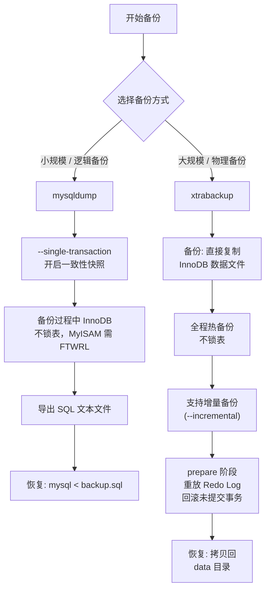

## 引言

删库跑路不是段子，你的备份策略真的可靠吗？"rm -rf /*" 一行命令，整个公司的业务数据瞬间化为乌有——这样的生产事故年年都在发生。更可怕的是，你花了大精力做的备份，可能从来就没有被验证过，等到真正需要恢复时才发现备份文件是损坏的。

本文系统讲解 MySQL 备份与恢复的完整方案，从基础逻辑备份到高级物理备份，从全量恢复到 PITR（Point-in-Time Recovery）精准时间恢复。读完本文你将掌握：
- **mysqldump 备份原理与安全实践**：如何做到备份不影响线上业务
- **xtrabackup 物理备份方案**：热备份不锁表，适用于大型数据库
- **PITR 精准时间点恢复**：结合全量备份和 Bin Log 恢复到任意时刻
- **生产级备份策略**：备份频率、存储、验证的完整方案

## 为什么要备份数据

先说一下为什么需要备份 MySQL 数据？

一句话总结：**为了保证数据的安全性。**

如果我们把数据只存储在一个地方，物理机器损坏会导致数据丢失，无法恢复。还有就是我们每次手动修改线上数据之前，为了安全起见，都需要先备份数据，防止人为误操作导致数据被破坏或丢失。

> **💡 核心提示**：**3-2-1 备份原则**是业界通用的备份策略：至少保留 **3** 份数据副本，存储在 **2** 种不同介质上，其中 **1** 份存放在异地。对于 MySQL 数据库，建议至少保留：本地快照 + 异地冷备份 + 云端对象存储。

## mysqldump 逻辑备份

想要快速简单粗暴备份 MySQL 数据，可以使用 **mysqldump** 命令：

```bash
# 备份 test 数据库
mysqldump -uroot -p test > backup.sql
```

但是这样备份的可能包含脏数据，比如在备份过程中有个下单操作正在执行：

1. 下单，保存订单表
2. 备份数据
3. 扣款

下单之后还没有来得及扣款，就开始执行备份数据的命令，就会出现数据不一致的问题。

### 安全的备份方式

mysqldump 提供了以事务形式备份的参数：

```bash
# 开启一个事务备份 test 数据库
mysqldump -uroot -p --single-transaction test > backup.sql
```

开启事务后，会利用 InnoDB 的 MVCC 机制获取一致性的数据快照，避免备份过程中出现脏数据。

> **注意**：只有 InnoDB 引擎支持事务命令，对于不支持事务的 MyISAM 引擎，备份时怎么保证数据安全性？

有一个粗暴的办法就是设置全库只读，禁止写操作：

```sql
SHOW VARIABLES LIKE 'read_only';
```

OFF 表示只读模式关闭，ON 表示开启只读模式：

```sql
SET GLOBAL read_only = 1;
```

这样设置其实是非常危险的，如果客户端连接断开，整个数据库也会一直处于只读模式，无法进行写操作。

更推荐的办法是设置**全局锁 FTWRL（Flush Tables With Read Lock）**：

```sql
-- 设置全局锁，禁止写操作
FLUSH TABLES WITH READ LOCK;
-- 释放锁
UNLOCK TABLES;
```

设置全局锁之后，如果客户端断开连接，会自动释放锁，更安全。

## xtrabackup 物理备份

mysqldump 是逻辑备份（导出 SQL 语句），当数据量达到 GB 级别时，备份和恢复的时间会非常长。**xtrabackup** 是 Percona 提供的物理备份工具，直接复制数据文件，速度快很多。

### xtrabackup vs mysqldump 对比

| 特性 | mysqldump | xtrabackup |
| :--- | :--- | :--- |
| **备份类型** | 逻辑备份（SQL 语句） | 物理备份（数据文件） |
| **备份速度** | 慢（需要执行 SQL 解析） | 快（直接复制数据文件） |
| **恢复速度** | 慢（需要执行所有 SQL） | 快（直接拷贝回数据目录） |
| **锁表** | InnoDB 不锁表（--single-transaction），MyISAM 需锁表 | 全程不锁表（热备份） |
| **适用数据量** | 适合中小库（< 50GB） | 适合大型库（GB~TB 级） |
| **增量备份** | 不支持 | 支持 |
| **依赖** | 无需额外安装 | 需安装 Percona XtraBackup |
| **推荐场景** | 小规模、跨版本迁移 | 生产环境、大型数据库 |



> **💡 核心提示**：**PITR（Point-in-Time Recovery，精准时间点恢复）** 的完整流程是：先用 mysqldump 或 xtrabackup 做全量备份（恢复到备份时刻的状态），再使用 Bin Log 回放从备份时刻到目标时间点之间的所有变更。这是实现"恢复到昨天下午 3 点 27 分"的关键技术。

## 数据恢复

### mysqldump 恢复

通过备份文件恢复数据：

```bash
# 把备份文件数据导入到 test 数据库
mysql -uroot -p test < backup.sql
```

### xtrabackup 恢复

```bash
# 1. 准备阶段：重放 Redo Log，回滚未提交事务
xtrabackup --prepare --target-dir=/path/to/backup

# 2. 停止 MySQL 服务
systemctl stop mysql

# 3. 清空 data 目录，拷贝备份数据
rm -rf /var/lib/mysql/*
xtrabackup --copy-back --target-dir=/path/to/backup

# 4. 修改权限并重启
chown -R mysql:mysql /var/lib/mysql
systemctl start mysql
```

### PITR 精准时间点恢复

```bash
# 1. 先恢复全量备份
mysql -uroot -p test < full_backup.sql

# 2. 从 Bin Log 中恢复到指定时间点
mysqlbinlog --start-position=1234 --stop-position=5678 mysql-bin.000001 | mysql -uroot -p

# 或者按时间恢复
mysqlbinlog --start-datetime="2024-01-01 10:00:00" \
  --stop-datetime="2024-01-01 15:30:00" \
  mysql-bin.000001 | mysql -uroot -p
```

## 生产环境避坑指南

| 坑位 | 现象 | 解决方案 |
| :--- | :--- | :--- |
| **从未验证备份有效性** | 备份文件存在但恢复时失败（文件损坏、格式不兼容） | 定期执行恢复演练（每月至少一次），自动化备份校验流程 |
| **Bin Log 缺失导致无法 PITR** | 全量备份 + 中间时段无 Bin Log = 只能恢复到备份点 | 确保 Bin Log 持续开启并定期备份 Bin Log 文件到异地存储 |
| **备份高峰期影响业务** | 备份操作消耗大量 CPU/IO，导致线上响应变慢 | 备份安排在业务低峰期（凌晨 2~5 点），使用 --single-transaction 避免锁表 |
| **MyISAM 表备份数据不一致** | 备份期间 MyISAM 表被写入，备份文件包含脏数据 | 备份前对 MyISAM 表执行 `FLUSH TABLES WITH READ LOCK`，或迁移到 InnoDB |
| **备份文件过大占用磁盘** | 备份文件占满磁盘空间，导致 MySQL 无法写入 | 压缩备份文件（`mysqldump | gzip > backup.sql.gz`），定期清理过期备份 |
| **增量备份链断裂** | xtrabackup 增量备份依赖前一次全量/增量备份，中间缺失导致无法恢复 | 定期做全量备份（建议每周一次），保持增量备份链的完整性 |

## 总结

| 备份方式 | 备份速度 | 恢复速度 | 锁表 | 适用数据量 | 推荐指数 |
| :--- | :--- | :--- | :--- | :--- | :--- |
| **mysqldump** | 慢 | 慢 | InnoDB 不锁 | < 50GB | ⭐⭐⭐ |
| **xtrabackup** | 快 | 快 | 不锁 | GB~TB | ⭐⭐⭐⭐⭐ |
| **PITR** | - | 中 | - | 按需恢复 | ⭐⭐⭐⭐⭐ |

### 行动清单

1. **定期执行恢复演练**：每月至少一次从备份文件恢复数据到测试环境，验证备份文件的有效性。
2. **备份 Bin Log 到异地**：Bin Log 是 PITR 的关键，定期将 Bin Log 文件备份到异地存储（如 S3 或 OSS）。
3. **低峰期执行备份**：将备份任务安排在凌晨 2~5 点，避免影响白天高峰期的业务性能。
4. **使用 xtrabackup 替代 mysqldump**：数据量超过 50GB 的生产环境，改用 xtrabackup 做物理备份，支持热备份和增量备份。
5. **压缩与定期清理**：使用 gzip 压缩备份文件，设置定时任务清理超过 30 天的旧备份。
6. **扩展阅读**：推荐 Percona 官方文档 "XtraBackup 备份策略" 和《高性能 MySQL》第 9 章"备份与恢复"。
