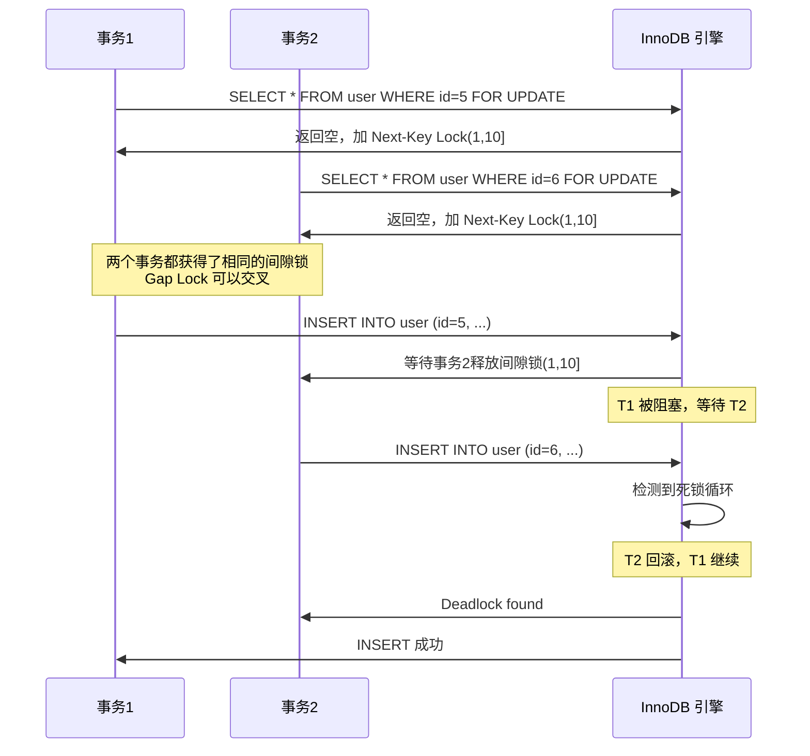
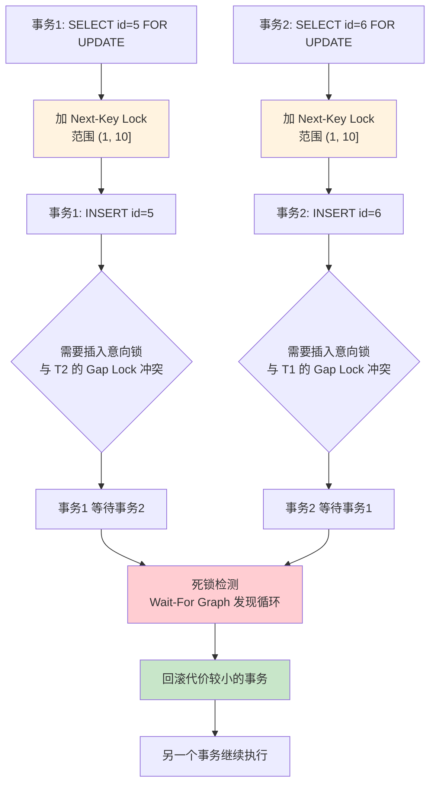
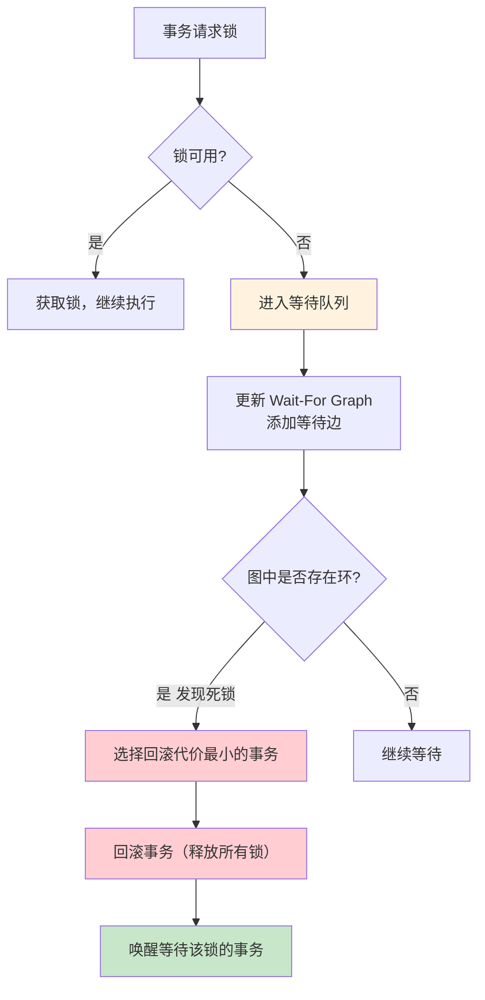

## 引言

线上 MySQL 突然报警，死锁日志疯狂刷新。你赶紧登录系统，查看业务日志：

```
Deadlock found when trying to get lock; try restarting transaction
```

能清楚看到是这条 `INSERT` 语句发生了死锁。MySQL 如果检测到两个事务发生了死锁，会**回滚其中一个事务**，让另一个事务执行成功。很明显，我们这条 INSERT 语句被回滚了。

```sql
INSERT INTO user (id, name, age) VALUES (6, '张三', 6);
```

但是怎么排查这个问题呢？到底跟哪条 SQL 产生了死锁？一条看似简单的 INSERT，为什么会和另一条 INSERT 互相冲突？

本文将深入剖析 MySQL 死锁的底层原理，包括：
- **死锁日志分析**：如何通过 `SHOW ENGINE INNODB STATUS` 还原死锁现场
- **Gap Lock 交叉锁定**：两条不相干的 INSERT 如何在同一个间隙范围产生循环等待
- **InnoDB 死锁检测机制**：Wait-For Graph 算法如何发现并解决死锁
- **生产环境避坑指南**：常见死锁场景、预防策略、自动检测配置

无论你是排查线上死锁还是准备面试，掌握这套分析方法都能帮你快速定位根因。

> **💡 核心提示**：MySQL 死锁不一定发生在 UPDATE 之间。**两条 INSERT 语句在 RR 隔离级别下，如果插入的键值不存在，会因为 Gap Lock 的范围交叉而产生死锁**。这是生产环境中最常见但也最容易被忽视的死锁场景。

## 死锁现象

线上 MySQL 死锁了，业务日志中清楚记录：

```sql
INSERT INTO user (id, name, age) VALUES (6, '张三', 6);
```

MySQL 的默认行为是：**检测到死锁后，回滚 undo log 代价较小的那个事务**（通常是修改数据量较少的事务），让另一个事务继续执行。

## 死锁日志

MySQL 记录了最近一次的死锁日志，可以用命令行工具查看：

```sql
SHOW ENGINE INNODB STATUS;
```

在死锁日志中，可以清楚地看到这两条 INSERT 语句产生了死锁：

```sql
-- 事务1
INSERT INTO user (id, name, age) VALUES (5, '张三', 5);
-- 事务2
INSERT INTO user (id, name, age) VALUES (6, '李四', 6);
```

这两条 INSERT 语句，怎么看也不像能产生死锁。我们来还原一下事发过程。

## 排查过程

对应的 Java 代码：

```java
@Override
@Transactional(rollbackFor = Exception.class)
public void insertUser(User user) {
    User userResult = userMapper.selectByIdForUpdate(user.getId());
    // 如果 userId 不存在，就插入数据；否则更新
    if (userResult == null) {
        userMapper.insert(user);
    } else {
        userMapper.update(user);
    }
}
```

业务逻辑很简单：如果 userId 不存在，就插入数据；否则更新 user 对象数据。

从死锁日志中，我们看到有两条 INSERT 语句，很明显 `userId = 5` 和 `userId = 6` 的数据都不存在。

对应的 SQL 执行过程是这样的：



> **💡 核心提示**：Gap Lock（间隙锁）之间是**兼容**的，多个事务可以同时对同一个间隙加 Gap Lock。但当事务需要在该间隙中 INSERT 数据时，就需要获取插入意向锁（Insert Intention Lock），而插入意向锁与 Gap Lock 互斥——这就形成了循环等待，导致死锁。

## 底层原理

### 为什么两条 INSERT 会死锁？

假设表中的记录是这样的：

| id | name | age |
|----|------|-----|
| 1 | 王二 | 1 |
| 10 | 一灯 | 10 |

当执行以下查询时：

```sql
SELECT * FROM user WHERE id = 5 FOR UPDATE;
```

由于 `id = 5` 不存在，InnoDB 会锁定 **(1, 10]** 这个范围（Next-Key Lock）。这条语句锁定的范围是 **(1, 10]**，即从 1 到 10 的间隙，包含 10。

**两个事务的执行时序**：



通过这个示例看到，两个事务都可以先后锁定 **(1, 10]** 这个范围，说明 MySQL 默认加的 **Next-Key Lock 的范围是可以交叉的**。当两个事务都要在这个范围内 INSERT 时，就产生了循环等待。

### InnoDB 死锁检测机制

InnoDB 使用 **Wait-For Graph（等待图）** 算法来检测死锁：



**死锁检测的关键配置**：

```sql
-- 查看死锁检测是否开启（默认开启）
SHOW VARIABLES LIKE 'innodb_deadlock_detect';
-- 查看死锁检测的等待图最大节点数
SHOW VARIABLES LIKE 'innodb_lock_wait_timeout';
```

| 配置项 | 默认值 | 说明 |
|--------|--------|------|
| `innodb_deadlock_detect` | ON | 是否开启死锁检测 |
| `innodb_lock_wait_timeout` | 50 秒 | 锁等待超时时间 |
| `innodb_deadlocks` (状态) | - | 累计死锁次数 |

> **💡 核心提示**：InnoDB 的死锁检测是**主动式**的——每次请求锁时都会检查 Wait-For Graph 是否存在环。如果关闭死锁检测（`innodb_deadlock_detect=OFF`），InnoDB 会依赖超时机制（`innodb_lock_wait_timeout`）来处理死锁，但这会导致事务等待更长时间。

## 解决方案

针对上述死锁场景，解决办法是将 SELECT 和 INSERT 合并成一条语句：

```sql
INSERT INTO user (id, name, age) VALUES (5, '张三', 5)
    ON DUPLICATE KEY UPDATE name = '张三', age = 5;
```

这样可以避免先查询再加锁的过程，减少锁竞争。

其他预防策略：
- **按固定顺序访问数据**：所有事务按相同顺序（如主键升序）操作记录
- **减少事务粒度**：缩短事务执行时间，减少持锁时间
- **批量插入排序**：批量 INSERT 前按主键排序，减少间隙锁交叉概率

## 生产环境避坑指南

### 1. 间隙锁交叉导致 INSERT 死锁（最常见）

**场景**：两个事务分别 `SELECT ... FOR UPDATE` 不存在的记录，然后各自 INSERT。由于间隙锁范围交叉，INSERT 时互相等待。

**触发条件**：
- RR 隔离级别
- 查询的记录不存在
- 两个事务都尝试在同一个间隙中插入数据

**解决方案**：使用 `INSERT ... ON DUPLICATE KEY UPDATE` 或 `INSERT IGNORE`。

### 2. 大事务增加死锁概率

**场景**：一个事务包含多个 SQL 操作，持锁时间长，增加了与其他事务的冲突概率。

**影响**：事务越大，死锁概率呈指数级增长。

**建议**：
- 拆分大事务为多个小事务
- 按固定顺序访问数据（如按主键排序）
- 缩短事务执行时间

### 3. 关闭死锁检测导致长时间锁等待

**场景**：某些场景下关闭了死锁检测（如高并发批量插入时），死锁只能依赖超时机制解决。

**影响**：事务可能等待 `innodb_lock_wait_timeout`（默认 50 秒）才超时，严重影响业务响应。

**排查命令**：
```sql
SHOW VARIABLES LIKE 'innodb_deadlock_detect';
SELECT * FROM information_schema.innodb_metrics 
WHERE name LIKE '%deadlock%';
```

### 4. 索引缺失导致全表加锁引发死锁

**场景**：`UPDATE user SET age = 1 WHERE name = '张三'`，`name` 列没有索引。

**影响**：全表扫描加锁，相当于表锁级别的操作，极易与其他事务产生死锁。

**建议**：确保 WHERE 条件的列有合适的索引。

### 5. 不同 SQL 执行顺序导致循环等待

**场景**：事务 A 先更新表 X 再更新表 Y，事务 B 先更新表 Y 再更新表 X。

**预防原则**：**所有事务按相同的顺序访问资源**。这是预防死锁的黄金法则。

### 6. 高并发场景下的批量插入死锁

**场景**：多个事务同时批量 INSERT 到同一张表，由于间隙锁范围交叉导致死锁。

**解决方案**：
- 批量插入前按主键排序
- 使用 `INSERT IGNORE` 或 `INSERT ... ON DUPLICATE KEY UPDATE`
- 考虑切换到 RC 隔离级别（不加 Gap Lock）

### 7. 监控死锁频率，设置合理告警

**场景**：线上偶发死锁不易察觉，直到业务量增长后才集中爆发。

**监控指标**：
```sql
-- 查看当前状态（包含最近一次死锁信息）
SHOW ENGINE INNODB STATUS;
-- 查看死锁相关指标
SHOW STATUS LIKE 'Innodb_deadlocks';
```

**建议**：设置死锁次数增长率的告警阈值；定期检查慢查询日志中的死锁记录。

## 总结与行动清单

### 死锁相关锁类型对比表

| 锁类型 | 作用 | 是否互斥 | 与死锁的关系 |
|--------|------|---------|-------------|
| **Record Lock** | 锁定索引记录 | 是（X 与 X） | 可能导致简单死锁 |
| **Gap Lock** | 锁定索引间隙 | 否（Gap 与 Gap 兼容） | 交叉锁定是 INSERT 死锁的根源 |
| **Next-Key Lock** | 记录锁 + 间隙锁 | 部分 | RR 级别默认，增加死锁概率 |
| **Insert Intention Lock** | 插入意向锁 | 是 | 与 Gap Lock 互斥，触发死锁 |

### 死锁检测 vs 超时机制 对比表

| 对比维度 | 死锁检测（Wait-For Graph） | 超时机制 |
|---------|---------------------------|---------|
| 检测方式 | 主动检测循环等待 | 被动等待超时 |
| 响应时间 | 即时发现 | 最长 50 秒 |
| 性能开销 | 每次锁请求都检查 | 无额外开销 |
| 配置项 | `innodb_deadlock_detect` | `innodb_lock_wait_timeout` |
| 推荐场景 | 一般场景 | 极高并发批量操作 |

### 行动清单

1. **合并 SELECT + INSERT**：使用 `INSERT ... ON DUPLICATE KEY UPDATE` 替代先查后插的模式。
2. **统一事务访问顺序**：所有事务按主键升序访问数据，从根源上预防循环等待。
3. **确保死锁检测开启**：检查 `innodb_deadlock_detect = ON`，不要随意关闭。
4. **合理设置超时时间**：根据业务场景调整 `innodb_lock_wait_timeout`，默认 50 秒。
5. **监控死锁频率**：定期执行 `SHOW ENGINE INNODB STATUS` 分析死锁日志，设置告警。
6. **WHERE 条件必须有索引**：避免无索引查询导致全表加锁引发死锁。
7. **缩短事务持锁时间**：减少事务中的 SQL 数量，快速提交。
8. **批量插入前排序**：按主键排序后再批量 INSERT，减少间隙锁交叉概率。
9. **评估隔离级别选择**：高并发场景且不依赖 Gap Lock 保护时，可考虑 RC 隔离级别。
