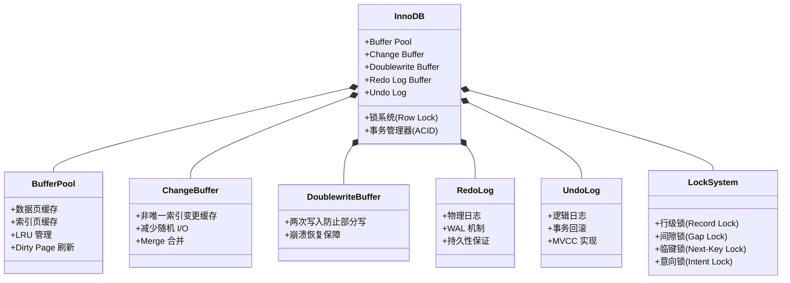
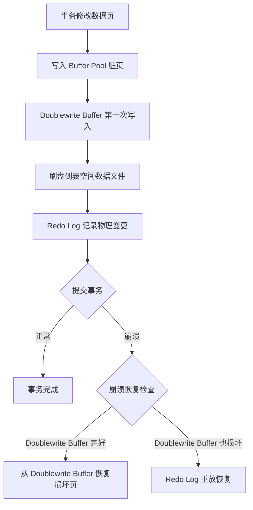
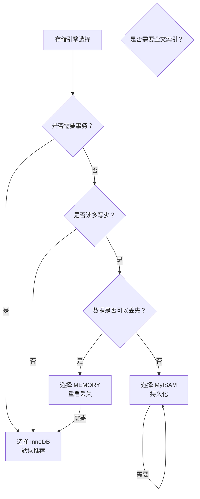

## 引言

MySQL 为什么默认用 InnoDB？什么场景下你会选其他引擎？你可能每天都在用 MySQL，却很少关注过底层的存储引擎选择。引擎选对了，性能翻几倍不是梦；选错了，锁竞争、数据丢失、崩溃恢复失败，一个接一个的坑等着你跳。

本文深入对比 MySQL 三大主流存储引擎——InnoDB、MyISAM、Memory，从底层实现到生产选型，帮你建立完整的存储引擎认知体系。读完本文你将掌握：
- **InnoDB 核心机制**：Buffer Pool、Change Buffer、Doublewrite Buffer 的工作原理
- **三种引擎的差异对比**：锁粒度、事务支持、崩溃恢复能力
- **生产环境选型指南**：不同业务场景下如何选择合适的存储引擎

## InnoDB 引擎

InnoDB 是 MySQL 5.1 版本后默认的存储引擎，提供了 ACID 事务支持、行级锁和外键约束，设计目标是处理大数据量的数据库系统。MySQL 运行时，InnoDB 会在内存中建立缓冲池（Buffer Pool），用于缓冲数据和索引。但 InnoDB 不支持全文搜索（MySQL 5.6 之后已支持），启动较慢，且不保存表的行数（SELECT COUNT(*) 需要扫描全表）。由于锁的粒度小，写操作不会锁定全表，在高并发场景下能显著提升吞吐量。

> **💡 核心提示**：InnoDB 的行级锁是通过索引实现的，**只有走索引的条件才能使用行级锁**。如果 WHERE 条件没有命中索引，InnoDB 会退化为表级锁！这也是为什么在高并发写场景下，合理的索引设计不仅能提升查询性能，还能大幅降低锁竞争。

### 核心机制深度解析

#### 1. Buffer Pool（缓冲池）

Buffer Pool 是 InnoDB 在内存中维护的一块区域，用于缓存数据页和索引页。它是 InnoDB 性能优化的核心，通过减少磁盘 I/O 来大幅提升读写性能。

- **LRU 链表管理**：InnoDB 使用改良版的 LRU（Least Recently Used）算法管理数据页，分为年轻子列表和老列表，防止全表扫描将热点数据挤出。
- **脏页刷新**：当 Buffer Pool 中的数据页被修改后，变成脏页（Dirty Page），最终需要刷回磁盘。
- **预读机制**：InnoDB 支持线性预读和随机预读，提前将可能访问的数据页加载到 Buffer Pool。

> **💡 核心提示**：Buffer Pool 的大小通常建议设置为物理内存的 **50%~70%**。设置过小会导致大量磁盘 I/O，设置过大则可能挤占操作系统和其他进程的内存。在专用数据库服务器上，建议设置 `innodb_buffer_pool_size` 为服务器总内存的 60%~80%。

#### 2. Change Buffer（变更缓冲区）

Change Buffer 是 InnoDB 专门用于优化非唯一二级索引更新的一种数据结构。当需要更新一个二级索引页，但该页不在 Buffer Pool 中时，InnoDB 不会立即从磁盘加载该页，而是将变更操作暂存在 Change Buffer 中。等到该页被其他操作加载到 Buffer Pool 时，再进行 Merge（合并）操作。

- **减少随机 I/O**：将多次对同一索引页的修改合并为一次磁盘写操作。
- **适用场景**：适合写多读少、且更新集中在非唯一索引上的业务。
- **代价**：读取时需要 Merge Change Buffer 中的数据，可能影响读取性能。

#### 3. Doublewrite Buffer（双写缓冲区）

Doublewrite Buffer 是 InnoDB 为防止"部分写失效"（Partial Page Write）而设计的。当系统崩溃发生在数据页写入磁盘的中间过程时，可能导致页数据损坏（一半旧数据 + 一半新数据）。InnoDB 在写入数据页到表空间之前，先将数据写入 Doublewrite Buffer 文件，然后再写入实际的数据文件。如果发生崩溃，InnoDB 可以从 Doublewrite Buffer 中恢复损坏的页。

> **💡 核心提示**：Doublewrite Buffer 虽然引入了额外的一次磁盘写入，但它是 InnoDB 崩溃恢复的最后一道防线。只有在数据页大小为 4KB 的存储设备上（如某些 NVMe SSD 支持原子写入），才可以考虑关闭 Doublewrite Buffer（`innodb_doublewrite=0`）以获得性能提升。

### 适用场景

适合对事务完整性要求较高、在并发条件下对数据一致性要求较高，除了查询和插入还有很多更新和删除操作的场景。

- **事务支持**：InnoDB 支持 ACID 事务（原子性、一致性、隔离性、持久性），并实现了标准的行级锁定和外键约束。
- **崩溃恢复**：通过使用 Redo Log 和 Undo Log，InnoDB 提供了崩溃恢复功能。
- **行级锁定**：支持高并发的行级锁定机制，减少锁争用，提高多用户并发访问的性能。
- **外键约束**：支持外键约束，保证数据的完整性。

## MyISAM 引擎

MyISAM 是 MySQL 5.1 以及之前版本的默认存储引擎。MyISAM 适合以读和插入操作为主、很少更新和删除、并且对事务完整性和并发性要求不高的场景。

- **不提供事务支持**：不支持事务，也不支持行级锁和外键。执行插入和更新操作时需要锁定整个表（表级锁），导致写效率较低。
- **COUNT(*) 优化**：MyISAM 保存了表的行数，执行 `SELECT COUNT(*) FROM table` 时，可以直接读取已保存的值，不需要扫描全表。
- **表级锁定**：使用表级锁定机制，读写操作可能会相互阻塞。
- **全文索引**：支持全文索引，适用于需要全文搜索的应用（注：MySQL 5.6 之后 InnoDB 也支持全文索引）。
- **存储效率高**：由于没有事务日志，MyISAM 存储效率较高。

## MEMORY 引擎

MEMORY 引擎将所有数据存储在内存中，实现快速访问。缺点是对表的大小有限制，无法缓存太大的表。适合更新不太频繁的小表，实现快速访问的场景。

- **内存存储**：数据存储在内存中，读写速度极快，但数据在服务器重启时会丢失。
- **表级锁定**：使用表级锁定机制。
- **哈希索引**：默认使用哈希索引，适用于等值查询。

## 三种引擎对比

| 特性 | InnoDB | MyISAM | MEMORY |
| :--- | :--- | :--- | :--- |
| **事务支持** | 支持 ACID | 不支持 | 不支持 |
| **锁粒度** | 行级锁 | 表级锁 | 表级锁 |
| **外键** | 支持 | 不支持 | 不支持 |
| **崩溃恢复** | 支持（Redo/Undo Log） | 不支持 | 不支持 |
| **COUNT(*)** | 需扫描全表 | 直接读取行数 | 需扫描 |
| **全文索引** | 支持（5.6+） | 支持 | 不支持 |
| **索引类型** | B+树 | B+树 | 哈希/B+树 |
| **数据存储** | 磁盘（Buffer Pool 缓存） | 磁盘 | 内存 |
| **数据持久性** | 持久化 | 持久化 | 重启丢失 |
| **适用场景** | 高并发写、事务型业务 | 读多写少、无事务需求 | 临时表、高速缓存 |

## 生产环境避坑指南

| 坑位 | 现象 | 解决方案 |
| :--- | :--- | :--- |
| **混用存储引擎** | 同一数据库中不同表使用不同引擎，导致跨引擎 JOIN 性能差、事务无法跨引擎 | 统一使用 InnoDB，避免混用引擎；历史遗留表逐步迁移到 InnoDB |
| **MEMORY 引擎数据丢失** | 服务器重启后 MEMORY 表数据全部丢失 | 仅用于临时缓存或中间结果表，重要数据务必使用 InnoDB，并建立定时持久化机制 |
| **InnoDB COUNT(*) 慢** | 大表 SELECT COUNT(*) 耗时极长 | 使用近似统计（如 EXPLAIN rows），或维护独立的计数器表，避免全表扫描 |
| **Buffer Pool 配置不当** | 内存设置过小导致大量磁盘 I/O，设置过大导致 OOM | 根据 `innodb_buffer_pool_size` 调整，专用服务器建议设置为物理内存的 60%~80% |
| **Change Buffer 引发读取延迟** | 大量写入后突然读取，触发 Change Buffer Merge 导致慢查询 | 控制写入量，在写入高峰期避免大量读取操作，合理设置 `innodb_change_buffer_max_size` |
| **Doublewrite Buffer 性能开销** | 在高 IOPS 的 NVMe SSD 上 Doublewrite Buffer 成为瓶颈 | 使用支持原子写入的 SSD 时可考虑关闭 Doublewrite Buffer（需评估风险） |

## 总结

| 特性 | InnoDB | MyISAM | MEMORY |
| :--- | :--- | :--- | :--- |
| **推荐指数** | ⭐⭐⭐⭐⭐ | ⭐⭐ | ⭐ |
| **生产推荐场景** | 绝大多数业务场景 | 仅读不写的归档表 | 临时表/缓存表 |

### 行动清单

1. **统一使用 InnoDB**：新建表默认使用 InnoDB，逐步将历史 MyISAM 表迁移到 InnoDB（`ALTER TABLE xxx ENGINE=InnoDB`）。
2. **调整 Buffer Pool**：检查生产环境的 `innodb_buffer_pool_size`，建议设置为服务器内存的 60%~80%。
3. **避免 MEMORY 存重要数据**：MEMORY 表仅用于临时计算和高速缓存，数据丢失不会造成业务影响的场景。
4. **关注锁粒度影响**：InnoDB 行级锁需要走索引才能生效，确保核心查询有合适的索引。
5. **定期检查存储引擎分布**：使用 `SELECT ENGINE, COUNT(*) FROM information_schema.tables GROUP BY ENGINE` 了解数据库中各引擎分布情况。
6. **扩展阅读**：推荐深入阅读《MySQL 技术内幕：InnoDB 存储引擎》了解 InnoDB 底层实现原理。
