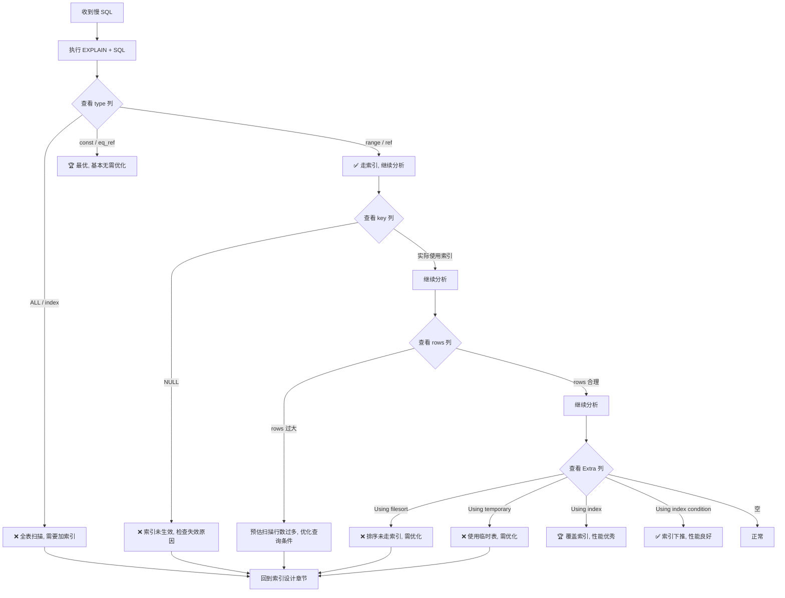

## 引言

一条 SQL 执行了 10 秒，怎么快速定位性能瓶颈？

很多开发者面对慢 SQL 的第一反应是"加索引"，但加索引之前，你得先知道这条 SQL 到底是怎么执行的。MySQL 提供了一个利器——`EXPLAIN` 命令，它能模拟优化器执行 SQL，返回执行计划的详细信息，而不会真正执行这条 SQL。

本文将带你深入理解 EXPLAIN 输出的每一个字段：id、select_type、type（访问类型，从 system 到 ALL 共 9 种）、key_len 计算规则、以及最容易被忽视的 Extra 列（Using filesort、Using temporary、Using index 到底意味着什么）。看完本文，你将能像 DBA 一样读懂执行计划，精准定位 SQL 性能瓶颈。

## 1. EXPLAIN 的基本使用

在 SELECT 语句之前增加 EXPLAIN 关键字，MySQL 会在查询上设置一个标记，执行查询会返回执行计划的信息，并不会真正执行这条 SQL。

```sql
EXPLAIN SELECT * FROM user WHERE id = 1;
```

EXPLAIN 输出的每一列都是 SQL 性能的关键指标，下面逐一详解。

## 2. EXPLAIN 分析工作流



## 3. EXPLAIN 字段详解

### 3.1 id 列

表示查询的序号，自动分配，顺序递增。**值越大，执行优先级越高**。

- id 相同时，由上到下顺序执行
- id 不同时，先执行 id 值大的子查询

### 3.2 select_type 列

表示查询类型：

| 值 | 含义 | 示例 |
|----|------|------|
| SIMPLE | 简单查询，不包含子查询或 UNION | `SELECT * FROM user` |
| PRIMARY | 主查询，最外层的 SELECT | `SELECT ... FROM (SELECT ...) t` |
| SUBQUERY | 子查询 | `WHERE id = (SELECT MAX(id) ...)` |
| DERIVED | 派生表（FROM 中的子查询） | `FROM (SELECT ...) t` |
| UNION | UNION 中的第二个及以后的 SELECT | `SELECT ... UNION SELECT ...` |
| UNION RESULT | UNION 的结果集 | UNION 执行后的临时结果 |

### 3.3 table 列

表示查询的表名、表别名或临时表名。

### 3.4 partitions 列

表示查询匹配到的分区，没有分区时显示 NULL。

### 3.5 type 列（核心重点）

type 表示**访问类型**（access type），是衡量查询性能最重要的指标之一。性能从好到差依次为：

> system > const > eq_ref > ref > ref_or_null > index_merge > range > index > ALL

> **💡 核心提示**：在生产环境中，至少保证查询的 type 达到 `range` 级别。如果是 `ALL`（全表扫描），必须排查原因并优化。

#### system

表中**只有一行记录**时的特例，是 const 类型的特殊情况，查询效率最高。

#### const

使用**主键或唯一索引**进行等值查询，最多返回一条记录。MySQL 在优化阶段就能将 const 表优化为常量，性能极佳。

```sql
SELECT * FROM user WHERE id = 1;  -- id 是主键, type=const
```

#### eq_ref

表连接时使用到了**主键或唯一索引**。常用于多表 JOIN 场景。

```sql
SELECT * FROM user u JOIN order o ON u.id = o.user_id;  -- o.user_id 是主键
```

#### ref

使用**非唯一索引**进行等值查询。

```sql
SELECT * FROM user WHERE name = '张三';  -- name 是普通索引
```

#### ref_or_null

在 ref 的基础上增加了 NULL 值的判断。

```sql
SELECT * FROM user WHERE name = '张三' OR name IS NULL;
```

#### index_merge

使用了**索引合并**优化，即同时用到多个索引，最后合并结果。

```sql
SELECT * FROM user WHERE name = '张三' OR age = 25;  -- name 和 age 各有索引
```

#### range

使用索引进行**范围查询**。

```sql
SELECT * FROM user WHERE age BETWEEN 18 AND 30;
```

#### index

**全索引扫描**：遍历整个索引树，比全表扫描稍好（因为索引通常比数据行小）。

```sql
SELECT name FROM user;  -- 只查 name 列, 直接扫描索引即可
```

#### ALL

**全表扫描**，性能最差，必须优化。

```sql
SELECT * FROM user WHERE age = 25;  -- age 没有索引
```

> **💡 核心提示**：很多人分不清 `index` 和 `ALL` 的区别。`index` 是扫描索引树（通常比表小），`ALL` 是扫描完整的数据行。但如果索引是覆盖索引（Using index），`index` 可能比 `ref` 还快。

## 4. 访问类型性能对比表

| 访问类型 | 扫描范围 | 索引利用 | 性能等级 | 是否需要优化 |
|---------|---------|---------|---------|------------|
| system | 1 行 | 主键 | 🏆 最优 | 不需要 |
| const | 1 行 | 主键/唯一索引 | 🏆 最优 | 不需要 |
| eq_ref | 1 行/连接 | 主键/唯一索引 | ⭐ 优秀 | 不需要 |
| ref | 多行 | 非唯一等值匹配 | ⭐ 良好 | 不需要 |
| ref_or_null | 多行 | 非唯一等值+NULL | ⭐ 良好 | 视情况 |
| index_merge | 多行 | 多个索引合并 | 🟡 中等 | 考虑联合索引 |
| range | 范围 | 索引范围扫描 | 🟡 中等 | 视范围大小 |
| index | 全索引 | 全索引扫描 | ⚠️ 较差 | 建议优化 |
| ALL | 全表 | 无索引 | ❌ 最差 | 必须优化 |

## 5. possible_keys 列

表示查询**可能用到**的索引列表。注意是"可能"，实际不一定用到。

## 6. key 列

表示查询**实际使用**的索引。如果为 NULL，说明没有使用任何索引。

## 7. key_len 列（重点）

表示**索引使用的字节数**，可以用来判断联合索引使用了几列。

| 数据类型 | 占用字节 | 说明 |
|---------|---------|------|
| tinyint | 1 | |
| smallint | 2 | |
| int | 4 | |
| bigint | 8 | |
| date | 3 | |
| timestamp | 4 | |
| datetime | 8 | |
| char(n) | n | 固定长度 |
| varchar(n) | 3n + 2 | UTF-8 编码，2 字节记录变长长度 |
| 字段允许为 NULL | +1 | 额外增加 1 字节标识位 |

> **💡 核心提示**：key_len 是判断联合索引使用情况的关键。例如联合索引 `(name, age)`，其中 name 是 varchar(100) NOT NULL，age 是 int NOT NULL。如果 key_len = 302（100*3 + 2），说明只用了 name 列；如果 key_len = 306（302 + 4），说明 name 和 age 两列都用到了。

## 8. ref 列

表示 WHERE 条件或 JOIN 中与索引比较的参数类型。常见的有 `const`（常量）、`func`（函数表达式）、字段名。没用到索引时显示 NULL。

## 9. rows 列

表示优化器**预估**需要扫描的行数。注意这是估算值，不一定准确（通过采样统计信息计算）。

## 10. filtered 列

表示按条件过滤后剩余行的百分比。与 rows 配合使用：`rows × filtered / 100 = 实际连接扫描的行数`。

例如 rows=10000, filtered=10%，表示扫描 10000 行后，只剩约 1000 行参与后续 JOIN 操作。

## 11. Extra 列（核心重点）

Extra 列包含了很多不适合在其他列展示的额外信息，但对性能调优至关重要。

| 值 | 含义 | 影响 |
|----|------|------|
| **Using where** | 使用了 WHERE 条件过滤，但没有通过索引直接过滤 | ⚠️ 可能需要优化 |
| **Using index** | 使用了覆盖索引，无需回表 | 🏆 性能优秀 |
| **Using index condition** | 使用了索引下推（ICP）优化 | ✅ 性能良好 |
| **Using filesort** | 排序字段没有用到索引，需要额外排序 | ❌ 需要优化 |
| **Using temporary** | 使用了临时表存储中间结果 | ❌ 需要优化 |
| **Using join buffer** | JOIN 时没有使用索引，使用连接缓冲区 | ❌ 需要优化 |
| **Impossible WHERE** | WHERE 条件永远为假 | 查询无结果 |
| **Select tables optimized away** | 优化器已经完成了所有优化 | 🏆 最优 |

### 重点关注标志

#### Using where

使用了 WHERE 条件搜索，但没有使用索引来过滤。这意味着 MySQL 需要在存储引擎层拿到数据后，在 Server 层再做一次过滤。

#### Using index（覆盖索引）

用到了覆盖索引，即在索引上就查到了所需全部数据，**无需二次回表查询**，性能较好。

#### Using filesort

排序字段没有用到索引，MySQL 需要在内存或磁盘中做额外排序操作。如果排序数据量大，会严重影响性能。

#### Using temporary

使用了临时表来存储中间查询结果，常见于 GROUP BY、DISTINCT、某些 JOIN 场景。临时表的创建和销毁都有额外开销。

#### Using join buffer

表关联时没有使用到索引，MySQL 使用连接缓冲区来缓存中间结果。数据量大时效率很低。

## 12. 生产环境避坑指南

### 坑 1：被 rows 估算值误导

**现象**：EXPLAIN 显示 rows=1000，实际执行却扫描了 100 万行。
**原因**：rows 是优化器的估算值，基于表的统计信息（采样数据）。如果统计信息过期（大量 INSERT/DELETE 后），估算值会严重偏差。
**对策**：定期执行 `ANALYZE TABLE` 更新统计信息；使用 `SHOW INDEX` 查看 Cardinality 判断统计信息是否准确。

### 坑 2：索引存在但未使用

**现象**：`possible_keys` 显示了索引，但 `key` 为 NULL。
**原因**：优化器根据成本估算选择了全表扫描。常见原因包括：表数据量太小、查询条件区分度太低、统计信息过期。
**对策**：检查是否需要 `FORCE INDEX` 强制使用索引；检查查询条件是否有隐式类型转换。

### 坑 3：忽略 Extra 列中的警告标志

**现象**：type 是 ref，看起来还行，但 Extra 显示 `Using filesort`。
**原因**：虽然走索引了，但 ORDER BY 字段没有使用索引，需要额外排序。
**对策**：在排序字段上创建索引，或调整索引列顺序使其覆盖排序字段。

### 坑 4：EXPLAIN 的结果不一定等于实际执行

**现象**：EXPLAIN 显示走了索引，实际执行却很慢。
**原因**：EXPLAIN 只是模拟，不会真正执行 SQL。实际执行时可能因为数据分布、缓存状态等因素表现不同。
**对策**：EXPLAIN 之后，使用 `SHOW PROFILE` 或 `optimizer_trace` 进一步分析实际执行情况。

### 坑 5：忽略 key_len 的含义

**现象**：联合索引建了，但不确定实际用到了几列。
**原因**：没有查看 key_len 来判断联合索引的覆盖情况。
**对策**：养成看 key_len 的习惯，通过字节数判断联合索引使用了几列。

### 坑 6：在视图或子查询上 EXPLAIN

**现象**：对复杂视图执行 EXPLAIN，输出极其复杂难以理解。
**原因**：MySQL 会展开视图定义，生成多个执行计划。
**对策**：优先对底层基础查询进行 EXPLAIN，逐步排查。复杂查询可以拆分后单独分析。

## 13. 总结

### EXPLAIN 关键字段速查表

| 字段 | 作用 | 重点关注值 |
|------|------|-----------|
| type | 访问类型 | 至少 range，避免 ALL |
| key | 实际使用的索引 | 不为 NULL |
| key_len | 索引使用字节数 | 判断联合索引使用列数 |
| rows | 预估扫描行数 | 越小越好 |
| Extra | 额外信息 | 避免 Using filesort / Using temporary |

### 行动清单

1. **慢 SQL 第一步先 EXPLAIN**：不要盲目加索引，先用 EXPLAIN 分析执行计划。
2. **重点关注 type 列**：确保所有核心查询至少达到 range 级别。
3. **养成查看 key_len 的习惯**：通过字节数判断联合索引是否被完整利用。
4. **警惕 Extra 列警告**：Using filesort 和 Using temporary 是性能杀手，需要优先优化。
5. **定期更新统计信息**：执行 `ANALYZE TABLE`，确保优化器的 rows 估算准确。
6. **结合 optimizer_trace 深度分析**：当优化器选错索引时，用 `optimizer_trace` 查看选择过程。
7. **生产环境禁用全表扫描监控**：开启 `log_queries_not_using_indexes` 自动记录不走索引的 SQL。
8. **建立 SQL 审核机制**：上线前所有 SQL 必须通过 EXPLAIN 审核，type 不能为 ALL。
