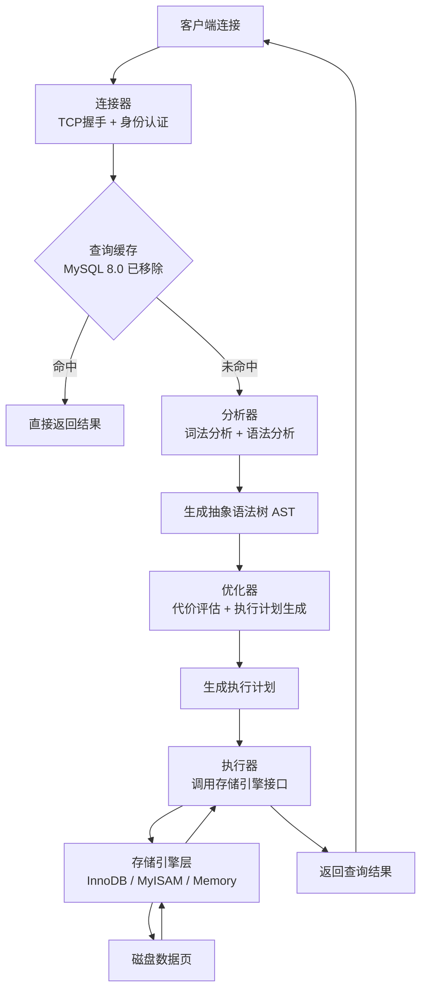
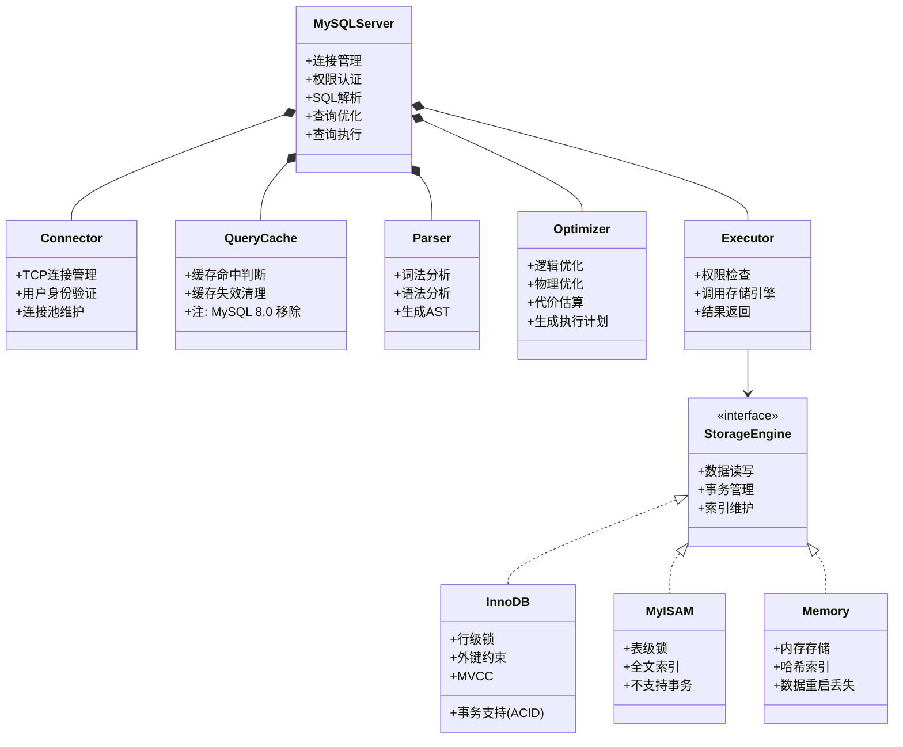
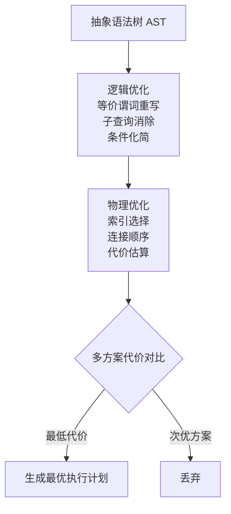

## 引言

一条 SELECT 语句，在 MySQL 内部经历了什么？你以为直接去磁盘读数据就完事了？实际上，它要穿过连接器身份验证、查询缓存（如果你的版本还有）、分析器词法语法检查、优化器代价评估、执行器引擎调度，最终才到达存储引擎层。

本文带你拆解 MySQL 分层架构，搞清楚每层的核心职责，以及你日常写的 SQL 优化到底发生在哪一层。读完本文你将掌握：
- **完整的 SQL 执行路径**：从客户端连接到返回结果，每一步经历了什么
- **Server 层与存储引擎层的边界**：为什么 MySQL 要做这样的分层设计
- **常见性能瓶颈的定位思路**：连接数爆炸、查询缓存失效、索引选错等问题，分别该查哪一层

## MySQL 整体架构

由图中可以看到 MySQL 架构主要分为 **Server 层** 和 **存储引擎层**。

**Server 层** 包含连接器、查询缓存（8.0 已移除）、分析器、优化器、执行器。所有跨存储引擎的功能都在这层实现，比如：函数、存储过程、触发器、视图等。

**存储引擎层** 是可插拔式的，常见的存储引擎有 MyISAM、InnoDB、Memory 等。MySQL 5.5 之前默认的是 MyISAM，之后默认的是 InnoDB。



> **💡 核心提示**：MySQL 采用"Server 层 + 存储引擎层"的分层架构，核心设计思想是**高内聚低耦合**。Server 层负责通用的 SQL 处理逻辑，存储引擎层负责具体的数据存储和检索。这种设计让 MySQL 可以灵活切换不同的存储引擎，而不需要重写上层逻辑。



## 连接器

连接器主要用来管理客户端的连接和用户身份认证。

客户端与 Server 端的连接采用的是 TCP 协议，经过三次握手建立连接之后，连接器开始进行身份验证。

```sql
mysql -hlocalhost -P3306 -uroot -p
```

如果认证失败，就会出现错误 `ERROR 1045 (28000): Access denied for user 'root'@'localhost' (using password: YES)`。

可以通过 `show processlist` 命令查看系统所有连接的信息。Command 列表示连接状态：
- **Daemon**：后台进程
- **Query**：正在执行查询
- **Sleep**：空闲连接

> **💡 核心提示**：MySQL 的连接是"有状态"的，建立连接后会在内存中保存用户权限等信息，后续请求直接复用，不需要重新认证。这就是为什么长连接能减少每次认证的开销，但也带来了连接数膨胀和内存占用的问题。

## 查询缓存

客户端请求不会直接去存储引擎查询数据，而是先在缓存中查询结果是否存在。如果结果已存在，直接返回；否则再执行一遍查询流程，查询结束后把结果再缓存起来。

如果数据表发生更改，缓存将被清空失效，例如 INSERT、UPDATE、DELETE、ALTER 操作等。对于频繁变更的数据表来说，缓存命中率很低，使用缓存反而降低了读写性能。

> **💡 核心提示**：**为什么 MySQL 8.0 移除了查询缓存？** 查询缓存的失效粒度是表级别的，任何对表的写操作都会清空整个表的查询缓存。在高并发写场景下，缓存几乎无法命中，反而成为性能瓶颈。加上缓存的维护成本（锁竞争、内存碎片等），MySQL 官方最终决定在 8.0 版本彻底移除这一模块。

## 分析器

分析器主要对 SQL 语句进行 **词法分析** 和 **语法分析**。

首先进行词法分析，识别出 MySQL 的关键字以及每个词语代表的含义。然后进行语法分析，检测 SQL 语句是否符合 MySQL 语法规则。

MySQL 通过识别 SQL 中的列名、表名、WHERE、SELECT/UPDATE/INSERT 等关键字，根据语法规则判断 SQL 是否合法，最终生成一棵抽象语法树（AST）。

比如 SQL 语句中少写个 WHERE 关键字，就会提示语法错误：

```sql
mysql> select * from user id=1;
ERROR 1064 (42000): You have an error in your SQL syntax; check the manual that corresponds to your MySQL server version for the right syntax to use near '=1' at line 1
```

## 优化器

在真正执行 SQL 语句之前，还需要经过优化器处理。我们熟知的执行计划（EXPLAIN）就是优化器生成的。

优化器主要有两个作用：**逻辑优化** 和 **物理优化**。

**逻辑优化** 主要进行等价谓词重写、条件化简、子查询消除、连接消除、语义优化、分组合并、选择下推、索引优化查询、表查询替换视图查询、UNION 替换 OR 操作等。

**物理优化** 的作用是通过代价估算模型，计算每种执行方式的代价，选择最优方案。并使用索引优化表连接，最终生成查询执行计划。



如果想知道优化器估算结果信息，可以通过 EXPLAIN 查看具体执行计划。

## 执行器

在优化器优化完 SQL 并生成执行计划后，执行计划会被传递给执行器。

执行器调用存储引擎接口，真正执行 SQL 查询。获取到存储引擎返回的查询结果后，把结果返回给客户端，至此 SQL 语句执行结束。

## 生产环境避坑指南

| 坑位 | 现象 | 解决方案 |
| :--- | :--- | :--- |
| **连接数过多** | `Too many connections` 报错 | 设置合理的 `max_connections`，使用连接池控制连接数，定期清理 Sleep 状态的长连接 |
| **查询缓存命中率极低** | CPU 飙升但 QPS 没有提升 | 检查表写频率，频繁更新的表不要开启查询缓存（MySQL 8.0 已移除） |
| **分析器语法错误排查慢** | 复杂 SQL 语法错误定位困难 | 使用 SQL 格式化工具，分步拆解复杂 SQL，利用 EXPLAIN 提前发现问题 |
| **优化器选错索引** | SQL 执行计划偏离预期，查询慢 | 使用 `optimizer_trace` 分析索引选择过程，必要时使用 `FORCE INDEX` 强制走索引 |
| **执行器权限不足** | 用户认证通过但执行时报权限错误 | 检查 Server 层的表级/列级权限配置，区分连接器认证和 SQL 执行器权限检查 |
| **空闲连接占用资源** | `show processlist` 大量 Sleep 连接 | 设置 `wait_timeout` 和 `interactive_timeout` 自动清理空闲连接 |

## 总结

| 组件 | 核心职责 | 性能关注点 |
| :--- | :--- | :--- |
| **连接器** | TCP 连接管理 + 身份认证 | 控制最大连接数，及时清理空闲连接 |
| **查询缓存** | 缓存查询结果（8.0 已移除） | 写频繁的场景命中率极低 |
| **分析器** | 词法分析 + 语法分析，生成 AST | SQL 语法错误在此阶段拦截 |
| **优化器** | 代价估算 + 索引选择 + 执行计划 | 关注执行计划，善用 EXPLAIN 和 optimizer_trace |
| **执行器** | 调用存储引擎接口执行查询 | 关注返回行数，避免全表扫描 |
| **存储引擎层** | 具体的数据存储和检索 | 选择合适的引擎（InnoDB/MyISAM） |

### 行动清单

1. **检查连接配置**：确认生产环境的 `max_connections` 是否合理，避免连接数打满。
2. **清理空闲连接**：设置 `wait_timeout`（建议 600s），定期 kill 长时间 Sleep 的连接。
3. **养成 EXPLAIN 习惯**：上线前对所有 SQL 执行 EXPLAIN，确认走了正确的索引。
4. **关注优化器行为**：当 SQL 执行计划不符合预期时，使用 `optimizer_trace` 分析原因。
5. **理解分层架构**：排查性能问题时，先定位问题在 Server 层还是存储引擎层，再针对性处理。
6. **扩展阅读**：推荐深入阅读《MySQL 技术内幕：InnoDB 存储引擎》和《高性能 MySQL》。
