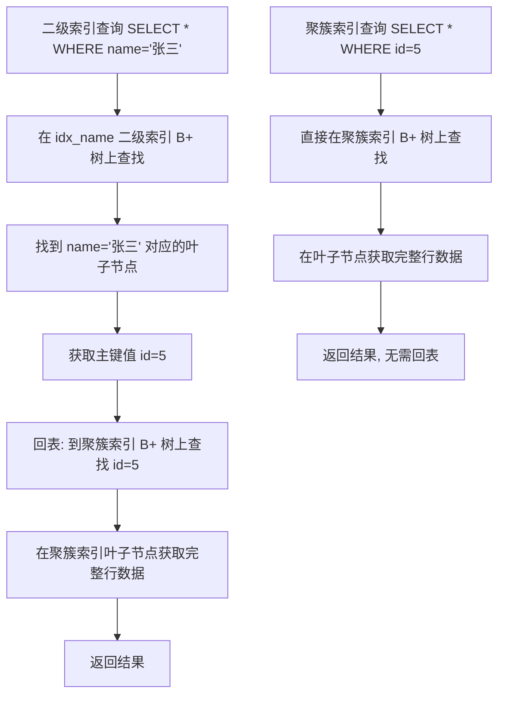

## 引言

为什么加了索引，SQL 反而变慢了？

很多开发者遇到性能瓶颈，第一反应就是"加索引"。但现实往往是：索引加了一堆，查询不但没变快，写入性能反而直线下降。问题出在哪？根本原因是你没有理解 MySQL 索引的底层数据结构和工作原理。

本文将从 B+ 树的数据结构讲起，带你彻底搞懂：InnoDB 为什么选择 B+ 树而不是 B 树或红黑树？聚簇索引和二级索引的本质区别是什么？联合索引的"最左匹配"底层是怎么实现的？以及哪些字段适合建索引、哪些字段建了反而拖慢性能。掌握这些，不管是写 SQL 还是面试，都能游刃有余。

## 1. 索引分类

在创建索引之前，先了解 MySQL 有哪些索引类型，才能选择合适的索引。

常见的索引有：普通索引、唯一索引、主键索引、联合索引、全文索引等。

### 普通索引

普通索引是最基本的索引，没有任何限制。

```sql
ALTER TABLE `table_name` ADD INDEX index_name (`column`);
```

### 唯一索引

与普通索引不同，唯一索引的列值必须唯一，允许为 NULL。

```sql
ALTER TABLE `table_name` ADD UNIQUE index_name (`column`);
```

### 主键索引

主键索引是一种特殊的唯一索引，一张表只有一个主键，不允许为 NULL。

```sql
ALTER TABLE `table_name` ADD PRIMARY KEY (`column`);
```

### 联合索引

联合索引是同时在多个字段上创建索引，查询效率更高。

```sql
ALTER TABLE `table_name` ADD INDEX index_name (`column1`, `column2`, `column3`);
```

### 全文索引

全文索引主要用来匹配字符串文本中的关键字。当需要判断字符串中是否包含关键字时，一般用 LIKE，但如果是以 `%` 开头则无法用到索引，这时可以使用全文索引。

```sql
ALTER TABLE `table_name` ADD FULLTEXT (`column`);
```

> **💡 核心提示**：全文索引在 MySQL 5.6 之前仅 MyISAM 引擎支持，5.6 之后 InnoDB 也支持了。但在实际生产中，中文全文检索更推荐使用 Elasticsearch，MySQL 的全文索引对中文分词支持有限。

## 2. 索引底层实现分类

### 哈希索引

MEMORY 存储引擎默认使用哈希索引，哈希索引的实现原理：

- **哈希表结构**：通过哈希函数将键值映射到哈希表的桶中，每个桶包含指向数据记录的指针。
- **无序存储**：不维护数据的顺序，只是简单地将键值通过哈希函数映射到位置上。

**适用场景**：
- 等值查询（`=`, `!=`, `IN` 操作）性能极佳
- 不支持范围查询（`BETWEEN`, `>`, `<`），因为哈希表不维护数据顺序

### B+ 树索引

InnoDB 和 MyISAM 默认都使用 B+ 树索引。

**实现原理**：
- **树结构**：B+ 树是一种多路平衡查找树，每个节点包含多个键值和指向子节点的指针。叶子节点包含实际数据或指向数据的指针。
- **有序存储**：维护数据顺序，天然支持范围查询和排序。

**适用场景**：
- 范围查询和排序性能优异
- 等值查询性能也很高（虽然不如哈希索引）
- 查找、插入、删除操作时间复杂度均为 O(log n)，性能稳定

> **💡 核心提示**：B+ 树之所以是数据库索引的首选，核心原因是它能将树高控制在 2~4 层。一个 3 层 B+ 树，每页 16KB，每页存 1000 个键值，可以存储约 10 亿条数据，而查询最多只需要 3 次磁盘 IO。

## 3. 索引数据结构演进：为什么是 B+ 树？

要知道 MySQL 索引底层为什么用 B+ 树，先理解一个核心问题：**磁盘 IO 是数据库性能的瓶颈**。

数据存储在磁盘中，读取数据产生磁盘 IO。相比内存操作（纳秒级），磁盘 IO（毫秒级）慢了几个数量级。所需数据在磁盘上往往不是连续的，一次查询可能需要多次磁盘 IO。因此，索引数据结构的设计目标就是：**尽可能减少磁盘 IO 次数**。

下面对比几种常见树结构的优劣。

### 二叉搜索树

二叉搜索树的定义：

1. 若左子树不空，则左子树上所有结点的值均小于它的根结点的值
2. 若右子树不空，则右子树上所有结点的值均大于它的根结点的值
3. 左、右子树也分别为二叉搜索树

理想情况下，查找时间复杂度是 O(log N)。但极端情况下（有序数据依次插入），二叉搜索树会退化成线性链表，查找时间复杂度退化为 O(N)。

### 红黑树

红黑树通过严格的规则保证左右子树高度差不超过 2 倍：

1. 结点是红色或黑色
2. 根结点是黑色
3. 所有叶子都是黑色（NIL 结点）
4. 每个红色结点的两个子结点都是黑色
5. 从任一结点到其每个叶子的所有路径都包含相同数目的黑色结点

**优点**：限制了树高，不会相差过大
**缺点**：规则复杂，插入/删除需要变色和旋转，维护成本高；且每个节点只存 1 个键值，树仍然较高，磁盘 IO 次数多

### B 树

B 树（多路平衡查找树）将二叉树变成了 N 叉树：

- 根节点至少有 2 个子节点
- 每个中间节点包含 k-1 个元素和 k 个子节点（m/2 <= k <= m）
- 所有叶子结点位于同一层

**优点**：每个节点含多个元素，一次 IO 加载一个节点到内存比较，大大减少了磁盘 IO 次数，树高更低

### B+ 树

B+ 树在 B 树的基础上做了关键改进：

1. 有 k 个子节点的中间节点就有 k 个元素（B 树是 k-1 个），子节点数量 = 元素数量
2. 中间节点的元素不保存数据，只用来索引，**所有数据都保存在叶子节点**
3. 所有中间节点元素同时存在于子节点中，在子节点元素中是最大（或最小）元素
4. **叶子结点包含全部元素信息，且叶子结点之间用有序链表连接**

**B+ 树的三大优势**：
1. 每个节点存储的元素更多，树更"矮胖"，磁盘 IO 次数更少
2. 非叶子节点只存索引不存数据，每次查找都到叶子节点，性能稳定
3. 叶子节点用有序链表连接，范围查询只需遍历链表，无需二次遍历树

### 索引数据结构对比 Mermaid 图

```mermaid
flowchart TD
    A[索引数据结构选型] --> B{二叉搜索树?}
    B -->|退化成链表 O(N)| C[❌ 不适合]
    B -->|理想情况 O(log N)| D[但极端情况不稳定]
    D --> C

    A --> E{红黑树?}
    E -->|树高仍较高| F[每个节点仅存1个键值]
    E -->|插入删除需旋转变色| G[维护成本高]
    F --> C
    G --> C

    A --> H{B树?}
    H -->|多路平衡, 树高低| I[✅ 不错]
    H -->|数据和索引混存| J[非叶子节点占空间大]
    J --> K[单页能存的键值更少]

    A --> L{B+树?}
    L -->|非叶子节点只存索引| M[✅ 单页存更多键值]
    L -->|所有数据在叶子节点| N[✅ 每次查找路径稳定]
    L -->|叶子节点有序链表| O[✅ 范围查询极快]
    M --> P[🏆 MySQL InnoDB 最终选择]
    N --> P
    O --> P
```

> **💡 核心提示**：B+ 树 vs B 树的关键区别在于"数据存在哪里"。B 树的每个节点都存数据，而 B+ 树只有叶子节点存数据。这意味着 B+ 树的非叶子节点更"瘦"，一个 16KB 的页能存放更多键值指针，树高更低，磁盘 IO 次数更少。

## 4. InnoDB 的聚簇索引与二级索引

理解 B+ 树之后，还需要理解 InnoDB 引擎中索引的两种实现方式。

### 聚簇索引（Clustered Index）

InnoDB 表数据文件本身就是 B+ 树索引结构：

- **叶子节点存储完整的数据行**（所有列的值）
- 按照主键顺序组织
- 每张表**有且只有一个**聚簇索引
- 如果没有显式定义主键，InnoDB 会自动生成一个 6 字节的隐藏主键

### 二级索引（Secondary Index）

除聚簇索引外的所有索引都是二级索引：

- **叶子节点存储的是主键值**，而非完整数据行
- 通过二级索引查询时，需要先用二级索引找到主键值，再通过主键值回表查询完整数据（这就是**回表**）



> **💡 核心提示**：覆盖索引的本质就是"不需要回表"。当你查询的列恰好都在二级索引中时（如 `SELECT id, name WHERE name='张三'`），MySQL 直接从二级索引就能拿到所有需要的数据，无需回表查询聚簇索引，性能大幅提升。这就是 `Extra` 列显示 `Using index` 的含义。

## 5. 哪些字段适合创建索引？

1. **频繁查询的字段**：冷热数据分明的表中，频繁使用的字段更适合创建索引。
2. **WHERE 和 JOIN ON 条件中的字段**：SQL 执行顺序是 `FROM > ON > JOIN > WHERE > GROUP BY > HAVING > SELECT > ORDER BY > LIMIT`，在早期阶段就能过滤数据的字段应优先建索引。
3. **区分度高的字段**：区分度 = COUNT(DISTINCT column) / COUNT(*)。用户表中"生日"比"性别"区分度高得多。
   ```sql
   SELECT count(DISTINCT birthday)/count(*), count(DISTINCT gender)/count(*) FROM user;
   ```
   已有索引的区分度可通过 `SHOW INDEX FROM table_name` 的 `Cardinality` 列查看。
4. **有序的字段**：有序字段插入时 B+ 树结构稳定，不需要频繁调整索引。

## 6. 哪些字段不适合创建索引？

1. **区分度低的字段**：如性别字段，只有两个值，建索引后优化器大概率选择全表扫描。
2. **频繁更新的字段**：每次更新都要维护 B+ 树结构，频繁更新索引文件会降低性能。
3. **过长的字段**：占用更多存储空间，可使用前缀索引替代。
4. **无序的字段**：如 UUID，插入时会导致 B+ 树频繁分裂和页合并，性能差。

## 7. 创建索引的其他注意事项

1. **优先使用联合索引**：联合索引比多个单列索引更精准。联合索引 `(age, name)` 在 B+ 树中先按 age 排序，age 相等再按 name 排序。
2. **联合索引中区分度高的字段放前面**：减少匹配过程中的比较次数。
3. **过长字符串使用前缀索引**：如 `ALTER TABLE user ADD INDEX idx_address (address(3));`，乡镇级区分度已足够。
4. **值唯一的字段使用唯一索引**：既提升查询性能，又避免程序 bug 导致重复数据。
5. **ORDER BY 和 GROUP BY 字段尽量创建索引**：避免文件排序（filesort），利用索引有序性。
6. **避免创建过多索引**：索引占用存储空间，每次 INSERT/UPDATE/DELETE 都要更新所有相关索引，得不偿失。

## 8. 联合索引的"最左匹配"原理

联合索引 `(name, age)` 在 B+ 树中的排序规则是：先按 name 排序，name 相同再按 age 排序。

这导致了**最左匹配原则**：

| 查询条件 | 是否用到索引 | 说明 |
|---------|------------|------|
| `WHERE name='张三'` | ✅ | 匹配第一列 |
| `WHERE name='张三' AND age=25` | ✅ | 匹配第一、二列 |
| `WHERE age=25` | ❌ | 跳过第一列，无法利用索引有序性 |
| `WHERE name LIKE '张%'` | ✅ | 前缀匹配第一列 |
| `WHERE name LIKE '%张'` | ❌ | 前缀通配无法利用索引 |

## 9. 索引失效场景

工作中常见的问题：明明建了索引，为什么 SQL 没有用到？

### 1. 数据类型隐式转换

name 字段是 varchar 类型，如果传入数值类型，虽然不报错但无法用到索引。

```sql
EXPLAIN SELECT * FROM user WHERE name='一灯';  -- ✅ 走索引
EXPLAIN SELECT * FROM user WHERE name=18;       -- ❌ 隐式转换，全表扫描
```

### 2. 模糊查询 LIKE 以 % 开头

```sql
EXPLAIN SELECT * FROM user WHERE name LIKE '张%';  -- ✅ 走索引
EXPLAIN SELECT * FROM user WHERE name LIKE '%张';  -- ❌ 全表扫描
```

### 3. OR 前后没有同时使用索引

name 有索引但 age 没有，使用 OR 时会全表扫描。

```sql
EXPLAIN SELECT * FROM user WHERE name='一灯' OR age=18;  -- ❌ 全表扫描
```

### 4. 联合索引没有使用第一列

必须遵循最左匹配原则。

```sql
CREATE TABLE `user` (
  `id` int NOT NULL AUTO_INCREMENT COMMENT '主键',
  `name` varchar(255) DEFAULT NULL COMMENT '姓名',
  `age` int DEFAULT NULL COMMENT '年龄',
  PRIMARY KEY (`id`),
  KEY `idx_name_age` (`name`,`age`)
) ENGINE=InnoDB COMMENT='用户表';

EXPLAIN SELECT * FROM user WHERE age=18;  -- ❌ 跳过了 name 列
```

### 5. 在索引字段上进行计算操作

```sql
EXPLAIN SELECT * FROM user WHERE id+1=2;  -- ❌ 索引列参与计算，全表扫描
```

### 6. 在索引字段上使用函数

```sql
EXPLAIN SELECT * FROM user WHERE UPPER(name)='YIDENG';  -- ❌ 函数导致索引失效
```

### 7. 优化器选错索引

优化器根据表数据量选择是否使用索引。当大部分数据都满足查询条件时，优化器会认为全表扫描比走索引更快。此时可用 `FORCE INDEX` 强制使用索引：

```sql
SELECT * FROM user FORCE INDEX(idx_name) WHERE name='一灯';
```

## 10. 存储引擎对比：InnoDB vs MyISAM vs MEMORY

| 特性 | InnoDB | MyISAM | MEMORY |
|------|--------|--------|--------|
| **事务支持** | ✅ 支持 ACID | ❌ 不支持 | ❌ 不支持 |
| **行级锁** | ✅ 支持 | ❌ 仅表锁 | ❌ 仅表锁 |
| **外键** | ✅ 支持 | ❌ 不支持 | ❌ 不支持 |
| **MVCC** | ✅ 支持 | ❌ 不支持 | ❌ 不支持 |
| **崩溃恢复** | ✅ 通过 redo log | ❌ 不支持 | ❌ 数据全丢失 |
| **索引结构** | B+ 树（聚簇索引） | B+ 树（非聚簇） | 哈希索引 / B+ 树 |
| **数据存储位置** | 表空间（.ibd） | 独立文件（.MYD） | 内存 |
| **全文索引** | ✅ 5.6+ 支持 | ✅ 支持 | ❌ 不支持 |
| **空间索引** | ✅ 支持 | ✅ 支持 | ❌ 不支持 |
| **COUNT(*) 性能** | 需要全表扫描 | ✅ O(1) 直接返回 | ✅ O(1) 直接返回 |
| **适用场景** | OLTP 通用场景 | 只读/读多写少 | 临时表/高速缓存 |
| **推荐指数** | ⭐⭐⭐⭐⭐（默认首选） | ⭐⭐（不推荐新使用） | ⭐（特定场景） |

## 11. 生产环境避坑指南

### 坑 1：盲目建索引，导致写入性能下降

**现象**：每张表建了七八个索引，INSERT 变慢了好几倍。
**原因**：每次写入数据都要更新所有相关索引的 B+ 树，索引越多写入越慢。
**对策**：定期用 `SHOW INDEX FROM table_name` 审查索引，删除使用频率低的索引。

### 坑 2：联合索引列顺序错误

**现象**：建了 `(gender, name, age)` 联合索引，但查询时只用了 `name` 条件。
**原因**：最左匹配原则要求查询条件从联合索引第一列开始连续匹配。
**对策**：区分度最高的字段放联合索引最前面，且确保业务查询能匹配前缀。

### 坑 3：索引列允许 NULL 值

**现象**：索引区分度低，查询效果差。
**原因**：NULL 值在 B+ 树中不参与索引比较，且需要额外存储标识位。
**对策**：建表时尽量使用 `NOT NULL DEFAULT` 约束，避免索引列出现 NULL。

### 坑 4：大表加索引不评估影响

**现象**：直接在千万级大表上 `ALTER TABLE ADD INDEX`，导致数据库长时间锁表。
**原因**：MySQL 5.6 之前 ADD INDEX 会锁表重建，5.6+ 虽然支持 Online DDL 但仍消耗大量资源。
**对策**：大表加索引使用 `pt-online-schema-change` 或 `gh-ost` 工具，在业务低峰期执行。

### 坑 5：忽略索引碎片问题

**现象**：表数据量不大，但查询越来越慢。
**原因**：频繁的 INSERT/UPDATE/DELETE 导致 B+ 树产生碎片，页分裂严重。
**对策**：定期执行 `OPTIMIZE TABLE` 或使用 `ALTER TABLE table_name ENGINE=InnoDB` 重建表。

### 坑 6：字符串索引不加前缀限制

**现象**：在 varchar(255) 的邮箱字段上建索引，索引文件巨大。
**原因**：整个字符串都纳入索引，浪费存储空间。
**对策**：使用前缀索引 `INDEX idx_email(email(20))`，通常前 20 个字符已足够区分。

## 12. 总结

### 核心知识对比表

| 对比维度 | 聚簇索引 | 二级索引 | 联合索引 |
|---------|---------|---------|---------|
| **叶子节点存储** | 完整数据行 | 主键值 | 主键值 |
| **每表数量** | 仅 1 个 | 多个 | 多个 |
| **是否需要回表** | 不需要 | 通常需要 | 通常需要 |
| **覆盖索引条件** | 天然覆盖 | 查询列全在索引中 | 查询列全在索引中 |
| **最佳使用场景** | 主键查询 | 单列高频查询 | 多列组合查询 |

### 行动清单

1. **审查现有索引**：在生产环境执行 `SHOW INDEX FROM 表名`，检查每个表的索引数量和 Cardinality 值。
2. **删除冗余索引**：找出使用频率为 0 的索引（通过 `sys.schema_unused_indexes` 视图），安全删除。
3. **优化联合索引列序**：确保区分度最高的字段放在联合索引最前面。
4. **检查索引列 NULL 约束**：将允许 NULL 的索引列改为 `NOT NULL DEFAULT` 值。
5. **使用前缀索引**：对长度超过 50 的字符串索引列，评估前缀索引的区分度。
6. **定期分析表**：执行 `ANALYZE TABLE` 更新索引统计信息，帮助优化器做出正确的索引选择。
7. **大表加索引用工具**：对超过 500 万行的表加索引时，使用 `pt-online-schema-change` 避免锁表。
8. **监控索引写入开销**：写入密集型表，索引数量控制在 5 个以内。
