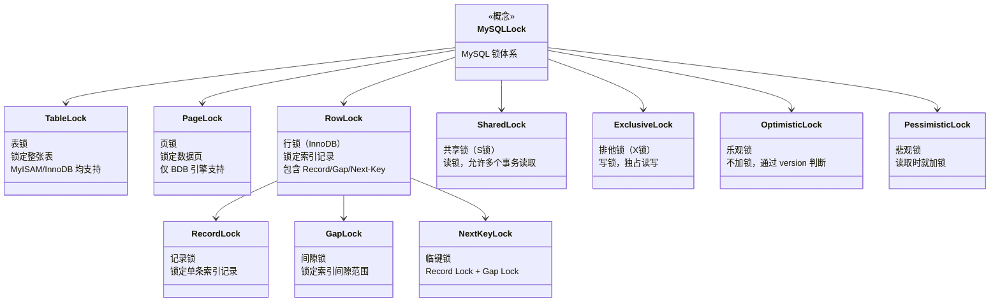
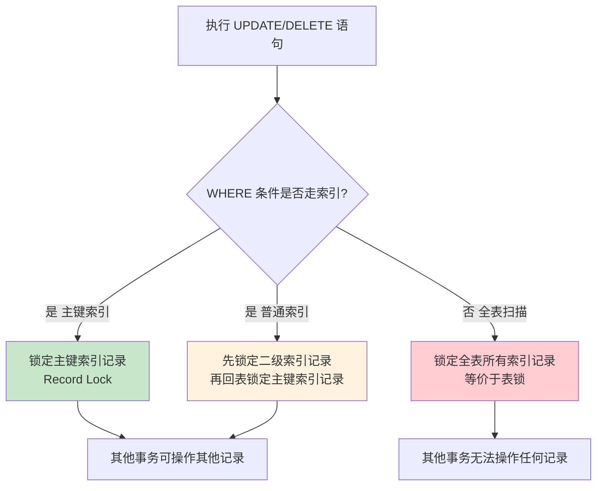

## 引言

一条 UPDATE 语句，到底锁住了哪些数据？

答案远比你想的复杂。锁的范围取决于 WHERE 条件是否走索引、是什么类型的索引、匹配的记录是否存在。理解 InnoDB 的锁机制，是排查线上死锁、锁等待超时的必备能力。

本文将深入剖析 MySQL 的锁机制，包括：
- **锁的分类体系**：表锁、行锁、记录锁、间隙锁、临键锁的层次关系和适用场景
- **InnoDB 行锁实现原理**：锁是加在索引上而非数据行上的，不走索引就等于全表加锁
- **共享锁 vs 排他锁**：读锁和写锁的兼容性矩阵
- **乐观锁 vs 悲观锁**：应用层与数据库层的并发控制策略对比
- **生产环境避坑指南**：索引失效导致表锁、锁等待超时、间隙锁交叉死锁

无论你是开发还是 DBA，掌握这套锁机制都能帮你精准定位"这条 SQL 到底锁了什么"。

> **💡 核心提示**：InnoDB 的行锁是**加在索引上**的，不是加在数据行上的。如果查询没有走索引，InnoDB 会锁住整张表的所有记录——这就是为什么有些 UPDATE 明明只更新一条数据，却导致整张表被锁。

## 为什么要加锁

当多个事务并发操作同一批数据的时候，如果不加锁，就无法保证事务的隔离性，最后导致数据错乱。

**加锁的本质目的**：保证并发操作下数据的正确性和一致性。

MySQL 的两大核心知识点——**索引**和**锁**，共同支撑了高并发场景下的数据访问：
- **索引**解决"怎么快速找到数据"
- **锁**解决"怎么安全地并发操作数据"

## 锁的分类体系



MySQL 的锁可以从三个维度进行分类：

| 分类维度 | 锁类型 | 说明 |
|---------|--------|------|
| **按锁的粒度** | 表锁 | 锁定整张表 |
| | 页锁 | 锁定单个数据页 |
| | 行锁 | 锁定单行数据 |
| | 记录锁（Record Locks） | 锁定单条索引记录 |
| | 间隙锁（Gap Locks） | 锁定索引记录之间的间隙 |
| | 临键锁（Next-Key Locks） | 记录锁 + 间隙锁 |
| **按锁的属性** | 共享锁（S 锁） | 读锁，允许多个事务同时读取 |
| | 排他锁（X 锁） | 写锁，独占读写权限 |
| **按加锁机制** | 乐观锁 | 不加锁，通过版本号/CAS 判断冲突 |
| | 悲观锁 | 读取时就加锁 |

## 按锁的粒度分类

### 表锁

MyISAM 和 InnoDB 引擎均支持表锁。

- **优点**：开销小，加锁快，不会出现死锁
- **缺点**：锁定粒度大，发生锁冲突概率高，并发度最低

**加锁方式**：

```sql
-- 对 user 表加读锁
LOCK TABLE user READ;
-- 同时对 user 表加读锁，对 order 表加写锁
LOCK TABLES user READ, order WRITE;
```

**什么情况下需要用到表锁？**

1. 需要更新表中的大部分数据（全表更新）
2. 事务涉及到多张表，业务逻辑复杂，加表锁可以避免死锁

### 页锁

- **优点**：开销和加锁速度介于表锁和行锁之间
- **缺点**：会出现死锁，锁定粒度介于表锁和行锁之间，并发度一般

目前只有 BDB 引擎支持页锁，应用场景较少。

### 行锁

**只有 InnoDB 引擎支持行锁，并且锁是加在索引上的，而不是数据行上。**

- **优点**：锁定粒度小，发生锁冲突的概率低，并发度高
- **缺点**：开销大，加锁慢，会出现死锁

记录锁、间隙锁、临键锁均属于行锁的具体实现。

#### 记录锁（Record Locks）

对**某条索引记录**加锁。

```sql
-- 对 id=1 的用户加锁（锁定 id=1 的索引记录）
UPDATE user SET age = age + 1 WHERE id = 1;
```

#### 间隙锁（Gap Locks）

对**某个索引范围**加锁，但不包含范围的临界数据。

```sql
-- 对 id 在 (1, 10) 范围内的间隙加锁
UPDATE user SET age = age + 1 WHERE id > 1 AND id < 10;
```

上面 SQL 的加锁范围是 `(1, 10)`，**不包含 1 和 10**。

#### 临键锁（Next-Key Locks）

由**记录锁 + 间隙锁**组成，既包含记录本身又包含范围，**左开右闭区间**。

```sql
-- 对 id 在 (1, 10] 范围内的间隙加锁，包含 id=10 的记录
UPDATE user SET age = age + 1 WHERE id > 1 AND id <= 10;
```

> **💡 核心提示**：Next-Key Lock 是 InnoDB 在 **RR（可重复读）** 隔离级别下默认的行锁算法。它通过同时锁定记录和间隙，从根源上阻止了其他事务在该范围内插入新数据，从而解决了幻读问题。

## 按锁的属性分类

### 共享锁（读锁、S 锁）

**作用**：防止其他事务修改当前数据，但允许其他事务读取。

**加锁方式**：在 SELECT 语句末尾加上 `LOCK IN SHARE MODE` 关键字。

```sql
-- 对 id=1 的用户加读锁
SELECT * FROM user WHERE id = 1 LOCK IN SHARE MODE;
```

### 排他锁（写锁、X 锁）

**作用**：防止其他事务读取（排他锁）或者更新当前数据。

**加锁方式**：在 SELECT 语句末尾加上 `FOR UPDATE` 关键字。

```sql
-- 对 id=1 的用户加写锁
SELECT * FROM user WHERE id = 1 FOR UPDATE;
```

### 锁兼容性矩阵

| | 共享锁（S） | 排他锁（X） |
|---|---|---|
| **共享锁（S）** | ✅ 兼容 | ❌ 冲突 |
| **排他锁（X）** | ❌ 冲突 | ❌ 冲突 |

- **S 与 S 兼容**：多个事务可以同时持有共享锁
- **S 与 X 冲突**：共享锁和排他锁互斥
- **X 与 X 冲突**：排他锁之间也互斥

> **💡 核心提示**：InnoDB 的 INSERT、UPDATE、DELETE 操作会自动加排他锁（X 锁），不需要手动指定。只有 SELECT 默认不加锁，需要显式使用 `FOR UPDATE` 或 `LOCK IN SHARE MODE`。

## 按加锁机制分类

### 乐观锁

总是假设别人**不会**修改当前数据，所以每次读取数据的时候都不加锁，只是在更新数据的时候通过 version 判断别人是否修改过数据。Java 的 `Atomic` 包下的类就是使用乐观锁（CAS）实现的。

**适用于读多写少的场景。**

**实现方式**：

1. 读取数据时，同时读取 version 字段

```sql
SELECT id, name, age, version FROM user WHERE id = 1;
```

2. 更新数据时，判断 version 是否被修改过

```sql
UPDATE user SET age = age + 1, version = version + 1 
WHERE id = 1 AND version = 1;
```

如果更新影响的行数为 0，说明 version 已被其他事务修改，需要重试。

### 悲观锁

总是假设别人**会**修改当前数据，所以每次读取的时候都加锁。

**适用于写多读少的场景。**

**加锁方式**：

```sql
-- 加读锁（共享锁）
SELECT * FROM user WHERE id = 1 LOCK IN SHARE MODE;
-- 加写锁（排他锁）
SELECT * FROM user WHERE id = 1 FOR UPDATE;
```

## InnoDB 行锁实现原理

### 锁是加在索引上的

这是理解 InnoDB 行锁最关键的一点。InnoDB 的行锁是通过锁定索引记录来实现的，而不是直接锁定数据行。

**这意味着**：

- 如果查询走了索引，InnoDB 会锁定对应的索引记录
- 如果查询**没有走索引**（全表扫描），InnoDB 会锁定**整张表的所有记录**——等价于表锁



### Next-Key Lock 的加锁规则

在 RR 隔离级别下，InnoDB 的 Next-Key Lock 加锁规则如下：

| 查询条件类型 | 索引类型 | 加锁方式 | 锁范围 |
|-------------|---------|---------|--------|
| 等值查询 | 唯一索引，记录存在 | Record Lock | 仅该记录 |
| 等值查询 | 唯一索引，记录不存在 | Gap Lock | 该值对应的间隙 |
| 等值查询 | 普通索引，记录存在 | Next-Key Lock | 记录 + 前后间隙 |
| 等值查询 | 普通索引，记录不存在 | Gap Lock | 该值对应的间隙 |
| 范围查询 | 任意索引 | Next-Key Lock | 范围内所有记录 + 间隙 |

## 生产环境避坑指南

### 1. 索引失效导致行锁退化为表锁

**场景**：`UPDATE user SET name = '张三' WHERE name LIKE '%张%'`，由于 `LIKE '%张%'` 无法使用索引，InnoDB 会锁住全表所有记录。

**影响**：其他事务对该表的任何写入操作都会被阻塞。

**排查方法**：使用 `EXPLAIN` 检查 SQL 执行计划，确认 `type` 不是 `ALL`。

**建议**：确保 WHERE 条件列有合适的索引；避免在 WHERE 条件中对列进行函数运算（如 `WHERE YEAR(create_time) = 2024`）。

### 2. 间隙锁导致并发插入性能骤降

**场景**：RR 隔离级别下，大量范围查询或等值查询（记录不存在）会触发 Gap Lock，阻塞其他事务的 INSERT 操作。

**影响**：高并发写入场景下，大量事务因 Gap Lock 等待而超时。

**建议**：
- 如果业务不需要 Gap Lock 的幻读保护，可切换到 RC 隔离级别（RC 下不加 Gap Lock）
- 尽量使用唯一索引做等值查询，让 Next-Key Lock 退化为 Record Lock

### 3. 锁等待超时问题

**场景**：事务 A 持有某条记录的锁，事务 B 长时间等待获取同一记录的锁，最终超时。

**排查命令**：

```sql
-- 查看当前锁等待情况
SELECT * FROM information_schema.innodb_locks;
SELECT * FROM information_schema.innodb_lock_waits;

-- 查看最近一次死锁信息
SHOW ENGINE INNODB STATUS;
```

**建议配置**：
```sql
-- 设置锁等待超时时间（默认 50 秒）
SET GLOBAL innodb_lock_wait_timeout = 10;
```

### 4. 隐式类型转换导致全表扫描加锁

**场景**：`id` 是 INT 类型，但查询时传入字符串：`SELECT * FROM user WHERE id = '5'`。虽然 MySQL 会自动转换类型，但会导致索引失效。

**影响**：行锁退化为表锁，严重影响并发性能。

**建议**：确保 WHERE 条件的数据类型与列定义一致；使用预编译语句避免类型转换。

### 5. 二级索引加锁需要锁定两把锁

**场景**：通过二级索引更新数据时，InnoDB 需要先锁定二级索引记录，再回表锁定主键索引记录。

**影响**：如果另一个事务通过主键索引修改了该记录，可能产生锁冲突。

**建议**：理解二级索引和主键索引的锁关系；在并发场景下优先使用主键索引操作。

### 6. 死锁的预防策略

**场景**：多个事务以不同顺序访问相同数据，导致循环等待。

**建议**：
- **按固定顺序访问数据**：所有事务按相同顺序（如 ID 升序）访问记录
- **减少事务粒度**：尽量缩短事务执行时间，减少持锁时间
- **使用 `INSERT ... ON DUPLICATE KEY UPDATE`**：替代先 SELECT 再 INSERT 的模式

## 总结与行动清单

### 锁类型对比表

| 锁类型 | 粒度 | 支持引擎 | 死锁可能 | 并发度 | 适用场景 |
|--------|------|---------|---------|--------|---------|
| **表锁** | 整表 | MyISAM/InnoDB | 无 | 最低 | 全表更新、批量操作 |
| **页锁** | 数据页 | BDB | 有 | 中等 | 较少使用 |
| **行锁** | 单行 | InnoDB | 有 | 最高 | 高并发读写 |
| **记录锁** | 索引记录 | InnoDB | 有 | 高 | 等值查询 |
| **间隙锁** | 索引间隙 | InnoDB | 有 | 中等 | 阻止插入 |
| **临键锁** | 记录+间隙 | InnoDB | 有 | 中等 | RR 级别默认 |

### 乐观锁 vs 悲观锁 对比表

| 对比维度 | 乐观锁 | 悲观锁 |
|---------|--------|--------|
| 加锁时机 | 更新时检查 | 读取时就加锁 |
| 实现方式 | version 字段 / CAS | 数据库锁机制 |
| 适用场景 | 读多写少 | 写多读少 |
| 冲突处理 | 重试 | 阻塞等待 |
| 性能 | 高（无锁开销） | 低（锁竞争） |
| 数据一致性 | 最终一致性 | 强一致性 |

### 行动清单

1. **用 EXPLAIN 检查执行计划**：确保所有 UPDATE/DELETE 的 WHERE 条件走索引，避免全表加锁。
2. **统一事务访问顺序**：多个事务操作相同数据时，按固定顺序（如主键升序）访问，预防死锁。
3. **合理设置锁等待超时**：根据业务场景调整 `innodb_lock_wait_timeout`，避免事务长时间阻塞。
4. **优先使用唯一索引做等值查询**：让 Next-Key Lock 退化为 Record Lock，减少锁范围。
5. **避免在 WHERE 条件中使用函数**：如 `WHERE YEAR(create_time) = 2024` 会导致索引失效。
6. **监控锁等待情况**：定期检查 `information_schema.innodb_lock_waits`，及时发现异常锁等待。
7. **读多写少场景使用乐观锁**：通过 version 字段实现应用层乐观锁，减少数据库锁竞争。
8. **RC 级别下减少 Gap Lock 影响**：高并发插入场景且不依赖幻读保护时，可切换到 RC 隔离级别。
