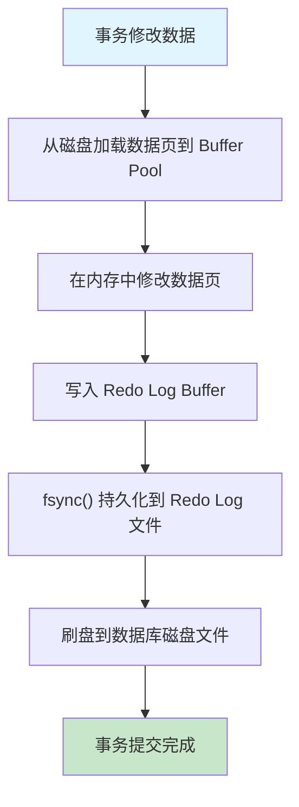
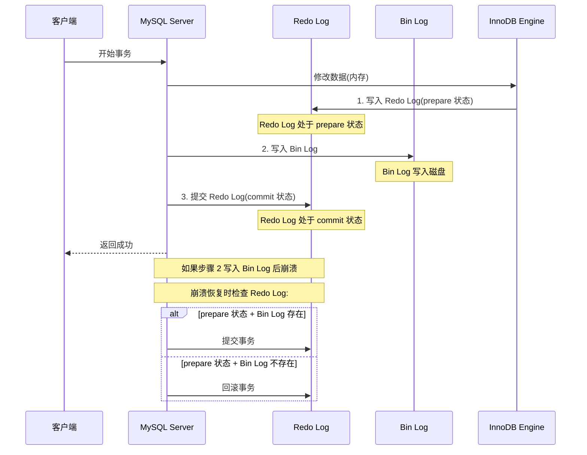
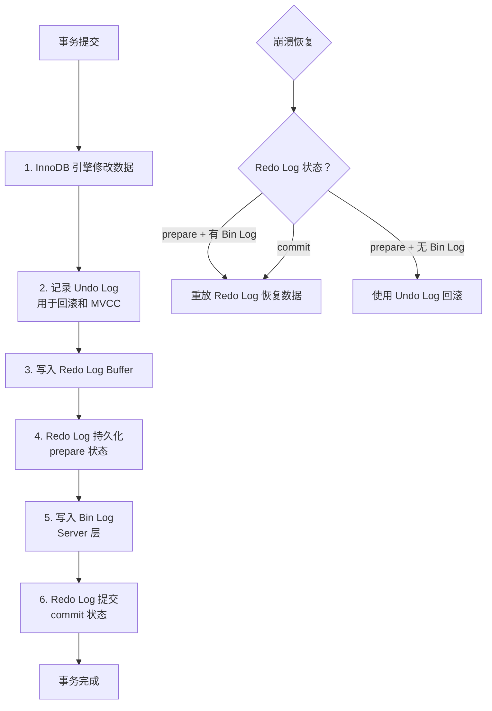

## 引言

MySQL 的三种日志，搞不清楚就别想进大厂了。事务的原子性和持久性靠什么保证？崩溃后数据怎么恢复？主从复制的数据同步机制是什么？答案都藏在 MySQL 的日志系统中——Redo Log、Undo Log、Bin Log。这三套日志各司其职，却又紧密协作，构成了 MySQL 数据安全的底座。

本文带你深入理解 MySQL 三大日志的底层原理和协作机制。读完本文你将掌握：
- **Redo Log 与 WAL 机制**：MySQL 如何实现事务的持久性（Durability）
- **Undo Log 与 MVCC**：事务回滚和多版本并发控制的实现原理
- **Bin Log 与两阶段提交**：数据备份、主从复制以及崩溃恢复的完整流程
- **三种日志的对比与协作**：它们分别解决什么问题，如何在事务中协同工作

## Redo Log（重做日志）

### Redo Log 的内容与作用

Redo Log 记录的是**物理日志**，也就是磁盘数据页的具体修改。

**作用**：用来保证服务崩溃后，仍能把事务中变更的数据持久化到磁盘上。MySQL 事务的持久性（Durability）就是使用 Redo Log 实现的。

### 什么时候写入 Redo Log？

你可能会问，为什么需要写 Redo Log Buffer 和 Redo Log File 两步？直接持久化到磁盘不好吗？直接写磁盘会产生严重的性能问题：

1. InnoDB 在磁盘中存储的基本单元是页，可能本次修改只变更一页中几个字节，但是需要刷新整页的数据，很浪费资源。
2. 一个事务可能修改了多页中的数据，页之间又不连续，就会产生随机 I/O，性能更差。

这种方案叫做 **WAL（Write-Ahead Logging，预写日志）**：先写日志，再写磁盘。即使系统崩溃，Redo Log 中已经有了完整的修改记录，可以通过重放日志来恢复数据。

> **💡 核心提示**：WAL 的核心思想是**把随机 I/O 变成顺序 I/O**。Redo Log 采用追加写入（顺序写），而数据页的刷盘可能是随机写。顺序写的性能远高于随机写，这就是 WAL 机制能大幅提升写入性能的根本原因。

### Redo Log 刷盘规则

写入 Redo Log Buffer 之后，并不会立即持久化到 Redo Log File，需要等待操作系统调用 `fsync()` 操作，才会刷到磁盘上。

具体什么时候可以把 Redo Log Buffer 刷到 Redo Log File 中，可以通过 `innodb_flush_log_at_trx_commit` 参数配置决定：

| 参数值 | 含义 | 安全性 | 性能 |
| :--- | :--- | :--- | :--- |
| **0（延迟写）** | 每隔一秒刷到 OS Buffer 并调用 fsync() 写入 Redo Log File | 可能丢失约 1 秒数据 | 最优 |
| **1（实时写）** | 每次提交事务都立即刷新并 fsync() 写入 Redo Log File | 最多丢失 1 个事务 | 最差 |
| **2（延迟刷新）** | 每次提交事务只刷新到 OS Buffer，一秒后再调用 fsync() | OS 崩溃可能丢数据 | 中等 |

InnoDB 的 Redo Log File 是固定大小的，可以配置为每组 4 个文件，每个文件的大小是 1GB，那么 Redo Log File 可以记录 4GB 的操作。

Redo Log 采用循环写入覆盖的方式，write pos 记录开始写的位置，向后移动。checkpoint 记录将要擦除的位置，也向后移动。write pos 到 checkpoint 之间的区域是可写区域，checkpoint 到 write pos 之间的区域是已写区域。

> **💡 核心提示**：当 write pos 追上 checkpoint 时（Redo Log 写满了），InnoDB 会停止执行所有更新操作，等待 checkpoint 向前推进（脏页刷盘后才能推进）。这就是所谓的 **Redo Log 写满阻塞**，生产环境中需要通过合理的 `innodb_log_file_size` 配置来避免。

## Undo Log（回滚日志）

### Undo Log 的内容与作用

Undo Log 记录的是**逻辑日志**，也就是 SQL 语句。

比如：当我们执行一条 INSERT 语句时，Undo Log 就记录一条相反的 DELETE 语句；执行 UPDATE 时，Undo Log 记录修改前的旧值。

**作用**：
1. **回滚事务**：恢复到修改前的数据状态。
2. **实现 MVCC（多版本并发控制）**：为并发事务提供一致性读。

MySQL 事务的原子性（Atomicity）就是使用 Undo Log 实现的。

### Undo Log 如何回滚到上一个版本

Undo Log 通过两个隐藏列 `trx_id`（最近一次提交事务的 ID）和 `roll_pointer`（上个版本的地址）建立版本链。在事务中读取时，会生成一个 **ReadView（读视图）**：

- **Read Committed 隔离级别**：每次读取都会生成一个新的 ReadView。
- **Repeatable Read 隔离级别**：只会在第一次读取时生成一个 ReadView，后续读取复用。

> **💡 核心提示**：Undo Log 是 MVCC 的基石。每个事务通过 ReadView 判断哪些数据版本对自己可见，不可见的版本沿着 undo log 版本链回溯查找。这就是为什么在 Repeatable Read 级别下，即使其他事务已经提交了新数据，当前事务仍然只能看到快照中的数据。

## Bin Log（归档日志）

### Bin Log 的内容与作用

**Bin Log** 记录的是**逻辑日志**，即原始的 SQL 语句（或行级变更），是 MySQL Server 层自带的，不依赖存储引擎。

**作用**：数据备份和主从同步。

**Bin Log** 共有三种日志格式，可以 `binlog_format` 配置参数指定：

| 参数值 | 含义 | 优点 | 缺点 |
| :--- | :--- | :--- | :--- |
| **Statement** | 记录原始 SQL 语句 | 数据量小 | 某些函数（如 NOW()）导致主从不一致 |
| **Row** | 记录每行数据的变更 | 保证主从数据一致 | 数据量较大 |
| **Mixed** | 混合模式：默认 Statement，涉及日期函数时采用 Row | 兼顾数据量和一致性 | 格式切换逻辑复杂 |

### 什么时候写入 Bin Log？

**Bin Log** 采用追加写入的模式，并不会覆盖原有日志，所以可以用来恢复到之前某个时刻的数据。

**Bin Log** 也是采用 WAL 模式，先写日志，再写磁盘。至于什么时候刷新到磁盘，可以通过 `sync_binlog` 配置参数指定：

| 参数值 | 含义 | 安全性 | 性能 |
| :--- | :--- | :--- | :--- |
| **0（延迟写）** | 由系统决定什么时候刷盘 | 可能丢失数据 | 最优 |
| **1（实时写）** | 每次提交事务都刷盘 | 最多丢失 1 个事务 | 最差 |
| **N（延迟写）** | 提交 N 个事务后刷盘 | 可能丢失 N 个事务 | 中等 |

### 两阶段提交

> **💡 核心提示**：**为什么需要两阶段提交？** 因为 Redo Log 是 InnoDB 引擎层的日志，Bin Log 是 Server 层的日志。如果只写 Redo Log 就提交，崩溃恢复时 InnoDB 恢复了数据，但 Bin Log 里没有这条记录，从库就会丢数据。两阶段提交确保了两份日志的一致性。

## 三种日志对比

| 特性 | Redo Log | Undo Log | Bin Log |
| :--- | :--- | :--- | :--- |
| **日志类型** | 物理日志（数据页变更） | 逻辑日志（SQL 语句/反向操作） | 逻辑日志（SQL 语句/行变更） |
| **所属层级** | InnoDB 存储引擎层 | InnoDB 存储引擎层 | MySQL Server 层 |
| **记录内容** | 数据页"修改了什么" | 数据页"修改前的旧值" | SQL 语句或行级变更 |
| **写入方式** | 循环写入，覆盖旧数据 | 追加写入 | 追加写入，不覆盖 |
| **主要用途** | 崩溃恢复，保证持久性 | 事务回滚，实现 MVCC | 数据备份，主从复制 |
| **对应事务特性** | 持久性（Durability） | 原子性（Atomicity） | - |
| **文件格式** | ib_logfile0, ib_logfile1 | undo tablespace | mysql-bin.NNNNNN |
| **配置参数** | `innodb_flush_log_at_trx_commit` | 自动管理 | `sync_binlog`、`binlog_format` |

## 生产环境避坑指南

| 坑位 | 现象 | 解决方案 |
| :--- | :--- | :--- |
| **Redo Log 写满阻塞** | 所有更新操作卡住，等待 checkpoint 推进 | 调大 `innodb_log_file_size`（如 4GB），提高 `innodb_io_capacity` 加快脏页刷盘 |
| **Bin Log 磁盘打满** | 磁盘空间不足导致 MySQL 拒绝写入 | 定期清理过期 Bin Log（`expire_logs_days` 或 `binlog_expire_logs_seconds`），监控磁盘使用率 |
| **两阶段提交不一致** | 主库崩溃恢复后数据与 Bin Log 不一致 | 确保 `innodb_flush_log_at_trx_commit=1` 且 `sync_binlog=1`，即双 1 配置 |
| **Undo Log 膨胀** | 长事务导致 Undo Log 持续增长，磁盘空间不足 | 避免长事务，监控 `information_schema.innodb_trx`，设置合理的 `innodb_max_undo_log_size` |
| **Bin Log 格式导致主从不一致** | 使用 Statement 格式时，NOW()、UUID() 等函数导致主从数据不同 | 推荐使用 `binlog_format=ROW`，保证主从数据一致性 |
| **innodb_flush_log_at_trx_commit 配置错误** | 设置为 0 时宕机丢失约 1 秒数据 | 对数据安全性要求高的业务务必设置为 1，可接受的场景设置为 2 平衡性能 |

## 总结

| 日志 | 核心作用 | 所属层 | 推荐配置 |
| :--- | :--- | :--- | :--- |
| **Redo Log** | 崩溃恢复，保证持久性 | InnoDB 引擎层 | `innodb_flush_log_at_trx_commit=1` |
| **Undo Log** | 事务回滚 + MVCC | InnoDB 引擎层 | 自动管理，关注长事务 |
| **Bin Log** | 备份 + 主从复制 | MySQL Server 层 | `sync_binlog=1`，`binlog_format=ROW` |

### 行动清单

1. **双 1 配置保证数据安全**：生产环境设置 `innodb_flush_log_at_trx_commit=1` 和 `sync_binlog=1`，确保崩溃不丢数据。
2. **定期清理 Bin Log**：设置 `binlog_expire_logs_seconds=604800`（7 天），定期清理过期日志，防止磁盘打满。
3. **避免长事务**：长事务会导致 Undo Log 持续膨胀，定期检查 `information_schema.innodb_trx`，及时 kill 异常长事务。
4. **使用 ROW 格式**：设置 `binlog_format=ROW`，避免 Statement 格式下函数导致的主从不一致。
5. **监控 Redo Log 使用率**：关注 Redo Log write pos 和 checkpoint 的距离，避免写满导致阻塞。
6. **扩展阅读**：推荐《MySQL 技术内幕：InnoDB 存储引擎》第 7 章"事务"和《高性能 MySQL》第 8 章"复制"。
