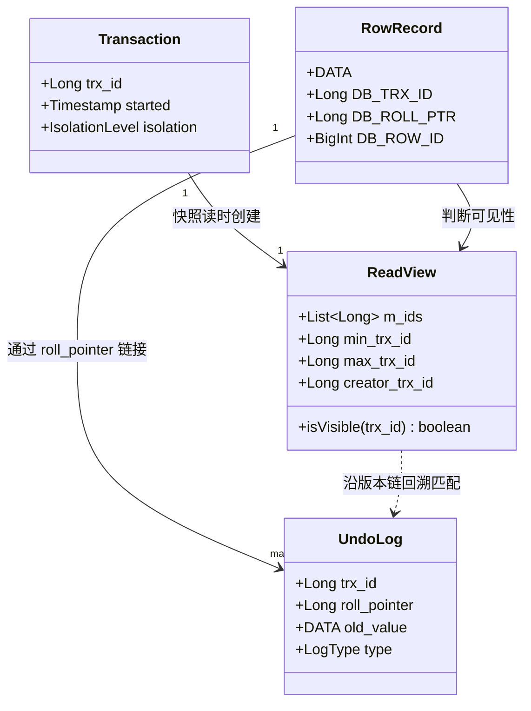
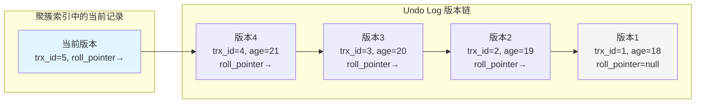
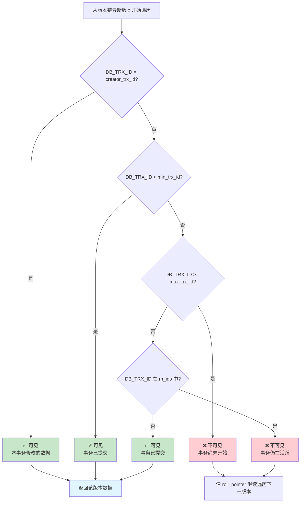
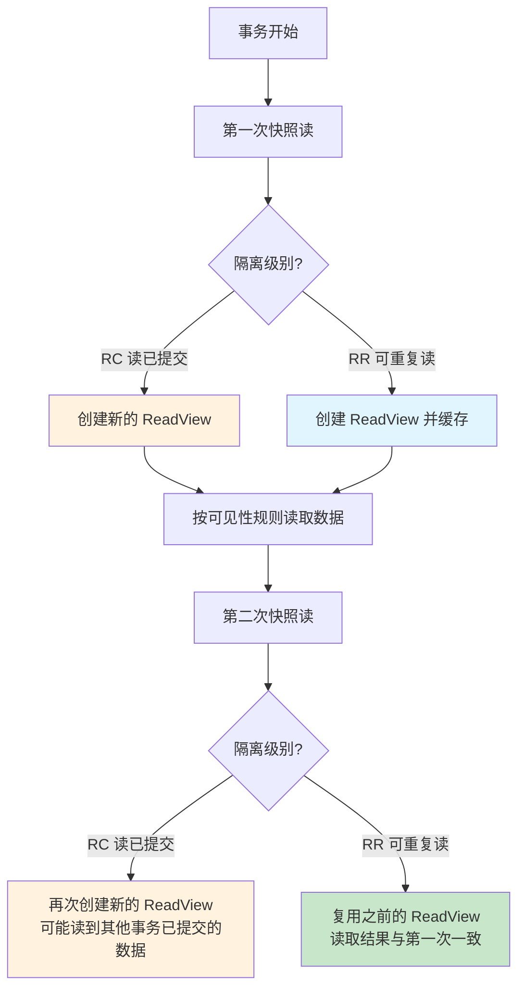

## 引言

不加锁如何实现读写并发？这正是 MySQL MVCC（多版本并发控制）的魔力所在。在生产环境中，读请求远多于写请求，如果每次读取都需要加锁，数据库的并发能力将大打折扣。

本文将深入剖析 MVCC 的底层实现机制，包括：
- **隐藏字段与版本链**：InnoDB 如何在每行记录中维护历史版本
- **ReadView 快照隔离**：不同隔离级别下如何决定"能看到哪个版本的数据"
- **快照读与当前读的本质区别**：为什么 `SELECT` 和 `SELECT ... FOR UPDATE` 读取的结果可能完全不同
- **长事务导致版本链膨胀**：生产环境中常见的性能杀手

无论你是面试还是排查读写并发问题，掌握 MVCC 都能帮你从原理层面彻底解决疑惑。

> **💡 核心提示**：MVCC 不是真正的"多版本"，而是通过 undo log 的**版本链**在需要时回溯到历史版本。它只在 **Read Committed** 和 **Repeatable Read** 两个隔离级别下生效，Read Uncommitted 直接读最新，Serializable 全部加锁。

## 什么是 MVCC

**MVCC** 全称是 **Multi-Version Concurrency Control**（多版本并发控制），是一种并发控制的方法，通过维护数据的多个版本，减少读写操作的冲突。

如果没有 MVCC，想要实现同一条数据的并发读写，还要保证数据的安全性，就需要在操作时加读锁和写锁，这样会严重降低数据库的并发性能。

有了 MVCC，就相当于把同一份数据生成了多个版本，在操作开始时各生成一个快照，**读写操作互不阻塞**，无需加锁也能保证数据的安全性和事务的隔离性。



事务的四大特性中，**隔离性**就是基于 MVCC 实现的。

## 事务的隔离级别

说隔离级别之前，先说一下**并发事务产生的问题**：

| 问题 | 定义 | 示例 |
|------|------|------|
| **脏读** | 一个事务读到其他事务**未提交**的数据 | 事务 B 修改了数据但未提交，事务 A 读到了这个中间值 |
| **不可重复读** | 相同的查询条件，多次查询到的结果不一致 | 事务 A 第一次读 age=1，第二次读 age=2（事务 B 已提交更新） |
| **幻读** | 相同的查询条件，多次查询到的结果不一致 | 事务 A 查询到 5 条记录，第二次查询到 6 条（事务 B 插入了新记录） |

> **💡 核心提示**：不可重复读与幻读的区别是——不可重复读是读到了其他事务执行 **UPDATE、DELETE** 后的数据，而幻读是读到其他事务执行 **INSERT** 后的数据。

### 四种隔离级别

| 隔离级别 | 脏读 | 不可重复读 | 幻读 | 说明 |
|---------|------|-----------|------|------|
| **Read Uncommitted（读未提交）** | 会 | 会 | 会 | 最低隔离级别，几乎不使用 |
| **Read Committed（读已提交）** | 不会 | 会 | 会 | Oracle 默认级别 |
| **Repeatable Read（可重复读）** | 不会 | 不会 | 会 | MySQL 默认级别 |
| **Serializable（串行化）** | 不会 | 不会 | 不会 | 最高隔离级别，性能最差 |

MVCC 只在 **Read Committed** 和 **Repeatable Read** 两个隔离级别下起作用，因为：
- **Read Uncommitted** 隔离级别下，读写都不加锁，直接读最新数据
- **Serializable** 隔离级别下，读写都加锁，不需要 MVCC

## Undo Log（回滚日志）

**Undo Log** 记录的是**逻辑日志**，也就是反向操作的 SQL 语句。

比如：当我们执行一条 `INSERT` 语句时，Undo Log 就记录一条相反的 `DELETE` 语句。

**作用**：

1. **回滚事务**：恢复到修改前的数据
2. **实现 MVCC**：维护数据的历史版本链

事务四大特性中，**原子性**也是基于 Undo Log 实现的。

## MVCC 的实现原理

### 当前读和快照读

先了解什么是当前读和快照读，这是理解 MVCC 的关键前提。

| 读类型 | 定义 | 加锁 | 示例 |
|--------|------|------|------|
| **快照读** | 读取数据的历史版本 | 不加锁 | `SELECT` |
| **当前读** | 读取数据的最新版本 | 加锁 | `INSERT`、`UPDATE`、`DELETE`、`SELECT ... FOR UPDATE`、`SELECT ... LOCK IN SHARE MODE` |

MVCC 是基于 **Undo Log**、**隐藏字段**、**ReadView（读视图）** 三者共同实现的。

### 隐藏字段

当我们创建一张表时，InnoDB 引擎会自动增加以下隐藏字段：

| 隐藏字段 | 含义 | 说明 |
|---------|------|------|
| **DB_TRX_ID** | 最近一次修改该记录的事务 ID | 每次 UPDATE/INSERT/DELETE 时更新 |
| **DB_ROLL_PTR** | 指向上一个版本的回滚指针 | 指向 Undo Log 中的旧版本记录 |
| **DB_ROW_ID** | 隐藏的行 ID | 没有定义主键时自动生成，用于构建聚簇索引 |

> **💡 核心提示**：这三个隐藏字段中，只有 `DB_TRX_ID` 和 `DB_ROLL_PTR` 参与 MVCC。`DB_ROW_ID` 只在表没有主键时用于构建聚簇索引，与 MVCC 无关。

### 版本链

每次修改数据时，旧版本数据会被写入 Undo Log，并通过 `roll_pointer` 形成一条从新到旧的版本链：



**版本链形成过程**：

```sql
-- 第一次插入，trx_id=1
INSERT INTO user (name, age) VALUES ('一灯', 18);
-- trx_id=1, roll_pointer=null

-- 第二次修改，trx_id=2
UPDATE user SET age = age + 1 WHERE id = 1;
-- trx_id=2, roll_pointer→版本1(age=18)

-- 第三次修改，trx_id=3
UPDATE user SET age = age + 1 WHERE id = 1;
-- trx_id=3, roll_pointer→版本2(age=19)
```

## ReadView（读视图）

在事务中执行 SQL 查询时，会生成一个**读视图（ReadView）**，用来保证数据的可见性——即决定读到 Undo Log 中哪个版本的数据。

ReadView 基于以下四个关键字段实现：

| 字段 | 含义 | 说明 |
|------|------|------|
| **m_ids** | 当前活跃事务 ID 集合 | 生成 ReadView 时还未提交的事务 |
| **min_trx_id** | m_ids 中的最小事务 ID | 小于此值的事务都已提交 |
| **max_trx_id** | 下一个要分配的事务 ID | 大于等于此值的事务尚未开始 |
| **creator_trx_id** | 当前事务的事务 ID | 用于排除自身修改 |

### 数据可见性规则

读取版本链时，从最新版本开始依次匹配，满足以下规则即可读到该版本，一旦匹配成功就不再往下查找：



**可见性判断逻辑**：

1. **`DB_TRX_ID = creator_trx_id`**：数据是本事务自己修改的，**可见**。
2. **`DB_TRX_ID < min_trx_id`**：修改数据的事务在生成 ReadView 之前已经提交，**可见**。
3. **`DB_TRX_ID >= max_trx_id`**：修改数据的事务在生成 ReadView 之后才启动，**不可见**。
4. **`min_trx_id <= DB_TRX_ID < max_trx_id`**：需要进一步判断：
   - 事务 ID 在 `m_ids` 中（仍在活跃）→ **不可见**
   - 事务 ID 不在 `m_ids` 中（已经提交）→ **可见**

> **💡 核心提示**：可见性判断是**从版本链的最新版本往旧版本遍历**，找到第一个满足可见性规则的版本就停止。这意味着版本链越长，快照读的开销越大。

## 不同隔离级别下可见性分析

在不同的事务隔离级别下，生成 ReadView 的时机不同，这直接决定了读写行为：



### READ COMMITTED（读已提交）

在 RC 隔离级别下，事务中**每一次**执行快照读时都会**重新生成一个新的 ReadView**，每个 ReadView 中四个字段的值都是不同的。

```sql
SET SESSION TRANSACTION ISOLATION LEVEL READ COMMITTED;
```

**示例分析**：

事务 1 第一次查询时，生成 ReadView：

| 属性 | 值 |
|------|------|
| m_ids | [1, 2] |
| min_trx_id | 1 |
| max_trx_id | 3 |
| creator_trx_id | 1 |

事务 1 第二次查询时，**生成新的** ReadView：

| 属性 | 值 |
|------|------|
| m_ids | [1] |
| min_trx_id | 1 |
| max_trx_id | 3 |
| creator_trx_id | 1 |

同一个事务内，相同的查询条件，两次查询结果**可能不一致**——因为第二次 ReadView 的 `m_ids` 已经不包含事务 2 的 ID（事务 2 已提交），所以能读到事务 2 的修改。这就是**不可重复读**。

### REPEATABLE READ（可重复读）

在 RR 隔离级别下，**仅在事务中第一次**执行快照读时生成 ReadView，后续**复用**这个 ReadView。

```sql
SET SESSION TRANSACTION ISOLATION LEVEL REPEATABLE READ;
```

**示例分析**：

事务 1 第一次查询时，生成 ReadView：

| 属性 | 值 |
|------|------|
| m_ids | [1, 2] |
| min_trx_id | 1 |
| max_trx_id | 3 |
| creator_trx_id | 1 |

事务 1 第二次查询时，**复用**原有的 ReadView：

| 属性 | 值 |
|------|------|
| m_ids | [1, 2] |
| min_trx_id | 1 |
| max_trx_id | 3 |
| creator_trx_id | 1 |

由于复用了 ReadView，事务 2 的 ID（=2）仍在 `m_ids` 中，判定为不可见。相同的查询条件，两次查询结果**一致**——解决了不可重复读问题。

## 生产环境避坑指南

### 1. 版本链过长导致快照读性能急剧下降

**场景**：一条数据被频繁更新（如状态字段），undo log 版本链很长，快照读需要逐版本回溯判断可见性。

**影响**：查询性能从 O(1) 退化为 O(n)，n 为版本链长度。

**排查**：监控慢查询日志，关注 undo log 相关性能指标。

**建议**：对频繁更新的列单独建表；避免单行数据的高频更新。

### 2. 长事务阻止 undo log 清理

**场景**：一个长事务一直不提交，其启动前的 ReadView 一直需要保留，导致所有比它旧的历史版本无法被 Purge 线程清理。

**影响**：
- undo log 表空间持续膨胀
- 磁盘空间逐渐耗尽
- 版本链越来越长，查询越来越慢

**排查命令**：
```sql
SELECT trx_id, trx_started, trx_state, trx_query
FROM information_schema.innodb_trx
WHERE TIME_TO_SEC(TIMEDIFF(NOW(), trx_started)) > 60;
```

**建议**：设置 `innodb_max_transaction_time` 限制长事务；定期监控活跃事务时长。

### 3. RC 与 RR 级别下的 ReadView 时机差异导致行为不一致

**场景**：同一个 SQL 在 RC 级别下每次执行结果可能不同，迁移数据库时如果不注意隔离级别差异，会导致业务逻辑异常。

**建议**：保持 MySQL 默认的 RR 隔离级别。如果业务确实需要 RC 级别（如与 Oracle 行为一致），确保代码能处理不可重复读的情况。

### 4. 快照读和当前读混用导致数据不一致

**场景**：事务中先用普通 `SELECT`（快照读）判断数据是否存在，再用 `UPDATE`（当前读）修改数据，中间可能被其他事务插入或修改。

**正确做法**：需要强一致性时使用 `SELECT ... FOR UPDATE`（当前读）加锁。

### 5. Purge 线程延迟导致磁盘空间无法回收

**场景**：删除大量数据后，磁盘空间没有释放。

**原理**：`DELETE` 操作只是标记删除，真正释放空间由后台 Purge 线程负责。如果 Purge 线程跟不上删除速度，会导致空间浪费。

**排查命令**：
```sql
SHOW VARIABLES LIKE 'innodb_purge_threads';
SHOW STATUS LIKE 'Innodb_purge%';
```

### 6. 大表加字段导致全表重建和版本链重建

**场景**：执行 `ALTER TABLE` 添加列时，InnoDB 会重建整张表，期间版本链机制会显著增加 undo log 压力。

**建议**：使用 `pt-online-schema-change` 或 MySQL 8.0 的 Instant ADD COLUMN 特性。

## 总结与行动清单

### 快照读 vs 当前读 对比表

| 对比维度 | 快照读 | 当前读 |
|---------|--------|--------|
| 读取版本 | 历史版本（MVCC） | 最新版本 |
| 是否加锁 | 否 | 是 |
| ReadView | 按隔离级别创建 | 始终读最新 |
| SQL 语句 | `SELECT` | `UPDATE`、`DELETE`、`INSERT`、`SELECT ... FOR UPDATE` |
| 性能 | 高（不加锁） | 低（加锁阻塞） |
| 适用场景 | 普通查询，允许读到旧版本 | 需要强一致性的写操作 |

### 隐藏字段作用对比

| 字段 | 用途 | 参与 MVCC |
|------|------|-----------|
| DB_TRX_ID | 记录最近修改的事务 ID | ✅ 是（可见性判断） |
| DB_ROLL_PTR | 指向上一个版本的指针 | ✅ 是（版本链遍历） |
| DB_ROW_ID | 无主键时的行标识 | ❌ 否 |

### 行动清单

1. **检查长事务**：定期查询 `information_schema.innodb_trx`，设置超时自动终止。
2. **监控 undo log 空间**：关注 `ibdata1` 文件大小，配置合适的 undo 表空间。
3. **保持默认隔离级别**：RR 级别是最安全的选择，除非有明确需求才改为 RC。
4. **避免快照读与当前读混用**：同一事务中保持读模式一致，需要强一致性时使用 `SELECT ... FOR UPDATE`。
5. **控制单行更新频率**：避免高频更新同一行数据导致版本链过长。
6. **及时提交事务**：长事务是 undo log 膨胀的元凶，尽量缩短事务执行时间。
7. **监控 Purge 线程状态**：确保删除操作后空间能够及时回收。
