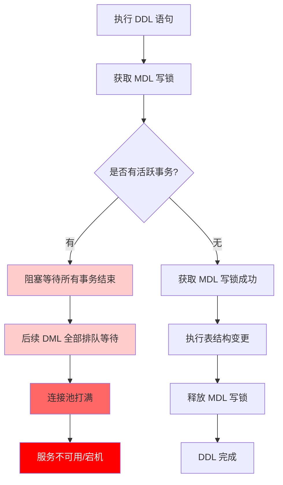
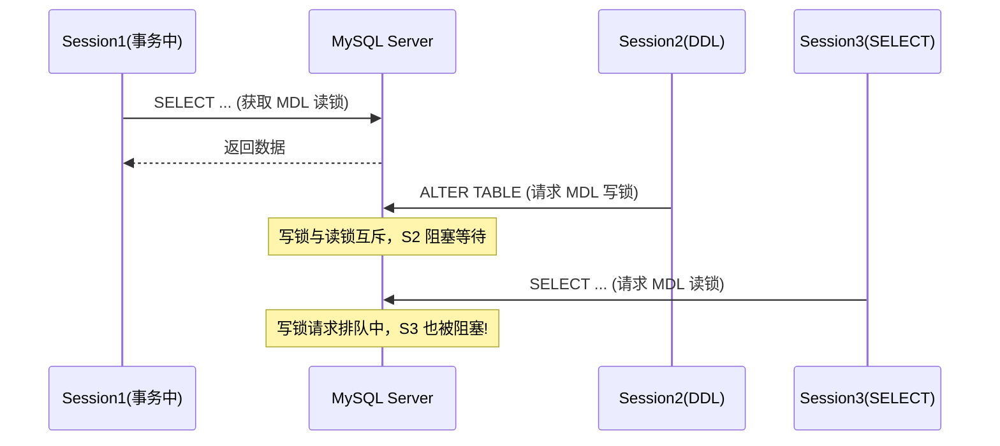
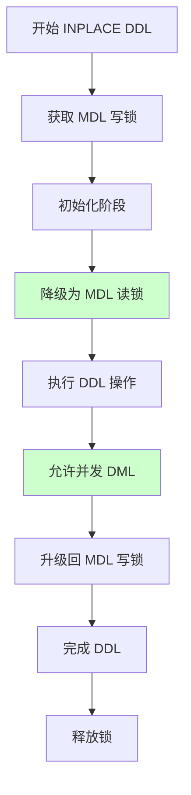
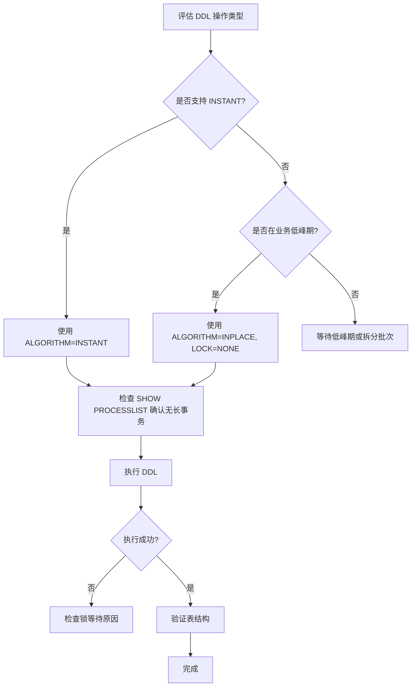

## 引言

> 给线上千万级用户表加一个"会员等级"字段，需要多久？

如果你回答"直接 ALTER TABLE 加完收工"，那你的服务可能离宕机只差一次 DDL。

某大厂曾因为一条 ALTER TABLE 语句，导致线上核心交易库锁死 40 分钟，订单超时率飙升到 15%，直接经济损失上百万。这不是危言耸听，而是真实发生过的生产事故。

本文带你深入理解 MySQL DDL 的底层加锁机制，掌握 **Online DDL** 的三种算法（Instant / Inplace / Copy），以及如何在**不中断业务**的前提下给大表加字段。读完你将掌握：

- MDL 锁的工作原理和阻塞链路
- ALGORITHM 和 LOCK 参数的选型策略
- 不同 DDL 操作的性能对比和最佳实践

---

## 一、线上加字段引发的血案

### 1.1 问题复现

工作中最常遇到的需求之一：怎么给线上频繁使用的大表添加字段？

比如，给下面的用户表添加 `age` 字段：

```sql
CREATE TABLE `user` (
  `id` int NOT NULL AUTO_INCREMENT COMMENT '主键',
  `name` varchar(100) DEFAULT NULL COMMENT '姓名',
  PRIMARY KEY (`id`)
) ENGINE=InnoDB COMMENT='用户表';
```

很多同学会说，这还不简单：

```sql
ALTER TABLE `user` ADD `age` int NOT NULL DEFAULT '0' COMMENT '年龄';
```

线下数据库这么干完全没问题，但在**线上环境**，这条语句可能导致整个服务宕机。

### 1.2 阻塞链路演示

我们用三个 Session 来模拟真实场景：

| 步骤 | Session | 操作 | 结果 |
|------|---------|------|------|
| 1 | Session1 | `BEGIN; SELECT * FROM user WHERE id=1;` | 事务启动，未提交 |
| 2 | Session2 | `ALTER TABLE user ADD age int ...` | **阻塞**，等待 MDL 锁 |
| 3 | Session3 | `SELECT * FROM user WHERE id=2;` | **也被阻塞**！ |

> **💡 核心提示**：最致命的不是 Session2 被阻塞，而是后续所有的读写请求（包括简单的 SELECT）都会被阻塞。这就是线上服务雪崩的直接原因。

### 1.3 DDL 执行流程



## 二、MDL 锁深度解析

### 2.1 什么是 MDL 锁？

MDL（Metadata Lock，元数据锁）是 MySQL **自动隐式加锁**的机制，无需手动操作。它的核心作用是**保证并发操作下表结构的一致性**。

> **💡 核心提示**：MDL 锁是**表级锁**，一旦加锁，影响的是整张表的所有操作。

### 2.2 加锁规则

| 操作类型 | 锁类型 | 说明 |
|----------|--------|------|
| DDL（CREATE/DROP/ALTER/RENAME/TRUNCATE） | MDL **写锁** | 修改表结构 |
| DML（SELECT/INSERT/UPDATE/DELETE） | MDL **读锁** | 读写表数据 |

### 2.3 锁兼容性矩阵

| | MDL 读锁 | MDL 写锁 |
|---|----------|----------|
| **MDL 读锁** | 兼容 | **互斥** |
| **MDL 写锁** | **互斥** | **互斥** |

关键规则：
- 读锁与读锁之间**不互斥**，多个事务可以同时读
- 读锁与写锁、写锁与写锁之间**互斥**

### 2.4 为什么 SELECT 也会被阻塞？



### 2.5 排查方法

执行 `SHOW PROCESSLIST` 命令查看阻塞情况：

```sql
SHOW PROCESSLIST;
```

关键信息：
- `State` 列显示 **`Waiting for table metadata lock`** 表示正在等待 MDL 锁
- 找到阻塞源头的事务，决定是 `KILL` 还是等它自然结束

## 三、Online DDL 优雅方案

### 3.1 什么是 Online DDL？

从 **MySQL 5.6** 开始引入 **Online DDL**，核心能力：**执行 DDL 时允许并发执行 DML**。即修改表结构的同时，仍然支持增删查改操作。

**MySQL 8.0** 进一步优化，支持 **Instant** 算法，实现**秒级给大表加字段**。

### 3.2 使用方法

```sql
ALTER TABLE `user` ADD `age` int NOT NULL DEFAULT '0' COMMENT '年龄', 
ALGORITHM=INSTANT, 
LOCK=NONE;
```

### 3.3 ALGORITHM 参数详解

| 算法 | 版本 | 原理 | 性能 | 允许并发 DML |
|------|------|------|------|-------------|
| **INSTANT** | 8.0+ | 只修改元数据，不碰数据页 | **最快**（毫秒级） | 是 |
| **INPLACE** | 5.6+ | 原地修改，Server 层不拷贝数据 | 中等 | 是 |
| **COPY** | 5.6 之前 | 创建新表 -> 拷贝数据 -> 删旧表 -> 重命名 | **最慢** | 否 |

> **💡 核心提示**：性能排序 `INSTANT > INPLACE > COPY`。生产环境优先使用 INSTANT，不支持再降级 INPLACE。

### 3.4 INPLACE 算法的执行流程



### 3.5 LOCK 参数详解

| 值 | 说明 | 允许的操作 |
|----|------|-----------|
| **NONE** | 不加锁 | 允许所有 DML 操作 |
| **SHARED** | 加读锁 | 允许读操作，**禁止** DML |
| **DEFAULT** | 默认模式 | 在满足 DDL 前提下，尽可能允许并发 |
| **EXCLUSIVE** | 加写锁 | **禁止**所有读写操作 |

### 3.6 各 DDL 操作支持情况

| 操作 | INSTANT | INPLACE | 重建表 | 允许并发 DML | 仅修改元数据 |
|------|---------|---------|--------|-------------|-------------|
| 添加列 | Yes | Yes | No | Yes | No |
| 删除列 | No | Yes | Yes | Yes | No |
| 重命名列 | No | Yes | No | Yes | Yes |
| 更改列顺序 | No | Yes | Yes | Yes | No |
| 设置列默认值 | Yes | Yes | No | Yes | Yes |
| 更改列数据类型 | No | No | Yes | No | No |
| 设置 VARCHAR 大小 | No | Yes | No | Yes | Yes |
| 删除列默认值 | Yes | Yes | No | Yes | Yes |
| 更改自增值 | No | Yes | No | Yes | No |
| 设置列为 NULL | No | Yes | Yes | Yes | No |
| 设置列 NOT NULL | No | Yes | Yes | Yes | No |

> **💡 核心提示**：最常见的**添加列**操作可以使用 INSTANT 算法，而**删除列、更改数据类型**只能使用 INPLACE（需要重建表）。

## 四、生产环境避坑指南

### 4.1 避坑清单

1. **大表加字段不要用默认 ALTER TABLE**：默认行为可能走 COPY 算法，全表数据拷贝，耗时极长且锁表。必须显式指定 `ALGORITHM=INSTANT` 或 `ALGORITHM=INPLACE`。
2. **DDL 前检查活跃事务**：使用 `SHOW PROCESSLIST` 和 `information_schema.innodb_trx` 确认没有长事务，否则 MDL 写锁会阻塞所有后续请求。
3. **INSTANT 不支持删除列**：MySQL 8.0 的 INSTANT 算法仅支持添加列和修改元数据操作，删除列必须使用 INPLACE。
4. **更改列数据类型必须重建表**：这类操作不支持 INSTANT 和 INPLACE，会锁表拷贝数据，建议在业务低峰期执行。
5. **控制 DDL 执行窗口**：即使使用 Online DDL，INPLACE 算法在开始和结束时仍然需要获取短暂的 MDL 写锁，如果此时有长事务，仍可能造成阻塞。
6. **监控 MDL 锁等待**：配置 `lock_wait_timeout` 参数（默认 50 秒），避免无限等待。线上建议设置为 10-30 秒。
7. **pt-online-schema-change 兜底**：对于超大表（亿级以上）或旧版本 MySQL（5.5 及以下），使用 Percona 的 `pt-online-schema-change` 工具进行无锁 DDL。

### 4.2 推荐操作流程



## 五、总结

### 5.1 核心方法对比

| 特性 | ALGORITHM=INSTANT | ALGORITHM=INPLACE | ALGORITHM=COPY |
|------|-------------------|-------------------|----------------|
| 适用版本 | MySQL 8.0+ | MySQL 5.6+ | 所有版本 |
| 数据拷贝 | 无 | Server 层无 | 全表拷贝 |
| 执行速度 | 毫秒级 | 分钟~小时 | 小时~天 |
| 并发 DML | 支持 | 支持 | 不支持 |
| 锁影响 | 几乎无 | 短暂 MDL 写锁 | 全程锁表 |
| 推荐指数 | ⭐⭐⭐⭐⭐ | ⭐⭐⭐⭐ | ⭐ |

### 5.2 行动清单

1. **优先使用 INSTANT**：MySQL 8.0+ 环境下，所有 ADD COLUMN 操作都加上 `ALGORITHM=INSTANT, LOCK=NONE`。
2. **DDL 前检查长事务**：执行 `SELECT * FROM information_schema.innodb_trx` 确认无活跃长事务。
3. **设置合理的锁等待超时**：`SET SESSION lock_wait_timeout = 30;` 避免无限等待。
4. **大表 DDL 选择业务低峰期**：即使使用 INPLACE，也建议在流量低谷执行。
5. **建立 DDL 审批流程**：所有线上 DDL 必须经过评审，禁止直接在生产执行。
6. **监控 MDL 锁等待**：配置告警规则，当 `Waiting for table metadata lock` 连接数超过阈值时立即通知。
7. **准备 pt-osc 兜底方案**：对于不支持 Online DDL 的操作，提前安装并测试 `pt-online-schema-change`。
