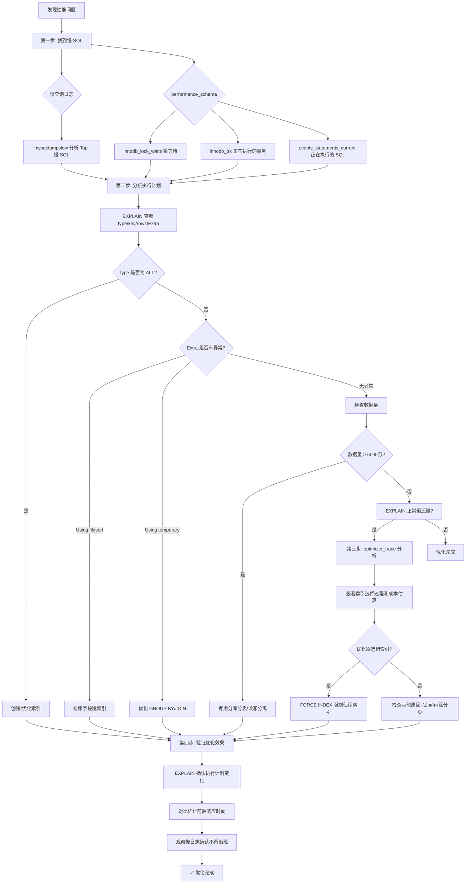

## 引言

面试官：你说精通 MySQL 调优，说下调优流程？

这是 MySQL 面试中出现频率最高的问题之一。但 90% 的面试者回答时逻辑混乱：先说 EXPLAIN，再说加索引，最后提分库分表——完全没有系统性。真正的调优高手有一套标准化的排查流程：先定位问题，再分析原因，最后对症下药。

本文将带你建立完整的 MySQL 调优体系。从排查慢 SQL 开始，通过慢查询日志和 performance_schema 定位问题；用 EXPLAIN 和 optimizer_trace 分析执行计划；根据分析结果优化索引和 SQL；必要时考虑分库分表。每个环节都有具体的操作命令和实战案例。看完本文，不管是面试还是生产环境调优，你都能做到有条理、有依据、有结果。

## 1. MySQL 调优全景流程



## 2. 排查慢 SQL

第一步不是使用 EXPLAIN 命令分析慢 SQL，**而是先要找到慢 SQL**。

### 2.1 慢查询日志

1. 查找慢查询日志文件位置：

```sql
SHOW VARIABLES LIKE '%slow_query_log_file%';
```

2. 使用 **mysqldumpslow** 命令分析慢查询日志：

```bash
# 常用参数
# -s: 排序方式: c=访问次数, t=查询时间, l=锁定时间, r=返回记录数, at=平均查询时间
# -t: 返回前 N 条数据

# 查询返回结果最多的 10 条 SQL
mysqldumpslow -s r -t 10 /usr/local/mysql/data/localhost_slow.log

# 查询耗时最长的 10 条 SQL
mysqldumpslow -s t -t 10 /usr/local/mysql/data/localhost_slow.log
```

### 2.2 performance_schema 库

performance_schema 库帮助我们记录 MySQL 的运行情况，锁等待、加锁的 SQL、正在执行的事务等都可以查到。

常用查询表：

| 表名 | 用途 |
|------|------|
| information_schema.innodb_lock_waits | 锁等待 |
| information_schema.innodb_locks | 定位锁 |
| information_schema.innodb_trx | 定位事务 |
| performance_schema.threads | 定位线程 |
| performance_schema.events_statements_current | 定位 SQL |
| information_schema.processlist | 正在执行的 SQL 进程 |
| information_schema.profiling | 分析 SQL 每一步的耗时 |

**查看锁等待情况**：

```sql
SELECT * FROM information_schema.innodb_lock_waits;
```

可以看到有锁等待的事务。

**查看正在竞争的锁**：

```sql
SELECT * FROM information_schema.innodb_locks;
```

MySQL 统计非常详细：
- `lock_trx_id`：事务 ID
- `lock_mode`：排它锁还是共享锁
- `lock_type`：锁定的记录还是范围
- `lock_table`：锁的表名
- `lock_index`：锁定的是哪个索引

**查看正在执行的事务**：

```sql
SELECT * FROM information_schema.innodb_trx;
```

可以清楚看到正在执行的事务，一个状态是锁等待（LOCK WAIT），正在执行的 SQL 也打印出来了。

**查看事务线程**：

```sql
SELECT * FROM performance_schema.threads WHERE processlist_id = 193;
```

**查看线程正在执行的 SQL 语句**：

```sql
SELECT THREAD_ID, CURRENT_SCHEMA, SQL_TEXT
FROM performance_schema.events_statements_current
WHERE thread_id = 218;
```

> **💡 核心提示**：information_schema 中的锁相关视图（innodb_lock_waits、innodb_locks）在 MySQL 8.0 中已被废弃，推荐使用 `performance_schema.data_locks` 和 `performance_schema.data_lock_waits` 替代。如果你的生产环境是 MySQL 8.0+，优先使用新的 performance_schema 视图。

## 3. 优化慢 SQL

### 3.1 EXPLAIN 执行计划

最常用的方案就是使用 EXPLAIN 命令，查看 SQL 的索引使用情况。

**优先查看 type 字段**：是否用到索引？用到了哪种？性能由好到差依次是：

> system > const > eq_ref > ref > ref_or_null > index_merge > range > index > ALL

**再查看 key_len（索引长度）**：可以看出用到了联合索引中的前几列。

**查看 rows（预估扫描行数）**：如果扫描行数过多，说明匹配结果数过多，可以修改查询条件，缩减查询范围。

**最后查看 Extra 字段**：
- `Using index`：用到了覆盖索引，减少了回表查询，✅ 性能好
- `Using filesort`：排序字段没有使用索引，❌ 需要优化
- `Using temporary`：用到临时表存储中间结果，❌ 需要优化
- `Using join buffer`：表连接没有用到索引，❌ 需要优化

### 3.2 创建索引规范

哪些字段适合创建索引？遵循以下规范：

1. 频繁查询的字段适合创建索引
2. 区分度高的字段适合创建索引
3. 有序的字段适合创建索引
4. 在 WHERE 和 ON 条件中出现的字段优先创建索引
5. 优先创建联合索引，区分度高的字段放在第一列
6. 过长字符串可以使用前缀索引
7. 频繁更新的字段不适合创建索引
8. 避免创建过多索引

### 3.3 优化查询规范

总结了一些 MySQL 查询规范，遵守可以提高查询效率：

- 避免 `SELECT *`，只查询需要的字段（可以利用覆盖索引）
- 避免在 WHERE 条件中对索引列进行函数操作或计算
- 避免使用 `!=` 或 `<>`，会导致全表扫描
- 避免 `OR` 条件中部分字段没有索引
- 分页查询避免深度分页，改用游标分页

### 3.4 索引失效场景

常见索引失效场景：

1. **数据类型隐式转换**：varchar 字段用数值类型查询
2. **模糊查询 LIKE 以 % 开头**：`LIKE '%张'`
3. **OR 前后没有同时使用索引**
4. **联合索引没有使用第一列**：违反最左匹配原则
5. **在索引字段进行计算操作**：`WHERE id + 1 = 2`
6. **在索引字段上使用函数**：`WHERE YEAR(create_time) = 2024`
7. **优化器选错索引**：数据分布导致优化器选择了错误的索引

如果优化器选错索引，可以使用 `FORCE INDEX` 强制使用指定的索引：

```sql
SELECT * FROM user FORCE INDEX(user_id) WHERE user_id = 1;
```

### 3.5 optimizer_trace（优化器追踪）

当 MySQL 表中存在多个索引时，优化器会选择其中一个或多个，有时也会选错。optimizer_trace 可以查看 EXPLAIN 执行计划的生成过程，以及每个索引的预估成本。

```sql
SELECT * FROM information_schema.OPTIMIZER_TRACE;
```

输出结果共有 4 列：

| 列名 | 含义 |
|------|------|
| QUERY | 我们执行的查询语句 |
| TRACE | 优化器生成执行计划的过程（重点关注） |
| MISSING_BYTES_BEYOND_MAX_MEM_SIZE | 优化过程被截断的信息 |
| INSUFFICIENT_PRIVILEGES | 是否有权限查看（0=有权限，1=无权限） |

重点关注 TRACE 列中的 `range_scan_alternatives` 结果：

| 字段 | 含义 |
|------|------|
| index | 索引名称 |
| ranges | 查询范围 |
| index_dives_for_eq_ranges | 是否用到索引潜水 |
| rowid_ordered | 是否按主键排序 |
| using_mrr | 是否使用 MRR |
| index_only | 是否使用了覆盖索引 |
| in_memory | 使用内存大小 |
| rows | 预估扫描行数 |
| cost | 预估成本大小，值越小越好 |
| chosen | 是否被选择 |
| cause | 未被选择的原因，cost 表示成本过高 |

> **💡 核心提示**：MySQL 调优的优先级应该是：先确保有合适的索引 → 再优化 SQL 写法 → 再调整表结构 → 最后才考虑分库分表。很多开发者跳过前三步直接分库分表，不仅增加了系统复杂度，还可能根本不需要。记住：80% 的性能问题可以通过合理的索引优化解决。

## 4. 死锁日志

使用 MySQL 事务时，可能会出现死锁或超时的情况。使用以下命令查看死锁日志和产生死锁的 SQL：

```sql
SHOW ENGINE INNODB STATUS;
```

在死锁日志中，可以清楚看到哪两条语句产生了死锁，最终哪个事务被回滚，哪个事务执行成功。

```sql
-- 事务1
INSERT INTO user (id, name, age) VALUES (5, '张三', 5);
-- 事务2
INSERT INTO user (id, name, age) VALUES (6, '李四', 6);
```

## 5. 调优流程总结

1. **先确认数据量**：如果表超过 5000 万条数据，常规 SQL 优化可能不够，需要考虑**分库分表**。
2. **读写分离**：如果写请求很多，可以拆分成读库和写库。
3. **EXPLAIN 分析**：查看是否用到索引、用到了哪些索引、索引性能、扫描行数。
4. **optimizer_trace 深度分析**：了解优化器为什么选择这个索引，查看每个索引的扫描行数和预估成本。
5. **慢查询日志**：分析有哪些慢 SQL，记录耗时长、锁定时间长、返回记录多的 SQL。
6. **死锁日志**：检查是否有死锁情况，`SHOW ENGINE INNODB STATUS`。
7. **深分页优化**：改成子查询，先查主键再查所有字段，利用覆盖索引。或使用分页游标。
8. **information_schema 排查**：查看锁等待、加锁 SQL、正在执行的事务。

## 6. 分库分表

如果常规的 SQL 优化手段不起作用，就可以进行分库分表。

分库分表的核心考量：

- **分片键选择**：选择查询最频繁的字段作为分片键，确保大部分查询能路由到单个分片。
- **分片算法**：范围分片（按 ID 范围）、哈希分片（按 ID 取模）、时间分片（按月/年）。
- **跨分片查询**：避免 JOIN 跨分片，如果无法避免，使用中间件（如 MyCat、ShardingSphere）。
- **分布式事务**：分库后涉及多库的事务需要考虑分布式事务方案（如 Seata）。

## 7. 生产环境避坑指南

### 坑 1：过早优化，忽视业务需求

**现象**：刚上线的系统只有几千条数据，就开始设计分库分表方案。
**原因**：没有根据实际数据量和访问量做评估，过度设计。
**对策**：遵循"先测量，再优化"原则。只有当实际性能指标不满足需求时才进行优化。初期做好索引设计即可。

### 坑 2：优化后不验证执行计划变化

**现象**：加了索引或改了 SQL，没有重新 EXPLAIN 确认执行计划。
**原因**：假设优化一定生效，实际上可能因为数据分布等原因未生效。
**对策**：每次优化后必须执行 EXPLAIN 确认执行计划符合预期，并在测试环境对比优化前后的响应时间。

### 坑 3：数据增长后忽略执行计划变化

**现象**：上线时 EXPLAIN 是 range，运行半年数据量增长后变成了 ALL。
**原因**：优化器根据统计信息做成本估算，数据分布变化后可能改变执行计划。
**对策**：定期执行 `ANALYZE TABLE` 更新统计信息；建立 SQL 性能基线监控，发现执行计划变化时及时介入。

### 坑 4：为了优化牺牲业务逻辑正确性

**现象**：为了提高性能，去掉了事务一致性保证或修改了业务逻辑。
**原因**：优化目标不明确，性能优先于正确性。
**对策**：永远优先保证业务逻辑正确，再在正确的范围内做性能优化。不能通过降低一致性级别来换取性能。

### 坑 5：忽略锁竞争问题

**现象**：索引加了，EXPLAIN 也正常，但高并发时仍然很慢。
**原因**：瓶颈不在查询，而在行锁竞争。大量事务同时更新同一批数据。
**对策**：使用 `SHOW ENGINE INNODB STATUS` 和 `information_schema.innodb_lock_waits` 排查锁竞争；优化事务粒度，减少锁持有时间。

### 坑 6：深分页问题不处理

**现象**：`LIMIT 1000000, 10` 查询非常慢。
**原因**：MySQL 需要扫描前 1000000 条记录然后丢弃，再取 10 条。
**对策**：使用延迟关联 `SELECT * FROM user u INNER JOIN (SELECT id FROM user ORDER BY id LIMIT 1000000, 10) t ON u.id = t.id`，或使用游标分页 `WHERE id > last_id ORDER BY id LIMIT 10`。

## 8. 总结

### 优化手段效果对比表

| 优化手段 | 适用场景 | 效果 | 复杂度 |
|---------|---------|------|--------|
| 添加索引 | 全表扫描、type=ALL | 10x~100x 提升 | 低 |
| 优化联合索引列序 | 联合索引未充分利用 | 2x~10x 提升 | 低 |
| 改写 SQL | 函数/计算导致索引失效 | 5x~50x 提升 | 中 |
| 覆盖索引 | 频繁查询固定几个字段 | 2x~5x 提升 | 低 |
| 深分页优化 | LIMIT 偏移量很大 | 10x~100x 提升 | 中 |
| 读写分离 | 读多写少 | 2x~5x 读性能提升 | 高 |
| 分库分表 | 单表 > 5000 万行 | 按需提升 | 极高 |

### 行动清单

1. **建立慢 SQL 监控基线**：开启慢查询日志，设置 long_query_time = 1s，每周分析 Top 10 慢 SQL。
2. **SQL 上线前必须 EXPLAIN**：所有上线的 SQL 必须通过 EXPLAIN 审核，type 不能为 ALL。
3. **定期 ANALYZE TABLE**：对频繁写入的表，每周执行一次 `ANALYZE TABLE` 更新统计信息。
4. **检查冗余索引**：通过 `sys.schema_unused_indexes` 找出未使用的索引并清理。
5. **优化深分页**：对涉及大偏移量的分页查询，全部改为游标分页或延迟关联。
6. **监控锁竞争**：定期检查 `innodb_lock_waits`，对锁等待频繁的表优化事务粒度。
7. **制定分库分表触发条件**：明确数据量阈值（如单表 5000 万行），达到阈值时才启动分库分表。
8. **保留优化记录**：每次优化后记录优化前/后的 EXPLAIN 结果和响应时间，形成优化知识库。
