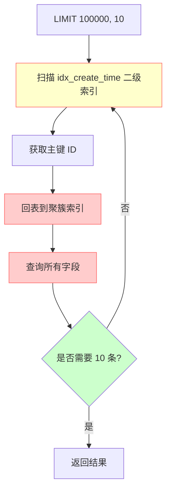
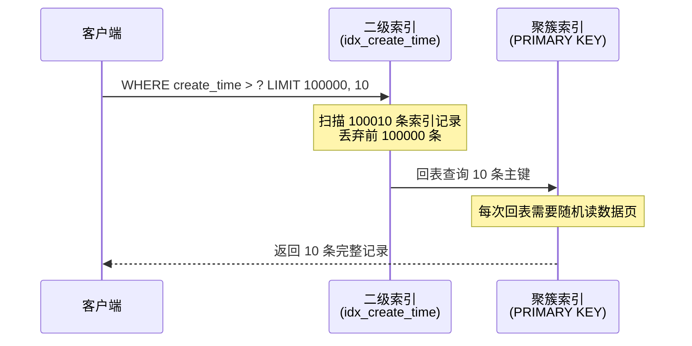
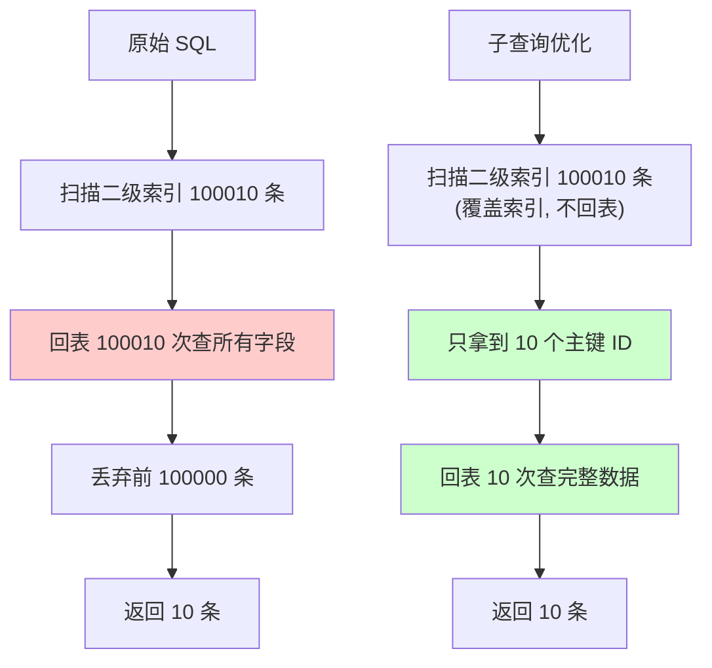
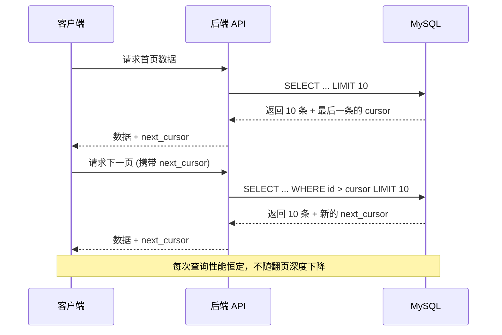

## 引言

> 用户投诉"APP 翻页越来越卡"，一查才发现：翻到第 1000 页时，一条简单的分页查询要跑 **3 秒**。

`LIMIT 100000, 10`——这条看似无害的 SQL，在数据量增长后变成了性能杀手。MySQL 需要先扫描并丢弃前 10 万条数据，才能返回你需要的 10 条。数据量越大，性能下降越剧烈。

深分页是所有业务系统的必经之路：后台管理列表、日志查询、数据报表……都会遇到。本文总结三种实战验证过的优化方案，最高可将查询效率提升 **数十倍**。读完你将掌握：

- 深分页性能骤降的底层原因（回表机制）
- 三种优化方案的适用场景和性能对比
- 互联网大厂瀑布流背后的分页技术选型

---

## 一、深分页问题复现

### 1.1 准备数据

创建用户表，仅在 `create_time` 字段上加索引：

```sql
CREATE TABLE `user` (
  `id` int NOT NULL AUTO_INCREMENT COMMENT '主键',
  `name` varchar(255) DEFAULT NULL COMMENT '姓名',
  `create_time` timestamp NULL DEFAULT NULL COMMENT '创建时间',
  PRIMARY KEY (`id`),
  KEY `idx_create_time` (`create_time`)
) ENGINE=InnoDB COMMENT='用户表';
```

### 1.2 验证深分页问题

**查询第 1 页**（每页 10 条）：

```sql
SELECT * FROM user 
WHERE create_time > '2022-07-03' 
LIMIT 0, 10;
```

执行结果：不到 0.01 秒，瞬间返回。

**查询第 10000 页**：

```sql
SELECT * FROM user 
WHERE create_time > '2022-07-03' 
LIMIT 100000, 10;
```

执行结果：约 0.16 秒，性能下降 **数十倍**。

### 1.3 性能下降的根源

耗时主要花在两个环节：

1. **大量数据扫描**：需要扫描前 100010 条数据，找到符合条件的 100000 条并丢弃
2. **频繁回表查询**：`create_time` 是非聚簇索引，每条数据都需要先通过二级索引找到主键 ID，再回表查询所有字段

### 1.4 回表查询流程





> **💡 核心提示**：深分页的性能瓶颈 = 大量扫描 + 频繁回表。优化思路就是**减少扫描行数**和**减少回表次数**。

## 二、方案一：子查询优化（延迟关联）

### 2.1 优化思路

先在子查询中只查询主键 ID（利用覆盖索引，无需回表），拿到 10 个 ID 后再回表查询完整数据。

### 2.2 优化 SQL

直接嵌套子查询会报错（MySQL 不支持子查询中使用 LIMIT），需要多套一层：

```sql
SELECT * FROM user 
WHERE id IN (
    SELECT id FROM (
        SELECT id FROM user 
        WHERE create_time > '2022-07-03' 
        LIMIT 100000, 10
    ) AS t
);
```

### 2.3 为什么能加速？

使用 `EXPLAIN` 查看执行计划，子查询的 `Extra` 列显示 **`Using index`**，表示用到了**覆盖索引**——只在二级索引中就能拿到主键 ID，无需回表。

| 对比项 | 原始 SQL | 子查询优化 |
|--------|---------|-----------|
| 扫描行数 | 100010 | 100010 |
| 回表次数 | **100010** | **10** |
| 执行时间 | 0.16 秒 | 0.05 秒 |

回表次数从 100010 次降到 10 次，性能提升约 **3 倍**。

### 2.4 流程图



## 三、方案二：INNER JOIN 优化

### 3.1 优化 SQL

把子查询改成 INNER JOIN 关联查询：

```sql
SELECT u.* FROM user u
INNER JOIN (
    SELECT id FROM user 
    WHERE create_time > '2022-07-03' 
    LIMIT 100000, 10
) AS t ON u.id = t.id;
```

### 3.2 与子查询方案的对比

| 对比项 | 子查询 | INNER JOIN |
|--------|--------|-----------|
| 性能 | 相同 | 相同 |
| 可读性 | 嵌套深 | 更直观 |
| MySQL 优化器 | 转为派生表 | 直接使用派生表 |
| 推荐度 | ⭐⭐⭐ | ⭐⭐⭐⭐ |

> **💡 核心提示**：子查询和 INNER JOIN 本质是同一个优化思路——**延迟关联（Deferred Join）**，核心都是先通过覆盖索引拿到主键 ID，再回表。

## 四、方案三：分页游标（推荐）

### 4.1 实现方式

记录上一页最后一条数据的位置，作为下一页的查询条件：

```sql
-- 查询第一页
SELECT * FROM user 
WHERE create_time > '2022-07-03' 
ORDER BY create_time, id
LIMIT 10;

-- 记住第一页最后一条的 id（假设为 100），查询第二页
SELECT * FROM user 
WHERE create_time > '2022-07-03' AND id > 100 
ORDER BY create_time, id
LIMIT 10;
```

### 4.2 为什么性能最好？

每次查询都从游标位置开始扫描，不需要跳过任何数据。无论翻到第几页，查询性能都**稳定不变**。

| 对比项 | 原始 SQL | 子查询/JOIN | 游标分页 |
|--------|---------|-----------|---------|
| 第 1 页耗时 | 0.01 秒 | 0.01 秒 | 0.01 秒 |
| 第 10000 页耗时 | 0.16 秒 | 0.05 秒 | **<0.01 秒** |
| 扫描行数 | 100010 | 100010 | **10** |
| 回表次数 | 100010 | 10 | **10** |
| 性能提升 | - | 3x | **16x+** |

### 4.3 适用场景

| 场景 | 是否适合游标分页 |
|------|----------------|
| 资讯类 APP 首页（瀑布流） | 非常适合 |
| 社交媒体动态流 | 非常适合 |
| 后台管理列表（需要跳页） | 不适合 |
| 数据报表（需要跳页） | 不适合 |

> **💡 核心提示**：游标分页的代价是**无法跳转到指定页**，只能一页一页翻。但大部分互联网 APP（如头条、微博、小红书）的首页瀑布流，根本不需要跳页功能。

### 4.4 大厂实践

以头条的瀑布流为例：



## 五、生产环境避坑指南

1. **永远不要在循环中做深分页**：如果需要通过分页遍历全表数据，使用游标分页方案，避免 `LIMIT offset, size` 的性能退化。
2. `LIMIT offset, size` **中 offset 的陷阱**：`LIMIT 100000, 10` 的 100000 不是第 100000 条，而是跳过 100000 条后取 10 条。offset 越大性能越差。
3. **覆盖索引是优化的关键**：方案一和方案二的核心是利用覆盖索引减少回表次数。确保子查询中只查询索引字段（通常是主键 ID）。
4. **ORDER BY 必须与索引一致**：游标分页要求 `ORDER BY` 的字段与索引顺序一致，否则无法利用索引排序，仍然会全表扫描。
5. **游标分页要注意排序字段唯一性**：如果排序字段（如 `create_time`）不唯一，可能导致数据遗漏或重复。建议用 `ORDER BY create_time, id` 组合排序。
6. **子查询中 LIMIT 不支持的报错处理**：MySQL 不允许在子查询中直接使用 LIMIT，需要多套一层 `SELECT id FROM (SELECT id FROM ... LIMIT ...) AS t`。
7. **大表定期归档数据**：对于日志表、操作记录表等持续增长的大表，定期归档历史数据，从根源上控制数据量，避免深分页问题。

## 六、总结

### 6.1 方案对比表

| 方案 | 原理 | 优点 | 缺点 | 适用场景 | 推荐指数 |
|------|------|------|------|---------|---------|
| 子查询（延迟关联） | 覆盖索引先查 ID，再回表 | 兼容性好，改动小 | 仍有大量扫描 | 后台管理（需跳页） | ⭐⭐⭐⭐ |
| INNER JOIN | 同子查询，语法不同 | 可读性好 | 仍有大量扫描 | 后台管理（需跳页） | ⭐⭐⭐⭐ |
| 游标分页 | 基于上次查询结果定位 | **性能最优且稳定** | 无法跳页 | 信息流、瀑布流 | ⭐⭐⭐⭐⭐ |

### 6.2 行动清单

1. **审计现有系统的深分页 SQL**：搜索所有 `LIMIT` 语句，找出 offset 超过 1000 的查询。
2. **优先使用游标分页**：对于信息流类需求，改用 `WHERE id > cursor` 的游标方案。
3. **必须跳页时使用延迟关联**：后台管理列表如果必须支持跳页，使用子查询或 JOIN 方案减少回表。
4. **建立分页查询规范**：禁止 `LIMIT offset` 中 offset 超过 10000，超过时必须使用游标方案。
5. **合理设置索引**：确保 `WHERE` + `ORDER BY` 的字段组合有合适的索引，避免 filesort。
6. **考虑搜索引擎方案**：对于复杂的全文搜索和多维度分页，考虑引入 Elasticsearch，其深分页性能更优。
7. **监控慢查询日志**：配置 `slow_query_log`，定期分析包含 `LIMIT` 的慢 SQL，持续优化。
