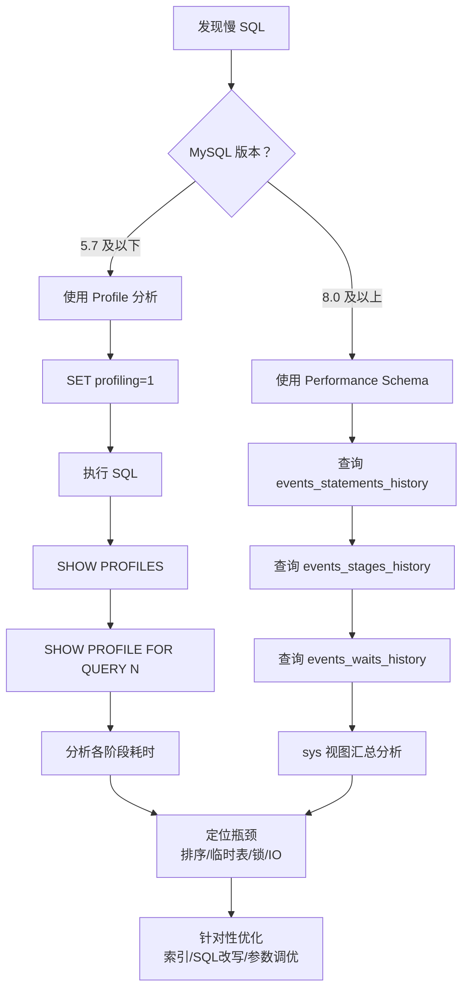
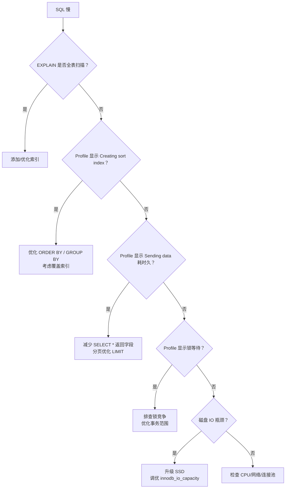

## 引言

MySQL 性能上不去？先查这 5 个瓶颈点。一条慢 SQL，可能卡在执行计划的索引选择、也可能耗在磁盘 I/O、甚至被锁竞争拖垮。你只用 EXPLAIN 看执行计划？如果执行计划没问题但查询依然慢呢？

本文带你系统学习 MySQL 性能诊断的核心工具和方法，从 CPU、内存、磁盘 I/O、网络到锁竞争，逐一拆解瓶颈定位思路。读完本文你将掌握：
- **Profile 工具的使用与局限**：MySQL 提供的性能分析利器，以及为什么在 8.0 中已被弃用
- **SQL 性能分析全流程**：从慢查询日志 → Profile → performance_schema → EXPLAIN 的完整诊断链路
- **替代方案**：Performance Schema 和 sys schema 如何接棒 Profile 成为新一代性能分析工具

## Profile 配置与开启

```sql
SHOW VARIABLES LIKE '%profil%';
```

输出参数详解：
- **have_profiling**：表示是否支持 Profile 功能，YES 表示支持
- **profiling**：表示是否开启 Profile 功能，ON 开启，OFF 关闭，默认是关闭状态
- **profiling_history_size**：表示保存最近 15 条历史数据

### 开启 Profile 功能

```sql
SET profiling = 1;
```

注意：修改配置只对当前会话生效，会话关闭后 Profile 历史信息被清空。

## 使用 Profile 分析 SQL 性能

先造点数据，创建一张用户表：

```sql
CREATE TABLE `user` (
  `id` int(11) NOT NULL AUTO_INCREMENT COMMENT '主键ID',
  `name` varchar(100) NOT NULL DEFAULT '' COMMENT '姓名',
  `age` tinyint NOT NULL DEFAULT 0,
  PRIMARY KEY (`id`)
) ENGINE=InnoDB DEFAULT CHARSET=utf8mb4;
```

执行一条耗时 SQL：

```sql
SELECT * FROM user ORDER BY name;
```

下面轮到主角 **Profile** 出场了。我们执行的所有 SQL 语句都会被记录到 Profile 里面，包括执行失败的 SQL 语句。使用 `show profiles` 命令查看：

| 参数 | 说明 |
| :--- | :--- |
| **Query_ID** | 自动分配的查询 ID，顺序递增 |
| **Duration** | SQL 语句执行耗时 |
| **Query** | SQL 语句内容 |

然后使用 Query_ID 查看具体每一步的耗时情况：

```sql
SHOW PROFILE FOR QUERY 1;
```

可以清楚地看到耗时主要花在 **创建排序索引（Creating sort index）** 上面。

再试一条 SQL：

```sql
SELECT DISTINCT name FROM user;
```

这次的耗时主要花在了：创建临时文件、拷贝文件到磁盘、发送数据、删除临时表上面。由此可以得知 `DISTINCT` 操作会创建临时文件，提醒我们需要建合适的索引来避免。

还可以扩展分析语句，查看 CPU 和 Block I/O 的使用情况：

```sql
SHOW PROFILE CPU, BLOCK IO FOR QUERY 2;
```

所有 Profile 历史数据都被记录在 `information_schema.profiling` 表中，也可以直接查询：

```sql
SELECT * FROM information_schema.profiling WHERE Query_ID = 2;
```

> **💡 核心提示**：`SHOW PROFILE` 可以精确到 SQL 执行的每个阶段（如 Opening tables、Creating tmp table、Sorting result 等），帮助你精准定位性能瓶颈。但这些数据仅在当前会话内有效，会话关闭即清空。

## MySQL 8.0 中的替代方案

以上数据基于 MySQL 5.7 版本。细心的你可能已经发现，每执行完一条 SQL 都会出现一条 warning 信息：

```sql
SHOW WARNINGS;
```

意思就是 **Profile 工具将来有可能被删除，不建议继续使用了**。在 MySQL 8.0 中，Profile 已被标记为废弃（deprecated），推荐使用 **Performance Schema** 和 **sys schema** 作为替代方案。



### Performance Schema 常用查询

```sql
-- 查看最近执行的 SQL 及其耗时
SELECT * FROM performance_schema.events_statements_history ORDER BY TIMER_WAIT DESC LIMIT 10;

-- 查看等待事件
SELECT * FROM performance_schema.events_waits_summary_global_by_event_name 
  ORDER BY SUM_TIMER_WAIT DESC LIMIT 10;

-- 使用 sys schema 快速定位慢查询
SELECT * FROM sys.statements_with_runtimes_in_95th_percentile LIMIT 10;
```

> **💡 核心提示**：Performance Schema 的开销在 MySQL 8.0 中已经大幅优化（默认开启的 instrument 仅带来约 1%~3% 的性能开销），建议在生产环境中长期开启，配合监控告警平台使用。

## 性能瓶颈诊断决策树



## 生产环境避坑指南

| 坑位 | 现象 | 解决方案 |
| :--- | :--- | :--- |
| **忽略慢查询日志** | 不知道哪些 SQL 慢，等用户投诉才发现 | 开启 `slow_query_log`，设置 `long_query_time=1`，定期分析慢查询日志 |
| **Profile 会话级限制** | 重启或断开连接后历史数据丢失 | 生产环境改用 Performance Schema 进行持续监控 |
| **Buffer Pool 配置不当** | 默认值 128MB 远不够生产使用，大量磁盘 I/O | 根据服务器内存调整 `innodb_buffer_pool_size`，建议为物理内存的 60%~80% |
| **临时表溢出到磁盘** | 复杂查询触发 tmp table on disk，性能骤降 | 调整 `tmp_table_size` 和 `max_heap_table_size`，优化查询避免不必要的 GROUP BY |
| **锁等待超时** | `Lock wait timeout exceeded` 频繁出现 | 缩小事务范围，避免长事务，使用 `SHOW ENGINE INNODB STATUS` 排查锁等待 |
| **Profile 已废弃仍在使用** | 升级到 MySQL 8.0 后 Profile 不可用或报 warning | 迁移到 Performance Schema 和 sys schema，配置合适的监控采集策略 |

## 总结

| 工具 | MySQL 版本 | 精度 | 持久化 | 推荐程度 |
| :--- | :--- | :--- | :--- | :--- |
| **Profile** | 5.0 ~ 8.0(废弃) | 阶段级 | 会话级 | ⭐⭐（已弃用） |
| **慢查询日志** | 全版本 | 语句级 | 持久化 | ⭐⭐⭐⭐⭐ |
| **EXPLAIN** | 全版本 | 执行计划 | - | ⭐⭐⭐⭐⭐ |
| **Performance Schema** | 5.5+ | 语句/阶段/等待级 | 实例级 | ⭐⭐⭐⭐⭐ |
| **sys schema** | 5.7+ | 聚合视图 | 实例级 | ⭐⭐⭐⭐⭐ |

### 行动清单

1. **开启慢查询日志**：`SET GLOBAL slow_query_log = ON`，`SET GLOBAL long_query_time = 1`，定期用 `mysqldumpslow` 分析。
2. **迁移到 Performance Schema**：MySQL 8.0 用户停止使用 Profile，改用 `performance_schema` 和 `sys` schema。
3. **养成 EXPLAIN 习惯**：上线前对核心 SQL 执行 EXPLAIN，确认使用了正确的索引。
4. **调整 Buffer Pool**：检查 `innodb_buffer_pool_size`，确保不是默认的 128MB。
5. **监控锁等待**：定期查询 `information_schema.innodb_locks` 和 `innodb_trx`，及时发现锁竞争。
6. **扩展阅读**：推荐《高性能 MySQL》第 5 章"创建高性能的索引"和第 6 章"查询性能优化"。
