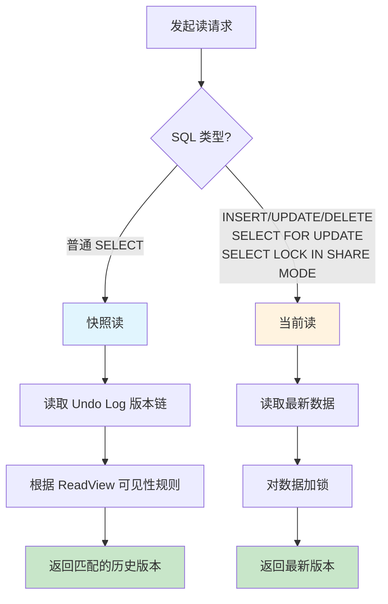
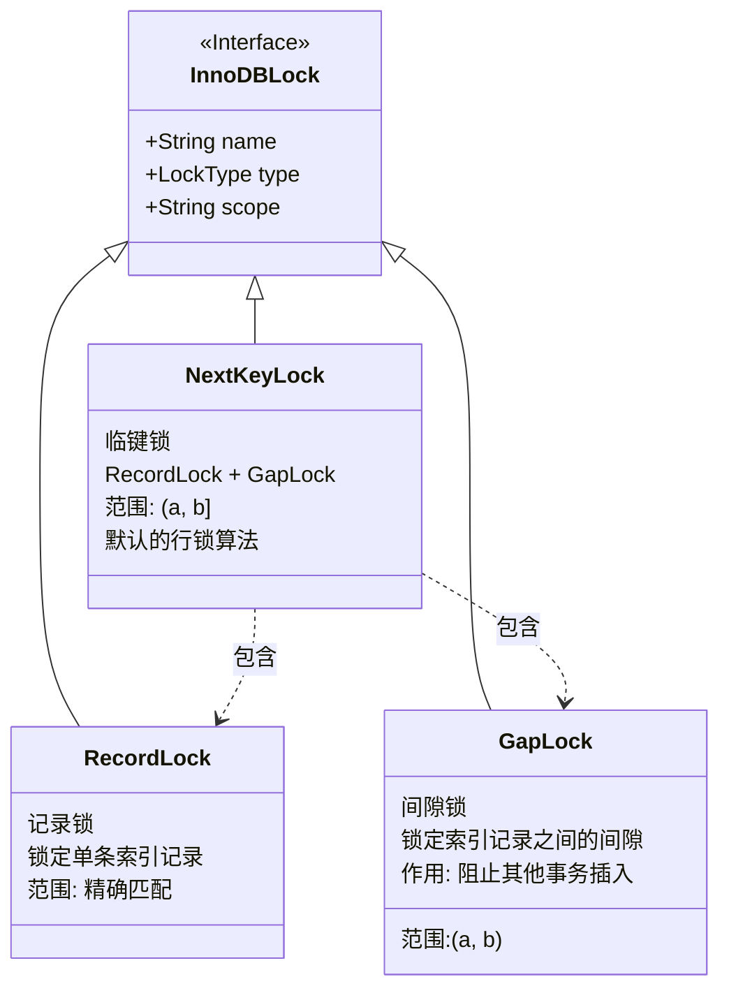
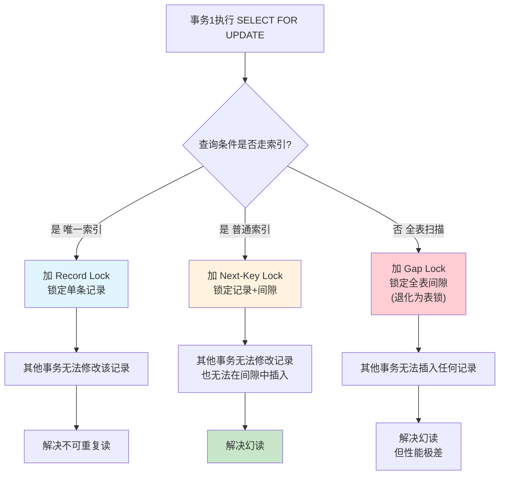

## 引言

RR 隔离级别下，MySQL 到底有没有解决幻读问题？网上众说纷纭，有的说解决了，有的说没解决。答案是：**部分解决了**。

关键在于——MySQL 对**快照读**和**当前读**采用了完全不同的策略。快照读靠 MVCC 解决，当前读靠间隙锁解决。只有理解这两种读取方式的本质差异，才能真正搞懂 MySQL 的幻读处理机制。

本文将深入剖析：
- **快照读 vs 当前读**：为什么同一个查询条件，普通 SELECT 和 SELECT FOR UPDATE 结果不同
- **Gap Lock + Next-Key Lock**：InnoDB 如何通过间隙锁阻断其他事务的插入
- **锁的类型体系**：Record Lock、Gap Lock、Next-Key Lock 的区别和应用场景
- **生产环境避坑**：非索引列加锁导致表锁、间隙锁范围交叉引发死锁

无论你是面试准备还是排查线上并发问题，掌握幻读的完整解决机制都能让你从原理层面给出令人信服的答案。

> **💡 核心提示**：幻读问题不是"解决"或"没解决"的二选一，而是**快照读用 MVCC 解决、当前读用锁解决**。如果只读不写，RR 级别下确实没有幻读；但如果涉及当前读，必须配合间隙锁才能彻底解决。

## 并发事务产生的问题

先创建一张用户表，用作数据验证：

```sql
CREATE TABLE `user` (
  `id` int NOT NULL AUTO_INCREMENT COMMENT '主键',
  `name` varchar(100) DEFAULT NULL COMMENT '姓名',
  PRIMARY KEY (`id`)
) ENGINE=InnoDB COMMENT='用户表';
```

并发事务会产生以下三个问题：

### 脏读

**定义**：一个事务读到其他事务**未提交**的数据。

事务 B 修改了数据但未提交，事务 A 已经读到了事务 B 最新修改的数据。如果事务 B 最终回滚，事务 A 读到的就是无效数据。

### 不可重复读

**定义**：一个事务读取到其他事务**修改（UPDATE/DELETE）过并已提交**的数据。

事务 A 第一次查询后，事务 B 修改了数据并提交，事务 A 第二次查询读到了被修改后的值。同一个事务内，相同条件两次查询结果不一致。

### 幻读

**定义**：一个事务读取到其他事务**最新插入（INSERT）并已提交**的数据。

事务 A 第一次查询后，事务 B 插入了新数据并提交，事务 A 第二次查询读到了新插入的行。同一个事务内，相同条件两次查询结果的数量不一致。

> **💡 核心提示**：不可重复读和幻读的关键区别——**不可重复读关注"已有数据被修改"，幻读关注"凭空多出新数据"**。不可重复读是 UPDATE/DELETE 导致的，幻读是 INSERT 导致的。

## 快照读和当前读

理解幻读问题之前，必须先理解快照读和当前读——这是 InnoDB 处理读操作的两种完全不同的模式。



| 读类型 | 定义 | 加锁 | 示例 | MVCC 生效 |
|--------|------|------|------|-----------|
| **快照读** | 读取数据的历史版本 | 不加锁 | `SELECT` | ✅ 是 |
| **当前读** | 读取数据的最新版本 | 加锁 | `INSERT`、`UPDATE`、`DELETE`、`SELECT ... FOR UPDATE`、`SELECT ... LOCK IN SHARE MODE` | ❌ 否 |

## RR 隔离级别下的幻读分析

MySQL 在 **Repeatable Read（可重复读）** 隔离级别下，到底有没有解决**幻读**的问题？

答案是：**部分解决**。

### 快照读：通过 MVCC 解决幻读

在快照读的情况下，通过 **MVCC（复用 ReadView）** 解决了幻读问题。

手动设置 MySQL 隔离级别为可重复读：

```sql
SET SESSION TRANSACTION ISOLATION LEVEL REPEATABLE READ;
```

**测试场景**：

1. 事务 1 执行 `SELECT * FROM user`，生成 ReadView（假设此时有 2 条记录）
2. 事务 2 执行 `INSERT INTO user ...` 并提交（插入 1 条新记录）
3. 事务 1 再次执行 `SELECT * FROM user`

**结果**：事务 1 两次查询结果**一致**，都是 2 条记录。事务 2 新插入的数据对事务 1 不可见。

**原因**：在可重复读隔离级别下，第一次快照读时生成了一个 ReadView，第二次快照读时**复用了第一次的 ReadView**。事务 2 的事务 ID 仍在 `m_ids` 中，被判定为不可见。

> **💡 核心提示**：快照读下的幻读解决，本质上是 **ReadView 复用**的结果。只要 ReadView 不变，版本链上可见的数据就不变。

### 当前读：未解决幻读

在**当前读**的情况下，可重复读隔离级别**没有解决**幻读问题。

**测试场景**：

1. 事务 1 执行 `SELECT * FROM user`（快照读），结果 2 条
2. 事务 2 执行 `INSERT INTO user ...` 并提交
3. 事务 1 执行 `SELECT * FROM user FOR UPDATE`（当前读）

**结果**：事务 1 的当前读查询到了**3 条**记录，读到了事务 2 新插入的数据——出现了幻读。

**原因**：当前读不走 MVCC，直接读取最新版本数据，且每次当前读都会生成新的 ReadView。

### 当前读场景下的 INSERT 幻读

不仅 `SELECT FOR UPDATE` 会出现幻读，`INSERT` 操作同样可能出现幻读问题。

**测试场景**：

1. 事务 1 执行 `SELECT COUNT(*) FROM user WHERE id = 5`，结果为 0（不存在）
2. 事务 2 执行 `INSERT INTO user (id, name) VALUES (5, '张三')` 并提交
3. 事务 1 执行 `INSERT INTO user (id, name) VALUES (5, '李四')`

**结果**：事务 1 的 INSERT 报**主键冲突**——出现了幻读。

## InnoDB 锁机制：彻底解决当前读幻读

在当前读的情况下，解决幻读的唯一办法就是**加锁**。

### 三种行锁类型



| 锁类型 | 锁定范围 | 是否包含边界 | 作用 | 示例 |
|--------|---------|-------------|------|------|
| **Record Lock（记录锁）** | 单条索引记录 | - | 锁定具体数据行 | `WHERE id = 1` |
| **Gap Lock（间隙锁）** | 索引记录之间的间隙 | 左开右开 `(a, b)` | 阻止其他事务在该范围内 INSERT | `WHERE id BETWEEN 1 AND 10`（1 和 10 不存在时） |
| **Next-Key Lock（临键锁）** | 记录锁 + 间隙锁 | 左开右闭 `(a, b]` | 同时锁定记录和间隙，解决幻读 | `WHERE id <= 10` |

> **💡 核心提示**：Next-Key Lock = Record Lock + Gap Lock。它是 InnoDB 在 RR 隔离级别下**默认的行锁算法**。当查询条件走唯一索引等值查询时，Next-Key Lock 会退化为 Record Lock。

### Next-Key Lock 解决幻读的原理

事务 1 在执行当前读查询时，使用 `FOR UPDATE` 对数据加 **Next-Key Lock**，不仅锁定了已存在的记录，还锁定了记录之间的间隙，**防止其他事务在该范围内插入新数据**。



### 锁的范围示例

假设表中已有记录：

| id | name |
|----|------|
| 1 | 王二 |
| 10 | 一灯 |

```sql
SELECT * FROM user WHERE id = 5 FOR UPDATE;
```

由于 `id = 5` 不存在，InnoDB 会对 **(1, 10)** 这个间隙加上 Gap Lock，锁定范围是 `(1, 10)`。如果查询条件是 `id <= 10`，则锁定范围是 `(-∞, 10]`（左开右闭）。

## 生产环境避坑指南

### 1. 非索引列加锁导致全表 Gap Lock

**场景**：对没有索引的列执行 `UPDATE ... WHERE name = '张三' FOR UPDATE`。

**影响**：由于不走索引，InnoDB 无法精确定位记录，会对**全表所有记录**加上 Gap Lock，相当于表锁。其他事务的任何插入操作都会被阻塞。

**排查方法**：使用 `EXPLAIN` 检查 SQL 是否使用了索引。

**建议**：确保加锁的 WHERE 条件列有索引；定期审查慢查询日志。

### 2. 间隙锁范围交叉导致死锁

**场景**：两个事务分别对不相交的记录加锁，但由于间隙锁的范围交叉，导致互相等待。

**示例**：表中记录 id=1 和 id=10，两个事务分别锁定 `id=5`（间隙 `(1, 10)`），由于 Next-Key Lock 的范围可以交叉，两个事务都能获得相同的间隙锁，后续 INSERT 时互相阻塞形成死锁。

**建议**：按照相同的顺序访问记录；使用 `INSERT ... ON DUPLICATE KEY UPDATE` 合并查询。

### 3. RR 级别下间隙锁导致的性能问题

**场景**：RR 隔离级别下，所有范围查询都会加 Gap Lock，导致并发插入被阻塞。

**影响**：在高并发插入场景下，大量事务因 Gap Lock 等待而超时。

**建议**：如果业务不需要 Gap Lock 的幻读保护（如只关心最终一致性），可以切换到 RC 隔离级别，RC 级别下不加 Gap Lock。

### 4. 快照读和当前读混用导致业务逻辑异常

**场景**：同一个事务中，先用 `SELECT` 判断数据是否存在，再 `INSERT`。中间其他事务可能已经插入了相同数据。

**正确做法**：使用 `SELECT ... FOR UPDATE` 确保当前读，或者使用 `INSERT ... ON DUPLICATE KEY UPDATE`。

### 5. 等值查询退化为 Gap Lock

**场景**：查询条件走的是普通索引（非唯一索引），即使等值查询也只命中一条记录，InnoDB 仍然会加 Next-Key Lock 而非退化为 Record Lock。

**原因**：普通索引可能存在多个相同值，InnoDB 无法确定只有一个匹配项。

**建议**：尽可能使用唯一索引做等值查询，让 Next-Key Lock 退化为 Record Lock。

### 6. 大范围查询导致锁等待超时

**场景**：`UPDATE user SET age = 1 WHERE id > 1 AND id < 10000` 锁定了大量范围，其他事务在该范围内插入时长时间等待。

**排查命令**：
```sql
SHOW ENGINE INNODB STATUS;  -- 查看锁等待信息
SELECT * FROM information_schema.innodb_locks;  -- 查看当前锁状态
```

**建议**：缩小更新范围；分批处理大范围的更新操作。

## 总结与行动清单

### 三种锁类型对比表

| 锁类型 | 组成 | 锁定范围 | 是否解决幻读 | 性能影响 |
|--------|------|---------|-------------|---------|
| **Record Lock** | 仅记录锁 | 单条索引记录 | ❌ 否 | 最小 |
| **Gap Lock** | 仅间隙锁 | 索引间隙 `(a, b)` | ⚠️ 部分 | 中等 |
| **Next-Key Lock** | Record Lock + Gap Lock | 记录 + 间隙 `(a, b]` | ✅ 是 | 最大 |

### 快照读 vs 当前读 对比表

| 对比维度 | 快照读 | 当前读 |
|---------|--------|--------|
| 解决幻读的方式 | MVCC（复用 ReadView） | Next-Key Lock |
| 是否需要加锁 | 否 | 是 |
| 读取版本 | 历史版本 | 最新版本 |
| 典型场景 | 普通查询 | 更新、删除、加锁查询 |

### 行动清单

1. **优先使用唯一索引做等值查询**：让 Next-Key Lock 退化为 Record Lock，减少锁范围。
2. **避免在非索引列上加锁**：非索引列加锁会退化为全表 Gap Lock，严重影响并发。
3. **统一事务中的读模式**：避免同一事务中快照读和当前读混用导致数据不一致。
4. **关注锁等待超时日志**：定期检查 `innodb_lock_wait_timeout` 配置（默认 50 秒），及时调整。
5. **合理使用 RC 隔离级别**：高并发插入场景且不依赖 Gap Lock 保护时，RC 级别性能更好。
6. **使用 `INSERT ... ON DUPLICATE KEY UPDATE`**：替代先 SELECT 再 INSERT 的模式，避免幻读和死锁。
7. **定期分析慢查询**：使用 `EXPLAIN` 确认查询走索引，避免全表扫描加锁。
8. **监控间隙锁使用量**：通过 `SHOW ENGINE INNODB STATUS` 查看当前锁状态，及时发现异常锁等待。
