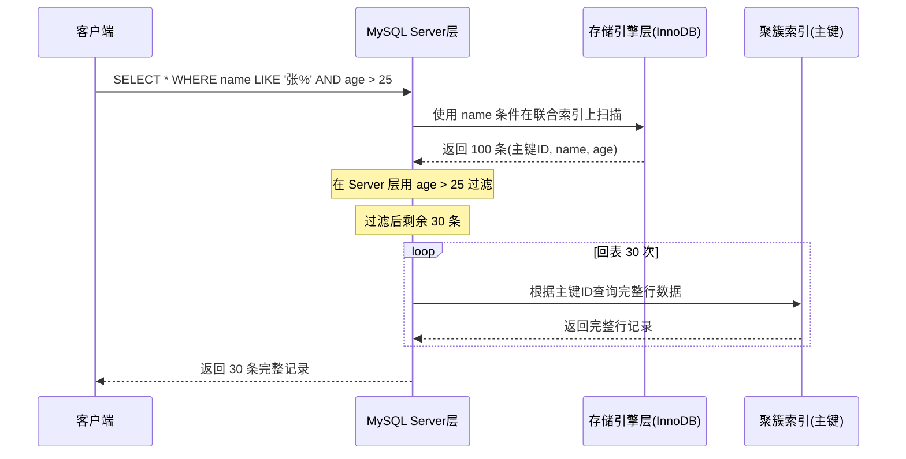
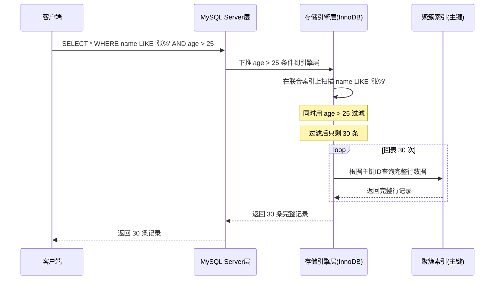

## 引言

MySQL 5.6 的这个优化，让索引少回了 70% 的数据。

你在联合索引 `(name, age)` 上执行 `SELECT * FROM user WHERE name LIKE '张%' AND age > 25`，name 的范围匹配找到了 100 条记录，但加上 age 条件后只剩 30 条。如果没有 ICP 优化，MySQL 需要回表 100 次才能筛出这 30 条记录；有了 ICP，在存储引擎层就用 age 条件过滤掉了 70 条，只需回表 30 次。70% 的回表减少，这就是索引下推的威力。

本文将通过详细的案例和时序图对比，带你彻底理解 ICP（Index Condition Pushdown）的工作机制：它是如何减少回表次数的？什么场景下会生效？什么情况下不生效？生产环境如何监控 ICP 的使用情况？掌握这个 MySQL 5.6 的隐藏优化利器，你的 SQL 查询性能可能有质的飞跃。

## 1. 索引下推的作用

索引下推（Index Condition Pushdown，简称 ICP）是 MySQL 5.6 引入的优化特性，主要有两个作用：

1. **减少回表查询的次数**：在存储引擎层就用索引条件过滤，减少需要回表的数据量。
2. **减少存储引擎和 MySQL Server 层之间的数据传输量**：不需要将不符合条件的行从存储引擎传送到 Server 层。

总之，就是提升 MySQL 查询性能。

## 2. ICP vs 非 ICP 数据流对比

### 2.1 没有使用 ICP 的查询过程



**步骤拆解**：

1. 存储引擎根据 `name LIKE '张%'` 条件在联合索引上找到 100 个匹配的条目（主键 ID + name + age）
2. 这 100 条数据全部返回给 MySQL Server 层
3. Server 层再根据 `age > 25` 条件筛选，剩下 30 条
4. 对这 30 条数据分别回表查询完整行记录
5. 返回给客户端

### 2.2 使用 ICP 的查询过程



**步骤拆解**：

1. 存储引擎根据 `name LIKE '张%'` 在联合索引上扫描，同时**在存储引擎层**用 `age > 25` 过滤
2. 过滤后只剩 30 条符合条件的数据
3. 只对这 30 条数据回表查询完整行记录
4. 返回给 MySQL Server 层
5. 返回给客户端

> **💡 核心提示**：对比两种流程，核心区别在于**过滤发生的层级**。非 ICP 时，age 条件在 Server 层过滤，需要先把 100 条数据从引擎层传到 Server 层，再回表 30 次；ICP 时，age 条件下推到引擎层，在索引扫描时就过滤掉了 70 条，只回表 30 次。减少了 70% 的回表 + 70% 的引擎层到 Server 层的数据传输。

## 3. 案例实践

创建用户表并造数据验证：

```sql
CREATE TABLE `user` (
  `id` int NOT NULL AUTO_INCREMENT COMMENT '主键',
  `name` varchar(100) NOT NULL COMMENT '姓名',
  `age` tinyint NOT NULL COMMENT '年龄',
  `gender` tinyint NOT NULL COMMENT '性别',
  PRIMARY KEY (`id`),
  KEY `idx_name_age` (`name`,`age`)
) ENGINE=InnoDB COMMENT='用户表';
```

查询 SQL 执行计划，验证是否用到索引下推：

```sql
EXPLAIN SELECT * FROM user WHERE name='一灯' AND age > 2;
```

执行计划中的 Extra 列显示 **Using index condition**，表示用到了索引下推的优化逻辑。

## 4. 索引下推配置

查看索引下推的开关配置：

```sql
SHOW VARIABLES LIKE '%optimizer_switch%';
```

如果输出结果中显示 **index_condition_pushdown=on**，表示开启了索引下推（MySQL 5.6+ 默认开启）。

手动开启：

```sql
SET optimizer_switch="index_condition_pushdown=on";
```

关闭：

```sql
SET optimizer_switch="index_condition_pushdown=off";
```

## 5. ICP 的适用条件

索引下推不是所有查询都会生效，需要满足以下条件：

1. **适用于 InnoDB 引擎和 MyISAM 引擎**。
2. **执行计划 type 必须是 range、ref、eq_ref、ref_or_null**，即范围查询或引用查询。
3. **对于 InnoDB 表，仅用于二级索引（非聚簇索引）**。ICP 的目标是减少全行读取从而减少 I/O。对于 InnoDB 聚簇索引，完整记录已经读入 InnoDB 缓冲区，此时使用 ICP 不会减少 I/O。
4. **子查询不能使用索引下推**。
5. **存储过程不能使用索引下推**。

> **💡 核心提示**：ICP 只对二级索引有效，对聚簇索引无效。原因是：聚簇索引的叶子节点本身就存储了完整的行数据，ICP 能减少的数据访问已经加载到缓冲区了，无法减少 I/O。而二级索引的叶子节点只存主键值，ICP 可以在回表之前过滤掉不符合条件的记录，这才是 ICP 的价值所在。

## 6. ICP 的局限性

ICP 虽然优秀，但并非万能，以下场景 ICP 不会生效：

| 场景 | 原因 |
|------|------|
| 全表扫描（type=ALL） | 没有使用索引，ICP 无从下手 |
| 子查询中的条件 | MySQL 不支持子查询下推 |
| 存储过程内的查询 | 引擎层无法感知存储过程逻辑 |
| 聚簇索引查询 | 完整数据已在缓冲区，无法减少 I/O |
| 条件不包含索引列 | 非索引列无法在索引层面过滤 |
| 关联查询的驱动表 | 驱动表走全表扫描时 |

## 7. 如何监控 ICP 使用情况

```sql
-- 查看 ICP 的使用次数
SHOW STATUS LIKE 'Handler_icp%';
```

- `Handler_icp_attempts`：ICP 尝试次数
- `Handler_icp_match`：ICP 匹配成功次数

通过这两个指标可以评估 ICP 在生产环境的收益。`match / attempts` 的比率越高，说明 ICP 效果越好。

## 8. 生产环境避坑指南

### 坑 1：不知道 ICP 是否生效

**现象**：建了联合索引，但不确定 ICP 是否生效。
**原因**：没有检查 EXPLAIN 的 Extra 列。
**对策**：养成习惯，EXPLAIN 后检查 Extra 列是否有 `Using index condition` 标识。

### 坑 2：在聚簇索引上期待 ICP 生效

**现象**：在主键上做了范围查询 + 其他条件过滤，期望 ICP 减少回表。
**原因**：ICP 只对二级索引有效，聚簇索引本身就有完整数据。
**对策**：理解 ICP 的适用范围，不要对主键查询期待 ICP 效果。

### 坑 3：升级 MySQL 版本后 ICP 被关闭

**现象**：从 5.5 升级到 5.6+ 后，配置文件中 optimizer_switch 的默认值可能覆盖新特性。
**原因**：配置文件中的旧配置可能显式关闭了 ICP。
**对策**：升级后检查 `SHOW VARIABLES LIKE '%optimizer_switch%'` 确认 index_condition_pushdown=on。

### 坑 4：依赖 ICP 而忽略索引设计

**现象**：认为有了 ICP 就不需要精心设计的联合索引。
**原因**：ICP 只是锦上添花，不能替代合理的索引设计。
**对策**：优先设计好联合索引（等值列在前，范围列在后），ICP 是额外的优化层。

### 坑 5：ICP 无法优化函数条件

**现象**：`WHERE name LIKE '张%' AND YEAR(create_time) = 2024`，ICP 无法下推 YEAR 函数。
**原因**：ICP 只能下推可以直接在索引上评估的条件。函数计算需要完整的行数据。
**对策**：将函数条件改写为范围比较，`create_time >= '2024-01-01' AND create_time < '2025-01-01'`。

## 9. 总结

### ICP 优化效果对比表

| 场景 | 无 ICP | 有 ICP | 回表减少 |
|------|--------|--------|---------|
| name 等值 + age 范围 | 回表所有 name 匹配行 | 引擎层先过滤 age | 30%~90% |
| name 范围 + age 范围 | 回表所有 name 范围行 | 引擎层同时过滤 age | 50%~95% |
| 单列等值查询 | 回表所有匹配行 | 无 ICP（无额外条件可下推） | 0% |
| 聚簇索引查询 | 直接读取完整数据 | ICP 不生效 | 0% |

### 行动清单

1. **检查 MySQL 版本**：确认版本 >= 5.6，ICP 特性默认可用。
2. **确认 ICP 开关**：执行 `SHOW VARIABLES LIKE '%optimizer_switch%'`，确保 index_condition_pushdown=on。
3. **EXPLAIN 检查 Extra 列**：对核心查询执行 EXPLAIN，观察是否有 `Using index condition` 标识。
4. **设计联合索引时考虑 ICP**：将等值条件列和范围条件列放在同一个联合索引中，让 ICP 有下推空间。
5. **监控 ICP 指标**：定期检查 `Handler_icp_attempts` 和 `Handler_icp_match`，评估 ICP 收益。
6. **避免在索引列上使用函数**：函数计算无法被 ICP 下推，改写为范围比较。
7. **ICP 不是万能药**：优先保证索引设计合理（最左匹配、区分度优先），ICP 是锦上添花。
8. **生产环境压力测试**：在测试环境模拟生产数据量，对比 ICP 开启和关闭的性能差异，量化收益。
