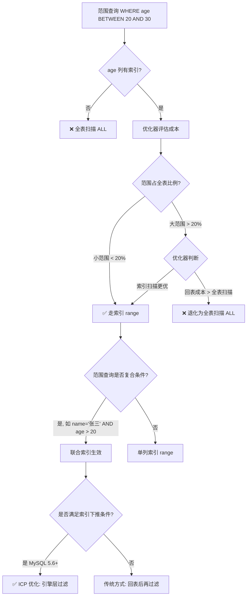

## 引言

为什么 BETWEEN 有时走索引，有时全表扫描？

你在 user 表的 age 字段上建了索引，满怀信心地写了 `WHERE age BETWEEN 20 AND 30`，结果 EXPLAIN 显示 type=ALL——全表扫描。换了个查询 `WHERE age > 20`，这次又走索引了。到底什么情况下范围查询能用到索引？什么情况下会退化成全表扫描？

本文将从 MySQL 的范围查询优化机制讲起，深入解析：B+ 树如何处理范围查询、什么条件下优化器会放弃索引、索引条件下推（ICP）如何进一步提升范围查询性能、以及 Index Skip Scan（MySQL 8.0 新特性）如何拯救低区分度字段。搞懂这些，你的范围查询性能至少提升一个数量级。

## 1. 范围查询的基本概念

范围查询是指使用比较运算符进行条件筛选的查询，常见的运算符包括：

- `>`、`>=`、`<`、`<=`
- `BETWEEN ... AND ...`
- `IN (...)`
- `LIKE 'prefix%'`（前缀匹配）

### 范围查询如何用到索引？

B+ 树的叶子节点是有序链表，范围查询的本质就是：

1. 在 B+ 树中定位到范围的**起始位置**
2. 沿着叶子节点的有序链表**顺序遍历**，直到超出范围

这就是为什么范围查询能用到索引——B+ 树的有序性保证了范围扫描的高效性。

## 2. 范围查询优化流程



> **💡 核心提示**：范围查询是否走索引，关键不在于"有没有索引"，而在于"优化器的成本估算"。当范围覆盖的数据超过全表的一定比例（通常约 20%，但具体值由优化器决定），优化器会认为回表的总成本高于全表扫描，从而放弃索引。这就是为什么同样的 SQL，数据量小的时候走索引，数据量大了反而全表扫描。

## 3. 范围查询的优化规则

### 3.1 单列索引范围查询

```sql
-- 走索引
SELECT * FROM user WHERE age > 20;
SELECT * FROM user WHERE age BETWEEN 20 AND 30;
SELECT * FROM user WHERE age IN (20, 25, 30);
```

但需要注意：

```sql
-- 以下情况可能导致索引失效
SELECT * FROM user WHERE age != 25;       -- != 或 <> 通常不走索引
SELECT * FROM user WHERE age NOT IN (20); -- NOT IN 不走索引
```

### 3.2 联合索引范围查询

联合索引 `(name, age)` 的范围查询有特殊规则：

```sql
-- ✅ 第一列等值 + 第二列范围：能用到两列
SELECT * FROM user WHERE name = '张三' AND age > 20;

-- ⚠️ 第一列范围 + 第二列条件：只能用到第一列
SELECT * FROM user WHERE name LIKE '张%' AND age > 20;

-- ❌ 跳过第一列：完全用不到索引
SELECT * FROM user WHERE age > 20;
```

> **💡 核心提示**：联合索引中，**只有第一个范围条件之前的列能精确匹配，范围列本身也能用到索引，但范围列之后的列就无法使用索引了**。这就是"等值可以用，范围就中断"原则。例如 `(a, b, c)` 联合索引，`WHERE a=1 AND b>2 AND c=3`，只有 a 和 b 能用索引，c 用不到。

### 3.3 Index Skip Scan（MySQL 8.0.13+）

这是 MySQL 8.0 引入的优化特性。对于联合索引 `(gender, name)`，当查询条件是 `WHERE name = '张三'`（跳过了第一列 gender），传统情况下无法使用索引。但 Index Skip Scan 会将查询"拆分"为：

```sql
-- 原始查询
SELECT * FROM user WHERE name = '张三';

-- 优化器自动拆分为多个子查询
SELECT * FROM user WHERE gender = 'M' AND name = '张三'
UNION ALL
SELECT * FROM user WHERE gender = 'F' AND name = '张三';
```

当第一列（gender）的区分度很低（只有几个不同值）时，这种拆分比全表扫描快得多。通过 `EXPLAIN` 可以看到 `Extra` 列显示 `Skip_scan`。

## 4. 索引条件下推（ICP）对范围查询的增强

在范围查询中，ICP（Index Condition Pushdown，索引下推）能显著提升性能。

当使用联合索引进行范围查询时，比如 `WHERE name LIKE '张%' AND age > 25`，name 的范围匹配和 age 的过滤都可以在存储引擎层完成，减少回表次数。

关于 ICP 的详细原理，可以参考专门的分析文章。

## 5. 生产环境避坑指南

### 坑 1：范围查询字段上使用了函数

**现象**：`WHERE YEAR(create_time) = 2024` 不走索引。
**原因**：函数破坏了索引列的有序性，B+ 树无法定位起始位置。
**对策**：改写为范围查询 `WHERE create_time >= '2024-01-01' AND create_time < '2025-01-01'`。

### 坑 2：隐式类型转换导致范围查询失效

**现象**：`phone` 字段是 varchar 类型，`WHERE phone > 13800000000`（数值类型）不走索引。
**原因**：隐式类型转换导致 MySQL 对每一行做函数转换后再比较，索引失效。
**对策**：确保查询条件的数据类型与列定义完全一致，`WHERE phone > '13800000000'`。

### 坑 3：范围查询跨度过大导致退化为全表扫描

**现象**：`WHERE status IN (1, 2, 3, 4, 5, 6)` 全表扫描，但 `WHERE status IN (1, 2)` 走索引。
**原因**：IN 列表中的值越多，优化器预估扫描比例越大，超过阈值后选择全表扫描。
**对策**：将大 IN 查询拆分为多个小查询，或使用 UNION ALL。

### 坑 4：联合索引中范围列位置不当

**现象**：联合索引 `(age, name, city)`，查询 `WHERE age > 20 AND name = '张三' AND city = '北京'` 只用到 age 列。
**原因**：范围列之后的列无法使用索引（等值可以用，范围就中断）。
**对策**：将等值列放前面，范围列放后面。调整为 `(name, city, age)`。

### 坑 5：OR 条件中混合范围查询

**现象**：`WHERE age > 20 OR city = '北京'` 全表扫描。
**原因**：OR 连接的两个条件只要有一个没有索引，MySQL 就会选择全表扫描。
**对策**：改写为 `UNION ALL` 分别查询后合并。

### 坑 6：LIKE 范围查询使用不当

**现象**：`WHERE name LIKE '%张%'` 不走索引。
**原因**：前缀通配符 `%` 破坏了索引的有序性，无法确定 B+ 树的起始查找位置。
**对策**：尽可能使用前缀匹配 `LIKE '张%'`；如需全文搜索，使用全文索引或 Elasticsearch。

## 6. 总结

### 范围查询索引使用情况速查表

| 查询模式 | 单列索引 | 联合索引 (a,b,c) | 说明 |
|---------|---------|-----------------|------|
| `a = 1` | ✅ | ✅ 用到 a | 等值查询 |
| `a > 1` | ✅ | ✅ 用到 a | 范围查询 |
| `a = 1 AND b > 2` | - | ✅ 用到 a,b | 等值+范围 |
| `a > 1 AND b = 2` | - | ⚠️ 仅用到 a | 范围列后的列失效 |
| `a = 1 AND b = 2 AND c > 3` | - | ✅ 用到 a,b,c | 前两列等值+第三列范围 |
| `b > 1`（跳过 a） | - | ❌ 不使用 | 未满足最左匹配 |
| `a != 1` | ❌ | ❌ | != 不走索引 |
| `a BETWEEN 1 AND 10` | ✅ | ✅ 用到 a | 范围查询 |

### 行动清单

1. **检查所有范围查询的执行计划**：对线上所有包含 `>`、`<`、`BETWEEN`、`IN` 的 SQL 执行 EXPLAIN，确保 type 不是 ALL。
2. **调整联合索引列序**：确保范围查询列放在联合索引的靠后位置，等值查询列放前面。
3. **避免在索引列上使用函数**：将 `YEAR(create_time) = 2024` 改写为范围比较。
4. **统一数据类型**：确保查询条件的类型与表定义一致，避免隐式转换。
5. **关注 IN 列表的大小**：IN 中的值超过 10 个时，评估是否需要拆分或使用临时表。
6. **善用 MySQL 8.0 的 Skip Scan**：如果升级到了 MySQL 8.0，检查低区分度联合索引是否能受益于 Index Skip Scan。
7. **大跨度范围查询用分页**：对于 `WHERE create_time > '2020-01-01'` 这类大范围查询，添加 LIMIT 或按时间分批处理。
