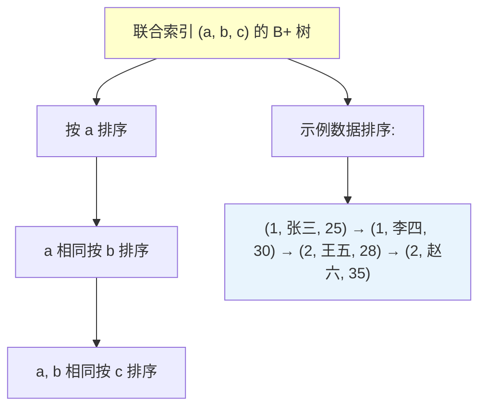

## 引言

> 一条只查 `name` 字段的 SQL，在 `(gender, name)` 联合索引下，明明跳过了第一列 `gender`，为什么 MySQL 仍然能走索引？

如果你脱口而出"联合索引必须遵循最左前缀匹配原则"，那么 MySQL 8.0 可能会给你一个意外的答案。

曾经有一个面试，候选人自信满满地背诵"联合索引遵循最左前缀匹配，跳过第一列就无法使用索引"，却被追问："一定吗？"——当场哑口无言。事实上，从 **MySQL 8.0** 开始，引入了一个被大多数人忽略的优化特性：**索引跳跃扫描（Index Skip Scan）**。

本文将带你理解这个新特性的工作原理、适用场景和实战验证。读完你将掌握：

- 索引跳跃扫描的触发条件和底层机制
- 如何用 `EXPLAIN` 验证 Skip Scan 是否生效
- 这个特性在什么情况下反而会帮倒忙

---

## 一、最左前缀匹配的传统认知

### 1.1 经典理论

当在 `(a, b, c)` 三个字段上创建联合索引时，实际上是创建了三个索引组合：

- `(a)`
- `(a, b)`
- `(a, b, c)`

根据最左前缀匹配原则，只有查询条件包含最左列 `a` 时，才能使用联合索引：

```sql
-- ✅ 能使用联合索引
SELECT * FROM table_name WHERE a = ?;
SELECT * FROM table_name WHERE a = ? AND b = ?;
SELECT * FROM table_name WHERE a = ? AND b = ? AND c = ?;
SELECT * FROM table_name WHERE a = ? AND c = ?;  -- 只用到了 (a) 部分

-- ❌ 不能使用联合索引（传统认知）
SELECT * FROM table_name WHERE b = ?;
SELECT * FROM table_name WHERE c = ?;
SELECT * FROM table_name WHERE b = ? AND c = ?;
```

> **💡 核心提示**：最左前缀匹配是 B+ 树索引的底层结构决定的。联合索引的值是按照 `(a, b, c)` 的顺序组织的，如果不知道 `a` 的值，就无法在 B+ 树中定位起点。

### 1.2 B+ 树结构理解



## 二、索引跳跃扫描（Skip Scan）

### 2.1 什么是索引跳跃扫描？

**MySQL 8.0** 引入了 **Index Skip Scan**（索引跳跃扫描）优化：当联合索引的**第一列唯一值较少**时，即使 WHERE 条件中没有第一列，优化器也可以利用联合索引进行查询。

> **💡 核心提示**：Skip Scan 的本质是优化器自动将查询拆解为多个子查询——先遍历第一列的所有枚举值，再在每个枚举值下匹配后续列。相当于 MySQL 替你把 `WHERE gender IN (0, 1) AND name = ?` 的逻辑自动完成了。

### 2.2 触发条件

| 条件 | 说明 |
|------|------|
| **第一列的唯一值较少** | 通常只有 2-3 个不同的值（如性别、状态等枚举字段） |
| **查询条件跳过了第一列** | WHERE 中包含联合索引的非首列字段 |
| **优化器判断 Skip Scan 成本更低** | 优化器会对比全表扫描和 Skip Scan 的代价 |

### 2.3 工作原理

```mermaid
flowchart TD
    A["查询: SELECT * FROM user WHERE name='一灯'"] --> B{第一列 gender 唯一值少?}
    B -->|否| C[走全表扫描]
    B -->|是| D[提取 gender 的所有枚举值: 0, 1]
    D --> E["等价拆解:"]
    E --> F["子查询1: WHERE gender=0 AND name='一灯'"]
    E --> G["子查询2: WHERE gender=1 AND name='一灯'"]
    F --> H[利用 (gender, name) 索引精确查找]
    G --> H
    H --> I[合并结果返回]
    
    style B fill:#ffffcc
    style D fill:#ccffcc
    style H fill:#ccffcc
```

### 2.4 实战验证

创建用户表：

```sql
CREATE TABLE `user` (
  `id` int NOT NULL AUTO_INCREMENT COMMENT '主键',
  `name` varchar(255) NOT NULL COMMENT '姓名',
  `gender` tinyint NOT NULL COMMENT '性别',
  PRIMARY KEY (`id`),
  KEY `idx_gender_name` (`gender`, `name`)
) ENGINE=InnoDB COMMENT='用户表';
```

在 `gender` 和 `name` 上建立联合索引，`gender` 只有两个枚举值（0 和 1）。

执行查询并查看执行计划：

```sql
EXPLAIN SELECT * FROM user WHERE name = '一灯';
```

关键观察：
- `type` 列显示 `range`（范围扫描，而非 `ALL` 全表扫描）
- `Extra` 列显示 **`Using index for skip scan`**，表示用到了索引跳跃扫描优化

### 2.5 Skip Scan vs 显式 IN 查询

如果手动将第一列的所有枚举值加到 WHERE 条件中：

```sql
SELECT * FROM user WHERE gender IN (0, 1) AND name = '一灯';
```

这两种写法效果等价，但 Skip Scan 的优势在于：

| 对比项 | Skip Scan | 显式 IN 查询 |
|--------|-----------|-------------|
| SQL 简洁性 | 更简洁 | 需要知道所有枚举值 |
| 枚举值变化 | 自动适应 | 需要修改 SQL |
| 优化器选择 | 优化器自动决策 | 强制走索引 |
| 执行计划 | `Using index for skip scan` | `Using where; Using index` |

## 三、注意事项与限制

### 3.1 适用场景

- **性别字段**：只有男/女两个值
- **状态字段**：如订单状态（待支付/已支付/已取消/已完成）
- **类型字段**：如用户类型（普通/VIP/企业）

### 3.2 不适用的场景

| 场景 | 原因 |
|------|------|
| 第一列唯一值很多（如时间戳） | 拆解后子查询太多，成本反而更高 |
| 第一列区分度高（如手机号前缀） | 优化器会选择全表扫描 |
| MySQL 5.7 及以下版本 | 不支持 Skip Scan 特性 |

### 3.3 如何验证是否生效？

```sql
-- 查看执行计划中的 Extra 列
EXPLAIN FORMAT=TREE SELECT * FROM user WHERE name = '一灯';

-- 如果输出中包含 "skip_scan": true，说明优化器选择了 Skip Scan
```

> **💡 核心提示**：可以通过 `SET optimizer_switch = 'skip_scan=off';` 临时关闭 Skip Scan 功能，对比两种方式的执行计划差异。

## 四、生产环境避坑指南

1. **不要盲目依赖 Skip Scan**：Skip Scan 的触发依赖于优化器的成本计算。如果数据分布发生变化（如第一列枚举值增多），优化器可能不再选择 Skip Scan，SQL 性能会突然下降。
2. **枚举值变化要及时更新统计信息**：使用 `ANALYZE TABLE` 更新表的统计信息，帮助优化器做出正确决策。
3. **第一列区分度低是设计问题**：如果联合索引的第一列唯一值很少，说明这个索引的区分度本身就低。与其依赖 Skip Scan，不如考虑调整索引顺序或创建独立索引。
4. **显式写出 IN 条件更可靠**：在 SQL 中显式写出 `gender IN (0, 1)` 比依赖 Skip Scan 更可控，执行计划更稳定，也更容易被团队理解。
5. **监控执行计划变化**：MySQL 版本升级或数据量增长后，执行计划可能发生变化。建议在发布前对比执行计划。
6. **Skip Scan 不能替代合理索引设计**：即使有 Skip Scan 优化，也不应该在索引设计上偷懒。联合索引的第一列仍然应该优先选择区分度高的字段。

## 五、总结

### 5.1 核心概念对比

| 特性 | 最左前缀匹配 | 索引跳跃扫描 | 显式 IN 查询 |
|------|-------------|-------------|-------------|
| 适用版本 | 所有版本 | MySQL 8.0+ | 所有版本 |
| 是否需要第一列 | 是 | 否 | 否 |
| 触发方式 | 自动 | 优化器自动 | 手动编写 |
| 执行稳定性 | 稳定 | 依赖优化器 | 稳定 |
| 推荐指数 | ⭐⭐⭐⭐⭐ | ⭐⭐⭐ | ⭐⭐⭐⭐ |

### 5.2 行动清单

1. **确认 MySQL 版本**：只有 8.0+ 才支持 Skip Scan，检查 `SELECT VERSION();`。
2. **审查现有联合索引**：检查联合索引的第一列是否为低区分度字段（如性别、状态），这类索引可以考虑调整。
3. **优先显式写出 IN 条件**：在查询中显式包含第一列的所有枚举值，比依赖 Skip Scan 更可靠。
4. **使用 EXPLAIN 验证**：每次 SQL 变更前，使用 `EXPLAIN` 确认执行计划是否符合预期。
5. **更新统计信息**：在数据量大幅变化后执行 `ANALYZE TABLE`，确保优化器有准确的统计信息。
6. **持续学习新特性**：关注 MySQL 每个版本的优化器改进，及时更新知识体系。
