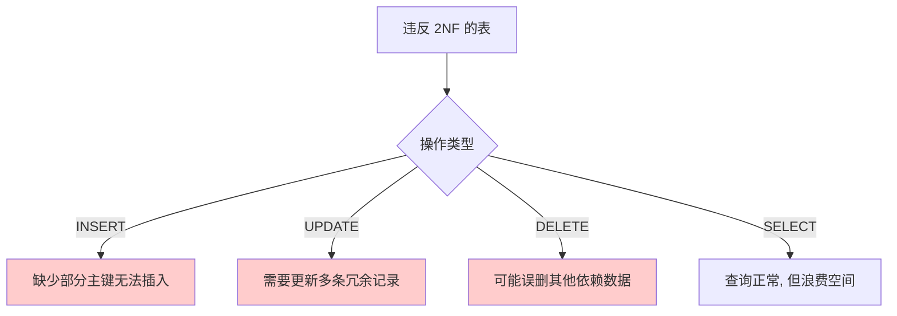
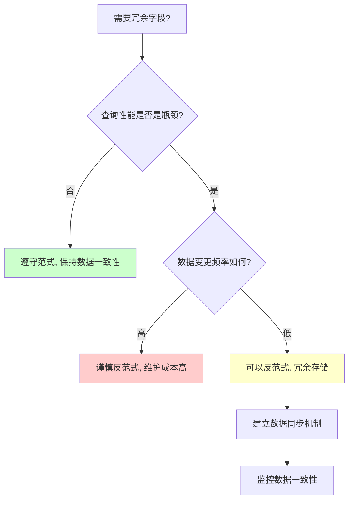

## 引言

> 为什么数据库老师反复强调"要满足第三范式"，但很多大厂的表设计却故意违反范式？

如果你正在纠结"到底要不要遵守数据库范式"，或者在面试中被问到"什么是第三范式"时只能说出"不依赖非主属性"却解释不清楚含义，那么这篇文章就是为你准备的。

数据库三大范式（1NF / 2NF / 3NF）是关系型数据库设计的基石，它们定义了**如何组织数据才能避免冗余和异常**。但在实际生产环境中，为了查询性能，经常会有意违反范式（反范式设计）。理解范式、懂得何时遵守、何时打破，是每个后端开发者的必备技能。

本文将用通俗的方式讲解三大范式的含义、违反后的后果，以及在真实项目中如何权衡。读完你将掌握：

- 三大范式的通俗解释和具体示例
- 违反每一范式会导致什么问题
- 什么时候应该反范式，以及如何安全地反范式

---

## 一、第一范式（1NF）：列的原子性

### 1.1 定义

第一范式要求**数据库表的每一列都是不可分割的原子数据项**。

换句话说：一个单元格只能存一个值，不能存多个值、列表或嵌套结构。

### 1.2 反例

```
| id | name    | contact_info        |
|----|---------|---------------------|
| 1  | 张三    | 13800000001, zhang@email.com |
| 2  | 李四    | 13800000002, li@email.com    |
```

`contact_info` 字段包含了手机号和邮箱两个信息，违反了 1NF。

### 1.3 正例

```
| id | name | phone       | email             |
|----|------|-------------|-------------------|
| 1  | 张三 | 13800000001 | zhang@email.com   |
| 2  | 李四 | 13800000002 | li@email.com      |
```

将复合字段拆分为独立的列，满足 1NF。

### 1.4 违反 1NF 的后果

| 问题 | 说明 |
|------|------|
| 无法单独查询 | 不能只查手机号，必须先拆分整个字段 |
| 无法单独更新 | 更新邮箱时会连带影响手机号 |
| 无法加索引 | 无法为子值单独建立索引，查询性能差 |
| 数据校验困难 | 无法对不同子值设置不同的约束条件 |

> **💡 核心提示**：在现代 MySQL（5.7+）中，虽然可以用 JSON 类型存储复合数据，但本质上 JSON 的每个 key 仍然满足原子性（JSON 本身被视为一个原子值）。如果需要查询 JSON 内部字段，可以使用虚拟列（Generated Column）和函数索引。

## 二、第二范式（2NF）：完全依赖主键

### 2.1 定义

第二范式要求在满足 1NF 的基础上，**实体的所有属性完全依赖于主关键字**，不能存在仅依赖主键一部分的属性。

**关键点：2NF 只在复合主键的场景下才有意义。**

### 2.2 反例

```
订单明细表（订单号 + 商品ID 作为复合主键）：
| order_id | product_id | product_name | quantity | price |
|----------|------------|--------------|----------|-------|
| 1001     | P001       | iPhone 15    | 2        | 5999  |
| 1001     | P002       | AirPods      | 1        | 1299  |
| 1002     | P001       | iPhone 15    | 1        | 5999  |
```

- `product_name` 只依赖于 `product_id`（主键的一部分），不依赖于 `order_id`
- `price` 同理只依赖于 `product_id`

这违反了 2NF。

### 2.3 正例：拆分为两张表

**订单明细表**（复合主键：order_id + product_id）：

```
| order_id | product_id | quantity |
|----------|------------|----------|
| 1001     | P001       | 2        |
| 1001     | P002       | 1        |
| 1002     | P001       | 1        |
```

**商品表**（主键：product_id）：

```
| product_id | product_name | price |
|------------|--------------|-------|
| P001       | iPhone 15    | 5999  |
| P002       | AirPods      | 1299  |
```

### 2.4 违反 2NF 的后果

| 问题 | 说明 |
|------|------|
| **数据冗余** | 商品名称和价格在每条订单记录中重复存储 |
| **更新异常** | 修改商品价格时，需要更新所有涉及该商品的订单记录 |
| **插入异常** | 新增一个还未被任何订单购买的商品时，无法插入（缺少 order_id） |
| **删除异常** | 删除某个订单时，可能把该商品的全部信息也删掉了 |



## 三、第三范式（3NF）：消除传递依赖

### 3.1 定义

第三范式要求在满足 2NF 的基础上，**任何非主属性不依赖于其他非主属性**。

换句话说：表中的列之间不能有依赖关系，所有列都必须直接依赖于主键。

### 3.2 反例

```
用户表（主键：user_id）：
| user_id | name   | department_id | department_name | dept_location |
|---------|--------|---------------|-----------------|---------------|
| 1       | 张三   | D01           | 技术部           | 3楼           |
| 2       | 李四   | D01           | 技术部           | 3楼           |
| 3       | 王五   | D02           | 市场部           | 5楼           |
```

依赖链路：

```
user_id → department_id → department_name → dept_location
```

`department_name` 和 `dept_location` 依赖于 `department_id`（非主键），而不是直接依赖于 `user_id`。这违反了 3NF。

### 3.3 正例：拆分

**用户表**：

```
| user_id | name   | department_id |
|---------|--------|---------------|
| 1       | 张三   | D01           |
| 2       | 李四   | D01           |
| 3       | 王五   | D02           |
```

**部门表**：

```
| department_id | department_name | dept_location |
|---------------|-----------------|---------------|
| D01           | 技术部           | 3楼           |
| D02           | 市场部           | 5楼           |
```

### 3.4 违反 3NF 的后果

| 问题 | 说明 |
|------|------|
| **数据冗余** | 部门名称和位置在每个用户记录中重复 |
| **更新异常** | 部门搬家（位置变更）需要更新所有该部门的用户记录 |
| **数据不一致** | 如果更新时漏了一条记录，就会出现同一个部门有两个位置 |

## 四、三大范式关系图


> **💡 核心提示**：三大范式是**递进关系**。满足 3NF 的表一定满足 2NF 和 1NF，但反过来不成立。

## 五、范式对比总结

| 范式 | 核心要求 | 解决的问题 | 反例表现 |
|------|---------|-----------|---------|
| **1NF** | 列不可再分 | 多值存储 | 一个单元格存多个值 |
| **2NF** | 完全依赖主键 | 部分依赖（复合主键场景） | 非主键列只依赖主键的一部分 |
| **3NF** | 消除传递依赖 | 传递依赖 | 非主键列依赖另一个非主键列 |

## 六、生产环境：何时反范式？

### 6.1 反范式设计（Denormalization）

在实际生产环境中，为了**查询性能**和**减少 JOIN**，经常有意违反范式，将相关数据冗余存储在一张表中。

**经典场景：订单表冗余用户信息和商品信息**

```
| order_id | user_id | user_name | product_id | product_name | price | total |
|----------|---------|-----------|------------|--------------|-------|-------|
| 1001     | U001    | 张三      | P001       | iPhone 15    | 5999  | 11998 |
```

这张表同时违反了 2NF（`product_name` 只依赖 `product_id`）和 3NF（`user_name` 传递依赖 `user_id`）。

**为什么这么做？**

| 原因 | 说明 |
|------|------|
| 减少 JOIN | 订单列表查询无需关联用户表和商品表 |
| 历史快照 | 订单记录的是下单时的价格，即使用户名/商品名改了也不影响历史订单 |
| 查询性能 | 单表查询远快于多表 JOIN，尤其在大数据量场景 |

### 6.2 反范式的使用原则



**反范式的前提条件：**

1. **读多写少**：冗余字段变更频率低
2. **历史快照语义**：冗余字段记录的是某个时间点的状态（如订单价格），而非实时值
3. **有数据一致性保障**：通过触发器、定时任务或消息队列维护冗余数据的一致性
4. **性能收益大于维护成本**：JOIN 的性能损耗远大于冗余带来的存储和维护开销

## 七、生产环境避坑指南

1. **不要盲目追求高范式**：过度规范化会导致大量 JOIN，查询性能急剧下降。一般业务表达到 3NF 即可，不需要追求 BCNF 或 4NF。
2. **反范式设计必须有数据同步方案**：如果冗余了 `user_name`，当用户改名时，必须通过触发器、异步任务或双写机制同步更新订单表。
3. **JSON 字段不等于违反 1NF**：MySQL 5.7+ 的 JSON 类型是一个原子列，但如果需要查询 JSON 内部字段，记得创建函数索引或虚拟列。
4. **联合主键要警惕 2NF**：如果使用了复合主键（如关联表），确保所有非主键列都依赖于完整的主键，否则应该拆分。
5. **历史订单/快照表可以反范式**：订单、日志、审计等"写一次不再改"的数据，冗余存储是被鼓励的。
6. **核心主数据必须遵守范式**：用户表、商品表、配置表等核心主数据，应严格遵守 3NF，确保数据一致性。
7. **定期审计数据一致性**：对于反范式设计的表，定期检查冗余字段与源数据是否一致，避免数据漂移。

## 八、总结

### 8.1 范式选择决策表

| 场景 | 推荐范式级别 | 原因 |
|------|-------------|------|
| OLTP 核心业务表 | 3NF | 保证数据一致性 |
| 数据仓库/报表表 | 反范式（星型/雪花模型） | 优化查询性能 |
| 订单/快照类表 | 反范式（冗余关键字段） | 减少 JOIN，保留历史快照 |
| 关联关系表 | 2NF（复合主键，无非主键列） | 只存关联关系 |
| 配置/字典表 | 3NF | 数据量小，一致性优先 |

### 8.2 行动清单

1. **审查现有表结构**：检查核心业务表是否满足 3NF，找出违反范式设计的地方，评估是否需要修复。
2. **建立表设计规范**：将范式要求纳入团队的数据库设计规范文档，作为建表评审的必检项。
3. **反范式设计需审批**：如果为了性能需要违反范式，必须在设计文档中说明原因、同步机制和一致性保障措施。
4. **使用工具检查**：借助数据库建模工具（如 PowerDesigner、dbdiagram.io）辅助检查表结构是否符合范式要求。
5. **历史表考虑反范式**：对于订单历史、操作日志等"写入后不再修改"的表，主动采用反范式设计，减少 JOIN。
6. **定期做数据一致性巡检**：编写定时任务，对比冗余字段与源数据的一致性，发现不一致及时修复。
