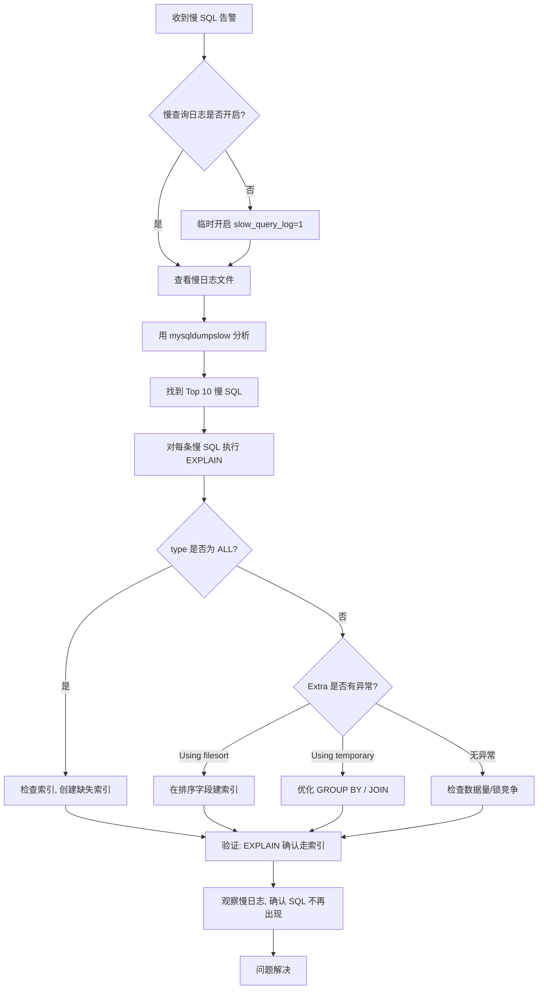

## 引言

线上 SQL 突然变慢，3 分钟定位问题的排查流程。

凌晨两点，监控告警：某个接口响应时间从 200ms 飙升到 10s。你被电话叫醒，打开电脑，第一件事是什么？很多开发者的第一反应是"赶紧加个索引"——但在不知道哪条 SQL 慢、为什么慢之前，加索引等于盲人摸象。

MySQL 的慢查询日志就是你定位线上慢 SQL 的第一把武器。它会自动记录所有执行时间超过阈值的 SQL，帮你精准定位性能瓶颈。本文将带你掌握：如何安全地开启慢查询日志（不影响生产性能）、如何设置合理的阈值（10 秒太长了！）、如何用 mysqldumpslow 快速分析海量慢日志、以及生产环境最容易踩的 6 个坑。看完本文，下次遇到慢 SQL 告警，3 分钟内你就能定位到具体 SQL 和优化方向。

## 1. 慢查询日志的作用

慢查询日志默认不开启，建议手动开启，方便定位线上问题。

执行时间超过阈值的 SQL 会被写入慢查询日志，帮助我们：

- **记录执行时间过长的 SQL 语句**
- **定位线上慢 SQL 问题**
- **为 SQL 性能调优提供数据支撑**
- **定期分析 SQL 性能趋势，预防性能退化**

## 2. 慢 SQL 排查工作流



## 3. 慢查询日志的配置

### 3.1 查看是否开启慢查询日志

```sql
SHOW VARIABLES LIKE 'slow_query_log';
```

默认是 OFF（不开启），需要手动开启。

### 3.2 开启慢查询日志

有两种方式：

**方式一：使用 MySQL 命令（临时生效，重启后失效）**

```sql
SET GLOBAL slow_query_log = 1;
```

**方式二：修改配置文件（永久生效）**

修改 `my.cnf`，加入以下配置，重启 MySQL 服务后生效：

```ini
slow_query_log = ON
```

> **💡 核心提示**：生产环境建议使用配置文件的永久开启方式。临时开启方式在 MySQL 重启后失效，可能导致慢 SQL 监控出现盲区。如果不确定何时能重启，可以先用临时方式立即生效，再修改配置文件确保重启后仍有效。

### 3.3 设置慢查询日志阈值（重点）

慢查询日志的阈值默认是 **10 秒**。对于线上服务来说，10 秒太长了！一个正常接口响应时间应该在 200ms 以内，超过 1 秒就已经影响用户体验了。

**方式一：使用 MySQL 命令（临时生效）**

```sql
SET GLOBAL long_query_time = 1;  -- 修改为 1 秒
```

**方式二：修改配置文件（永久生效）**

```ini
long_query_time = 1
```

> **💡 核心提示**：阈值设置建议参考以下标准：开发/测试环境设为 1 秒，能捕获更多潜在慢 SQL；生产环境设为 1~2 秒，避免日志量过大。注意：修改 long_query_time 后，当前已连接的 session 不会立即生效，需要重新连接或使用 `SET SESSION long_query_time = 1`。

### 3.4 修改慢查询日志位置

查看当前日志位置：

```sql
SHOW VARIABLES LIKE '%slow_query_log_file%';
```

修改配置文件永久指定位置：

```ini
slow_query_log_file = /usr/local/mysql/data/localhost_slow.log
```

### 3.5 记录更多慢查询 SQL

默认情况下，管理语句（`ALTER TABLE`、`ANALYZE TABLE`、`CHECK TABLE`、`CREATE INDEX`、`DROP INDEX`、`OPTIMIZE TABLE`、`REPAIR TABLE`）不会被记录到慢查询日志中。

管理语句也很重要，建议开启记录：

```sql
SET GLOBAL log_slow_admin_statements = ON;
```

**⚠️ 注意一个大坑**：默认情况下，**不使用索引的 SQL 也不会被记录到慢查询日志中**！这意味着大量全表扫描的 SQL 可能被遗漏。

想要记录不走索引的 SQL，需要开启：

```sql
SET GLOBAL log_queries_not_using_indexes = ON;
```

> **💡 核心提示**：开启 `log_queries_not_using_indexes` 后，即使 SQL 执行时间没有超过阈值，只要没有使用索引，也会被记录。这在数据量小的表中可能产生大量日志，生产环境谨慎使用，建议在数据量超过 10 万的表上配合阈值使用。

## 4. 慢查询日志的使用

手动造一条慢 SQL 测试（user 表 100 万数据）：

```sql
SELECT * FROM user;
```

查看慢日志文件内容：

```bash
cat /usr/local/mysql/data/localhost_slow.log
```

日志中会记录 SQL 语句和执行时间。

## 5. 分析慢查询日志 — mysqldumpslow

慢查询日志较多时，手动查看不方便。MySQL 提供了 **mysqldumpslow** 工具来分析和汇总慢日志。

### 常用参数

| 参数 | 说明 | 可选值 |
|------|------|--------|
| `-s` | 排序方式 | `c` 访问次数、`t` 查询时间、`l` 锁定时间、`r` 返回记录数、`at` 平均查询时间、`al` 平均锁定时间、`ar` 平均返回记录数 |
| `-t` | 返回前 N 条 | 数字 |
| `-g` | 正则匹配 | 正则表达式 |

### 5.1 查询返回结果最多的 10 条 SQL

```bash
mysqldumpslow -s r -t 10 /usr/local/mysql/data/localhost_slow.log
```

### 5.2 查询耗时最长的 10 条 SQL

```bash
mysqldumpslow -s t -t 10 /usr/local/mysql/data/localhost_slow.log
```

### 5.3 查询执行次数最多的 SQL

```bash
mysqldumpslow -s c -t 10 /usr/local/mysql/data/localhost_slow.log
```

### 5.4 查询包含特定关键词的 SQL

```bash
# 查找包含 user 表的慢 SQL
mysqldumpslow -s t -t 10 -g 'user' /usr/local/mysql/data/localhost_slow.log
```

## 6. 生产环境避坑指南

### 坑 1：慢日志占满磁盘空间

**现象**：服务器磁盘空间告警，排查发现慢日志文件达到几十 GB。
**原因**：慢日志开启了但从未清理，长期积累。
**对策**：配置 logrotate 定期轮转慢日志文件，或使用 `SET GLOBAL slow_query_log = 0` 临时关闭，备份后重新开启。建议设置定时任务：`find /path/to/logs -name "*_slow.log" -mtime +30 -delete`。

### 坑 2：阈值设置过低导致日志爆炸

**现象**：`long_query_time = 0.001`（1 毫秒），慢日志每秒写入几百条。
**原因**：阈值太低，大量正常 SQL 也被记录，不仅日志量大，记录本身也影响性能。
**对策**：生产环境阈值建议 1~2 秒。如果需要更细粒度的分析，使用 `performance_schema.events_statements_history`。

### 坑 3：开启慢日志影响数据库性能

**现象**：开启慢查询日志后，数据库整体性能下降 5%~10%。
**原因**：每条 SQL 执行都需要检查是否超过阈值，有轻微的性能开销。
**对策**：慢查询日志本身开销很小（通常 < 1%），如果感知到明显性能下降，检查是否同时开启了 `log_queries_not_using_indexes`（这个开销较大）。

### 坑 4：修改阈值后当前连接不生效

**现象**：执行 `SET GLOBAL long_query_time = 1` 后，慢 SQL 仍然按 10 秒阈值记录。
**原因**：GLOBAL 级别的设置对已存在的连接不生效，只对新建连接有效。
**对策**：当前连接执行 `SET SESSION long_query_time = 1` 立即生效，或重新建立连接。

### 坑 5：log_queries_not_using_indexes 导致日志爆炸

**现象**：开启后，慢日志被大量小表查询撑满。
**原因**：这个选项会记录所有不走索引的 SQL，不管执行多快。小表查询本来就不需要索引。
**对策**：同时设置 `min_examined_row_limit`，如 `SET GLOBAL min_examined_row_limit = 1000`，只记录扫描超过 1000 行的 SQL。

### 坑 6：慢日志中 SQL 被参数化，无法定位具体代码

**现象**：慢日志中看到的 SQL 是 `SELECT * FROM user WHERE id = ?`，不知道是哪个业务模块调用的。
**原因**：MySQL 慢日志默认不记录 SQL 来源。
**对策**：开启 `log_throttle_queries_not_using_indexes` 限制频率；结合应用层的 SQL 日志（如 MyBatis 的日志）进行关联分析。

## 7. 总结

### 慢查询配置参数推荐表

| 参数 | 开发/测试环境 | 生产环境 | 说明 |
|------|-------------|---------|------|
| slow_query_log | ON | ON | 必须开启 |
| long_query_time | 1 秒 | 1~2 秒 | 按需调整 |
| log_slow_admin_statements | ON | ON | 记录管理语句 |
| log_queries_not_using_indexes | ON | OFF | 生产环境谨慎开启 |
| min_examined_row_limit | 0 | 1000 | 配合上面参数使用 |
| log_output | FILE | FILE | 建议写入文件而非表 |

### 行动清单

1. **立即开启慢查询日志**：检查所有生产 MySQL 实例的 `slow_query_log` 状态，未开启的立即开启。
2. **设置合理阈值**：生产环境 `long_query_time` 设为 1 秒，不要使用默认的 10 秒。
3. **配置日志轮转**：设置 logrotate 定期清理慢日志，防止磁盘占满。
4. **定期分析慢日志**：每周使用 `mysqldumpslow -s t -t 10` 分析 Top 10 慢 SQL。
5. **开启管理语句记录**：`log_slow_admin_statements = ON`，DDL 操作也可能成为性能瓶颈。
6. **谨慎开启 log_queries_not_using_indexes**：仅在性能专项排查期间开启，配合 `min_examined_row_limit` 使用。
7. **建立慢 SQL 告警机制**：监控慢日志文件大小和条目数，异常时自动告警。
8. **慢 SQL 排查 SOP**：告警 → 查慢日志 → mysqldumpslow → EXPLAIN → 优化 → 验证，形成标准流程。
