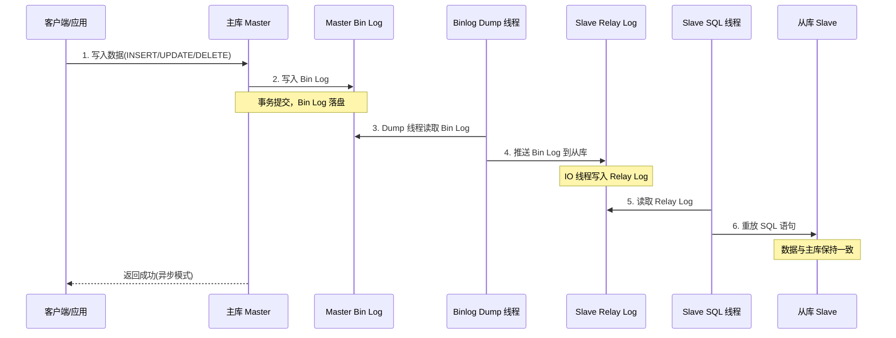

## 引言

主从延迟 3 秒，用户的刚写入读不到怎么办？你以为写了数据就能读到，结果读从库发现数据还没同步——这是高并发业务中最让人崩溃的场景。主从复制看似美好（读写分离、容灾备份、负载均衡），但延迟、不一致、故障切换，每一个问题都可能让你的线上服务翻车。

本文深入讲解 MySQL 主从同步的底层原理、三种复制模式、延迟根因分析和高可用方案。读完本文你将掌握：
- **主从同步的完整流程**：Bin Log → Binlog Dump → Relay Log → Slave Apply 的完整链路
- **三种复制模式的区别与选型**：异步、半同步、全同步各自的适用场景
- **主从延迟的根因与解决方案**：从机器性能到大事务分割的完整应对策略
- **高可用架构设计思路**：GTID 复制、并行复制、故障切换的最佳实践

## MySQL 主从同步架构

MySQL 主从同步是基于 Bin Log 实现的，而 Bin Log 记录的是原始 SQL 语句或行级变更。

**Bin Log** 共有三种日志格式，可以通过 `binlog_format` 配置参数指定：

| 参数值 | 含义 | 优点 | 缺点 |
| :--- | :--- | :--- | :--- |
| **Statement** | 记录原始 SQL 语句 | 数据量小 | 某些函数（如 NOW()）导致主从不一致 |
| **Row** | 记录每行数据的变更 | 保证主从数据一致 | 数据量较大 |
| **Mixed** | 混合模式 | 兼顾数据量和一致性 | 格式切换逻辑复杂 |

**常见的主从同步架构有一主多从、双主多从**：

- **一主多从**：一般是主库负责所有读写请求，从库只负责容灾恢复和冗余备份。如果做了读写分离，主库负责写请求，从库负责读请求，可以提升数据库性能。
- **双主多从**：一般是主库 1 负责所有读写请求，主库 2 不对外提供服务，只用来容灾恢复。相比一主多从，双主多从可以减少宕机时间，更快恢复数据库可用状态。



## MySQL 主从同步的作用

1. **读写分离，提升数据库性能**：主库负责写，从库负责读，分散负载。
2. **容灾恢复**：主服务器不可用时，从服务器可以接管提供服务，提高可用性。
3. **冗余备份**：主服务器数据损坏丢失时，从服务器保留备份。

## 主从同步的原理

```mermaid
flowchart TD
    A["主库执行事务写入数据"] --> B["主库写入 Bin Log 文件"]
    B --> C["从库 IO 线程发起连接"]
    C --> D["主库 Binlog Dump 线程推送 Bin Log"]
    D --> E["从库 IO 线程写入 Relay Log"]
    E --> F["从库 SQL 线程读取 Relay Log"]
    F --> G["从库重放 SQL 语句"]
    G --> H["从库数据与主库一致"]
    
    B -. "异步模式: 写完立即返回" -. A
    B -. "半同步: 等至少一个从库确认" -. A
    B -. "全同步: 等所有从库确认" -. A
```

主从同步的完整流程：

1. 当主库数据发生变更时，写入本地 Bin Log 文件。
2. 从库 IO 线程向主库发起 dump 请求，请求拉取 Bin Log。
3. 主库 IO 线程（Binlog Dump 线程）将 Bin Log 内容推送给从库。
4. 从库 IO 线程把接收到的 Bin Log 内容写入本地的 Relay Log 文件。
5. 从库 SQL 线程读取 Relay Log 文件内容。
6. 从库 SQL 线程重新执行一遍 SQL 语句，使数据与主库一致。

## 三种复制模式

**主从同步共有三种复制方式**：

| 模式 | 工作方式 | 延迟 | 安全性 | 性能影响 |
| :--- | :--- | :--- | :--- | :--- |
| **异步复制（默认）** | 主库执行完立即返回，不关心从库是否执行 | 有延迟 | 低，主库宕机可能丢数据 | 无影响 |
| **半同步复制** | 至少有一个从库确认接收后返回 | 较小 | 中，保证至少一个从库有数据 | 增加少量延迟 |
| **全同步复制** | 所有从库执行完成后才返回 | 较大 | 高，所有节点数据一致 | 显著增加延迟 |

> **💡 核心提示**：**异步复制是 MySQL 的默认模式**。在大多数业务场景中，如果对数据安全性要求没那么高，异步复制的性能最优；如果需要一定程度的数据安全保障，建议使用半同步复制（MySQL 5.5+ 支持），它在性能和安全性之间取得了较好的平衡。

## 主从同步延迟问题

主从同步最常遇到的问题就是主从同步延迟，可以通过在从库上执行 `SHOW SLAVE STATUS` 命令查看延迟时间，**Seconds_Behind_Master** 表示延迟的秒数。

### 主从同步延迟的原因

1. **从库机器性能较差**：主库负责所有读写请求，从库只用来备份，常会使用性能较差的机器，执行时间自然较慢。
2. **从库压力更大**：读写分离后，主库负责写请求，从库负责读请求。互联网应用一般读请求更多，所以从库读压力更大，占用更多 CPU 资源。
3. **网络延迟**：主库的 Bin Log 往从库发送时，可能产生网络延迟，也会导致从库数据跟不上。
4. **主库有大事务**：当主库上有个大事务需要执行 5 分钟，Bin Log 发送到从库后，从库至少也需要执行 5 分钟，这时从库就出现了 5 分钟的延迟。

### 主从同步延迟的解决方案

1. **从库机器性能较差**：把从库换成跟主库同等规格的机器。
2. **从库压力更大**：多搞几台从库，分担读请求压力。
3. **网络延迟**：联系运维或者云服务提供商解决，优化网络链路。
4. **主库有大事务**：把大事务分割成小事务执行。大事务不但会产生从库延迟，还可能产生死锁，降低数据库并发性能，所以尽量少用大事务。

> **💡 核心提示**：**GTID（Global Transaction Identifier）复制** 是 MySQL 5.6 引入的全局事务标识符机制。每个事务在主库上都有一个唯一的全局 ID（格式为 `UUID:sequence_number`）。相比传统的基于 Bin Log 文件名和位置的复制方式，GTID 复制简化了故障切换流程，避免了重复执行或遗漏事务的问题，是生产环境推荐使用的复制方式。

## 如何提升主从同步性能

### 1. 从库开启多线程复制

在从库的最后两步（Relay Log 读取和 SQL 执行）使用多线程，修改配置 `slave_parallel_workers = 4`，代表开启 4 个复制线程。

MySQL 5.7 引入了 **基于逻辑时钟的并行复制（MTS）**，可以在库级别并行执行 SQL，大幅提升同步效率。

### 2. 修改同步模式

如果对数据安全性要求没那么高，可以把同步模式改为半同步复制或者异步复制，降低主库等待时间。

### 3. 修改从库 Bin Log 配置

**修改 sync_binlog 配置：**

- `sync_binlog=0`：写 Bin Log 不立即刷新磁盘，由系统决定什么时候刷新。
- `sync_binlog=1`：每次写 Bin Log 都刷新磁盘，安全性高，性能差。
- `sync_binlog=N`：写 N 次 Bin Log 才刷新磁盘。

从库对数据安全性要求没那么高，可以设置 `sync_binlog=0`。

**修改 innodb_flush_log_at_trx_commit 配置：**

- `innodb_flush_log_at_trx_commit=0`：每隔一秒刷新事务日志到磁盘。
- `innodb_flush_log_at_trx_commit=1`：每次事务都刷新到磁盘。
- `innodb_flush_log_at_trx_commit=2`：每次事务不主动刷新，由系统决定。

从库对数据安全性要求没那么高，可以设置 `innodb_flush_log_at_trx_commit=2`。

> **💡 核心提示**：**并行复制（Parallel Replication）** 在 MySQL 5.7+ 中支持，通过 `slave_parallel_type` 配置：
> - `DATABASE`（基于库，5.6 默认）：不同数据库的变更可以并行执行。
> - `LOGICAL_CLOCK`（基于逻辑时钟，5.7+ 默认推荐）：同一数据库内没有依赖关系的事务可以并行执行。
> 生产环境建议设置为 `LOGICAL_CLOCK` 并配合合适的 `slave_parallel_workers` 值。

## 生产环境避坑指南

| 坑位 | 现象 | 解决方案 |
| :--- | :--- | :--- |
| **主从延迟导致刚写入读不到** | 用户写入后立即读取，从库尚未同步 | 关键读请求走主库（强制读主），或使用半同步复制降低延迟 |
| **数据不一致（Bin Log 格式问题）** | 使用 Statement 格式时，NOW()、UUID() 等函数导致主从数据不同 | 使用 `binlog_format=ROW`，确保行级变更精确同步 |
| **故障切换（Failover）数据丢失** | 异步复制下主库宕机，从未同步的数据丢失 | 使用半同步复制，部署 MHA、Orchestrator 等自动故障切换工具 |
| **复制中断** | 从库 SQL 线程因冲突或错误中断，`Slave_SQL_Running=No` | 使用 GTID 简化复制管理，遇到冲突时人工确认后跳过：`SET GLOBAL sql_slave_skip_counter=1` |
| **主从切换后数据回写** | 旧主库恢复后作为从库加入，可能产生数据冲突 | 确保 GTID 模式，旧主库重新同步前不要写数据 |
| **Bin Log 磁盘打满** | Bin Log 持续积累导致磁盘满，MySQL 拒绝写入 | 设置 `binlog_expire_logs_seconds` 定期清理，监控磁盘使用率并配置告警 |

## 总结

| 指标 | 异步复制 | 半同步复制 | 全同步复制 |
| :--- | :--- | :--- | :--- |
| **延迟** | 有延迟 | 较小延迟 | 较大延迟 |
| **数据安全** | 可能丢数据 | 至少一个从库有数据 | 所有从库有数据 |
| **性能影响** | 无 | 少量 | 显著 |
| **推荐场景** | 可接受少量数据丢失 | 大多数生产环境 | 金融级强一致性要求 |

### 行动清单

1. **使用 GTID 复制**：开启 `gtid_mode=ON` 和 `enforce_gtid_consistency=ON`，简化故障切换和复制管理。
2. **开启并行复制**：设置 `slave_parallel_type=LOGICAL_CLOCK` 和 `slave_parallel_workers=4`（根据 CPU 核数调整）。
3. **监控主从延迟**：定期检查 `SHOW SLAVE STATUS` 中的 `Seconds_Behind_Master`，配置延迟超 3 秒告警。
4. **关键查询读主库**：对实时性要求高的读请求，强制走主库，避免主从延迟导致的脏读。
5. **避免大事务**：大事务是主从延迟的头号杀手，将大批量操作拆分为小批量执行（每批 1000~5000 行）。
6. **扩展阅读**：推荐《高性能 MySQL》第 10 章"复制"和 Percona 官方博客 "MySQL Replication Best Practices"。
