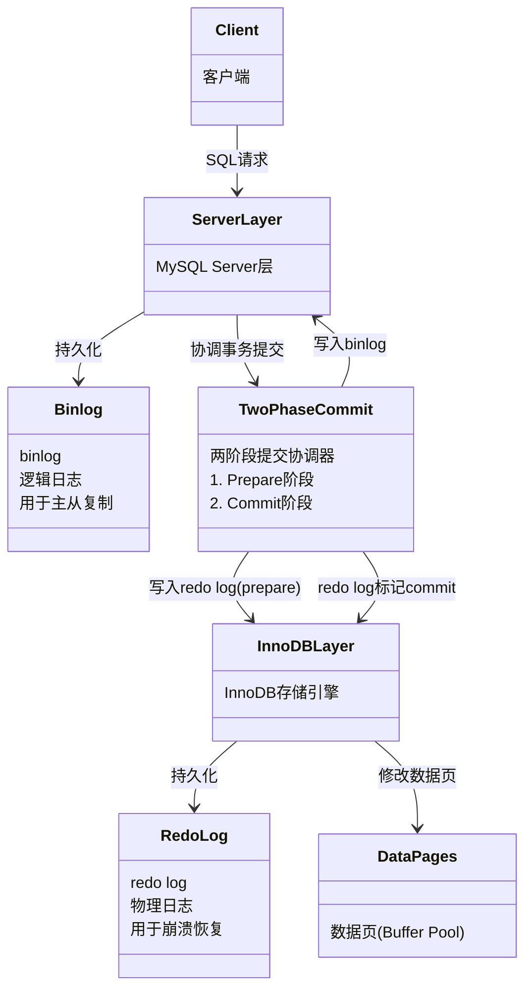
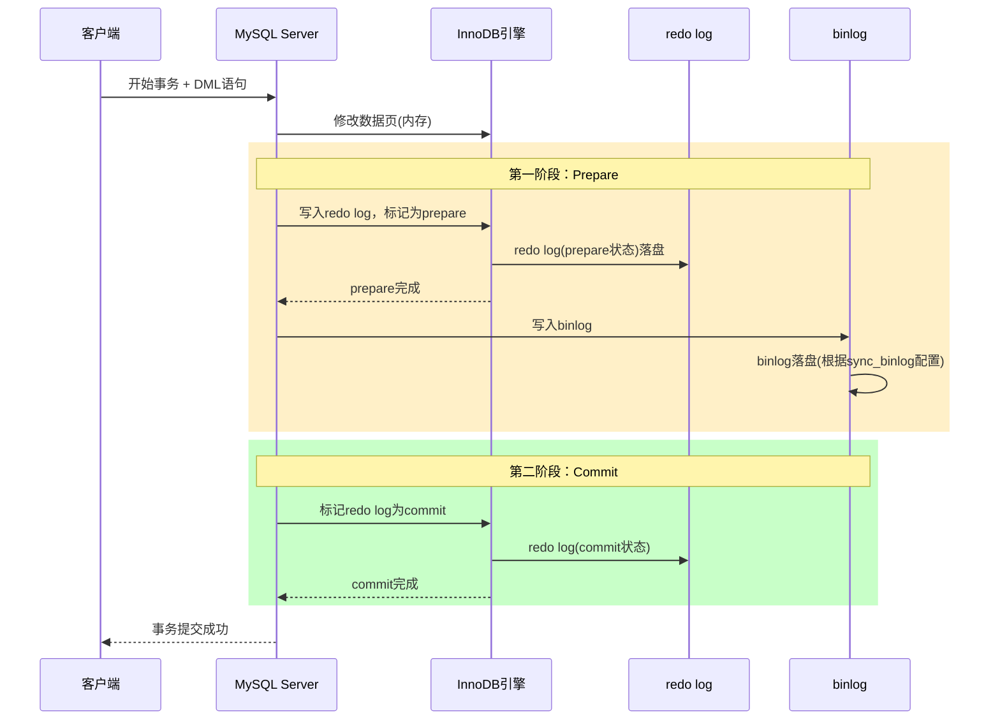
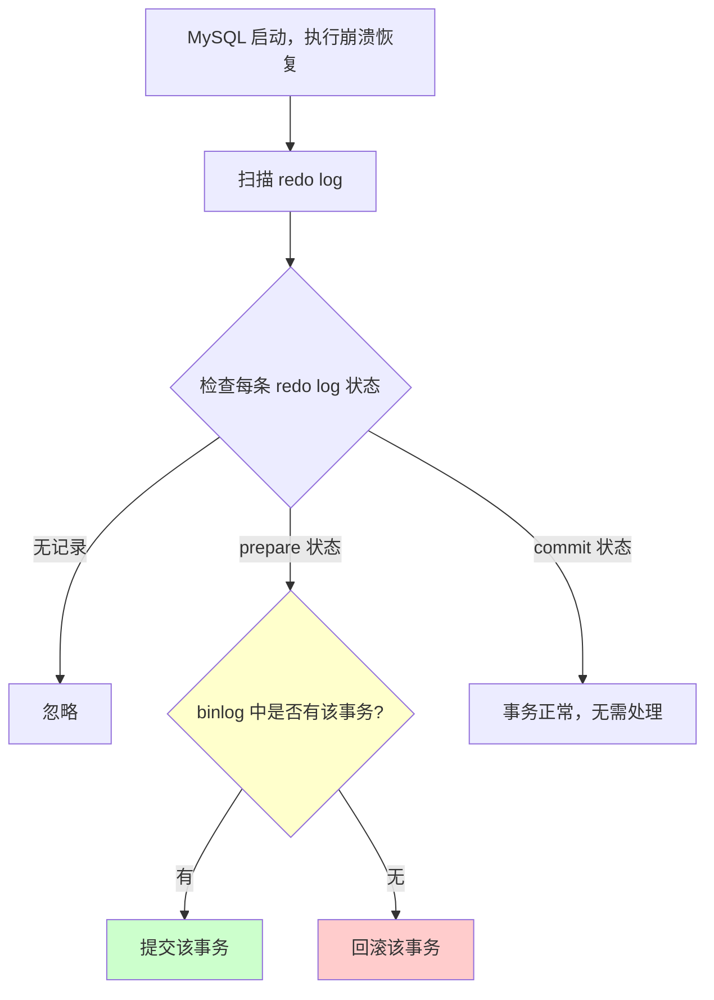

## 引言

> 为什么有了 redo log（崩溃恢复）还不够，MySQL 还需要 binlog（归档备份）？如果两者同时存在，宕机时如何保证数据一致？

这是一个经典的 MySQL 底层问题。某金融客户在一次机房断电后，发现主库和从库的数据不一致——差了整整 200 万条交易记录。根本原因就是在同时开启 redo log 和 binlog 的情况下，**没有使用两阶段提交**，导致崩溃恢复时数据丢失。

本文深入剖析 redo log 与 binlog 的两阶段提交机制，理解 MySQL 如何在两种日志之间保证**崩溃恢复的一致性**。读完你将掌握：

- 为什么单独的 redo log 或 binlog 都会导致数据不一致
- 两阶段提交（prepare → commit）的完整流程
- 崩溃恢复时 MySQL 如何根据日志状态判断事务的提交与否

---

## 一、问题的本质：两种日志的冲突

### 1.1 redo log 和 binlog 的区别

| 特性 | redo log | binlog |
|------|----------|--------|
| 所属层次 | InnoDB 存储引擎层 | MySQL Server 层 |
| 记录内容 | **物理日志**：记录"在哪个数据页做了什么修改" | **逻辑日志**：记录 SQL 语句或数据行变化 |
| 用途 | 崩溃恢复（crash-safe） | 主从复制、数据归档、时间点恢复 |
| 写入方式 | 循环写入，空间固定 | 追加写入，文件会增长 |

> **💡 核心提示**：redo log 是 InnoDB 特有的，保证事务的持久性（Durable）；binlog 是 MySQL Server 层的，用于主从复制和备份恢复。两者职责不同，缺一不可。

### 1.2 单一日志的局限性

**场景**：一个事务 T 修改了数据行 A 和 B。

| 写入顺序 | 正常情况 | 宕机发生在 | 后果 |
|----------|----------|-----------|------|
| 先写 redo log，再写 binlog | redo log 和 binlog 都有记录 | redo log 写入后、binlog 写入前 | 主库通过 redo log 恢复了数据，但从库没有这条记录 → **主从不一致** |
| 先写 binlog，再写 redo log | redo log 和 binlog 都有记录 | binlog 写入后、redo log 写入前 | 主库无法通过 redo log 恢复数据，但从库已经有这条记录 → **主从不一致** |

> **💡 核心提示**：无论先写哪个，在两个日志之间发生宕机，都会导致主库和从库（或备份）的数据不一致。这就是引入两阶段提交的**根本原因**。

### 1.3 架构关系



## 二、两阶段提交完整流程

### 2.1 什么是两阶段提交？

两阶段提交（Two-Phase Commit，2PC）将一个事务的提交过程分成两个阶段：

1. **Prepare 阶段**：写入 redo log 并标记为 `prepare` 状态，然后写入 binlog
2. **Commit 阶段**：将 redo log 标记为 `commit` 状态，并将 binlog 刷入磁盘

通过这种方式，无论数据库在哪个时刻宕机，都能根据 redo log 和 binlog 的状态判断事务是否应该提交。

### 2.2 详细流程



### 2.3 示例分析

假设执行一条 `INSERT` 语句：

```sql
INSERT INTO user (name) VALUES ('一灯');
```

两阶段提交步骤：

1. **Prepare 阶段**：
   - 将 `INSERT` 的修改写入 redo log，标记为 `prepare` 状态
   - 将 `INSERT` 语句写入 binlog
2. **Commit 阶段**：
   - 将 redo log 标记为 `commit` 状态
   - 如果 `sync_binlog=1`，将 binlog 刷入磁盘

> **💡 核心提示**：如果事务包含多条 DML 语句，每条语句都会写入 redo log（prepare 状态），但 binlog 是在事务 COMMIT 时才一次性写入的，这样保证了 binlog 中事务的原子性。

## 三、崩溃恢复机制

### 3.1 各种宕机场景分析

| 宕机时机 | redo log 状态 | binlog 状态 | 恢复策略 |
|----------|--------------|------------|---------|
| 写入 redo log (prepare) 前 | 无记录 | 无记录 | 事务未开始，无需处理 |
| 写入 redo log (prepare) 后，写入 binlog 前 | prepare | 无记录 | **回滚**该事务（binlog 不完整） |
| 写入 binlog 后，redo log (commit) 前 | prepare | 有记录 | **提交**该事务（binlog 已写入，从库可能已执行） |
| redo log (commit) 后 | commit | 有记录 | 事务正常，无需特殊处理 |

### 3.2 恢复流程图



> **💡 核心提示**：判断的核心逻辑——如果 redo log 是 prepare 状态，就去检查 binlog 中是否有对应事务。**有就提交，没有就回滚**。这保证了两份日志的最终一致性。

## 四、关键参数配置

### 4.1 sync_binlog

| 值 | 含义 | 性能 | 安全性 |
|----|------|------|--------|
| 0 | 不主动刷盘，依赖 OS 调度 | **最高** | 最低（宕机可能丢失） |
| 1 | 每次事务提交都刷盘 | **最低** | **最高**（推荐） |
| N | 每 N 次事务提交刷盘 | 中等 | 中等 |

### 4.2 innodb_flush_log_at_trx_commit

| 值 | 含义 | 性能 | 安全性 |
|----|------|------|--------|
| 0 | 每秒刷盘一次 | **最高** | 最低 |
| 1 | 每次事务提交都刷盘 | **最低** | **最高**（推荐） |
| 2 | 每次提交写入 OS 缓存，每秒刷盘 | 中等 | 中等 |

> **💡 核心提示**：要同时保证**最高安全性**（双 1 配置），需要将 `sync_binlog=1` 和 `innodb_flush_log_at_trx_commit=1` 同时设置。这是金融级生产环境的标准配置，虽然性能有约 10-20% 的损失，但能保证 RPO=0（零数据丢失）。

## 五、生产环境避坑指南

1. **双 1 配置是底线**：`sync_binlog=1` 和 `innodb_flush_log_at_trx_commit=1` 是保证数据不丢失的最低要求。如果追求性能最多只能将 `innodb_flush_log_at_trx_commit` 改为 2。
2. **大事务导致 redo log 写满**：单个事务修改数据量过大时，redo log 空间不足会强制刷盘，严重拖慢性能。建议将大事务拆分为多个小事务。
3. **binlog 格式选择**：推荐使用 `ROW` 格式（`binlog_format=ROW`），相比 `STATEMENT` 格式更精确，相比 `MIXED` 格式更可控，且是 GTID 复制的前提。
4. **binlog 过期清理策略**：务必设置 `binlog_expire_logs_seconds`（MySQL 8.0）或 `expire_logs_days`（MySQL 5.7），否则 binlog 会占满磁盘空间导致服务不可用。
5. **两阶段提交的性能损耗**：每次事务提交需要两次刷盘（redo log + binlog），这是无法避免的性能开销。如果需要优化，考虑批量操作减少事务数量，而不是降低刷盘频率。
6. **主从切换前检查 binlog 位置**：在主从切换时，必须确保从库已经同步了主库的所有 binlog，否则切换后会出现数据不一致。
7. **监控 redo log 使用率**：当 redo log 使用率超过 75% 时应触发告警，接近 100% 时会强制刷盘，导致性能断崖式下降。

## 六、总结

### 6.1 核心概念对比

| 概念 | redo log | binlog | 两阶段提交 |
|------|----------|--------|-----------|
| 作用 | 崩溃恢复 | 主从复制、备份 | 保证两者一致性 |
| 存储位置 | 固定大小循环文件 | 追加写入的增长文件 | 协调机制 |
| 所属层级 | InnoDB 引擎层 | MySQL Server 层 | 跨层协调 |
| 恢复方式 | 重做已提交事务 | 重放SQL或数据行 | 根据状态判断提交/回滚 |

### 6.2 行动清单

1. **确认双 1 配置**：检查 `sync_binlog=1` 和 `innodb_flush_log_at_trx_commit=1`，确保数据安全。
2. **设置 binlog 过期策略**：`SET GLOBAL binlog_expire_logs_seconds = 604800;`（7 天）。
3. **监控大事务**：定期检查 `information_schema.innodb_trx` 中事务的执行时间，超过 30 秒的事务需要优化。
4. **使用 ROW 格式的 binlog**：`SET GLOBAL binlog_format = 'ROW';`。
5. **压测两阶段提交的性能影响**：在生产上线前，对比双 1 配置和降低配置后的 QPS 差异，评估是否需要硬件升级。
6. **制定主从切换演练计划**：每季度进行一次主从切换演练，验证 binlog 同步完整性。
7. **崩溃恢复测试**：在测试环境模拟断电，验证 MySQL 能否正确恢复。
