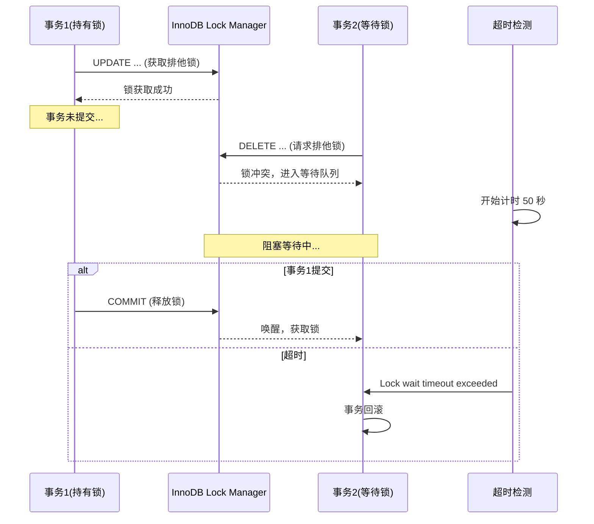
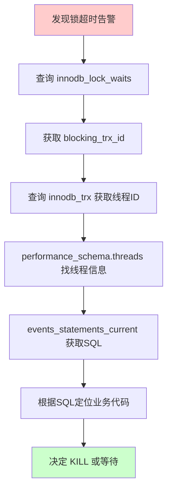

## 引言

> 线上订单突然无法取消，排查半小时才发现是 **MySQL 锁超时**。

这种问题在生产环境并不罕见——一个未提交的事务持有行锁，后续所有请求全部阻塞，直到 `innodb_lock_wait_timeout`（默认 50 秒）超时报错。更可怕的是，如果找不到持有锁的事务，你连 kill 都不知道该 kill 哪个。

本文带你完整走一遍 MySQL 锁超时的排查链路，从发现问题到定位代码，逐步掌握 InnoDB 锁竞争的诊断方法。读完你将掌握：

- 如何利用 `information_schema` 三张核心表定位锁等待关系
- 从锁等待 → 事务 → SQL → 线程 → 业务代码的完整排查路径
- MySQL 5.7 与 8.0 在锁排查工具上的关键差异

---

## 一、锁超时问题复现

### 1.1 场景模拟

创建一张用户表并插入测试数据：

```sql
CREATE TABLE `user` (
  `id` int(11) NOT NULL AUTO_INCREMENT COMMENT '主键ID',
  `name` varchar(50) NOT NULL DEFAULT '' COMMENT '姓名',
  PRIMARY KEY (`id`)
) ENGINE=InnoDB DEFAULT CHARSET=utf8mb4;
```

### 1.2 锁等待复现

**事务 1**：更新 `id=1` 的用户姓名，**不提交事务**：

```sql
BEGIN;
UPDATE user SET name='一灯' WHERE id=1;
```

**事务 2**：删除 `id=1` 的数据，此时产生锁等待：

```sql
BEGIN;
DELETE FROM user WHERE id=1;
-- 阻塞等待... 50 秒后报错 Lock wait timeout exceeded
```

> **💡 核心提示**：InnoDB 的行锁是通过索引实现的。如果 UPDATE/DELETE 语句没有走索引（全表扫描），会退化为**表锁**，影响范围更大。

### 1.3 锁等待的底层原理



## 二、锁等待排查三板斧

### 2.1 第一步：查锁等待关系

```sql
SELECT * FROM information_schema.innodb_lock_waits;
```

这张表展示了**谁在等谁**的核心关系。关键字段：

| 字段 | 含义 |
|------|------|
| `requesting_trx_id` | 等待锁的事务 ID |
| `blocking_trx_id` | 持有锁的事务 ID |
| `requested_lock_id` | 请求的锁 ID |
| `blocking_lock_id` | 阻塞的锁 ID |

### 2.2 第二步：查锁详情

```sql
SELECT * FROM information_schema.innodb_locks;
```

> **⚠️ 注意**：此表在 **MySQL 8.0 中已被移除**，改用 `performance_schema.data_locks`。

关键字段说明：

| 字段 | 含义 |
|------|------|
| `lock_trx_id` | 持有锁的事务 ID |
| `lock_mode` | 锁模式：X（排他锁）/ S（共享锁） |
| `lock_type` | 锁类型：RECORD（记录锁）/ TABLE（表锁） |
| `lock_table` | 被锁的表名 |
| `lock_index` | 锁使用的索引名 |
| `lock_data` | 锁定的具体数据（主键值） |

### 2.3 第三步：查活跃事务

```sql
SELECT * FROM information_schema.innodb_trx;
```

这张表展示所有**正在执行的事务**，关键字段：

| 字段 | 含义 |
|------|------|
| `trx_id` | 事务 ID |
| `trx_state` | 事务状态：`RUNNING` / `LOCK WAIT` |
| `trx_started` | 事务开始时间 |
| `trx_mysql_thread_id` | MySQL 线程 ID（用于 KILL） |
| `trx_query` | 当前正在执行的 SQL |

> **💡 核心提示**：找到 `trx_state = 'LOCK WAIT'` 的行，就知道谁在等锁。根据 `trx_mysql_thread_id` 可以直接 `KILL` 该线程。

## 三、从锁定位到业务代码

### 3.1 完整排查链路



### 3.2 具体操作步骤

**Step 1**：根据 `blocking_trx_id` 找到持有锁的事务，获取其 `trx_mysql_thread_id`（比如 193）。

**Step 2**：通过 MySQL 线程 ID 查找 Performance Schema 中的线程 ID：

```sql
SELECT * FROM performance_schema.threads WHERE processlist_id = 193;
```

得到 `THREAD_ID`（比如 218）。

**Step 3**：查找该线程正在执行的 SQL：

```sql
SELECT THREAD_ID, CURRENT_SCHEMA, SQL_TEXT 
FROM performance_schema.events_statements_current 
WHERE thread_id = 218;
```

**Step 4**：拿到 SQL 后，在业务代码中搜索对应语句，定位到具体的方法调用。

## 四、MySQL 8.0 的变化

> **💡 核心提示**：MySQL 8.0 对锁排查体系做了重大调整，`information_schema.innodb_locks` 和 `innodb_lock_waits` 已被废弃。

### 4.1 替代方案

| MySQL 5.7 | MySQL 8.0 |
|-----------|-----------|
| `information_schema.innodb_locks` | `performance_schema.data_locks` |
| `information_schema.innodb_lock_waits` | `performance_schema.data_lock_waits` |
| `information_schema.innodb_trx` | 仍然可用 |

### 4.2 MySQL 8.0 排查示例

```sql
-- 查询锁等待关系
SELECT * FROM performance_schema.data_lock_waits;

-- 查询所有数据锁
SELECT * FROM performance_schema.data_locks;
```

## 五、生产环境避坑指南

1. **大事务是锁等待的元凶**：事务越大、持有锁的时间越长，发生锁超时的概率越高。遵循**短事务原则**，尽快提交。
2. **避免长事务不提交**：开发环境调试时开启了事务但忘记 COMMIT/ROLLBACK，连上生产库后成为"隐形杀手"。建议设置 `SET SESSION innodb_lock_wait_timeout = 10;` 缩短超时时间。
3. **索引缺失导致锁升级**：如果 UPDATE/DELETE 语句没有使用索引，InnoDB 会扫描全表并加**表级锁**，严重影响并发。务必确保 WHERE 条件字段有索引。
4. **死锁和锁超时的区别**：死锁（Deadlock）是 InnoDB 自动检测并回滚其中一个事务；锁超时是等待超过 `innodb_lock_wait_timeout` 后报错。前者是 InnoDB 主动处理，后者是被动超时。
5. **gap lock（间隙锁）的隐藏陷阱**：在 RR（可重复读）隔离级别下，范围查询会加间隙锁。例如 `UPDATE user WHERE id > 5` 不仅锁住已有记录，还会锁住 `id > 5` 的间隙，导致新插入也被阻塞。
6. **外键约束会隐式加锁**：如果表之间存在外键关系，UPDATE/DELETE 父表记录时会自动检查子表并加锁，这是很多锁等待问题的隐蔽原因。
7. **监控告警必须配置**：建议监控 `information_schema.innodb_trx` 中事务数量和等待时间，超过阈值立即告警。

## 六、总结

### 6.1 关键排查命令速查

| 命令 | MySQL 5.7 | MySQL 8.0 | 用途 |
|------|-----------|-----------|------|
| 锁等待关系 | `innodb_lock_waits` | `data_lock_waits` | 谁在等谁 |
| 锁详情 | `innodb_locks` | `data_locks` | 锁的模式和范围 |
| 活跃事务 | `innodb_trx` | `innodb_trx` | 事务状态和线程ID |
| 线程信息 | `threads` | `threads` | 线程ID映射 |
| 正在执行的SQL | `events_statements_current` | `events_statements_current` | 获取SQL语句 |

### 6.2 行动清单

1. **设置合理的锁超时时间**：`SET GLOBAL innodb_lock_wait_timeout = 30;`（默认 50 秒，建议缩短到 10-30 秒）。
2. **开启慢查询日志**：记录执行时间长的 SQL，提前发现潜在的锁竞争问题。
3. **定期检查长事务**：编写定时任务，监控 `information_schema.innodb_trx` 中运行超过阈值的事务。
4. **代码层面控制事务粒度**：事务内只包含必要的数据库操作，避免在事务中做 HTTP 调用或耗时计算。
5. **排查时遵循标准链路**：`innodb_lock_waits` → `innodb_trx` → `threads` → `events_statements_current` → 业务代码。
6. **升级到 MySQL 8.0 的同学注意**：锁排查表已迁移到 `performance_schema`，需要更新排查脚本。
7. **建立锁告警机制**：当等待锁的连接数超过 5 个或等待时间超过 10 秒时，触发告警通知。
