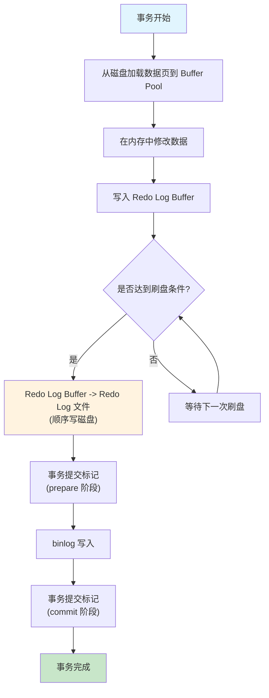
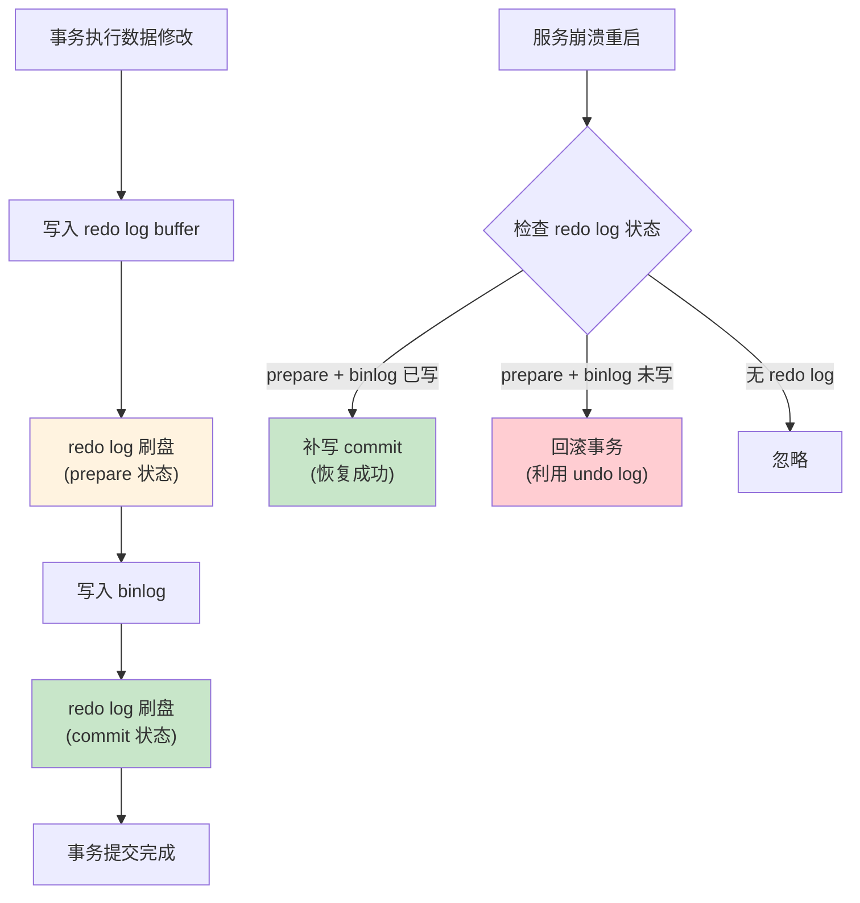

## 引言

MySQL 服务崩溃重启后，为什么已提交的数据没有丢失？未提交的事务又是如何被回滚的？答案藏在 InnoDB 的两套核心日志机制——redo log 和 undo log 中。

本文将深入剖析 MySQL 事务的四大特性（ACID）及其底层实现原理，包括：
- **redo log 两阶段提交**的持久化机制，保证数据崩溃后不丢失
- **undo log 版本链**的原子性保障，支持事务回滚和 MVCC
- **四种隔离级别**下并发事务问题的本质差异
- **WAL（Write-Ahead Logging）原则**在数据库中的核心地位

无论你是准备面试还是排查生产环境的崩溃恢复问题，理解这些机制都能帮你快速定位根因。

> **💡 核心提示**：事务的四大特性并非全部由数据库引擎实现——原子性由 undo log 保证，一致性依赖业务逻辑约束，隔离性由 MVCC 和锁共同实现，持久性则由 redo log 保障。理解这一点，才能准确定位不同特性对应的故障场景。

## 事务四大特性

事务有四大特性，分别是原子性（Atomicity）、一致性（Consistency）、隔离性（Isolation）、持久性（Durability），简称 ACID。

- **原子性**：事务中所有操作要么全部成功，要么全部失败。
- **一致性**：事务执行前后，数据始终处于一致性状态，不会出现数据丢失或中间状态。
- **隔离性**：事务提交前的中间状态对其他事务不可见，即相互隔离。
- **持久性**：事务提交后，数据的修改永久保存在数据库中，即使服务崩溃也不会丢失。

### 实现原理概览

| 特性 | 实现机制 | 核心日志 |
|------|---------|---------|
| 原子性 | undo log 回滚 | 逻辑日志（反向操作） |
| 一致性 | 业务逻辑约束 + 引擎保证 | 无专门日志 |
| 隔离性 | MVCC + 锁机制 | undo log（版本链） |
| 持久性 | redo log + WAL 原则 | 物理日志（页级别修改） |

## 持久性：Redo Log（重做日志）

Redo Log 记录的是**物理日志**，也就是磁盘数据页的具体修改内容。它用来保证服务崩溃后，仍能把事务中变更的数据持久化恢复到磁盘上。

### 没有 Redo Log 会怎样？

如果没有 Redo Log，修改数据的过程是这样的：

1. 从磁盘加载数据页到内存（Buffer Pool）
2. 在内存中修改数据
3. 把修改后的整页数据持久化到磁盘

这样做会有严重的性能问题：

1. InnoDB 在磁盘中存储的基本单元是页（默认 16KB），可能本次修改只变更一页中几个字节，但是需要刷新整页的数据，非常浪费资源。
2. 一个事务可能修改了多页中的数据，页之间又是不连续的，就会产生**随机 I/O**，性能更差。

### 引入 Redo Log 后的修改流程

为了解决上述性能问题，InnoDB 引入了 Redo Log，采用 **WAL（Write-Ahead Logging）** 原则：先写日志，再写数据。

引入 Redo Log 后的修改流程：

1. 从磁盘加载数据到内存（Buffer Pool）
2. 在内存中修改数据（产生 Dirty Page）
3. 把新数据写到 **Redo Log Buffer** 中（内存）
4. 把 **Redo Log Buffer** 中数据持久化到 **Redo Log 文件**中（顺序写磁盘）
5. **Redo Log 文件**中的数据在合适时机持久化到数据库磁盘（后台刷脏页）

> **💡 核心提示**：Redo Log 采用**顺序写**的方式，性能远高于随机写磁盘页。这是 MySQL 写入性能大幅提升的关键原因——用日志的追加写入替代了数据页的随机写入。



### Redo Log 两阶段提交（崩溃恢复的关键）

MySQL 使用 redo log 和 binlog 配合实现崩溃恢复，采用**两阶段提交**协议：



## 原子性：Undo Log（回滚日志）

Undo Log 记录的是**逻辑日志**，也就是反向操作的 SQL 语句。用来回滚事务时，恢复到修改前的数据。

比如：当我们执行一条 `INSERT` 语句时，Undo Log 就记录一条相反的 `DELETE` 语句。执行 `UPDATE` 时，记录反向的 `UPDATE`（将旧值恢复）。

加入 Undo Log 之后的修改流程：

1. 从磁盘加载数据到内存
2. 在内存中修改数据
3. 将**修改前的旧数据**写入 **Undo Log**
4. 将新数据写入 **Redo Log Buffer**
5. Redo Log 刷盘，事务提交

### Undo Log 版本链

Undo Log 不仅是回滚的关键，它还是 MVCC（多版本并发控制）的基础。每次修改数据时，旧版本数据会被写入 Undo Log，并通过指针形成一个**版本链**：


> **💡 核心提示**：Undo Log 版本链是**从新到旧**链接的。每次更新数据时，旧数据被写入 Undo Log，新记录的 `roll_pointer` 指向这个旧版本。读取历史版本时，顺着版本链向前查找，直到找到满足可见性规则的版本。

## MVCC（多版本并发控制）

记录的是某个时间点上的数据快照，用来实现不同事务之间数据的隔离性。

提到隔离性，一定要说一下事务的隔离级别。说事务隔离级别之前，必须要先说一下并发事务产生的问题：

### 并发事务的三大问题

| 问题 | 定义 | 示例 |
|------|------|------|
| **脏读** | 一个事务读到其他事务**未提交**的数据 | 事务 B 修改了数据但未提交，事务 A 读到了这个中间值 |
| **不可重复读** | 同一事务内，多次读取相同数据，结果不一致 | 事务 A 第一次读 age=1，第二次读 age=2（事务 B 已提交更新） |
| **幻读** | 同一事务内，相同查询条件，多次读取的结果不一致 | 事务 A 查询到 5 条记录，第二次查询到 6 条（事务 B 插入了新记录） |

> **💡 核心提示**：不可重复读和幻读的区别在于——**不可重复读是读到了其他事务执行 UPDATE、DELETE 后的数据，而幻读是读到其他事务执行 INSERT 后的数据**。前者是已有数据被修改，后者是新数据"凭空出现"。

### 事务的四种隔离级别

| 隔离级别 | 脏读 | 不可重复读 | 幻读 | 说明 |
|---------|------|-----------|------|------|
| **Read Uncommitted（读未提交）** | 会 | 会 | 会 | 最低隔离级别，几乎不使用 |
| **Read Committed（读已提交）** | 不会 | 会 | 会 | Oracle 默认级别 |
| **Repeatable Read（可重复读）** | 不会 | 不会 | 会（部分解决） | MySQL 默认级别 |
| **Serializable（串行化）** | 不会 | 不会 | 不会 | 最高隔离级别，性能最差 |

### MVCC 的工作原理

MVCC 解决了读写冲突，实现了并发读写，提升了事务的性能。

由于 **Read Uncommitted** 隔离级别下，每次都读取最新的数据；而 **Serializable** 隔离级别下，对所有读取数据都加锁。这两种隔离级别不需要 MVCC，所以 MVCC 只在 **Read Committed** 和 **Repeatable Read** 两种隔离级别下起作用。

MVCC 的实现方式通过两个隐藏字段 `trx_id`（最近一次提交事务的 ID）和 `roll_pointer`（上个版本的地址），建立一个版本链。并在事务中读取的时候生成一个 **ReadView（读视图）**：

- **Read Committed**：每次读取都生成一个新的读视图
- **Repeatable Read**：只在第一次读取时生成读视图，后续复用

## 生产环境避坑指南

### 1. 崩溃恢复：为什么已提交的数据不会丢失？

**场景**：MySQL 服务突然宕机，重启后数据是否完整？

**原理**：MySQL 使用 redo log + WAL 原则保证持久性。修改数据时，先写 redo log（顺序写，速度快），再异步刷脏页到数据文件。崩溃恢复时，InnoDB 会重放 redo log 中已提交的日志，恢复未刷盘的数据。

**排查命令**：
```sql
SHOW VARIABLES LIKE 'innodb_flush_log_at_trx_commit';
```
- 值为 `1`：每次事务提交都刷盘，最安全但性能最差
- 值为 `0`：每秒刷盘一次，可能丢失 1 秒数据
- 值为 `2`：每次提交写 OS buffer，每秒刷盘

> **💡 核心提示**：生产环境建议设置为 `1`，宁可牺牲一点性能也不能丢数据。如果性能敏感且可接受 1 秒数据丢失，可设为 `2`。

### 2. 两阶段提交不一致导致的数据损坏

**场景**：redo log 已 prepare 但 binlog 未写，崩溃后数据状态是什么？

**原理**：崩溃恢复时，MySQL 会检查 redo log 的状态：
- redo log 为 prepare 且 binlog 完整 -> 提交事务
- redo log 为 prepare 但 binlog 不完整 -> 回滚事务

**排查方法**：使用 `SHOW ENGINE INNODB STATUS` 查看崩溃恢复过程。

### 3. Undo Log 膨胀导致性能下降

**场景**：长事务未提交，导致 undo log 无法清理，磁盘空间持续增长。

**影响**：
- undo log 表空间（`ibdata1`）持续膨胀
- 版本链过长，快照读性能急剧下降
- 可能触发 `Out of Memory`

**排查命令**：
```sql
SELECT * FROM information_schema.innodb_trx 
WHERE TIME_TO_SEC(TIMEDIFF(NOW(), trx_started)) > 60;
```

### 4. Redo Log 写满导致数据库挂起

**场景**：`innodb_log_file_size` 设置过小，高并发写入时 redo log 写满，数据库无法继续处理写请求。

**影响**：所有写操作被阻塞，直到后台刷脏页释放出 redo log 空间。

**建议配置**：
```sql
SET GLOBAL innodb_log_file_size = 2G;  -- 根据业务调整
SET GLOBAL innodb_log_files_in_group = 3;  -- redo log 组数
```

### 5. 隔离级别设置不当引发业务问题

**场景**：RC 级别下，同一个事务内多次查询结果不一致，导致业务逻辑判断错误。

**建议**：MySQL 默认使用 RR 级别，大多数业务场景不需要修改。如果需要 RC 级别（如需要看到其他事务最新提交的数据），需确保业务代码能处理不可重复读的情况。

### 6. 大事务导致 undo log 回滚缓慢

**场景**：一个事务修改了 1000 万条数据，执行到一半回滚，回滚时间可能比执行时间还长。

**影响**：回滚期间，被修改的数据行无法被其他事务访问，锁等待时间急剧增加。

**建议**：避免大事务，分批提交。单次事务修改数据量控制在万级以内。

## 总结与行动清单

### 核心日志对比表

| 对比维度 | Redo Log | Undo Log | Binlog |
|---------|----------|----------|--------|
| 日志类型 | 物理日志（页级别修改） | 逻辑日志（反向 SQL） | 逻辑日志（SQL/Row） |
| 存储位置 | InnoDB 引擎层 | InnoDB 引擎层 | MySQL Server 层 |
| 主要作用 | 崩溃恢复、持久性保证 | 事务回滚、MVCC 版本链 | 主从复制、数据恢复 |
| 写入时机 | 事务执行过程中 | 数据修改前 | 事务提交时 |
| 刷盘策略 | 可配置（flush_log_at_trx_commit） | 随事务提交 | 可配置（sync_binlog） |
| 文件格式 | 循环使用（固定大小） | 可回滚清理 | 追加写入（可归档） |

### 行动清单

1. **检查崩溃恢复参数**：确认 `innodb_flush_log_at_trx_commit=1`，保证数据安全性。
2. **监控长事务**：定期检查 `information_schema.innodb_trx`，设置超时自动回滚。
3. **合理配置 redo log 大小**：`innodb_log_file_size` 建议 1-2G，根据写入量调整。
4. **避免大事务**：单次事务修改数据量控制在万级以内，分批提交。
5. **监控 undo log 使用量**：关注 `ibdata1` 文件大小增长，及时处理长事务。
6. **保持默认隔离级别**：RR 级别在大多数场景下是正确的选择，除非有明确理由才改为 RC。
7. **开启 binlog 与 redo log 一致性检查**：定期检查两阶段提交状态，防止数据不一致。
