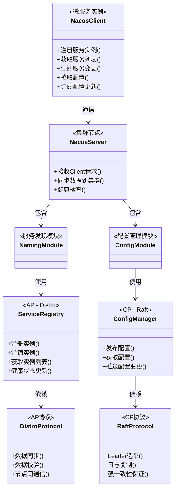
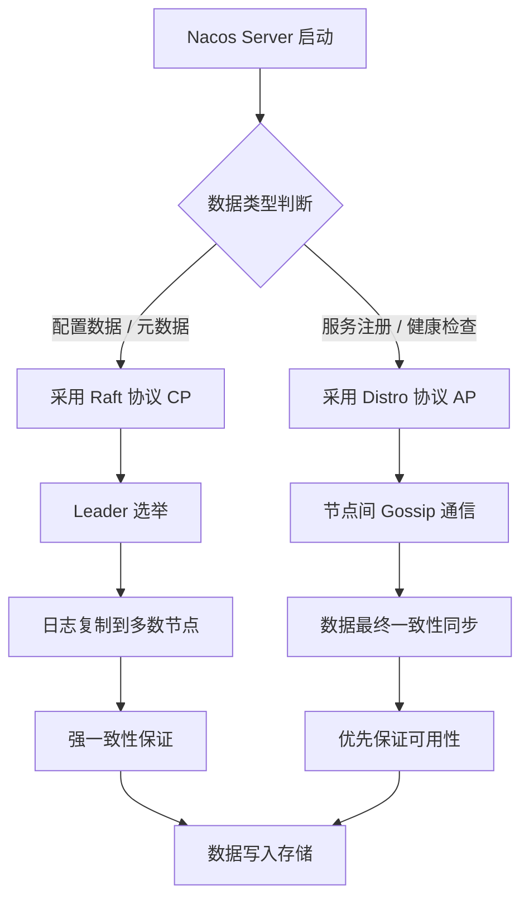
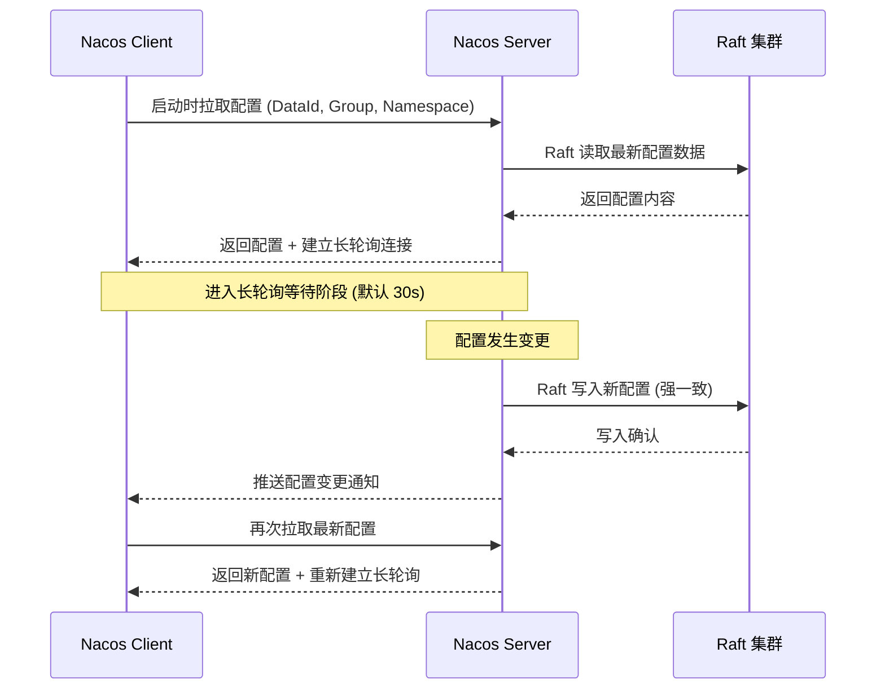

## 引言

你以为微服务架构只需要一个 Eureka 就够了？当配置变更、环境隔离、多租户这些需求接踵而至时，你很快会发现自己在维护 Eureka + Spring Cloud Config + Apollo 的组合泥潭中疲于奔命。Nacos 的出现并非偶然——它是阿里巴巴在双十一等极限场景下打磨出的统一方案，将服务发现与配置管理收归一处。

读完本文，你将掌握：

1. **一致性协议分离设计**——Nacos 为何对配置数据用 Raft（CP），对服务注册用 Distro（AP），以及这个设计如何同时满足"强一致"和"高可用"这两个看似矛盾的目标。
2. **服务发现与配置管理的完整流程**——从 Client 注册到配置动态推送的每一步底层机制。
3. **主流选型对比**——Nacos vs Eureka vs Consul vs Zookeeper 的核心差异，帮助你在下次技术评审中给出有说服力的选型依据。

无论是正在做云原生技术选型，还是准备应对国内大厂分布式面试，Nacos 的架构细节都是绕不开的硬知识点。

## 深度解析 Apache Nacos 架构设计：统一服务发现与配置管理平台

### Nacos 是什么？定位与核心理念

Nacos 是一个**易于使用、功能丰富、性能卓越的平台**，专注于构建云原生应用。

* **定位：** 它是一个集**动态服务发现**、**配置管理**和**服务管理**于一体的**统一控制平台**。
* **核心理念：** 提供一套简化的云原生基础设施，让开发者能够更专注于业务逻辑，而将服务发现和配置管理等通用能力交给 Nacos 处理。

### 为什么选择 Nacos？优势分析

* **统一平台：** 将服务发现和配置管理集成到一个系统中，简化部署和运维。
* **云原生友好：** 设计上考虑了容器化和云环境的特点，易于在 Kubernetes 等平台上部署。
* **易用性：** 提供了友好的 Web 管理界面，配置和管理相对简单。
* **高性能和可靠性：** 针对高并发场景优化，支持多种集群部署模式和一致性协议，保证服务的可用性和数据的一致性。
* **丰富的功能：** 除了服务发现和配置管理，还提供健康检查、流量权重调整、路由等服务管理能力。
* **开源且社区活跃：** 由阿里巴巴开源，拥有活跃的国内社区支持。

> **💡 核心提示**：Nacos 的核心差异化优势不是"功能多"，而是**一致性协议分离**——同一套 Server 集群根据数据类型采用不同一致性协议，这在同类产品中极为少见。

### Nacos 架构设计与核心组件

Nacos 的架构巧妙地融合了服务发现和配置管理，并根据数据的不同特性采用了不同的**一致性协议**。

#### Nacos 架构类图



#### 核心角色与数据模型

1. **角色：**
    * **Nacos Client：** 集成在微服务应用中，负责向 Nacos Server 注册服务实例、从 Server 获取服务列表、订阅服务列表变化、从 Server 拉取配置、订阅配置更新等。
    * **Nacos Server：** Nacos 服务端，构成一个**集群**。接收 Client 请求，存储和管理服务元数据和配置信息。它是**统一的服务器角色**，不区分 NameServer 或 Broker。

2. **整体架构：**
    * 多个 Nacos Server 节点构成**集群**。集群内的 Server 之间相互通信，同步数据。
    * Producer 和 Consumer 微服务都作为 Nacos Client，与 Nacos Server 集群通信。

3. **数据模型：**
    * Nacos 管理的数据围绕服务和配置展开：
        * **服务 (Service)：** 一组提供相同功能的实例的逻辑集合。
        * **实例 (Instance)：** 服务的一个运行实例（如 IP:Port）。包含健康状态、权重等元数据。
        * **分组 (Group)：** 服务可以被组织到不同的分组下，用于更好的管理。
        * **命名空间 (Namespace)：** 提供多租户或多环境隔离能力。不同 Namespace 下的服务和配置数据相互隔离。常用于隔离开发、测试、生产环境。
        * **配置 (Configuration)：** 以 DataId 和 Group 作为唯一标识的配置内容。
        * **DataId：** 配置的唯一标识符（如 `application.properties`）。

#### 一致性协议分离 - 关键特性

Nacos 并没有为所有数据采用同一种一致性协议，而是根据数据的特性和对一致性的要求进行了**协议分离**。这是其架构上的一个重要特点：

* **配置管理与元数据 (CP - Consistency Preferred)：** 对于配置数据和核心元数据，Nacos 采用基于 **Raft 协议** 的一致性算法。Raft 协议保证了在集群中，即使部分节点宕机，数据也能保持强一致性。但当网络分区发生时，为了保证一致性，可能会牺牲可用性。
* **服务注册与健康检查 (AP - Availability Preferred)：** 对于服务注册（实例列表）和健康检查信息，Nacos 采用了自研的 **Distro 协议**（一个改造过的、轻量级的、基于 Gossip 协议的注册中心一致性协议）。Distro 协议强调数据的最终一致性，但优先保证**可用性**。即使在网络分区发生时，只要有 Nacos Server 节点存活，服务实例就可以向其注册或获取服务列表（可能不是最新的完整列表），保证了服务发现的可用性。

> **💡 核心提示**：为什么 Nacos 要将一致性协议分离？因为**配置数据**一旦出错可能导致全量服务异常（强一致优先，选 Raft/CP）；而**服务注册信息**更新频繁、网络波动常见，服务发现的核心诉求是在极端情况下也能尽力发现服务（可用性优先，选 Distro/AP）。



### 服务发现机制

1. **Client 注册：** 微服务 Client 启动时，向 Nacos Server 发送注册请求，将自身实例信息发送给 Server。Server 接收信息，并将其同步给集群中的其他 Server（通过 Distro 协议）。
2. **Client 发现：** 微服务 Client 向 Nacos Server 发送请求，根据服务名查询服务实例列表。Client 会在本地缓存服务列表，并定期或通过**订阅 (Push)** 的方式获取服务列表的增量更新，减少对 Server 的直接查询压力。
3. **健康检查：** Nacos Server 会定期对注册的服务实例进行健康检查（支持 TCP、HTTP、心跳等多种方式），不健康的实例会被标记或剔除，不参与服务发现。

### 配置管理机制

1. **Client 拉取：** 微服务 Client 启动时，根据配置（DataId、Group、Namespace）向 Nacos Server 发送请求拉取配置内容。
2. **Server 推送 (长轮询)：** Client 在拉取配置后，会与 Server 建立一个长连接。当配置在 Server 端发生变化时，Server 会通过这个长连接将变更推送给客户端，客户端收到推送后再次拉取最新配置。这保证了配置的动态更新能力。
3. **命名空间与分组隔离：** Nacos 根据 Namespace 和 Group 对配置进行隔离，不同的环境或应用使用不同的 Namespace 和 Group。

#### 配置推送流程时序图



### Nacos 内置服务治理能力

Nacos 除了服务发现和配置管理，还提供了一些基础的服务治理能力：

* **流量管理：** 支持服务实例的权重调整、元数据管理、基于元数据的流量路由等。
* **服务健康状态管理：** 提供多种健康检查方式，并根据健康状态调整流量分配。

### Spring Cloud 集成 Nacos 的使用方式

Spring Cloud Alibaba 项目提供了对 Nacos 的便捷集成。

1. **添加依赖：** 在 Spring Boot 项目中，添加 Nacos Discovery 和 Nacos Config Starter。

```xml
<dependency>
    <groupId>com.alibaba.cloud</groupId>
    <artifactId>spring-cloud-starter-alibaba-nacos-discovery</artifactId>
</dependency>
<dependency>
    <groupId>com.alibaba.cloud</groupId>
    <artifactId>spring-cloud-starter-alibaba-nacos-config</artifactId>
</dependency>
```

> **💡 核心提示**：Spring Cloud Alibaba 各组件的版本与 Spring Cloud 和 Spring Boot 版本存在严格对应关系，升级前务必查阅官方版本兼容矩阵，避免因版本不匹配导致启动失败。

2. **配置 Server 地址：** 在 `application.yml` 中配置 Nacos Server 地址。

```yaml
# application.yml
spring:
  cloud:
    nacos:
      discovery:
        server-addr: localhost:8848
        # namespace: your-namespace-id
        # group: your-group-name
      config:
        server-addr: ${spring.cloud.nacos.discovery.server-addr}
        file-extension: yml
        # namespace: your-namespace-id
        # group: DEFAULT_GROUP
        # ext-config[0]:
        #   data-id: another-config.yml
        #   group: ANOTHER_GROUP
        #   refresh: true
```

3. **启用 Service Discovery：** 在 Spring Boot 启动类上添加 `@EnableDiscoveryClient`。

```java
@SpringBootApplication
@EnableDiscoveryClient
public class MyNacosApp {
    public static void main(String[] args) {
        SpringApplication.run(MyNacosApp.class, args);
    }
}
```

4. **使用 Service Discovery：**
    * **通过服务名称调用 (结合 LoadBalancer/Feign)：** 引入 LoadBalancer 或 OpenFeign Starter，配置 `lb://service-name` 或 `@FeignClient(name="service-name")`。
    * **注入 `DiscoveryClient`：** 注入 Spring Cloud 的 `DiscoveryClient` 接口，通过服务名称获取服务实例列表。

5. **使用 Configuration Management：**
    * **动态刷新配置：** 在需要动态刷新的 Bean 上添加 `@RefreshScope` 注解。
    * **注入配置属性：** 使用 `@Value` 或 `@ConfigurationProperties` 注解注入 Nacos 配置中心的属性。

### Nacos vs Eureka/Consul/Zookeeper/Spring Cloud Config 对比分析

Nacos 的独特之处在于其**统一平台**和**一致性协议分离**的设计。

| 特性 | Nacos (统一平台) | Eureka (仅发现) | Consul (发现+K/V) | Zookeeper (协调服务) | Spring Cloud Config (仅配置) |
| :--- | :--- | :--- | :--- | :--- | :--- |
| **功能范围** | 服务发现 + 配置管理 + 服务管理 | 仅服务发现 | 服务发现 + K/V 存储 | 分布式协调 + K/V 存储 | 仅配置管理 |
| **一致性协议** | Raft (配置 CP) + Distro (服务 AP) | Peer-to-Peer (AP) | Raft (CP) | ZAB (CP) | 无内置协议 |
| **架构** | Server 集群，统一角色，协议分离 | Peer-to-Peer 集群 | Raft 集群 | Leader/Follower 集群 | Server & Client 分离 |
| **配置机制** | 长轮询推送，Raft 强一致 | 不提供 | K/V HTTP API | K/V Watcher | Git/FS 拉取 |
| **管理界面** | 功能完善，UI 友好 | 基础 | 功能较全 | 需第三方工具 | 需第三方工具 |
| **国内生态** | 活跃，应用广泛 | 维护中 | 较少 | 广泛应用 | 广泛应用 |
| **云原生** | 原生设计 | 传统 | 支持 | 传统 | 客户端库 |

### 理解 Nacos 架构与使用方式的价值

* **掌握云原生基础设施：** 了解统一服务发现和配置管理平台的设计思想。
* **理解一致性选型：** 学习 Nacos 如何根据数据特性进行一致性协议的权衡和选择（Raft vs Distro, CP vs AP）。
* **对比分析能力：** 能够清晰地对比 Nacos 与其他基础设施组件的优缺点，做出合理的选型决策。
* **高效开发与运维：** 掌握 Nacos 在 Spring Cloud 中的使用方式，简化应用开发和配置管理。
* **应对面试：** Nacos 是国内云原生和分布式领域的热点，其架构特别是协议分离是高频考点。

### Nacos 为何是面试热点

* **云原生代表：** 体现了对现代应用架构的理解。
* **统一平台：** 解决了分开管理的痛点，是其核心亮点。
* **一致性协议分离：** Raft 和 Distro 的组合以及背后的原因，是考察技术深度和分布式原理理解的绝佳问题。
* **国内应用广泛：** 许多国内公司在使用 Nacos。
* **与 ZooKeeper/Eureka/Consul/Config 对比：** 这是最常见的面试问题，考察候选人对不同基础设施组件的认知广度和深度。

### 面试问题示例与深度解析

* **什么是 Nacos？它解决了微服务架构中的哪些问题？核心理念是什么？**（定义为统一平台，解决服务发现和配置管理分离的痛点，核心理念是构建云原生应用的统一基础设施。）
* **请描述一下 Nacos 的架构。它包含哪些核心组件或角色？**（核心！Server 集群（统一角色），Client。简述 Server 之间的协作。）
* **Nacos 最显著的架构特点是什么？请详细解释 Raft 和 Distro 这两种一致性协议在 Nacos 中分别用于什么数据？为什么这样设计？**（**核心！** 必考题。特点：一致性协议分离。Raft 用于配置和元数据（CP），Distro 用于服务注册（AP）。原因：根据数据对一致性/可用性的不同要求进行权衡。）
* **请描述一下 Nacos 的服务注册与发现机制。它是基于推还是拉的？**（Client 注册到 Server（Distro），Client 从 Server 拉取服务列表并订阅更新（长轮询），结合客户端缓存。以拉模式为主，支持服务器推送。）
* **请描述一下 Nacos 的配置管理机制。客户端如何获取配置？如何实现动态更新？**（Client 启动时拉取配置，建立长连接，配置变化时 Server 推送通知，Client 再拉取最新配置。动态更新通过长轮询实现。）
* **Nacos 中的 Namespace 和 Group 有什么作用？**（Namespace：多租户/多环境隔离；Group：配置/服务分组管理。）
* **请对比一下 Nacos 和 Eureka 在服务发现方面的异同。**
* **请对比一下 Nacos 和 Consul。**
* **请对比一下 Nacos 和 Zookeeper。**
* **请对比一下 Nacos 配置管理和 Spring Cloud Config。**
* **你了解 Nacos 提供的哪些服务治理能力？**（权重调整、元数据管理、流量路由、健康检查。）

### 生产环境避坑指南

1. **Namespace 误用：** 开发/测试/生产环境务必使用不同的 Namespace 隔离，而非依赖 Group。Group 适用于同一环境内不同应用或模块的分组，Namespace 才是环境隔离的正确方式。
2. **长轮询超时设置：** Nacos Client 默认长轮询超时时间为 30 秒。在网络抖动或 Server 负载高时可能超时，建议适当调大 `configLongPollTimeout` 参数。
3. **配置刷新范围遗漏：** 只有标注了 `@RefreshScope` 的 Bean 才会响应配置变更。忘记加注解是配置不刷新的最常见原因。
4. **Distro 协议数据同步延迟：** 服务注册信息采用 AP 协议，节点间数据同步存在短暂延迟。在刚注册后立即调用的场景下，可能出现"找不到服务"的问题，需做好重试机制。
5. **Nacos Server 集群规模：** 生产环境建议至少 3 个 Server 节点（Raft 协议需要多数派选举）。单节点仅用于开发测试。
6. **内存泄漏风险：** 在 Spring Cloud Alibaba 早期版本中，`@RefreshScope` 频繁触发 Bean 重建可能导致 Metaspace 泄漏，建议升级至最新稳定版本。
7. **MySQL 数据源配置：** Nacos 生产环境推荐使用 MySQL 作为外部存储，确保在 Server 重启时配置数据不丢失。务必开启 MySQL 的主从同步或高可用方案。

### 总结

Apache Nacos 是一个为云原生应用设计的统一平台，成功地将服务发现和配置管理两大核心基础设施集成到一起。其独特的**一致性协议分离设计**（Raft for Config/Metadata, Distro for Service Registration）是其架构上的亮点，根据数据特性提供了差异化的可用性和一致性保证。

理解 Nacos 的统一平台理念、架构设计、核心机制（协议分离、服务发现、配置管理流程）以及其与 Eureka、Consul、Zookeeper、Spring Cloud Config 等其他组件的对比，是掌握云原生基础设施、进行技术选型并应对面试的关键。

### 行动清单

1. **检查点**：确认生产环境 Nacos Server 以集群模式部署（至少 3 节点），并使用 MySQL 作为外部存储。
2. **隔离策略**：使用 Namespace 区分 dev/test/prod 环境，使用 Group 区分同一环境内的不同业务模块。
3. **版本兼容**：升级 Spring Cloud Alibaba 前，先查阅官方版本兼容性表格，确保 Spring Boot、Spring Cloud、Nacos 三者版本匹配。
4. **配置安全**：对包含敏感信息（如数据库密码）的配置项，在 Nacos 控制台中设置访问权限，避免配置泄露。
5. **扩展阅读**：推荐阅读 Nacos 官方文档中的"架构设计"章节和 Distro 协议源码分析，深入理解 AP 协议的具体实现。
