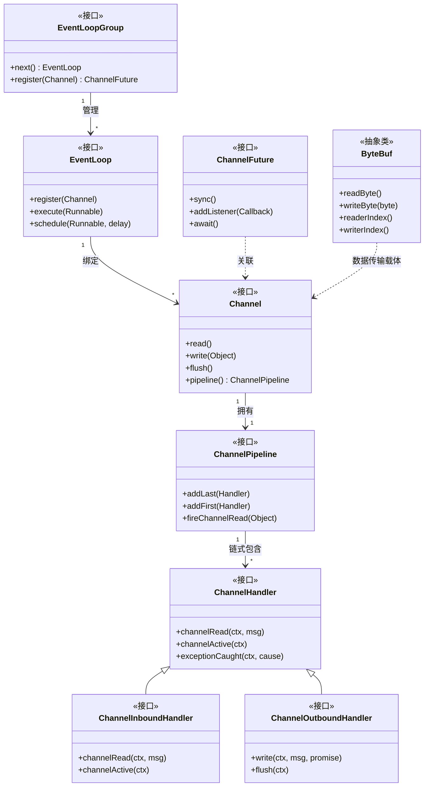
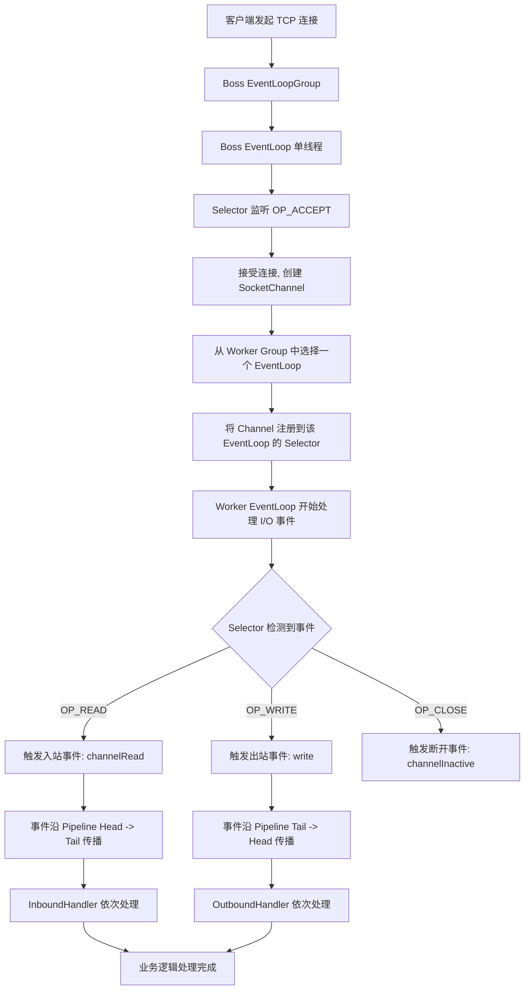
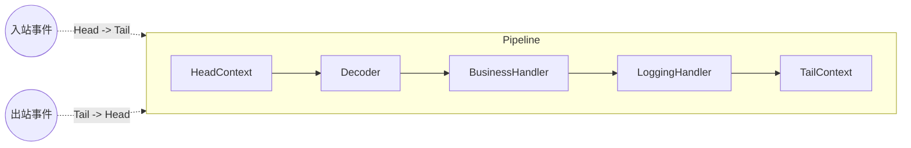

## 引言

你的线上服务在凌晨三点突然 CPU 飙到 200%，排查半天发现是 Netty EventLoop 线程里执行了一段同步数据库查询——一个看似无害的 `channelRead` 方法，直接把整个 Reactor 线程堵死，所有连接超时雪崩。这就是高性能网络编程中最隐蔽也最致命的陷阱。

Netty 是 Apache Dubbo、gRPC、RocketMQ、Elasticsearch、Spring Cloud Gateway 等主流框架的底层网络引擎。理解它的架构，意味着你能：

1. **看透 EventLoop 单线程模型**——为什么一个线程能处理上万连接，以及为什么一行阻塞代码就能毁掉一切。
2. **掌握 Pipeline 事件传播机制**——入站从 Head 到 Tail，出站从 Tail 到 Head，编解码器放在什么位置直接影响性能。
3. **理解 ByteBuf 零拷贝与池化设计**——比 Java 原生 ByteBuffer 强在哪里，为什么这是 Netty 高性能的核心。

无论是排查线上网络问题，还是面试中被问到 Reactor 模式和 NIO 底层原理，Netty 都是检验 Java 工程师技术深度的试金石。

## 深度解析 Netty 架构设计：构建高性能异步网络应用

### Netty 核心组件详解

Netty 的架构围绕着几个核心组件构建：Channel、EventLoop、EventLoopGroup、ChannelHandler、ChannelPipeline 和 ByteBuf。

#### Netty 核心组件类图



1. **Channel (通道)：**
    * **定义：** 代表一个网络连接或者一个通信的端点（如一个 TCP Socket 连接）。它是进行 I/O 操作的载体。
    * **作用：** 提供了进行 I/O 操作（如读、写、连接、绑定）的 API。Channel 是全双工的，可以同时进行读写。
    * **状态：** Channel 有生命周期状态，如连接中 (connecting)、已连接 (connected)、关闭中 (disconnecting)、已关闭 (disconnected) 等。

2. **EventLoop (事件循环) & EventLoopGroup (事件循环组)：**
    * **定义：**
        * **EventLoop：** Netty 的核心线程，一个 EventLoop 绑定一个线程。它负责处理分配给它的 Channel 的所有 I/O 事件（连接建立、数据读取、数据写入完成等）以及普通任务的执行。它基于 **Reactor 模式** 的单线程事件循环，通过多路复用器 (`Selector`) 监听多个 Channel 的事件。
        * **EventLoopGroup：** 包含一个或多个 EventLoop 的组。负责管理 EventLoop，并将 Channel 分配给其中一个 EventLoop。
    * **与线程关系：** 一个 EventLoop 对应一个独立的线程。所有属于同一个 EventLoop 的 Channel 的 I/O 操作都在这个线程中执行，避免了多线程竞争，简化了并发处理。
    * **EventLoopGroup 的作用 (Boss/Worker)：** 通常在服务器端，`EventLoopGroup` 会被分成两组：
        * **Boss EventLoopGroup：** 负责处理客户端的连接请求。当客户端连接成功后，Boss EventLoop 会将新建立的 Channel 注册到 **Worker EventLoopGroup** 中的一个 EventLoop 上。
        * **Worker EventLoopGroup：** 负责处理 Boss Group 分发下来的 Channel 的 I/O 读写事件和业务逻辑。
    * **Reactor 模式的体现：** Netty 的 Boss/Worker EventLoopGroup 就是经典的 **多 Reactor 主从模式** 的实现。Boss 是主 Reactor，负责连接 Accept；Worker 是从 Reactor，负责读写事件处理。

> **💡 核心提示**：一个 EventLoop 在其生命周期内只绑定一个线程。这意味着所有在同一个 EventLoop 上的 Channel 的 I/O 操作都是**无锁的**——这是 Netty 高性能的核心秘密之一。

3. **ChannelHandler (通道处理器) & ChannelPipeline (通道流水线)：**
    * **定义：**
        * **ChannelHandler：** 这是实现应用程序业务逻辑的核心组件。它是一个接口，定义了处理各种 I/O 事件和拦截 I/O 操作的方法（如 `channelRead()`, `write()`, `connect()` 等）。
        * **ChannelPipeline：** 是 ChannelHandler 的有序链表。每个 Channel 都有一个与之关联的 ChannelPipeline。ChannelHandler 注册到 ChannelPipeline 中，事件会在 Pipeline 中流动，并由 Pipeline 中的 Handler 按顺序处理。
    * **事件在 Pipeline 中的传播方向：**
        * **入站事件 (Inbound Events)：** 从 Pipeline 的头部 (Head) 向尾部 (Tail) 传播，依次由 `ChannelInboundHandler` 处理。
        * **出站事件 (Outbound Events)：** 从 Pipeline 的尾部向头部传播，依次由 `ChannelOutboundHandler` 处理。

4. **Buffer (`ByteBuf`)：**
    * **定义：** Netty 提供的高性能字节缓冲区。它是 Netty 处理数据 I/O 的核心载体。
    * **优势 (与 Java ByteBuffer 对比)：**
        * **更直观的读写指针：** `ByteBuf` 维护独立的 `readerIndex` 和 `writerIndex`，读写操作互不影响，避免了 `ByteBuffer` 的 `flip()`, `rewind()` 等复杂操作。
        * **更好的性能：** 支持**零拷贝 (Zero-copy)** 特性，减少 CPU 在用户空间和内核空间之间复制数据。
        * **缓冲区池化：** 支持缓冲区复用，减少内存分配和垃圾回收的开销。
        * **动态扩容：** 容量可以按需扩展。

5. **Future & Promise：**
    * Netty 利用 `ChannelFuture` 和 `ChannelPromise` 来处理异步操作的结果。
    * **`ChannelFuture`：** 代表一个异步 I/O 操作的结果。你可以在 `Future` 上注册监听器，当操作完成时（成功、失败或取消）会被通知。
    * **`ChannelPromise`：** `ChannelFuture` 的子接口，可以在外部设置异步操作的结果。

### Netty 架构设计与线程模型

将上述组件组合起来，Netty 构建了一个基于多 Reactor 主从模式的高效架构。

#### Reactor 线程模型流程



* **Reactor 线程模型：多 Reactor 主从模式 (Boss-Worker)：**
    * **Boss EventLoopGroup：** 通常只有一个 EventLoop。它负责监听 ServerSocketChannel，接受客户端的新连接。当接受到一个连接请求并建立 Channel 后，Boss EventLoop 会将新建立的 Channel **注册**到 Worker EventLoopGroup 中的**一个** EventLoop 上。
    * **Worker EventLoopGroup：** 包含多个 EventLoop。每个 Worker EventLoop 专门负责处理分配给它的 Channel 的读写事件。一个 Worker EventLoop 在其所属的**一个线程**中，通过 `Selector` 轮询多个 Channel 的 I/O 事件。
* **EventLoop 与 Channel 的关系：** 一旦 Channel 被注册到某个 Worker EventLoop 上，该 Channel 的所有后续 I/O 操作（读、写、状态变更）都将完全由这个**唯一的** EventLoop 线程处理。这种一对多的绑定关系避免了多线程同时操作同一个 Channel 带来的同步开销。
* **Pipeline 与事件流程：** Channel 的 I/O 事件（如数据读取 `channelRead`）或操作（如写入数据 `write`）会封装成事件对象，沿着 ChannelPipeline 传播。
    * **入站事件：** 数据从 Socket 读入 -> EventLoop 检测到读事件 -> 触发 Pipeline 的入站事件 -> 事件从 Pipeline 头部 (`HeadHandler`) 传播 -> 依次经过入站 `ChannelInboundHandler` 的 `channelRead()` 等方法 -> 最后到达 Pipeline 尾部 (`TailHandler`)。
    * **出站事件：** 应用代码发起写操作 (`channel.write()`) -> 触发 Pipeline 的出站事件 -> 事件从 Pipeline 尾部传播 -> 依次经过出站 `ChannelOutboundHandler` 的 `write()` 等方法 -> 最后到达 Pipeline 头部 -> 最终由底层发送给 Socket。

> **💡 核心提示**：Netty 的 EventLoop 线程负责处理 I/O 事件和非阻塞的轻量级任务。**严禁在 EventLoop 线程中执行任何阻塞或耗时的业务逻辑**。阻塞操作必须 Offload 到独立的业务线程池，否则会导致该 EventLoop 管理的所有 Channel 全部卡死。

### 构建一个简单的 Netty 应用

使用 Netty 构建应用通常涉及以下几个步骤：

1. **配置 Bootstrap：**
    * **服务器端：** 使用 `ServerBootstrap`。配置 Boss EventLoopGroup 和 Worker EventLoopGroup，指定 `ServerSocketChannel` 的类型，绑定监听端口。
    * **客户端：** 使用 `Bootstrap`。配置 Worker EventLoopGroup，指定 `SocketChannel` 的类型，连接远程地址。
2. **配置 ChannelInitializer：** 当新的 Channel 被接受或连接建立时，`ChannelInitializer` 会被调用。
3. **在 ChannelInitializer 中配置 Pipeline：** 获取 Channel 的 `Pipeline`，并向其中添加一系列的 `ChannelHandler`。
4. **实现 `ChannelHandler`s：** 编写自定义的 `ChannelHandler` 实现类。

```java
// 服务器端 Bootstrap
ServerBootstrap b = new ServerBootstrap();
b.group(bossGroup, workerGroup)
 .channel(NioServerSocketChannel.class)
 .childHandler(new ChannelInitializer<SocketChannel>() {
     @Override
     public void initChannel(SocketChannel ch) throws Exception {
         ch.pipeline().addLast(new MyProtocolDecoder());
         ch.pipeline().addLast(new MyBusinessLogicHandler());
         ch.pipeline().addLast(new MyProtocolEncoder());
     }
 });
// 绑定端口并启动服务器
ChannelFuture f = b.bind(port).sync();
f.channel().closeFuture().sync();

// 简单的 Inbound 业务逻辑 Handler
public class MyBusinessLogicHandler extends ChannelInboundHandlerAdapter {
    @Override
    public void channelRead(ChannelHandlerContext ctx, Object msg) {
        System.out.println("Received business object: " + msg);
    }

    @Override
    public void exceptionCaught(ChannelHandlerContext ctx, Throwable cause) {
        cause.printStackTrace();
        ctx.close();
    }
}
```

阻塞业务逻辑的正确 Offload 方式：

```java
@Override
public void channelRead(ChannelHandlerContext ctx, Object msg) {
    // 提交任务到独立的业务线程池
    businessThreadPool.submit(() -> {
        Object result = processBlockingLogic(msg);
        // 在 EventLoop 线程中写回响应，避免在业务线程池中进行 I/O
        ctx.executor().execute(() -> {
            ctx.writeAndFlush(result);
        });
    });
}
```

### Netty 的高性能之道

Netty 实现高性能的关键在于：

* **基于 NIO：** 利用操作系统级别的 I/O 多路复用，实现少量线程处理大量连接。
* **高效的 EventLoop 线程模型：** 单线程处理多个 Channel 的 I/O 事件，避免了锁竞争和线程切换开销。多 Reactor 主从模式提高了并发连接处理能力。
* **优化的 `ByteBuf`：** 提供高效的字节缓冲区，支持池化和零拷贝，减少内存分配、GC 和数据复制。
* **灵活的 Pipeline：** 提供可插拔的 Handler 链，方便实现各种协议和业务逻辑，且事件传播方向明确。
* **减少上下文切换：** I/O 处理在一个线程中完成，除非主动 offload，否则不进行线程切换。
* **丰富的协议支持：** 内置多种常用协议的编解码器（HTTP, WebSocket, Protobuf 等）。

### Netty ByteBuf vs Java ByteBuffer 对比

| 特性 | Netty ByteBuf | Java NIO ByteBuffer |
| :--- | :--- | :--- |
| **读写指针** | 独立的 `readerIndex` 和 `writerIndex` | 单一 `position`，读写需 `flip()` |
| **池化支持** | 内置 `PooledByteBufAllocator`，可复用 | 无原生池化 |
| **零拷贝** | `slice()`, `duplicate()`, `compositeBuffer` | 有限支持 |
| **动态扩容** | 自动扩容，无需手动处理 | 固定容量，需手动重建 |
| **引用计数** | `ReferenceCounted` 追踪释放，避免内存泄漏 | 依赖 GC |
| **API 易用性** | 丰富的读写方法，支持多种数据类型 | 基础 API，操作繁琐 |

> **💡 核心提示**：ByteBuf 使用引用计数管理内存（池化堆外内存时尤为重要）。每次 `release()` 后引用计数减一，计数归零时内存归还池。忘记 release 会导致**堆外内存泄漏**——JVM 的 GC 无法回收这部分内存，最终 OOM 却看不到堆内对象增长。

### Netty 管道传播方向



### 理解 Netty 架构的价值

* 深入理解 Java NIO 和 Reactor 模式在高性能网络应用中的实践。
* 掌握异步事件驱动编程的思想。
* 看懂许多基于 Netty 构建的开源框架的底层通信模块源码，如 Dubbo、gRPC、Kafka 客户端、Spring Cloud Gateway。
* 具备设计和实现高性能网络应用的能力。
* 高效排查网络通信中的问题。
* 在面试中展现出对网络底层和高性能架构的深刻理解。

### Netty 为何是面试热点

* **确认你是否掌握 Java NIO 的原理和应用。**
* **考察你对 Reactor 模式和高性能线程模型的理解。**
* **评估你设计和排查网络应用问题的能力。**
* **判断你是否理解异步事件驱动编程。**

### 面试问题示例与深度解析

* **什么是 Netty？它解决了 Java 网络编程的哪些问题？**（定义为异步事件驱动网络框架，解决 NIO 复杂性、BIO 高并发问题。）
* **请解释一下 Netty 的 EventLoop 和 EventLoopGroup。它们与线程有什么关系？**（EventLoop 单线程事件循环，EventLoopGroup 管理 EventLoop。一个 EventLoop 绑定一个线程，处理多个 Channel 事件。）
* **Netty 的线程模型是什么？请详细描述 Boss 和 Worker 的职责。**（**核心！** 多 Reactor 主从模式。Boss Group 负责 Accept 连接，Worker Group 负责处理已连接 Channel 的 I/O 读写。）
* **请解释 Netty 的 Channel、ChannelHandler 和 ChannelPipeline。它们之间的关系是什么？**（Channel 连接载体，Pipeline Handler 链，Handler 处理事件。）
* **事件在 Netty 的 ChannelPipeline 中是如何传播的？请区分入站事件和出站事件的传播方向。**（**核心！** 入站事件从 Head 到 Tail，出站事件从 Tail 到 Head。）
* **请解释一下 Netty 的 ByteBuf。它相对于 Java 原生的 ByteBuffer 有哪些优势？**
* **为什么不能在 Netty 的 EventLoop 线程中执行阻塞或耗时的业务逻辑？应该如何处理？**（**核心！** 会阻塞 EventLoop，影响其他 Channel 的 I/O 处理。应该将阻塞任务 Offload 到独立的业务线程池执行。）
* **Netty 是如何实现高性能的？**（基于 NIO、高效线程模型、ByteBuf 零拷贝/池化、减少上下文切换、Pipeline。）
* **Netty 中的 Future 和 Promise 有什么用？**（处理异步操作结果。）
* **请简述一下 Netty 服务器启动的大致流程。**

### 生产环境避坑指南

1. **EventLoop 线程阻塞：** 最常见的生产事故。任何同步数据库查询、HTTP 调用、文件 I/O、`Thread.sleep()` 都不应出现在 EventLoop 线程中。务必通过线程池 Offload。
2. **ByteBuf 内存泄漏：** 使用 `io.netty.leakDetection.level` 开启泄漏检测（推荐设为 `PARANOID` 用于排查）。每个自定义 Handler 中，如果不再向下传递 `msg`，必须调用 `ReferenceCountUtil.release(msg)`。
3. **Channel 未正确关闭：** 异常处理中必须调用 `ctx.close()`，否则僵尸连接会耗尽文件描述符。使用 `ctx.channel().closeFuture().sync()` 优雅关闭。
4. **Boss/Worker 线程数配置不当：** 默认 Boss Group 1 个线程通常够用（除非连接建立极其频繁）。Worker Group 默认 `CPU 核数 * 2`，对于纯 I/O 密集型场景可适当增大。
5. **TCP 参数未调优：** 务必在 Bootstrap 中配置 `SO_BACKLOG`（连接等待队列大小）、`TCP_NODELAY`（禁用 Nagle 算法，减少延迟）、`SO_KEEPALIVE`（心跳检测）。
6. **编解码器顺序错误：** Pipeline 中 Handler 的添加顺序至关重要。解码器必须在业务 Handler 之前，编码器在业务 Handler 之后（出站方向）。
7. **粘包/半包问题：** TCP 是面向字节流的协议，必须使用 `LengthFieldBasedFrameDecoder`、`LineBasedFrameDecoder` 等解决粘包半包问题。

### 总结

Netty 是 Java 高性能网络编程领域的卓越框架。它通过对 Java 原生 NIO 的深度封装和优化，提供了一套清晰、高效、易用的异步事件驱动编程模型。其核心架构包括 Channel（连接）、EventLoop（I/O 线程）、ChannelPipeline（处理器链）、ChannelHandler（事件处理器）和 ByteBuf（高性能缓冲区）。基于多 Reactor 主从线程模型，Netty 能够以少量线程处理海量并发连接，实现极高的吞吐量和响应能力。

理解 Netty 的架构和工作原理，特别是 EventLoop 的单线程特性、Pipeline 的事件传播机制以及 ByteBuf 的优势，是掌握高性能网络编程的关键。

### 核心组件/参数对比表

| 参数/组件 | 推荐配置 | 说明 | 场景 |
| :--- | :--- | :--- | :--- |
| **Boss EventLoopGroup 线程数** | 1 | 仅负责 Accept，1 个足够 | 通用场景 |
| **Worker EventLoopGroup 线程数** | CPU 核数 * 2 | I/O 密集型可适当增大 | 高并发场景 |
| **TCP_NODELAY** | true | 禁用 Nagle 算法，减少延迟 | 实时通信 |
| **SO_BACKLOG** | 1024 | 连接等待队列上限 | 高并发接入 |
| **ByteBuf Allocator** | Pooled | 池化分配，减少 GC | 生产环境 |
| **Leak Detection** | SIMPLE / PARANOID | 内存泄漏检测级别 | 排查期用 PARANOID |

### 行动清单

1. **检查点**：确认所有自定义 ChannelHandler 中不再传递的消息都正确调用了 `ReferenceCountUtil.release()`。
2. **线程模型**：审查所有 Handler 代码，确保没有同步阻塞操作在 EventLoop 线程中执行。如有，立即 Offload 到独立线程池。
3. **TCP 调优**：在 ServerBootstrap 中配置 `ChannelOption.TCP_NODELAY(true)` 和 `ChannelOption.SO_BACKLOG(1024)`。
4. **优雅关闭**：确保应用关闭时调用 `bossGroup.shutdownGracefully()` 和 `workerGroup.shutdownGracefully()`。
5. **扩展阅读**：推荐阅读《Netty In Action》和 Netty 官方 User Guide，深入理解 `ByteBuf` 的引用计数机制。
