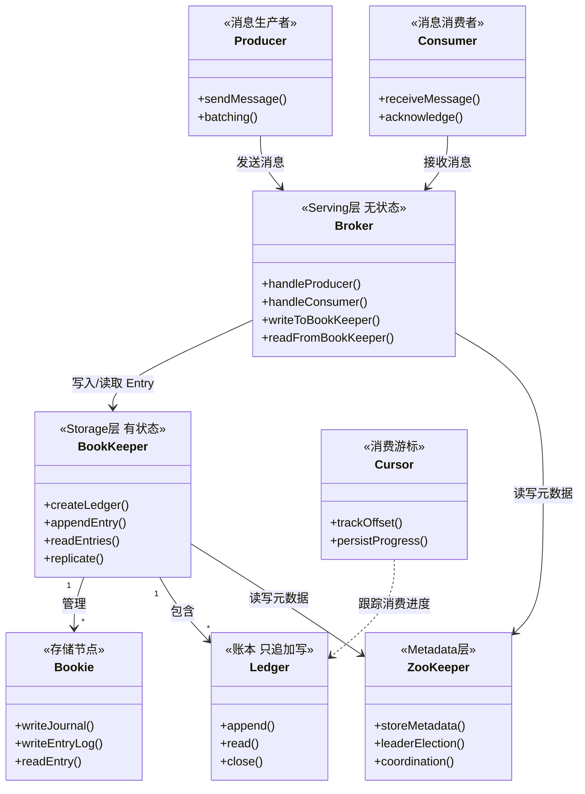
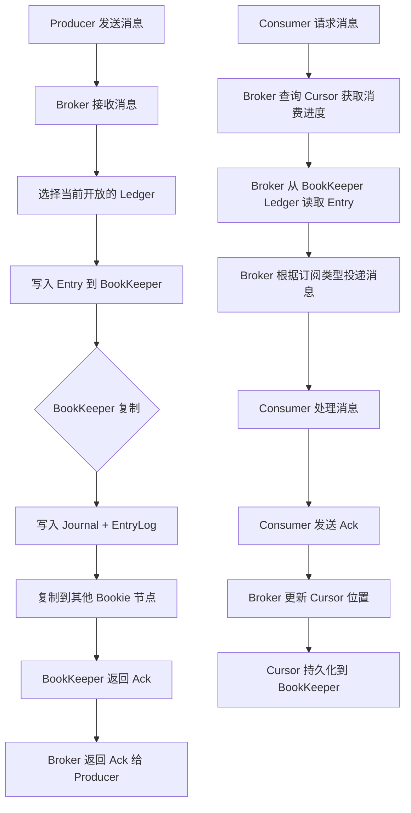
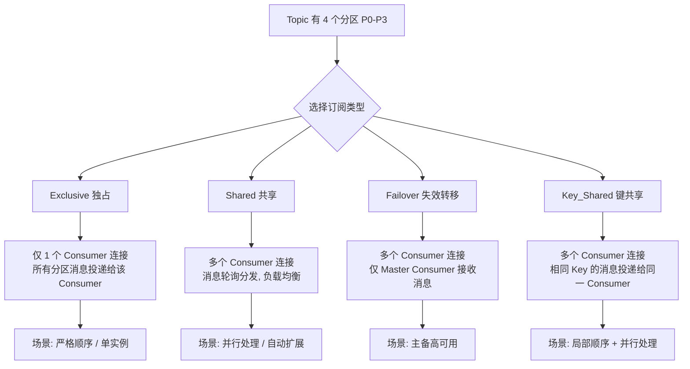
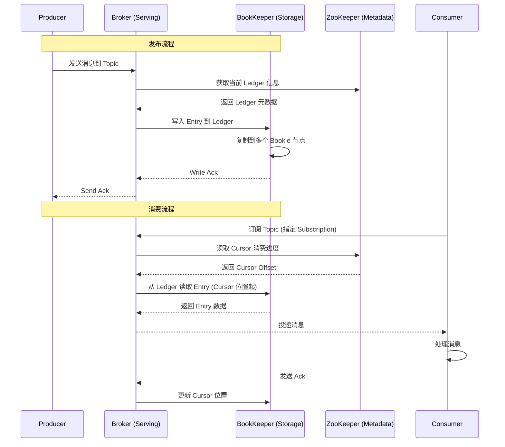

## 引言

当你的 Kafka 集群因为扩容存储节点而需要停机数小时做数据重平衡，当你的 RabbitMQ 因为消息堆积导致内存溢出崩溃——你是否想过，消息队列的架构本身可能就是瓶颈？Kafka 的 Broker 同时承担计算和存储，这意味着你无法单独扩展某一维度的资源。

Apache Pulsar 以"存储与计算分离"的云原生架构回应了这个痛点：Broker 无状态可秒级扩缩容，BookKeeper 存储层独立管理，数据重平衡零影响。这不是对传统 MQ 的小修小补，而是从架构层面的重新设计。

读完本文，你将掌握：

1. **存储与计算分离架构**——Pulsar 如何将 Serving 层和 Storage 层彻底解耦，以及这一设计如何带来独立弹性伸缩、快速故障恢复和低成本分层存储。
2. **四种订阅模式深度解析**——Exclusive、Shared、Failover、Key_Shared 的适用场景和消息投递规则，满足从严格顺序到并行处理的各类需求。
3. **Pulsar vs Kafka vs RabbitMQ 选型对比**——从架构、存储模型、消费模型到运维弹性的全方位对比，帮助你在下次技术评审中做出有理有据的选择。

无论你在评估云原生消息中间件，还是面试中需要展示对下一代消息系统的理解，Pulsar 的分层架构都是绕不开的关键知识点。

## 深度解析 Apache Pulsar 架构设计：存储与计算分离的云原生消息平台

### Pulsar 是什么？定位与核心理念

Apache Pulsar 是一个**分布式、云原生、高可用、多租户的消息和流处理平台**。

* **定位：** 它是一个下一代消息中间件，旨在**统一消息队列和流处理**，并为云环境提供更强的弹性伸缩和运维能力。
* **核心理念：** 将消息的**Serving（处理客户端请求）层**与**Storage（持久化存储）层**彻底分离，使它们可以独立伸缩和管理。

### 为什么选择 Pulsar？优势分析

* **独特的架构优势 (存储与计算分离)：** 这是 Pulsar 最核心的优势。
    * **独立的弹性伸缩：** 可以根据吞吐量需求独立扩展 Broker 节点（计算），或根据数据量需求独立扩展 Bookie 节点（存储）。
    * **操作弹性高：** Broker 无状态，故障恢复快，扩缩容无需数据重平衡。
    * **数据重平衡简单：** BookKeeper 的存储特性使得数据分布更均匀，且不绑定到特定的 Broker。
    * **天然支持分层存储 (Tiered Storage)：** 易于将历史数据无缝迁移到对象存储等冷存储介质。
* **丰富的订阅模式：** 提供多种灵活的订阅类型，满足不同消费场景的需求。
* **内置地理复制 (Geo-Replication)：** 支持在多个数据中心之间复制数据，构建灾备和多活系统。
* **统一消息和流 API：** 生产者发送消息，消费者以多种方式消费，API 统一。
* **高可靠和持久性：** 基于 BookKeeper 的复制机制保证数据不丢失。
* **多租户：** 内置多租户管理能力。

> **💡 核心提示**：Pulsar 的核心差异化优势不是"功能多"，而是**存储与计算分离**——Broker 无状态，BookKeeper 独立存储，这意味着 Broker 扩缩容不涉及任何数据迁移，彻底解决了 Kafka 等传统 MQ 扩容时数据重平衡的痛点。

### Pulsar 架构设计与核心组件

Pulsar 的架构是其最显著的特点，分为 Serving 层、Storage 层和 Metadata 层。

#### Pulsar 架构类图

1. **角色：**
    * **Producer：** 消息生产者，发送消息到 Broker。
    * **Consumer：** 消息消费者，从 Broker 接收并消费消息。
    * **Broker：** **Serving 层**，**无状态**。负责处理生产者和消费者的请求（消息的收发），运行消息的查找和服务逻辑，不负责消息的物理存储。Broker 集群是无状态的，可以快速扩缩容和恢复。
    * **BookKeeper (包含 Bookie 节点)：** **Storage 层**，**有状态**。一个 Apache 开源的**分布式日志存储系统**。Bookie 是 BookKeeper 集群中的存储节点。BookKeeper 负责消息的持久化存储、复制和读取。它是 Pulsar 数据可靠性和持久性的基石。
    * **Zookeeper：** **Metadata 层**，有状态。负责存储 Pulsar 和 BookKeeper 的元数据，如 Broker 信息、Topic 配置、Ledger 信息、消费者订阅的 Offset（Cursor）等。用于集群协调和 Leader 选举。

2. **分层架构：**
    * **Serving Layer (Brokers)：** 接收客户端连接和请求，并将消息写入 Storage 层，从 Storage 层读取消息投递给客户端。由于不存储消息本身，Broker 是无状态的，易于横向扩展和快速恢复。
    * **Storage Layer (Bookies)：** 由 BookKeeper 集群提供，负责消息的持久化存储。消息被写入 BookKeeper 的 **Ledger** 中。BookKeeper 保证写入的消息是持久化和复制的。Storage 层是有状态的。
    * **WHY 分层？带来的优势：**
        * **独立伸缩：** 根据吞吐量需求独立增减 Broker 节点；根据数据量需求独立增减 Bookie 节点。
        * **操作弹性：** Broker 宕机或重启不丢失状态，不影响数据，恢复快。
        * **数据重平衡简化：** 数据分布在 BookKeeper 集群中，与 Broker 无关，Broker 扩缩容不涉及数据迁移。
        * **支持分层存储：** 旧的 Ledger 可以无缝地从 BookKeeper 迁移到对象存储等冷存储系统，降低存储成本。

#### 存储与计算分离数据流

3. **存储单元：**
    * **Ledger (账本)：** Apache BookKeeper 中的核心概念。一个 Ledger 是一个只支持**追加写 (Append-only)** 的、**有序的 Entry 序列**。Ledger 创建后**不可变**。一个 Topic 的一个 Partition 的数据会跨越多个 Ledger 进行存储。
    * **Entry (条目)：** 写入 Ledger 的基本单元。通常包含一条或多条消息的 Batch。
    * **Cursor (游标)：** 存储在 BookKeeper 中的数据结构，用于持久化跟踪**一个订阅 (Subscription)** 在一个 **Partition** 中的消费进度（Offset）。

### Pulsar 订阅模式详解

订阅（Subscription）是 Pulsar 最灵活的特性之一，控制消息如何从 Topic 的 Partitions 分配给消费组中的消费者实例。

#### 四种订阅模式对比

* **Exclusive (独占订阅)：** 一个订阅只允许一个消费者实例连接。所有消息都投递给这一个消费者。**场景：** 需要严格的顺序处理，或者只需要一个消费者实例。
* **Shared (共享订阅)：** 允许多个消费者实例连接到同一个订阅。消息会**轮询分发**给订阅下的不同消费者实例，实现负载均衡。**场景：** 大部分通用消费场景，需要并行处理和自动负载均衡。
* **Failover (失效转移订阅)：** 允许多个消费者实例连接到同一个订阅。但所有消息**只投递给其中一个"主"消费者**。其他消费者处于备用状态。**场景：** 需要主备模式，强调高可用而非并行处理。
* **Key_Shared (键共享订阅)：** 允许多个消费者实例连接到同一个订阅。消息会根据**消息的 Key 进行哈希**，具有相同 Key 的消息总是被投递给同一个消费者实例。**场景：** 需要保证相同 Key 的消息顺序处理，但不同 Key 的消息可以并行处理。

> **💡 核心提示**：Shared 是最常用的通用模式，但它**不保证消息顺序**——因为消息轮询分发给不同消费者。如果需要"同一订单的消息按顺序处理"，请使用 Key_Shared 订阅并设置订单 ID 作为消息 Key。

### Pulsar 发布与消费流程时序图

### 高可用与数据一致性

* **Broker 高可用：** Broker 是无状态的。任何一个 Broker 宕机不会导致数据丢失。新的连接可以建立到其他 Broker。
* **BookKeeper 高可用与数据持久性：** BookKeeper 集群通过配置 Entry 的**复制因子 (Replication Factor)** 和**写入法定人数 (Write Quorum)** 来保证即使部分 Bookie 节点宕机，数据也不会丢失。Ledger 一旦封闭则不可变。
* **Metadata 高可用：** Zookeeper 集群保证 Pulsar 和 BookKeeper 元数据的高可用。
* **数据一致性：** BookKeeper 保证对 Ledger 的写入是强一致和有序的。Cursor 的更新也是持久化在 BookKeeper 中。

### Pulsar 关键特性回顾

* **分层架构 (Serving/Storage Separation)：** 核心优势，提供独立伸缩和操作弹性。
* **多种订阅模式 (Exclusive, Shared, Failover, Key_Shared)：** 灵活的消费方式。
* **地理复制 (Geo-Replication)：** 内置支持跨数据中心的异步复制。
* **分层存储 (Tiered Storage)：** 将旧数据透明迁移到 S3 等对象存储。
* **Pulsar Functions：** 轻量级无服务计算框架，无需独立部署流处理引擎即可处理消息。
* **Pulsar IO：** 连接器框架，方便 Pulsar 与其他系统集成。

### Pulsar vs Kafka vs RabbitMQ 对比分析

Pulsar 在设计上吸取了 Kafka 和 RabbitMQ 的优点，并引入了 Storage/Serving 分离等创新，形成了独特的定位。

| 特性 | Apache Pulsar | Apache Kafka | RabbitMQ |
| :--- | :--- | :--- | :--- |
| **核心模型** | 分布式消息/流平台 (分层) | 分布式提交日志/流平台 (单层) | 传统消息队列 (Broker 集群) |
| **架构** | Broker (无状态) + Bookies (有状态) | Zookeeper/Kraft + Broker (Leader/Follower) | Broker 集群 (节点对等) |
| **存储** | 分层存储 (BookKeeper Ledger) | 分布式日志 (Partition Logs) | 基于内存和磁盘队列 |
| **消费模型** | Push 和 Pull，四种订阅类型 | Pull (拉模式) | Push (推荐) 和 Pull |
| **消息顺序** | 局部顺序，支持 Key_Shared | 分区内顺序保证 | 队列内有序 |
| **延时消息** | 内置支持 | 需外部调度 | 需插件 |
| **Geo-Replication** | 内置支持 | 需额外工具 | 需额外工具 |
| **运维弹性** | 高 (存储计算分离) | 相对较低 (耦合) | 适中 |
| **CAP 倾向** | 存储 CP，服务 AP | 分区内强一致，分区间最终一致 | 依赖配置 |

* **Kafka：** 高吞吐的数据管道，适合大数据和流处理。
* **RabbitMQ：** 灵活的信使，适合传统消息队列和复杂路由。
* **Pulsar：** 云原生的消息和流平台，适合需要弹性伸缩、多种订阅模式和存储计算分离的场景。

### 理解 Pulsar 架构与使用方式的价值

* **掌握云原生消息原理：** 理解存储计算分离带来的架构优势。
* **理解分布式存储 (BookKeeper)：** 学习 Ledger 等概念。
* **理解多样化订阅模型：** 知道如何根据不同场景选择最合适的消费方式。
* **对比分析能力：** 能够清晰地对比 Pulsar、Kafka、RabbitMQ 的差异，做出合理的选型决策。
* **应对面试：** Pulsar 是新兴的热点，其独特架构和特性是高频考点。

### Pulsar 为何是面试热点

* **云原生背景：** 是针对云环境设计的新一代消息系统。
* **架构独特：** 存储与计算分离是其最核心的差异点，易于考察原理。
* **对比对象：** 常与 Kafka/RabbitMQ 进行对比，考察你对不同消息系统理解深度。
* **多种订阅模式：** 是区别于 Kafka 的重要功能，常考。

### 面试问题示例与深度解析

* **什么是 Apache Pulsar？它解决了传统消息队列（如 Kafka/RabbitMQ）在架构上的哪些问题？核心理念是什么？**（定义分布式消息/流平台，解决存储与计算耦合问题，核心理念是存储与计算分离的云原生平台。）
* **请描述一下 Pulsar 的整体架构。它包含哪些核心组件？**（**核心！** NameServer, Brokers（Serving）, Bookies（Storage）, Zookeeper（Metadata）。描述分层架构，Broker 与 BookKeeper 如何交互。）
* **请详细解释 Pulsar 的分层架构。Serving 层和 Storage 层分别是什么？为什么将它们分离？**（**核心！** 必考题。Serving=Brokers（无状态），Storage=BookKeeper（有状态）。优势：独立伸缩、操作弹性、数据重平衡简化、分层存储支持。）
* **请介绍一下 Pulsar 的存储层 BookKeeper。它的核心概念是什么？**（**核心！** BookKeeper 定义，核心概念：Ledger（只追加、不可变）, Entry（消息单元）, Bookie（存储节点）。）
* **请解释一下 Pulsar 的四种订阅类型：Exclusive, Shared, Failover, Key_Shared。它们分别有什么特点和适用场景？**（**核心！** 必考题，详细解释每种类型如何分配分区给消费者实例，对比场景。）
* **请描述一个消息在 Pulsar 中的发布流程和消费流程。**（Producer -> Broker -> Write Entry -> BookKeeper -> Ack -> Cursor 更新。）
* **Pulsar 如何保证消息的高可用和数据不丢失？**（Broker 无状态 HA，BookKeeper 的 Ledger 复制 HA，持久化刷盘，Ledger 不可变性。）
* **请对比一下 Pulsar、Kafka 和 RabbitMQ 三者在架构、存储模型、消费模型、核心功能等方面的异同。**（**核心！** 必考题。）

### 生产环境避坑指南

1. **Broker 与 BookKeeper 版本匹配：** Pulsar Broker 和 BookKeeper 版本之间存在兼容性要求，升级时需按官方升级指南顺序进行，避免混用不兼容版本。
2. **Ledger 滚动策略调优：** 默认 Ledger 最大大小为 2GB 或最大条目数限制。在高吞吐场景下，过大的 Ledger 会导致写入延迟增加。建议根据实际吞吐调整 `managedLedgerMaxEntriesPerLedger`。
3. **Bookie 磁盘监控：** BookKeeper 的 Journal 和 EntryLog 对磁盘 I/O 敏感。Journal 应部署在 SSD 上，EntryLog 可使用 HDD。务必监控磁盘使用率，超过 90% 时应触发告警。
4. **Cursor 膨胀问题：** 如果消费者长期不 Ack 或消费速度远低于生产速度，Cursor 会滞后导致 Ledger 无法被删除，存储持续膨胀。需设置消费延迟告警。
5. **Zookeeper 集群规模：** Pulsar 和 BookKeeper 都依赖 ZooKeeper，建议独立部署 3 或 5 节点的 ZooKeeper 集群，避免与 Broker 混部。
6. **Namespace 多租户隔离：** 生产环境使用独立的 Tenant 和 Namespace 隔离不同业务线，利用 Pulsar 内置的多租户特性实现资源配额和权限控制。
7. **Topic 分区数选择：** 分区数决定了并行度上限，但过多的分区会增加 BookKeeper 和 ZooKeeper 的元数据压力。建议根据实际吞吐需求和 Consumer 数量合理设置。

### 总结

Apache Pulsar 是一个面向云原生时代设计的分布式消息和流处理平台，其核心创新在于将消息的 Serving 层和 Storage 层彻底分离，分别由无状态的 Brokers 和有状态的 BookKeeper 集群负责。这种分层架构带来了出色的弹性伸缩、操作弹性和对分层存储的支持。同时，Pulsar 提供了灵活多样的订阅模式，能够满足各种复杂的消费需求。

理解 Pulsar 的分层架构、BookKeeper 存储机制、多样化的订阅类型以及其 Publish/Consume 工作流程，并将这些与 Kafka 和 RabbitMQ 进行对比，是掌握云原生消息技术栈、进行技术选型并应对面试的关键。

### 核心参数对比表

| 参数/特性 | Pulsar | Kafka | RabbitMQ |
| :--- | :--- | :--- | :--- |
| **默认端口** | 6650 | 9092 | 5672 |
| **消息确认机制** | Ack (Broker 持久化 Cursor) | ISR + offset commit | ACK (manual/auto) |
| **消息持久化** | BookKeeper Ledger (append-only) | Partition Log (文件系统顺序写) | 磁盘队列 + 内存 |
| **消费模式** | Push + Pull，4 种订阅 | Pull 为主 | Push (推荐) + Pull |
| **分层存储** | 内置 (S3, GCS 等) | 需第三方插件 | 不支持 |
| **地理复制** | 内置异步复制 | MirrorMaker / Confluent Replicator | Federation / Shovel |
| **多租户** | 内置 (Tenant/Namespace) | 需 ACL + 外部管理 | vHost 隔离 |

### 行动清单

1. **架构评估**：如果当前消息队列面临频繁扩缩容或数据重平衡痛点，评估 Pulsar 存储计算分离架构是否适用。
2. **磁盘规划**：为 BookKeeper 的 Journal 配置 SSD，EntryLog 可使用 HDD。确保磁盘 IOPS 满足吞吐需求。
3. **订阅类型选择**：90% 的场景使用 Shared 订阅即可；需要顺序性时改用 Key_Shared；严格单消费者用 Exclusive。
4. **监控覆盖**：确保监控覆盖 Cursor 滞后时间、Bookie 磁盘使用率、Broker 连接数等关键指标。
5. **扩展阅读**：推荐阅读 Pulsar 官方文档中关于 BookKeeper Ledger 管理和 Geo-Replication 的章节。
