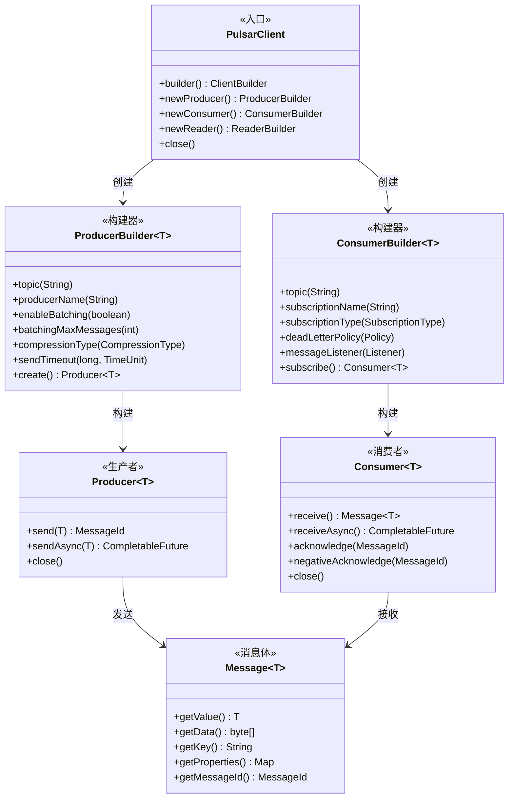
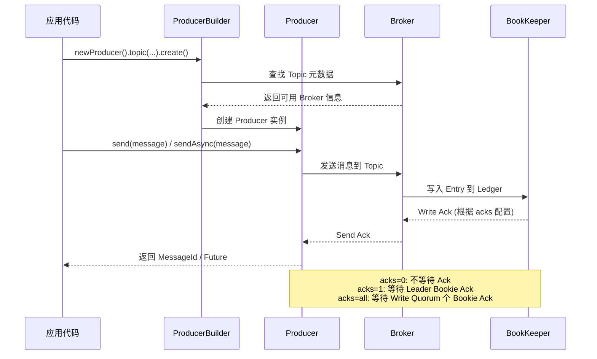
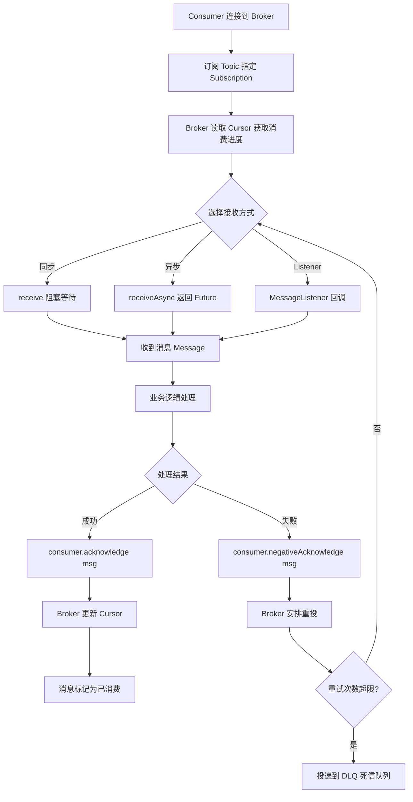

## 引言

你知道 Pulsar Producer 的 `acks` 参数设置为 `0` 时，消息可能在 Broker 还没写入磁盘就被确认了吗？你知道 Consumer 开启自动 Ack 后，消息还没处理成功就已经从队列中被移除了吗？Pulsar 的架构再精妙，如果用错了客户端 API，照样会导致消息丢失、重复消费、顺序错乱。

这篇文章将从架构走向代码，带你掌握 Pulsar Java Client 的核心用法：

1. **Producer 发送策略与可靠性配置**——acks 参数如何关联 BookKeeper 的持久性保证，同步/异步/单向发送的性能差异，以及批量发送和压缩的正确配置方式。
2. **Consumer 订阅类型与 Ack 机制**——四种订阅类型的代码配置、手动 Ack vs 自动 Ack 的陷阱、死信队列和延时消息的实战用法。
3. **消息确认底层原理**——Ack 后 Cursor 如何更新到 BookKeeper，否定确认后消息如何重投，以及如何在生产环境中保证 At-least-once 语义。

无论是将 Pulsar 集成到 Spring Boot 项目，还是排查"消息为什么丢了/重复了"的线上问题，这些实操细节都是你必须掌握的硬技能。

## Apache Pulsar 使用教程：从架构到实践，构建高效消息应用

### 前置知识回顾

* **Broker：** 无状态计算层，处理客户端请求。
* **BookKeeper：** 有状态存储层，存储消息的 Ledger。
* **Topic：** 消息的逻辑分类，可分区（Partitioned Topic）。
* **Subscription：** 消费者组消费 Topic 的方式，有多种类型（Exclusive, Shared, Failover, Key_Shared）。
* **Cursor：** 持久化存储在 BookKeeper 中的消费进度。
* **Ledger & Entry：** BookKeeper 中的存储单元。

### Pulsar Java Client 环境搭建

#### Pulsar Client 架构概览



1. **添加依赖：** 在 Maven 项目中添加 Pulsar Java Client 依赖。

```xml
<dependency>
    <groupId>org.apache.pulsar</groupId>
    <artifactId>pulsar-client</artifactId>
    <version>2.11.0</version>
</dependency>
```

> **💡 核心提示**：如果使用 Pulsar 2.8.0 及以上版本，推荐使用 `pulsar-client-all` 依赖以简化依赖管理，避免类冲突。

2. **连接 Pulsar 集群：** 使用 `PulsarClient` 连接到 Pulsar 集群。`serviceUrl` 指向 Pulsar Broker 的地址。

```java
import org.apache.pulsar.client.api.PulsarClient;
import org.apache.pulsar.client.api.PulsarClientException;

String serviceUrl = "pulsar://localhost:6650";

PulsarClient client = null;
try {
    client = PulsarClient.builder()
            .serviceUrl(serviceUrl)
            // .authentication(AuthenticationFactory.token("your-auth-token"))
            // .connectionTimeout(30, TimeUnit.SECONDS)
            // .operationTimeout(30, TimeUnit.SECONDS)
            .build();
    System.out.println("Pulsar Client created successfully.");
} catch (PulsarClientException e) {
    System.err.println("Failed to create Pulsar Client: " + e.getMessage());
    e.printStackTrace();
} finally {
    if (client != null) {
        client.close();
    }
}
```

3. **认证 (Authentication)：** 如果 Pulsar 集群开启了认证，需要在构建 `PulsarClient` 时进行配置，例如使用 Token 认证或 TLS 认证。

### Topic 管理与类型

* **命名规范：** Pulsar 的 Topic 名称格式为 `{persistent|non-persistent}://tenant/namespace/topic`。
    * `persistent` 或 `non-persistent`：指定消息是否需要持久化存储。
    * `tenant`：租户名称。
    * `namespace`：命名空间名称。
    * `topic`：主题名称。
    * 例如：`persistent://public/default/my-first-topic`。
* **分区 Topic (Partitioned Topic)：** 为了实现水平扩展，Topic 可以被分区。一个分区 Topic 包含多个内部 Topic（分区），数据分布在这些分区上。
* **创建 Topic：** 当生产者第一次连接到 Topic 时，如果 Topic 不存在，Pulsar 会自动创建它。也可以使用 Pulsar Admin Client 或命令行工具显式创建分区 Topic。

### 生产者 (Producer) 使用方式

#### 消息发送流程



1. **创建 Producer：** 使用 `PulsarClient` 构建 `Producer` 实例，指定要发送消息的 Topic。

```java
import org.apache.pulsar.client.api.Producer;
import org.apache.pulsar.client.api.Schema;

String topicName = "persistent://public/default/my-topic";

try {
    Producer<byte[]> producer = client.newProducer()
            .topic(topicName)
            .producerName("my-producer-001")
            .create();
    System.out.println("Producer created for topic: " + topicName);
} catch (PulsarClientException e) {
    System.err.println("Failed to create producer: " + e.getMessage());
}
```

2. **发送选项 (Configuration)：** 在创建 Producer 时可以配置多种发送行为。
    * `enableBatching(boolean)`：是否开启批量发送（默认 true）。将多条消息聚合成一批发送，减少网络请求次数，提高吞吐。
    * `batchingMaxMessages(int)`：批量发送最大消息数。
    * `batchingMaxPublishDelay(long, TimeUnit)`：批量发送最大等待时间。
    * `compressionType(CompressionType)`：消息压缩类型（LZ4, ZLIB, ZSTD, SNAPPY）。
    * **`sendTimeout(long, TimeUnit)`：** 发送超时时间。
    * **`acks(int)`：** 消息发送的确认机制，**关联 BookKeeper 持久性**。
        * `0`：不等待 Broker 确认，发送即返回成功。**吞吐量最高，但可能丢消息。**
        * `1`：等待 Leader Bookie 写入成功。**性能次之，Leader Bookie 故障可能丢消息。**
        * `all`（或 `-1`）：等待配置的写法定人数（Write Quorum）个 Bookie 节点写入成功。**可靠性最高，能保证已确认消息不丢失。**
    * `messageRoutingMode(MessageRoutingMode)`：消息路由模式（RoundRobinPartition, SinglePartition, ConsistentHashing）。
    * `messageKey(String)`：设置消息 Key。用于消息路由到指定分区（Key 的 Hash）或顺序消息。

3. **发送消息方式：**

    * **同步发送 (`send(byte[] message)`)：** 阻塞当前线程，直到消息成功发送（或失败）。适用于对发送结果强感知的场景。

```java
try {
    MessageId msgId = producer.send("Hello Pulsar - Sync!".getBytes());
    System.out.println("Message sent successfully: " + msgId);
} catch (PulsarClientException e) {
    System.err.println("Message send failed: " + e.getMessage());
}
```

    * **异步发送 (`sendAsync(byte[] message)`)：** 立即返回一个 `CompletableFuture`，发送操作在后台执行。适用于需要高吞吐的场景。

```java
producer.sendAsync("Hello Pulsar - Async!".getBytes()).thenAccept(msgId -> {
    System.out.println("Message sent successfully (async): " + msgId);
}).exceptionally(e -> {
    System.err.println("Message send failed (async): " + e.getMessage());
    return null;
});
```

4. **消息 Key 和 Properties 的使用：**
    * 发送顺序消息：确保相同 Key 的消息发送到同一个分区，Producer 配置基于 Key 的路由模式。
    * 消息过滤：消费者可以根据消息 Key 或 Properties 进行过滤。
    * 业务标识：在 Properties 中携带业务相关信息。

### 消费者 (Consumer) 使用方式

#### 消费者消息处理流程



1. **创建 Consumer：** 使用 `PulsarClient` 构建 `Consumer` 实例，指定要订阅的 Topic 和**订阅信息**。

```java
import org.apache.pulsar.client.api.Consumer;
import org.apache.pulsar.client.api.SubscriptionType;

String topicName = "persistent://public/default/my-topic";
String subscriptionName = "my-subscription";

try {
    Consumer<byte[]> consumer = client.newConsumer()
            .topic(topicName)
            // .topics(Arrays.asList("topic1", "topic2"))
            .subscriptionName(subscriptionName)
            .subscriptionType(SubscriptionType.Shared)
            // .autoCommitAcknowledgement(true)
            .subscribe();
    System.out.println("Consumer created for topic: " + topicName + ", subscription: " + subscriptionName);
} catch (PulsarClientException e) {
    System.err.println("Failed to create consumer: " + e.getMessage());
}
```

2. **创建 Consumer 时指定订阅类型：** 这是 Pulsar 的关键特性，决定了消息如何投递给消费组内的消费者实例以及如何分配 Partition 的消费权。
    * **`SubscriptionType.Exclusive` (独占)：** 只有一个消费者连接到此订阅。适用于严格顺序处理。
    * **`SubscriptionType.Shared` (共享)：** 多个消费者连接，消息在消费者间轮询分发。适用于并行处理和负载均衡。
    * **`SubscriptionType.Failover` (失效转移)：** 多个消费者连接，但只有一个主消费者接收所有消息。适用于主备高可用场景。
    * **`SubscriptionType.Key_Shared` (键共享)：** 多个消费者连接，相同 Key 的消息投递给同一个消费者。保证基于 Key 的局部顺序。
    * **选择依据：** 根据业务对消息顺序性、并行处理、高可用模式的需求选择。Shared 是最常用的通用模式。

3. **接收消息方式：**

    * **同步接收 (`receive()`)：** 阻塞当前线程，直到收到一条消息。

```java
try {
    Message<byte[]> msg = consumer.receive();
    System.out.println("Received message: " + new String(msg.getData()));
    consumer.acknowledge(msg);
} catch (PulsarClientException e) {
    System.err.println("Failed to receive message: " + e.getMessage());
}
```

    * **异步接收 (`receiveAsync()`)：** 立即返回 `CompletableFuture`。

```java
consumer.receiveAsync().thenAccept(msg -> {
    System.out.println("Received message (async): " + new String(msg.getData()));
    consumer.acknowledgeAsync(msg);
}).exceptionally(e -> {
    System.err.println("Failed to receive message (async): " + e.getMessage());
    return null;
});
```

    * **使用 MessageListener：** 注册一个监听器，当收到消息时回调。

```java
import org.apache.pulsar.client.api.MessageListener;

consumer = client.newConsumer()
        .topic(topicName)
        .subscriptionName(subscriptionName)
        .subscriptionType(SubscriptionType.Shared)
        .messageListener((consumer, msg) -> {
            try {
                System.out.println("Received: " + new String(msg.getData()));
                consumer.acknowledge(msg);
            } catch (Exception e) {
                consumer.negativeAcknowledge(msg);
            }
        })
        .subscribe();
```

4. **消息确认 (Acknowledgement) - 关键：** Ack 是消费者向 Broker 发送的信号，表示该消息已经被成功处理。Broker 收到 Ack 后，会更新该订阅的 Cursor（游标），标记该消息及其之前的所有消息为已消费。如果消息未 Ack，Broker 会在一定条件下将消息**重投**。

> **💡 核心提示**：**强烈建议禁用自动确认**（`autoCommitAcknowledgement(false)`），使用**手动确认**，在**消息处理成功后**再发送 Ack。自动确认在接收到消息后就标记为已消费，如果处理过程中发生异常，消息将丢失。

* `acknowledge(MessageId msgId)` / `acknowledge(Message<T> msg)`：手动确认单条消息。
* `acknowledgeCumulative(MessageId msgId)`：累计确认，确认该 MessageId 及其之前所有未确认的消息。
* `negativeAcknowledge(MessageId msgId)`：否定确认。告诉 Broker 该消息处理失败，Broker 会在稍后**重投**这条消息。
* `redeliverUnacknowledgedMessages()`：手动触发重投所有之前未确认的消息。

### Pulsar 高级功能使用

* **顺序消息：**
    * 生产者：发送消息时设置 `messageKey`，使用基于 Key 的路由模式。
    * 消费者：使用 **`SubscriptionType.Key_Shared` 订阅**。
* **定时/延时消息：**

```java
producer.newMessage()
        .value("Delayed message".getBytes())
        .deliverAfter(10, TimeUnit.MINUTES)
        .send();
```

* **死信队列 (DLQ)：** 自动将多次消费失败的消息发送到死信队列。

```java
consumer = client.newConsumer()
        .topic(topicName)
        .subscriptionName(subscriptionName)
        .subscriptionType(SubscriptionType.Shared)
        .enableRetry(true)
        .deadLetterPolicy(DeadLetterPolicy.newBuilder()
                .maxRedeliverCount(3)
                .deadLetterTopic("persistent://public/default/my-dlq-topic")
                .build())
        .subscribe();
```

* **消息过滤：**
    * **Broker 端过滤 (按 Tag 或 SQL92)：** 生产者发送时设置 `Tag` 或 `Properties`，消费者订阅时使用 `messageSelector`（SQL92 语法）。
    * **消费者端过滤：** 在消费者接收到消息后，根据业务逻辑进行过滤。

### 在 Spring Boot 中集成 Pulsar

在 Spring Boot 应用中，推荐使用 Spring 官方的 `spring-pulsar` 模块（Spring for Apache Pulsar，2023 年起已纳入 Spring 生态）。

1. **添加依赖：**

```xml
<dependency>
    <groupId>org.springframework.boot</groupId>
    <artifactId>spring-boot-starter</artifactId>
</dependency>
<dependency>
    <groupId>org.springframework.pulsar</groupId>
    <artifactId>spring-pulsar-spring-boot-starter</artifactId>
    <version>1.0.0</version>
</dependency>
```

2. **配置：** 在 `application.yml` 中配置 Pulsar 连接信息。

```yaml
# application.yml
spring:
  pulsar:
    client:
      service-url: pulsar://localhost:6650
    producer:
      default-topic: my-topic
    consumer:
      topics:
        - persistent://public/default/my-topic
      subscription-name: my-subscription
```

3. **使用：** 注入自动配置的 `PulsarTemplate` 和 `PulsarReader` Bean。

```java
@Service
public class MyPulsarService {
    private final PulsarTemplate<String> pulsarTemplate;

    public MyPulsarService(PulsarTemplate<String> pulsarTemplate) {
        this.pulsarTemplate = pulsarTemplate;
    }

    public void sendMessage(String message) throws Exception {
        pulsarTemplate.send("my-topic", message);
    }
}
```

### Producer 发送方式对比

| 发送方式 | 方法 | 阻塞 | 适用场景 | 推荐指数 |
| :--- | :--- | :--- | :--- | :--- |
| **同步发送** | `send()` | 是 | 对发送结果强感知、低吞吐场景 | ⭐⭐⭐ |
| **异步发送** | `sendAsync()` | 否 | 高吞吐场景，需要高并发发送 | ⭐⭐⭐⭐⭐ |
| **单向发送** | `sendAsync()` 不监听结果 | 否 | 可容忍少量丢失的日志场景 | ⭐⭐ |

### Consumer 订阅类型对比

| 订阅类型 | 消费者数 | 消息分配方式 | 顺序保证 | 适用场景 |
| :--- | :--- | :--- | :--- | :--- |
| **Exclusive** | 1 | 全部消息给该 Consumer | 全局顺序 | 严格顺序 / 单实例 |
| **Shared** | 多个 | 轮询分发 | 无 | 并行处理 / 负载均衡 |
| **Failover** | 多个 | 仅 Master Consumer | 全局顺序 | 主备高可用 |
| **Key_Shared** | 多个 | 按 Key Hash 分配 | 按 Key 局部顺序 | 局部顺序 + 并行处理 |

### 理解 Pulsar 使用方式的价值

* **将架构知识转化为实践：** 将对 Pulsar 架构的理解应用于实际的客户端配置和代码编写中。
* **灵活使用 Pulsar 特性：** 掌握多种订阅模式、Ack 机制、定时消息、DLQ 等核心功能的使用。
* **提高代码质量和可靠性：** 知道如何正确配置生产者 Ack 和消费者 Ack，避免消息丢失和重复。
* **应对面试：** 面试官常会结合实际使用场景来考察对 Pulsar 的掌握程度。

### Pulsar 使用方式为何是面试热点

* **考察实际动手能力：** 会用是基础。
* **考察架构影响用法：** 为什么这样配置 Ack？为什么选择这种订阅类型？这要求你将用法与架构原理关联起来。
* **考察核心特性：** 订阅类型、Ack 机制、顺序消息、定时消息等是 Pulsar 的独特或重要特性，常结合使用场景提问。

### 面试问题示例与深度解析

* **如何在 Java 中连接到 Pulsar 集群？需要哪些核心配置？**（`PulsarClient.builder().serviceUrl(...)`，配置服务地址。）
* **请描述一下在 Java 中创建 Pulsar Producer 的过程。有哪些重要的配置选项？**（`client.newProducer().topic(...).create()`。重要配置：`acks`, `enableBatching`, `messageRoutingMode`, `messageKey`。）
* **Producer 的 `acks` 参数有什么作用？设置为 `all` 有什么意义？它与 BookKeeper 的持久性有什么关系？**（**核心！** 确认机制，`acks=all` 等待写法定人数 Bookie 确认。关系：保证消息写入 BookKeeper 集群的持久性。）
* **Pulsar 的订阅 (Subscription) 有哪几种类型？如何指定？你通常会根据什么来选择？**（**核心！** 四种类型：Exclusive, Shared, Failover, Key_Shared。在 `client.newConsumer().subscriptionType(...)` 指定。选择依据：对消息顺序、并行、高可用的需求。）
* **请解释一下 Pulsar 的消息确认 (Acknowledgement) 机制。为什么需要 Ack？如何处理消费失败的消息？**（**核心！** Ack 是消费者处理成功的信号，Broker 收到更新 Cursor，保证不重复投递。失败：`negativeAcknowledge` 或不 Ack，Broker 重投。）
* **消息确认 (Ack) 后，在 Pulsar 的架构底层发生了什么？**（Ack 信息发送给 Broker，Broker 更新该订阅在 BookKeeper 中的 Cursor 位置。）
* **如何在 Java 中发送顺序消息？需要 Producer 和 Consumer 端如何配合？**（Producer 发送时设置 `messageKey`，Consumer 使用 `SubscriptionType.Key_Shared`。）
* **如何在 Java 中发送延时或定时消息？**（`deliverAfter` 或 `deliverAt`。）
* **Spring Boot 应用如何集成 Pulsar？**（引入 Spring Pulsar Starter，自动配置 `PulsarTemplate`。）

### 生产环境避坑指南

1. **关闭自动 Ack：** 务必设置 `autoCommitAcknowledgement(false)`，在业务逻辑处理成功后手动调用 `acknowledge(msg)`。自动 Ack 是消息丢失的头号原因。
2. **acks 参数配置：** 生产环境 Producer 的 acks 必须设置为 `all`（或 `-1`），确保消息写入多个 Bookie 节点后才确认。acks=0 仅适用于可丢失的日志类消息。
3. **Consumer 异常处理：** 在 MessageListener 或 receive 逻辑中，必须捕获异常并调用 `negativeAcknowledge(msg)` 触发重投，而不是吞掉异常。
4. **DLQ 配置不能遗漏：** 生产环境必须配置死信队列，设置合理的 `maxRedeliverCount`（建议 3-5 次），否则异常消息会无限重投导致消费者死循环。
5. **Client 复用：** `PulsarClient` 是线程安全的重量级对象，应在应用中全局复用（如注册为 Spring Bean），不要为每个 Producer/Consumer 创建新的 Client。
6. **分区数与消费者数匹配：** Shared 模式下，消费者数量不应超过 Topic 分区数。多余的消费者不会分到任何分区，处于空闲状态。
7. **消息序列化 Schema 选择：** 优先使用 `JSONSchema` 或 `AVROSchema` 替代裸 `byte[]`，利用 Schema Registry 进行 schema 校验，避免生产者和消费者之间的序列化不兼容。
8. **连接超时与操作超时：** 在网络不稳定的环境中（如 K8s Pod 间通信），适当调大 `connectionTimeout` 和 `operationTimeout`（建议 30 秒以上）。

### 总结

掌握 Apache Pulsar 的 Java Client 使用方式，是将对 Pulsar 架构的理解转化为实际开发能力的关键。通过 `PulsarClient` 构建 Producer 和 Consumer，配置各种发送和接收选项，特别是正确地选择**订阅类型**和处理**消息确认 (Ack)**，是构建可靠、高效 Pulsar 应用的核心。

理解各种使用方式背后的原理（如 `acks` 与 BookKeeper 持久性、订阅类型与 Partition 分配、Ack 与 Cursor 更新）能够帮助你更灵活地运用 Pulsar 特性，排查问题。

### 行动清单

1. **检查点**：确认生产环境中所有 Consumer 的 `autoCommitAcknowledgement` 设置为 `false`，并使用手动 Ack。
2. **可靠性**：Producer acks 设置为 `all`，确保消息写入多个 Bookie 节点后才确认。
3. **DLQ 配置**：为所有 Consumer 配置死信队列策略，`maxRedeliverCount` 设为 3-5 次。
4. **Client 复用**：确保 `PulsarClient` 全局单例，不要频繁创建和销毁。
5. **扩展阅读**：推荐阅读 Pulsar 官方文档中的"Client Developer Guide"和 BookKeeper 持久性原理章节。
