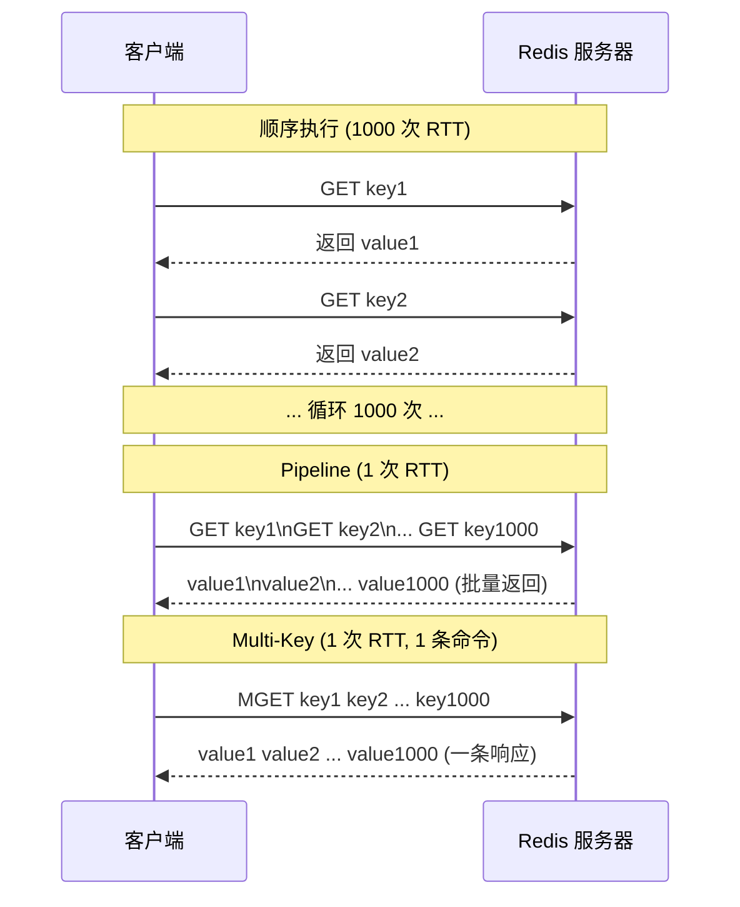
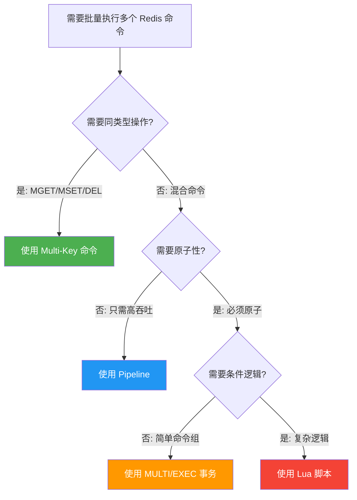

## 引言

1000 次 Redis 命令 = 30 秒？Pipeline 让它变成 0.1 秒。

在高并发和分布式系统的世界里，性能优化是一个永恒的话题。Redis 的"单线程模型"和"基于内存"特性让其具备了极高的读写速度，但即使单个命令再快，如果需要连续执行大量命令，一个常被忽视却对整体性能影响巨大的瓶颈就会显现——**网络延迟（RTT）**。

每一个"发送命令 → 服务器处理 → 返回结果"的循环都包含一个不可忽略的网络往返时间。在高并发场景下，执行 1000 个简单命令，最直观的方式是循环 1000 次独立的请求-响应，总耗时将是 `1000 × RTT`。累积的 RTT 将成为压垮性能的元凶。

> 💡 **核心提示**：Redis 批量操作的本质就是**减少网络往返次数（RTT）**。即使 Redis 处理单个命令只需几微秒，RTT 通常为 0.1~1 毫秒（局域网），1000 次独立请求就是 100~1000 毫秒的纯网络开销。批量操作能把这个开销降低到原来的千分之一。

### 不同批量模式的 RTT 对比



### 四种核心批量操作机制

#### Pipelining (管道)

* **概念与原理：** Pipelining 是**客户端**的一种优化行为。客户端连续发送多个命令到服务器的缓冲区，不等待每个命令的响应。服务器依次执行后，将所有响应一次性批量返回。

* **优势：** **最直接有效的吞吐量提升手段**。通过摊薄 RTT 成本，让服务器的处理能力成为瓶颈而非网络延迟。

* **局限性：** **不保证原子性**。管道中命令依次执行，任一命令失败仅该命令返回错误，其他命令继续执行。客户端和服务器都需要额外内存来缓冲命令和响应。

> 💡 **核心提示**：Pipeline 的本质是**客户端将多个命令打包到一个 TCP 包（或少数几个包）中发送**，服务器批量处理后也打包返回。理论上，Pipeline 可以将 QPS 提高到接近 `1 / (命令执行时间)` 的水平，远高于 `1 / (命令执行时间 + RTT)`。但 Pipeline 中的命令数量不宜过多，否则客户端和服务器的缓冲内存会过大，甚至导致 OOM。

#### Multi-Key Commands (多键命令)

* **概念与原理：** Redis 提供的内置命令，允许一次性操作多个 Key。如 `MGET`、`MSET`、`DEL`、`HMGET` 等。这是一个**原子**的 Redis 命令。
* **优势：** **单个 RTT** 完成多键操作，命令本身具有原子性。
* **局限性：** **命令类型受限**，只能使用 Redis 提供的特定多键命令。
* **适用场景：** 获取/设置多个 String Key（MGET/MSET）、批量删除（DEL）、操作同一 Hash Key 的多个 Field。

#### Transactions (事务)

* **概念与原理：** 使用 `MULTI` 开始事务，后续命令进入队列直到 `EXEC` 执行。可配合 `WATCH` 实现乐观锁。
* **优势：** **提供原子性**——事务中所有命令被连续执行，不被其他命令插队。
* **局限性：** **不支持回滚**。命令执行时的运行时错误不会回滚已执行的命令。只有入队阶段的语法错误才会拒绝整个事务。
* **适用场景：** 需要保证一组相关操作的原子性，如原子地扣减库存并记录；使用 `WATCH` 实现乐观锁。

> 💡 **核心提示**：Redis 事务与传统数据库事务有本质区别——**没有回滚机制**。如果事务中某条命令执行失败（如对 String 执行 LPUSH），之前的命令依然生效，后续命令继续执行。这与 MySQL 的 ACID 事务完全不同。

#### Lua Scripting (Lua 脚本)

* **概念与原理：** 客户端将 Lua 脚本发送到 Redis，服务器使用内置 Lua 解释器执行。**整个脚本执行过程是原子性的**——执行期间 Redis 完全阻塞，不处理其他客户端的任何命令。Redis 会缓存脚本，后续通过 `EVALSHA` 直接调用 SHA1。
* **优势：** **最强的原子性保证**，**单个 RTT** 完成复杂逻辑，支持条件判断和循环。
* **局限性：** **脚本执行阻塞整个 Redis**。如果脚本执行时间过长，所有客户端都会被阻塞。

> 💡 **核心提示**：Lua 脚本的原子性来自 Redis 的**单线程执行模型**。脚本执行期间，Redis 不处理任何其他命令，因此整个脚本天然具备原子性。但这也意味着**慢脚本 = 全局阻塞**。默认 `lua-time-limit` 为 5 秒，超时后脚本会被终止。

### 选择合适批量方法的决策树



### 四种机制对比

| 特性 | Pipeline | Multi-Key Commands | Transactions (MULTI/EXEC) | Lua Scripting |
|------|----------|-------------------|--------------------------|---------------|
| **主要目标** | 提升吞吐量 | 便利批量操作 | 原子性与隔离性 | 原子性与复杂逻辑组合 |
| **原子性** | 无 | 命令内部（有限） | 排队执行（无回滚） | **脚本整体原子** |
| **RTT** | 少量（取决于批量大小） | 1 | 2 + 命令发送 | 1 (发送脚本或 SHA) |
| **实现原理** | 客户端缓冲 | 服务器内置命令 | 服务器命令排队 | 服务器执行 Lua |
| **灵活性** | 很高（任意命令组合） | 低（命令固定） | 中（无条件判断） | 很高（支持逻辑判断） |
| **Cluster 支持** | 有限（需按 slot 分组） | 有限（同 slot） | 有限 | 有限 |
| **错误处理** | 逐条检查返回 | 整体成功/失败 | 部分成功（不回滚） | 整体成功/失败 |

### 生产环境避坑指南

| 陷阱 | 场景 | 影响 | 解决方案 |
|------|------|------|---------|
| Pipeline 缓冲区溢出 | 单次 Pipeline 发送数十万条命令 | 客户端和服务器内存暴涨，可能 OOM | 分批执行，每批 100-500 条命令 |
| Cluster 下的 Pipeline | Redis Cluster 环境中 Pipeline 跨 slot 命令 | MOVED/ASK 重定向导致部分命令失败 | 按 slot 分组后分别 Pipeline，或使用 Hash Tag |
| Lua 脚本阻塞 | 包含耗时操作或大循环的脚本 | 阻塞整个 Redis 实例，所有客户端受影响 | 限制脚本执行时间，拆分复杂逻辑 |
| 事务不回滚 | MULTI/EXEC 中某命令运行时错误 | 部分命令成功、部分失败，数据不一致 | 在客户端检查每条命令的返回结果 |
| Pipeline 忘记 sync | 调用 Pipeline 方法但未调用 sync/syncAndReturnAll | 命令不会发送，客户端内存泄漏 | 确保 finally 块中调用 sync |
| Lua 混合读写 | Lua 脚本中同时执行读和写操作且依赖中间结果 | 逻辑正确但难以调试和维护 | 使用 `EVALSHA` 缓存脚本，充分测试 |
| 大批量 Multi-Key | MGET 操作数百个 Key | O(N) 时间复杂度，可能阻塞主线程 | 分批执行，每批不超过 50 个 Key |

### Java 客户端中的实现与最佳实践

**Jedis Pipeline:**
```java
Jedis jedis = new Jedis("localhost", 6379);
Pipeline pipeline = jedis.pipelined();
for (int i = 0; i < 100; i++) {
    pipeline.set("key" + i, "value" + i);
    pipeline.incr("counter");
}
List<Object> results = pipeline.syncAndReturnAll();
jedis.close();
```

**Lettuce Pipeline (异步):**
```java
RedisAsyncCommands<String, String> asyncCommands = client.connect().async();
List<RedisFuture<?>> futures = new ArrayList<>();
for (int i = 0; i < 100; i++) {
    futures.add(asyncCommands.set("key" + i, "value" + i));
    futures.add(asyncCommands.incr("counter"));
}
CompletableFuture.allOf(futures.toArray(new RedisFuture[0])).join();
```

**Multi-Key Commands:**
```java
List<String> values = jedis.mget("key1", "key2", "key3");
jedis.mset("keyA", "valueA", "keyB", "valueB");
jedis.del("key1", "key2", "keyA");
```

**Transactions:**
```java
Transaction multi = jedis.multi();
multi.incr("balance:" + userId);
multi.rpush("history:" + userId, "transfer_out:100");
List<Object> results = multi.exec();
```

**Lua Scripting:**
```java
String script = "local current = redis.call('incr', KEYS[1]) if current > tonumber(ARGV[1]) then redis.call('decr', KEYS[1]) return 0 else return 1 end";
String sha = jedis.scriptLoad(script);
Object result = jedis.evalsha(sha, Arrays.asList("counter"), Arrays.asList("100"));
```

**批量大小的选择：** 建议从几十到几百开始测试，根据网络延迟、命令类型、内存情况逐步调整。

### 行动清单

- [ ] 检查代码中循环执行 Redis 命令的地方，替换为 Pipeline
- [ ] 将 MGET/MSET 等批量命令用于同类型 Key 操作
- [ ] 对需要原子性的简单操作，使用 MULTI/EXEC 代替客户端拼装
- [ ] 对需要原子性的复杂逻辑（含条件判断），封装为 Lua 脚本并使用 EVALSHA
- [ ] 设置 Pipeline 批量上限（建议每批 100-500 条），避免缓冲区溢出
- [ ] 在 Redis Cluster 环境中，按 Hash Slot 分组后再使用 Pipeline
- [ ] 监控 Pipeline 的内存使用，避免大 Pipeline 导致 OOM

### 总结

网络延迟是影响 Redis 性能的一大杀手，而批量命令是应对这一问题的核心武器。本文深入探讨了四种主要批量机制：

| 机制 | 何时使用 | 关键注意事项 |
|------|---------|-------------|
| Pipeline | 只需高吞吐，不关心原子性 | 分批发送，注意 Cluster 下的 slot 分组 |
| Multi-Key | 同类型 Key 的简单批量操作 | 命令类型受限，但最简单 |
| MULTI/EXEC | 需要原子性，逻辑简单 | 不支持回滚，需客户端检查执行结果 |
| Lua | 需要原子性 + 复杂逻辑 | 控制执行时间，避免阻塞 |

掌握这些知识，不仅能让你在面试中对答如流，更能展现你对高性能分布式系统设计的深刻理解。
