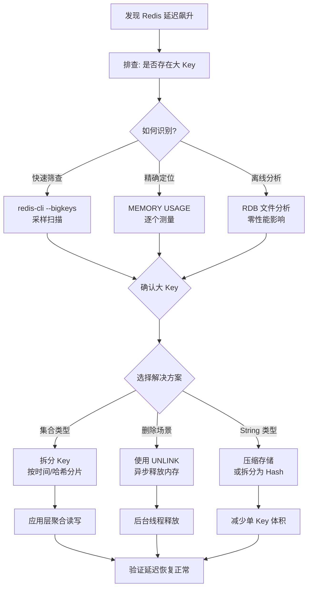
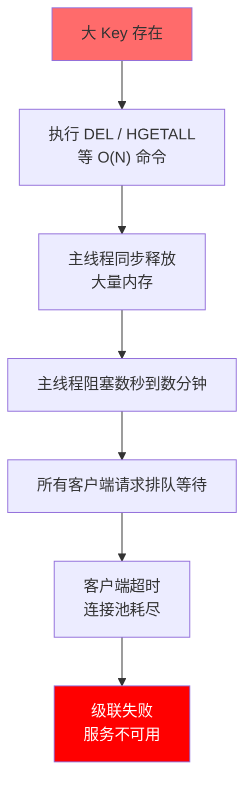
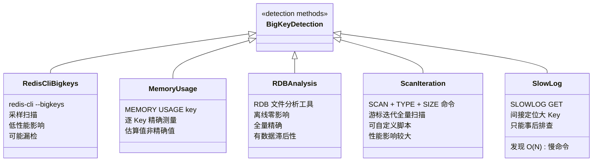

## 引言

在 Redis 的高性能光环下，"大 Key"问题就像个隐形杀手——平时悄无声息，一旦触发，轻则延迟飙升，重则阻塞整个服务。

在业务快速迭代中，开发者可能无意中将不断增长的数据（如用户消息列表、活动参与列表）塞进一个 Key 下，随着时间推移悄然膨胀成"大 Key"。对于追求卓越的中高级 Java 工程师而言，理解大 Key 的本质、危害、识别与解决方案，是保障 Redis 高可用、写出健壮代码以及应对面试经典难题的关键能力。







## 什么是大 Key？如何定义？

"大 Key"并非一个精确的统一定义，它是一个相对概念，取决于 Redis 服务器配置（内存大小、CPU 性能）、网络环境以及业务对延迟的容忍度。通常从两个维度衡量：

1. **Value 的字节数：** 对于 **String** 类型，如果 Value 字节数非常大（例如超过 **100KB** 甚至 **1MB**），就可以认为是大 Key。
2. **元素的数量：** 对于 **List、Set、Hash、Sorted Set** 等集合类型，如果包含的元素数量非常多（例如超过**几万**甚至**几十万**个元素），就可以认为是大 Key。

满足任一条件，都可能带来潜在问题。

## 大 Key 的危害：为什么它是"罪魁祸首"？

大 Key 之所以危险，根源在于 Redis 的**单线程模型**以及针对大 Key 的操作具有较高的**时间复杂度**。

> **💡 核心提示**：Redis 6.0+ 虽然引入了多线程 I/O，但**命令执行核心依然是单线程**。大 Key 的阻塞问题不会因为版本升级而消失。

### 阻塞 Redis 主线程（核心危害）

针对大 Key 的某些操作，其执行时间与 Key 的元素数量 $N$ 或 Value 的字节数 $Size$ 成正比：

| 命令 | 时间复杂度 | 说明 |
|------|-----------|------|
| `GET key` | $O(Size)$ | 获取大 String 的 Value |
| `DEL key` | $O(N/Size)$ | **同步释放**所有元素的内存，**阻塞主线程** |
| `HGETALL key` | $O(N_{field})$ | 获取大 Hash 中的所有字段和值 |
| `SMEMBERS key` | $O(N_{member})$ | 获取大 Set 中的所有成员 |
| `LRANGE key 0 -1` | $O(N_{element})$ | 获取大 List 中的所有元素 |
| `RENAME` | $O(1)$ | 仅改指针，不阻塞，但后续操作仍受影响 |

> **💡 核心提示**：`DEL` 命令阻塞主线程的根本原因是 Redis 需要**同步遍历并释放所有元素的内存**。对于包含百万个元素的 Hash，`DEL` 可能阻塞主线程数秒甚至数分钟。Redis 4.0+ 引入的 `UNLINK` 将内存释放交给**后台线程异步执行**，主线程只做解除引用操作，避免了长时间阻塞。

### 其他危害

* **内存不友好：** 挤占其他热点数据空间，可能导致频繁触发淘汰策略。大 Key 的修改或删除可能导致严重的**内存碎片**。
* **网络拥塞：** 传输大 Key 占用大量带宽，影响其他请求。
* **影响集群稳定性：** 主从全量同步时，RDB 文件中包含大 Key 传输更慢；集群槽位迁移包含大 Key 的槽位非常耗时。
* **客户端处理压力：** 客户端接收大 Key 后需要加载到内存并反序列化，可能导致客户端 OOM。

## 如何识别和发现大 Key？

发现并解决大 Key 是保障 Redis 健康运行的重要环节。

### 1. `redis-cli --bigkeys`

* **原理：** 通过**采样**（Sampling）方式扫描 Key，找到各种数据类型中最大的 Key，最后汇总报告。
* **优点：** 使用简单，对 Redis 性能影响较小。
* **局限性：** 由于是采样，可能无法发现所有的大 Key。

> **💡 核心提示**：`redis-cli --bigkeys` 只**采样 100 个 Key**（默认每 1000 个 Key 采样一次），结果仅供参考，不能保证精确性。要全面排查，需要结合其他方法。

### 2. `MEMORY USAGE` 命令

* **用法：** `MEMORY USAGE key` 返回指定 Key 使用的内存字节数。
* **优点：** 精确测量单个 Key 的内存占用。
* **局限性：** 是**估算值**而非精确值，不考虑碎片。需要对每个 Key 执行，不适合大规模扫描。

### 3. `SCAN` 结合类型命令

* **用法：** 使用 `SCAN` 游标迭代所有 Key，对每个 Key 使用 `TYPE` 判断类型，再用 `STRLEN`、`HLEN`、`LLEN`、`SCARD`、`ZCARD` 获取大小。
* **优点：** 比 `bigkeys` 更全面，可以检查所有 Key。
* **缺点：** 对 Redis 性能影响较大，尤其是在 Key 数量巨大时。

### 4. RDB 文件分析工具

* **用法：** 获取 RDB 持久化文件，使用 `redis-rdb-tools` 等工具离线解析。
* **优点：** **对在线 Redis 服务几乎零性能影响**。全面准确。
* **缺点：** 分析结果是 RDB 快照时刻的数据，存在滞后性。

### 5. 慢查询日志

* 定期检查 `slowlog get`，如果发现 `DEL`、`HGETALL` 等 $O(N)$ 命令执行时间很长，这些命令操作的 Key 很可能就是大 Key。

## 大 Key 的解决方案

### 根本方案：优化数据结构设计（治本之策）

核心思想是**将大 Key 拆分成多个小 Key**：

* **拆分大集合：** 按时间或哈希分片。例如 `user:123:feed` 拆分为 `user:123:feed:202310`、`user:123:feed:202311`，或 `user:123:feed:0` ~ `user:123:feed:N`。
* **拆分大 String：** 按字段拆分，或改用 Hash 类型存储，将对象字段作为 Hash Field。
* **使用合适的数据结构：** Bitmaps（位图，用于状态标记）、HyperLogLog（用于 UV 统计）。

**Java 应用中的拆分与聚合：**

```java
// 写入：按月分片存储用户消息
public void addMessage(long userId, Message message) {
    String month = getMonthString(message.getTimestamp());
    String key = "user:" + userId + ":messages:" + month;
    jedis.rpush(key, message.toJsonString());
}

// 读取：查询最近 N 条，需访问多个分片并聚合
public List<Message> getLastMessages(long userId, int count) {
    List<String> months = getLastMonths(count);
    List<Message> messages = new ArrayList<>();
    for (String month : months) {
        String key = "user:" + userId + ":messages:" + month;
        messages.addAll(jedis.lrange(key, 0, -1).stream()
            .map(Message::fromJsonString)
            .collect(Collectors.toList()));
    }
    return messages.stream().sorted(...).limit(count).collect(Collectors.toList());
}
```

### 缓解方案（治标）

* **使用 `UNLINK` 代替 `DEL`：**
  > **💡 核心提示**：`UNLINK` 在主线程中只做解除引用（O(1)），真正内存释放由后台 lazyfree 线程异步完成。Redis 6.2+ 还可通过 `lazyfree-lazy-eviction`、`lazyfree-lazy-expire` 等配置让过期删除和淘汰也走异步路径。

* **避免对大 Key 执行 $O(N)$ 命令：** 使用 `HSCAN`、`SSCAN`、`ZSCAN` 分批迭代获取。
* **设置合理的 Key 过期时间：** 有明确生命周期的数据必须设置 TTL。
* **限制集合大小：** 在应用层限制元素数量，达到阈值后不再添加。
* **监控和告警：** 定期运行 `redis-cli --bigkeys` 或 RDB 分析，设置延迟告警。

## Java 应用中的实践细节

### 使用 `UNLINK` 异步删除

```java
// Jedis
jedis.unlink("big_key_to_delete");

// Lettuce (异步)
redisAsyncCommands.unlink("big_key_to_delete");
```

### 使用 `SCAN` 迭代 Hash

```java
String cursor = ScanParams.SCAN_INIT_CURSOR;
ScanParams scanParams = new ScanParams().count(100);
List<Map.Entry<String, String>> allEntries = new ArrayList<>();
do {
    ScanResult<Map.Entry<String, String>> scanResult = jedis.hscan("big_hash_key", cursor, scanParams);
    allEntries.addAll(scanResult.getResult());
    cursor = scanResult.getCursor();
} while (!cursor.equals(ScanParams.SCAN_INIT_CURSOR));
```

## 面试官视角

大 Key 问题之所以是面试高频考点，因为它综合考察：

* **底层原理理解：** 单线程模型、命令复杂度、$O(N)$ 的实际含义
* **运维能力：** 如何发现问题（`bigkeys`、`SCAN`、慢查询）
* **性能优化意识：** 大 Key 是性能杀手，如何预防
* **系统设计能力：** 结合业务场景设计合理的存储方案
* **问题解决能力：** 缓解方案和根治方案的权衡

## 生产环境避坑指南

| # | 陷阱 | 后果 | 预防措施 |
|---|------|------|----------|
| 1 | **生产环境 `DEL` 大 Key** | 主线程阻塞数秒到数分钟，所有请求超时 | 删除大 Key 一律使用 `UNLINK` |
| 2 | **`KEYS *` 生产使用** | $O(N)$ 全量扫描，直接阻塞主线程 | 用 `SCAN` 替代 `KEYS`，或在从库执行 |
| 3 | **高峰期做内存分析** | `MEMORY USAGE` 全量扫描影响线上性能 | 在低峰期或使用 RDB 离线分析 |
| 4 | **拆分 Hash 过度** | Key 数量暴增，内存元数据开销反而变大 | 合理控制分片数（建议 100-1000），不宜过多 |
| 5 | **压缩带来的 CPU 开销** | 大 String 压缩/解压消耗大量 CPU | 评估压缩比 vs CPU 成本，优先选择拆分 |
| 6 | **内存碎片未清理** | 大 Key 删除后留下大量碎片，内存利用率下降 | 定期执行 `MEMORY PURGE` 或启用主动碎片整理 `activedefrag yes` |

## 核心对比表

### DEL vs UNLINK 对比

| 特性 | `DEL` | `UNLINK` | `LAZYFREE_THRESHOLD` |
|------|-------|----------|---------------------|
| **执行方式** | 同步释放内存 | 后台线程异步释放 | 超过阈值自动走 UNLINK 路径 |
| **主线程阻塞** | 是（时间取决于大小） | 否（仅解除引用 O(1)） | 64 个元素以下走 DEL，以上走 UNLINK |
| **内存回收速度** | 立即 | 异步（可能有延迟） | 可配置 `lazyfree-lazy-server-del` |
| **推荐场景** | 小 Key（< 64 元素） | **大 Key 删除首选** | 自动判断，无需手动选择 |

### 大 Key 识别方法对比

| 方法 | 覆盖范围 | 精确度 | 性能影响 | 推荐场景 |
|------|----------|--------|----------|----------|
| `redis-cli --bigkeys` | 采样 | 低 | 极低 | 快速初筛 |
| `MEMORY USAGE` | 单 Key | 中（估算） | 低 | 精确测量已知 Key |
| RDB 离线分析 | 全量 | 高 | 零（离线） | 全面排查、定期审计 |
| `SCAN` 脚本 | 全量 | 中 | 高 | 需要自定义规则时 |
| 慢查询日志 | 事后 | 中 | 无 | 事后排查、监控 |

## 总结

Redis 大 Key 问题是一个隐蔽而危险的性能陷阱。它既包含 Value 字节过大的 String，也包含元素数量巨大的集合类型。大 Key 最严重的危害在于 $O(N)$ 或 $O(Size)$ 的操作会**阻塞 Redis 主线程**，导致整个服务卡顿。

### 行动清单

1. **检查慢查询日志**：定期执行 `SLOWLOG GET 100`，排查 $O(N)$ 命令的执行时间。
2. **大 Key 删除一律用 UNLINK**：在代码中禁止对未知大小的 Key 使用 `DEL`。
3. **禁用 `KEYS *`**：全局搜索代码库，将所有 `KEYS` 替换为 `SCAN`。
4. **定期 RDB 分析**：每周使用 `redis-rdb-tools` 离线分析 RDB 文件，生成 Top 大 Key 报告。
5. **设计阶段控制 Key 大小**：在代码审查中增加大 Key 风险评估，集合类 Key 必须设定上限。
6. **配置 lazyfree 参数**：开启 `lazyfree-lazy-eviction`、`lazyfree-lazy-expire`、`lazyfree-lazy-server-del`。
7. **拆分策略验证**：大 Key 拆分后，监控内存总占用和延迟指标，确保优化效果。
8. **监控告警**：配置 Redis 延迟 P99 告警（建议阈值 > 10ms），及时发现大 Key 引发的性能问题。
