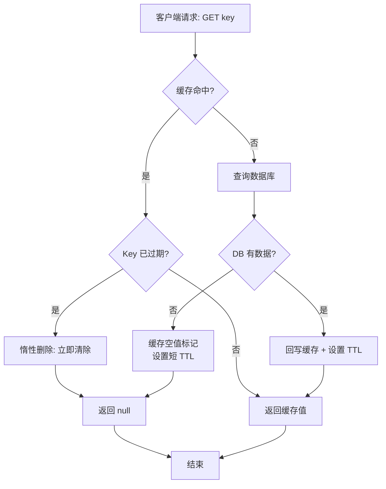
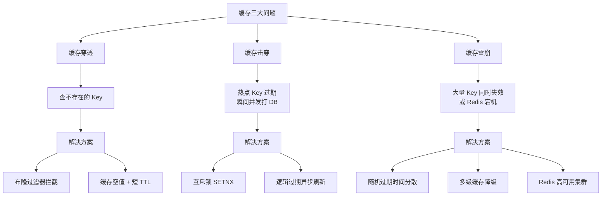
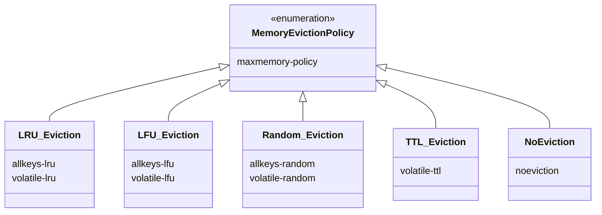

## 引言

缓存雪崩一夜之间搞垮整个系统，这三个缓存陷阱你必须知道。

在构建高并发、高可用分布式系统时，缓存是几乎无法绕过的关键组件。Redis 凭借其极致的内存速度和丰富的数据结构，成为业界最受欢迎的缓存首选。但引入缓存的同时，也带来了过期删除、内存淘汰、穿透/击穿/雪崩等一系列挑战。本文将带你深入理解 Redis 缓存的两大核心管理机制——**过期键删除**和**内存淘汰**，并逐一剖析缓存领域"经典三剑客"的底层原理与实战解决方案。掌握这些，不仅能让你设计出稳健的缓存架构，更能在面试中展现对分布式缓存的深度理解。

> **💡 核心提示**：缓存不是银弹。没有做好生命周期管理和异常防护的缓存，反而会成为系统的定时炸弹。







## Redis 缓存管理机制

使用 Redis 作为缓存，最核心的需求之一就是管理内存和数据的"新鲜度"。这就涉及到了过期键的删除和内存不足时的淘汰。

### 过期键删除策略

为什么 Key 会过期？很简单，为了让数据有生命周期，自动失效，从而释放内存空间，并保证数据的"新鲜度"（比如用户的 Session、商品的促销信息等）。

Redis 中为 Key 设置过期时间（TTL - Time To Live 或 EXPIRE / PEXPIRE 命令）后，Redis 如何知道一个 Key 是否过期了呢？每个设置了过期时间的 Key 都会被放入一个独立的字典中，记录着 Key 和它的过期时间戳（一个 long long 类型的整数）。

关键在于，Redis 如何删除这些过期的 Key？它并非简单地启动一个线程遍历所有 Key 来删除，那样太低效。Redis 结合使用了两种策略：

* **惰性删除 (Lazy Deletion):**
    * **原理：** 就像它的名字一样"懒惰"。Redis 并不会主动删除过期的 Key，而是在**每次客户端访问（GET、SET 等操作）某个 Key 时**，先检查这个 Key 的过期时间。如果发现 Key 已经过期，那么在执行命令前，Redis 会立即删除这个 Key，并返回一个表示 Key 不存在的结果。
    * **优点：** 对 CPU 非常友好。只有在 Key 被访问时才进行检查和删除，平时 CPU 开销极低。
    * **缺点：** 可能导致大量已过期但长时间未被访问的 Key 继续占用内存空间。

* **定期删除 (Active Deletion):**
    * **原理：** Redis 会周期性地（默认每秒进行 10 次）运行一个后台任务。这个任务从设置了过期时间的数据库中**随机抽取**一部分数据库，在每个数据库中**随机抽取**一部分设置了过期时间的 Key，删除其中已过期的 Key。如果本次删除中过期 Key 的比例超过 25%，任务可能再执行一次，直到过期 Key 比例低于阈值或达到 25 毫秒的时间上限。
    * **优点：** 能够有效地清理一部分过期 Key，回收内存。
    * **缺点：** 这是一个**概率性**的检查和删除过程，不能保证所有到期 Key 都能被及时删除。任务执行会占用一定的 CPU 资源。

* **组合策略的巧妙之处：** Redis 通过结合这两种策略达到平衡。**定期删除**回收大部分过期内存，**惰性删除**确保访问时不会读到过期数据。即使某些过期 Key 逃过了定期删除，最终也会在内存不足时被内存淘汰策略清理掉。

> **💡 核心提示**：惰性删除和定期删除是互补的，缺一不可。只有惰性删除会导致内存泄漏（过期数据堆积），只有定期删除会导致读到脏数据（过期 Key 未被及时清理）。两者结合，才是完整的过期键管理方案。

**面试关联点：** 面试官经常会问："Redis 的 Key 到期了，是怎么删除的？是立刻删除吗？"你需要清晰解释惰性 + 定期删除的协同机制。

### 内存淘汰策略

当 Redis 使用的内存达到 `maxmemory` 参数设定的上限，并且又有新的数据需要写入时，Redis 就需要"忍痛割爱"，根据一定的规则**淘汰**一部分现有的 Key，为新的数据腾出空间。

`maxmemory-policy` 配置选项决定了当内存不足时，Redis 会采用哪种策略来选择要淘汰的 Key：

* `noeviction`: 默认策略。内存不足时新写入操作会报错。通常不用于缓存场景。
* **LRU 系列 (Least Recently Used - 最少最近使用):**
    * `allkeys-lru`: 从所有 Key 中选择最近最少使用的 Key 进行淘汰。
    * `volatile-lru`: 从**设置了过期时间**的 Key 中选择最近最少使用的 Key 进行淘汰。
* **LFU 系列 (Least Frequently Used - 最少频率使用):**
    * `allkeys-lfu`: 从所有 Key 中选择访问频率最低的 Key 进行淘汰。
    * `volatile-lfu`: 从**设置了过期时间**的 Key 中选择访问频率最低的 Key 进行淘汰。
* `allkeys-random`: 从所有 Key 中随机选择 Key 进行淘汰。
* `volatile-random`: 从**设置了过期时间**的 Key 中随机选择 Key 进行淘汰。
* `volatile-ttl`: 从**设置了过期时间**的 Key 中，选择**剩余生存时间最短**的 Key 进行淘汰。

#### 深入理解：Redis 的 LRU 是近似算法

> **💡 核心提示**：Redis 的 LRU **不是真正的 LRU**。它使用采样近似算法（sampling），而非维护全量有序链表。精确 LRU 需要为每个 Key 维护访问顺序，每次访问都要移动节点，内存和时间开销巨大。

Redis 的近似 LRU 工作原理：

1. Redis 在 `redisObject` 的 24 位 LRU 字段中记录最后一次访问时间（以秒为单位的时钟）。
2. 配置 `maxmemory-samples` 参数（默认是 5）。
3. 当需要淘汰时，随机抽取 `maxmemory-samples` 个 Key，选择其中最近访问时间最久的那个进行淘汰。
4. 重复直到内存满足要求。

> **💡 核心提示**：24 位时钟算法的精度受限于 `maxmemory-samples`。默认 5 次采样的命中率约为精确 LRU 的 80%-90%。提高 `maxmemory-samples` 到 10 可以接近精确 LRU 的效果，但会增加 CPU 开销。

#### LFU 的频率衰减机制

LFU 比 LRU 更能体现 Key 的"热门程度"。Redis 4.0 引入的 LFU 实现有一个精妙的设计：**频率衰减**。每个 Key 的 24 位 LRU 字段被拆分为 8 位 counter（访问频率，0-255）和 16 位 ldt（最后衰减时间）。随着时间推移，counter 会自动衰减（通过 `lfu-decay-time` 配置衰减速率），避免"历史热点"永远占据内存。

#### 如何选择合适的淘汰策略？

* 如果所有 Key 都用于缓存，且希望所有 Key 都能参与淘汰：考虑 `allkeys-lru` 或 `allkeys-lfu`。通常 `allkeys-lru` 是一个不错的通用选择。
* 如果只有部分 Key 设置了过期时间，且希望优先淘汰带有时间属性的 Key：考虑 `volatile-lru`、`volatile-lfu`、`volatile-ttl`。这是最常见的缓存场景配置。
* 如果数据重要性都很随机：考虑 `random` 系列，性能开销最低。

## 经典缓存问题与解决方案

理解了 Redis 自身管理缓存的机制，我们再来看看应用层面可能遇到的三个经典问题。

### 缓存穿透 (Cache Penetration)

* **问题描述：** 客户端请求的数据**既不在缓存中，也不在后端数据库中**。例如，恶意用户持续查询一个永不存在的商品 ID。
* **危害：** 由于缓存不命中，每次请求都会穿透缓存层，直接打到数据库，可能导致数据库压力过大甚至崩溃。
* **解决方案：**
    * **缓存空结果 (Cache Null Result):** 当数据库中查询不到数据时，在缓存中存储一个特定的"空值"标记（如 `__EMPTY__`），并设置较短的过期时间。后续请求命中空值标记，直接返回，不再访问数据库。
    * **布隆过滤器 (Bloom Filter):**
        * **原理：** 布隆过滤器是一个概率型数据结构，由一个很长的二进制向量和一系列哈希函数组成。添加元素时，通过多个哈希函数将元素映射到二进制向量的多个位置并设为 1。查询时，如果所有对应位都是 1，则元素**可能**存在；如果有任意一位是 0，则元素**一定不存在**。
        * **误判率计算：** 误判率 $p \approx (1 - e^{-kn/m})^k$，其中 $k$ 是哈希函数数量，$n$ 是元素数量，$m$ 是位数组大小。对于一个容纳 1 亿元素、误判率 0.01% 的布隆过滤器，仅需约 1.7GB 内存，而缓存空值方案可能需要数十 GB。
        * **优势：** 内存效率极高，适合 Key 数量巨大的场景。

> **💡 核心提示**：布隆过滤器有一个致命限制——**不能删除元素**。因为将某一位设为 0 可能影响其他元素的判断。如果需要支持删除，必须使用 Counting Bloom Filter（每个位替换为计数器），但这会成倍增加内存开销。

### 缓存击穿 (Cache Breakdown)

* **问题描述：** 一个**非常热点**的 Key 在缓存中正好过期，大量并发请求同时涌入，全部去查询数据库。
* **危害：** 数据库在极短时间内收到大量针对同一个 Key 的请求，可能被打满甚至崩溃。
* **解决方案：**
    * **互斥锁 (Mutex):** 当第一个请求发现缓存未命中时，获取针对该 Key 的分布式锁（如 `SETNX`）。成功获取锁的请求负责去数据库加载数据并回写缓存，其他请求等待或返回旧数据。
    * **热点数据永不过期：** 将特别热点的数据设置为永不过期，依赖显式更新。简单但缺乏灵活性。
    * **逻辑过期：** 不在 Key 级别设置 TTL，而是在值内部嵌入过期时间戳。客户端发现逻辑过期后，**异步**触发后台线程更新缓存，同时返回旧数据。不阻塞客户端，但实现较复杂。

### 缓存雪崩 (Cache Avalanche)

* **问题描述：** **大量 Key** 在**同一时间**集中失效，或 Redis 服务**宕机**，导致巨大流量瞬间全部涌向数据库。
* **危害：** 数据库可能直接被打垮，形成连锁反应，整个应用系统服务中断。
* **解决方案：**
    * **Redis 高可用：** 部署 Sentinel 或 Cluster，确保 Redis 服务本身稳定。
    * **分散过期时间：** 在基础 TTL 上**加随机值**，例如 `1小时 + random(0, 5分钟)`，避免集中失效。
    * **多级缓存：** 在应用内使用进程内缓存（如 Caffeine），Redis 前面再套一层。Redis 出问题时，进程内缓存仍能承担一部分流量。
    * **服务降级或限流：** 检测到数据库压力过大时，触发熔断，牺牲部分用户体验以保护核心服务。

## Java 应用中的实践与整合

在 Java 应用中实现这些方案，需要结合 Redis 客户端库（如 Jedis 或 Lettuce）进行：

* **设置随机过期时间防雪崩：**
  ```java
  int ttl = BASE_TTL + random.nextInt(RANDOM_EXTRA_SECONDS);
  jedis.setex(key, ttl, value);
  ```
* **处理空结果：** 判断返回值是否为特定的空值标记字符串。如果是，直接返回空，不再查询 DB。
  ```java
  String value = jedis.get(key);
  if ("__EMPTY__".equals(value)) {
      return null; // 命中空值标记
  }
  ```
* **击穿互斥锁实现：** 利用 `SET key value NX EX seconds` 原子设置锁和过期时间。获取成功则查询 DB、回写缓存，最后删除锁。
  ```java
  String lockKey = "lock:" + key;
  String lockValue = UUID.randomUUID().toString();
  boolean locked = jedis.set(lockKey, lockValue, "NX", "EX", 10) != null;
  if (locked) {
      try {
          // 双重检查
          value = jedis.get(key);
          if (value == null) {
              value = loadFromDB(key);
              jedis.setex(key, TTL, value);
          }
      } finally {
          // 只有自己的锁才删除
          if (lockValue.equals(jedis.get(lockKey))) {
              jedis.del(lockKey);
          }
      }
  }
  ```
* **布隆过滤器：** 使用 Redisson 的 `RBloomFilter`。在数据写入 DB 时同步更新布隆过滤器。
  ```java
  RBloomFilter<String> bloomFilter = redisson.getBloomFilter("productFilter");
  bloomFilter.tryInit(1000000L, 0.01); // 预期 100 万元素, 1% 误判率
  bloomFilter.add(productId);
  ```

## 面试官视角

为什么这些缓存问题在面试中如此重要？因为它们是衡量一个工程师**设计高可用、高性能分布式系统能力**的试金石。面试官考察你：

* 对缓存本质和局限性的理解
* 对 Redis 内部工作机制（过期、淘汰）的掌握程度
* 分析和定位线上问题的能力
* 设计和权衡不同解决方案的能力
* 对系统稳定性的重视和保障手段

常见问法："如果你的电商系统商品详情页 QPS 很高，但数据库时不时压力过大，你会从哪些方面排查？""缓存击穿和雪崩有什么区别？怎么应对？"

## 生产环境避坑指南

| # | 陷阱 | 后果 | 预防措施 |
|---|------|------|----------|
| 1 | **大量 Key 同时过期** | 缓存雪崩，数据库被打垮 | 设置 TTL 时加随机偏移（`base + random(0, 300s)`） |
| 2 | **布隆过滤器误判** | 不存在的数据绕过过滤器打 DB | 合理配置误判率（建议 0.1%~1%），配合缓存空值兜底 |
| 3 | **互斥锁死锁** | 获取锁后异常未释放，后续请求全部阻塞 | 锁必须设置过期时间，使用 UUID 标识确保只删自己的锁 |
| 4 | **热点 Key 重建竞态** | 多个线程同时发现缓存 miss，同时查 DB | 使用双重检查（DCL）+ 分布式锁 |
| 5 | **空值缓存 TTL 过短/过长** | 过短：DB 仍被打；过长：无效数据占内存 | 根据业务场景设置 1~5 分钟，不宜超过 10 分钟 |
| 6 | **缓存与 DB 不一致** | 更新 DB 后缓存未同步，读到脏数据 | 使用 Cache Aside 模式：先更新 DB，再删除缓存（不是更新缓存） |

> **💡 核心提示**：缓存与数据库一致性的经典模式是 **Cache Aside Pattern**（旁路缓存）：读时先查缓存，miss 则查 DB 并回写；写时**先更新 DB，再删除缓存**。为什么不先删缓存再更新 DB？因为如果 DB 更新失败，缓存已被删除，后续请求会读到 DB 旧数据并回写脏缓存。

## 核心对比表

### 过期删除策略对比

| 策略 | CPU 开销 | 内存回收速度 | 数据准确性 | 适用场景 |
|------|----------|-------------|-----------|----------|
| 惰性删除 | 极低（仅访问时检查） | 慢（未被访问的过期数据不回收） | 高（访问时必定清除） | 必须配合其他策略使用 |
| 定期删除 | 中等（周期性采样检查） | 中等（概率性回收） | 中（可能漏掉部分过期 Key） | 必须配合其他策略使用 |
| 惰性 + 定期 | 低到中等 | 快（互补覆盖） | 高 | **Redis 默认方案，推荐** |

### 淘汰策略对比：LRU vs LFU vs Random

| 特性 | LRU (allkeys-lru) | LFU (allkeys-lfu) | Random (allkeys-random) |
|------|-------------------|-------------------|------------------------|
| **命中率** | 高（时间局部性好） | 最高（频率+时间衰减） | 低（随机淘汰） |
| **内存开销** | 低（24 位时钟） | 低（24 位 counter+ldt） | 无额外开销 |
| **CPU 开销** | 中（采样比较） | 中（采样+衰减计算） | 最低 |
| **适合场景** | 通用缓存 | 读热点明显的场景 | 数据重要性均匀 |
| **访问模式适应性** | "最近用过的更可能再用" | "用得多的更可能再用" | 无偏好 |

## 总结

Redis 作为缓存为我们带来了巨大的性能提升，但同时也引入了一系列挑战。过期键的**惰性删除**和**定期删除**互补协作，内存不足时的**采样近似淘汰策略**（LRU/LFU）在性能和效果间取得平衡。而**缓存穿透**（查不存在的）、**缓存击穿**（热点 Key 失效）和**缓存雪崩**（大量 Key 失效或 Redis 宕机）则需要主动设计防御体系。

### 行动清单

1. **检查过期策略**：确认生产环境 Redis 同时启用了惰性删除和定期删除（默认行为），无需额外配置。
2. **分散过期时间**：所有业务代码中设置 TTL 时必须加随机偏移，公式：`ttl = base + random.nextInt(jitter)`。
3. **选择淘汰策略**：纯缓存场景推荐 `allkeys-lru` 或 `allkeys-lfu`；混合场景推荐 `volatile-lru`。
4. **部署布隆过滤器**：对于查询不存在 Key 的场景（如恶意查询），在缓存层前部署布隆过滤器，误判率设为 0.1%~1%。
5. **实现击穿防护**：热点 Key 使用互斥锁 + 双重检查，或采用逻辑过期异步刷新方案。
6. **多级缓存架构**：核心业务在 Redis 前增加本地缓存（Caffeine），Redis 出故障时仍有兜底。
7. **缓存一致性**：严格使用 Cache Aside 模式——先更新 DB，再删除缓存，禁止"先删缓存再更新 DB"。
8. **监控告警**：配置缓存命中率监控（建议告警阈值 < 85%），定期检查慢查询日志中的缓存 miss 率。
