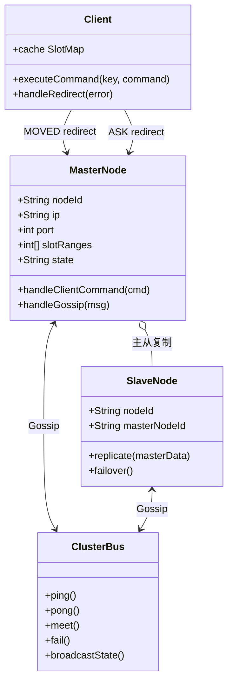
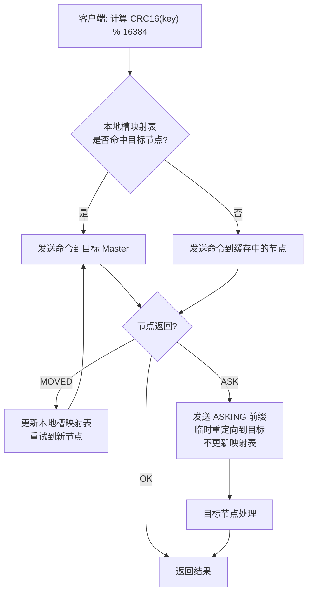
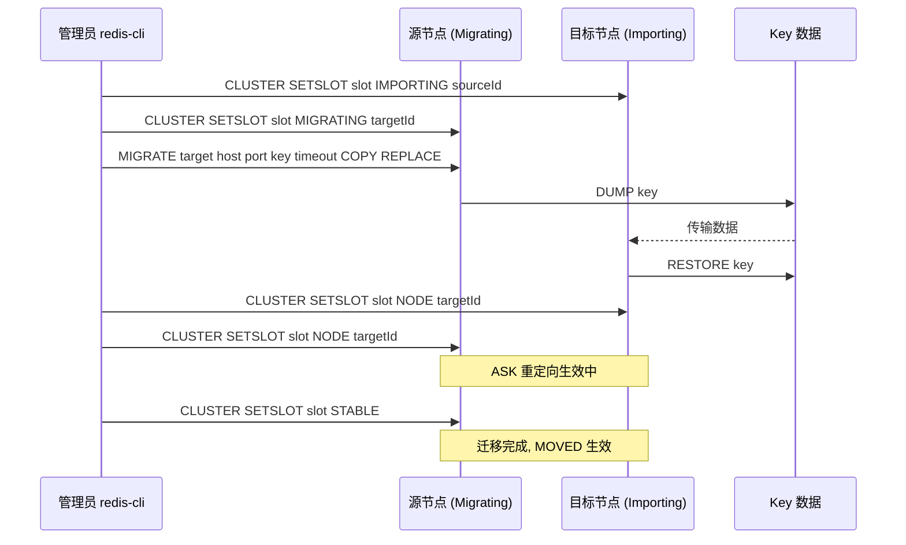

## 引言

单机 Redis 扛不住了？16384 个槽的集群方案来帮你。

单机 Redis 速度飞快，但在海量数据和高并发请求面前很快就会遇到瓶颈：内存容量有限、单线程 QPS 有上限、单点故障风险。主从复制能解决读的扩展和部分高可用，但**写入能力**和**总存储容量**依然受限于单个 Master。

Redis 3.0 引入的官方解决方案——**Redis Cluster**，通过数据分片和去中心化设计实现了真正的横向扩展和高可用。本文将深入解析 16384 个哈希槽的设计取舍、Gossip 协议的耳语传播、`-MOVED` 与 `-ASK` 重定向的本质区别，以及故障转移从 PFAIL 到 FAIL 再到选举晋升的完整流程。读完本文，你将理解为什么槽数量是 16384 而非 65536，为什么集群主节点不建议超过 1000 个，以及如何用哈希标签解决跨槽操作限制。

### 架构与数据分片：16384 个槽的魔法

Redis Cluster 将整个键空间划分为固定的 **16384** 个哈希槽，每个 Key 通过 CRC16 取模映射到某个槽，槽再分配给不同的 Master 节点。

```
slot = CRC16(key) mod 16384
```

> **💡 核心提示**：为什么是 16384 而不是 65536？16384 = 2^14，Gossip 协议传播的节点信息中需要携带槽位位图。16384 位 = 2KB，在心跳包大小和槽位精度之间取得了最佳平衡。如果设为 65536，心跳包会增大到 8KB，网络开销显著增加；如果太小（如 1024），数据分布的粒度太粗，不利于负载均衡。

**哈希标签 (Hash Tags - `{...}`)：** 强制让相关 Key 落在同一个槽。例如 `user:{1000}:session` 和 `user:{1000}:cart` 只使用 `{1000}` 部分计算槽号，确保它们在同一分片上，从而支持事务和 Lua 脚本。

**去中心化架构：** 没有 ZooKeeper、Etcd 或 Sentinel 等外部协调组件，每个节点通过集群总线（默认客户端端口 + 10000）互相通信。

### 集群架构类图



### 集群通信：Gossip 的耳语

节点之间通过集群总线使用 Gossip 协议交换信息。消息类型包括：

* **PING:** 周期性发送，探测其他节点状态。
* **PONG:** 对 PING 的回复，也可用于广播状态变更。
* **MEET:** 用于引入新节点到集群。
* **FAIL:** 标记某个节点为 FAIL 状态。

通过 Gossip 协议，集群的状态信息最终达到**最终一致性**。

> **💡 核心提示**：为什么集群主节点数量不建议超过 1000 个？Gossip 协议的消息复杂度随节点数增长，每个节点需要维护所有其他节点的状态。节点越多，心跳包传播的延迟越长，集群状态收敛越慢，CPU 和带宽开销越大。超过 1000 个 Master 节点时，Gossip 开销本身就可能成为性能瓶颈。

### 客户端交互：智能路由与重定向

客户端使用**集群感知型客户端**（如 JedisCluster、Lettuce ClusterClient），内置槽路由逻辑：

1. 发送 `CLUSTER SLOTS` 获取完整槽分配表，缓存在本地。
2. 计算 Key 的槽号 `CRC16(key) % 16384`，查找本地映射表确定目标 Master。
3. 直接发送命令到目标节点。

**`-MOVED` vs `-ASK` 重定向的本质区别：**

* **`-MOVED`：永久性重定向。** 槽的所有权已稳定转移到新节点。客户端收到后**立即更新本地槽映射表**并重试。
* **`-ASK`：临时性重定向。** 发生在槽迁移过程中。客户端收到后**只重定向当前命令**，不更新本地映射表，下次访问该槽仍会先尝试原节点。

### 客户端请求路由流程



### 高可用与故障转移

每个 Master 节点可配置一个或多个 Replica 节点异步复制数据。故障转移流程：

1. **PFAIL（疑似下线）：** 节点检测到另一节点超时未回复 PING，标记为 PFAIL。
2. **FAIL（确定下线）：** 当多数主节点都确认该节点 PFAIL 后，升级为 FAIL。
3. **选举：** 副本节点发起选举，数据最新的副本更可能胜出。
4. **晋升：** 胜出的副本晋升为 Master，接管原 Master 的所有槽。
5. **广播：** 通过 Gossip 传播新的槽分配，客户端通过 `-MOVED` 学习到新路由。

> **💡 核心提示**：故障转移依赖多数派原则。如果存活的主节点数量不足半数，即使某个节点宕机，集群也无法触发故障转移，整个集群进入不可用状态。这是牺牲分区容错性（P）来保证一致性（C）的 CP 取舍。

### 槽迁移时序图



### Redis Cluster vs 其他分片方案对比

| 特性 | Redis Cluster | Redis Sentinel | 代理方案 (Codis/Twemproxy) | 客户端分片 (Jedis Sharding) |
| :--- | :--- | :--- | :--- | :--- |
| **数据分片** | 内置哈希槽 | 无（单写入口） | 代理层分片 | 客户端计算 |
| **横向扩展** | 原生支持 | 不支持写扩展 | 支持 | 需手动重分片 |
| **高可用** | 原生故障转移 | 原生故障转移 | 代理层管理 | 无 |
| **运维复杂度** | 中 | 低 | 高（额外组件） | 低（无自动迁移） |
| **跨槽操作** | 不支持 | 支持 | 部分支持 | 不支持 |
| **客户端要求** | Cluster-aware | 普通 | 普通 | Sharding-aware |
| **推荐场景** | 大规模生产环境 | 中小规模 | 已有代理基础设施 | 简单静态分片 |

### 生产环境避坑指南

1.  **跨槽多 Key 操作报错 (CROSSSLOT)**：事务、Lua 脚本、`MGET`/`MSET` 只能在同一槽内使用。操作前务必确认所有 Key 使用哈希标签 `{...}` 强制同槽。
2.  **槽迁移期间短暂不可用**：MIGRATE 过程中该槽的写请求可能短暂受阻或返回 ASK。在大规模迁移时应分批少量槽操作，避免集中迁移导致服务抖动。
3.  **主节点过多导致 Gossip 开销爆炸**：超过 1000 个 Master 时，心跳消息占用大量带宽和 CPU。规划集群规模时控制 Master 数量。
4.  **网络分区引发脑裂**：少数派分区中的 Master 仍可能接受写请求，但数据无法同步到多数派。网络恢复后可能丢失这部分写入。需合理配置 `cluster-node-timeout`。
5.  **单个 Master 只有一个 Slave**：没有冗余的故障转移保障。如果 Slave 也宕机，该分片完全不可用。生产环境建议每个 Master 至少配置 2 个 Slave。
6.  **数据倾斜**：哈希分布不均导致某个槽数据量远超其他槽。使用 `redis-cli --cluster check` 定期检查槽分布，必要时重新均衡。

### 行动清单

1.  **检查点**：确认所有相关的多 Key 操作都使用了哈希标签 `{...}` 保证同槽。
2.  **监控槽分布**：定期检查各 Master 节点的 Key 数量和内存占用，及时发现数据倾斜。
3.  **合理设置副本数**：每个 Master 至少配置 2 个 Replica，确保故障转移冗余。
4.  **控制集群规模**：Master 节点不超过 1000 个，避免 Gossip 协议成为性能瓶颈。
5.  **压测故障转移**：模拟 Master 宕机场景，验证自动故障转移时间和数据一致性。
6.  **使用 Cluster-aware 客户端**：JedisCluster 或 Lettuce ClusterClient 自动处理路由和重定向，避免手动实现槽计算。

### 总结

Redis Cluster 通过 16384 个哈希槽实现了去中心化的数据分片和横向扩展。客户端通过本地槽映射表和 `-MOVED`/`-ASK` 重定向机制智能路由请求，节点间通过 Gossip 协议维护集群状态，主从复制配合多数派选举实现自动故障转移。理解 16384 的设计取舍、哈希标签的强制同槽能力、以及 ASK 与 MOVED 的本质区别，是在生产环境中驾驭 Redis Cluster 的关键。
