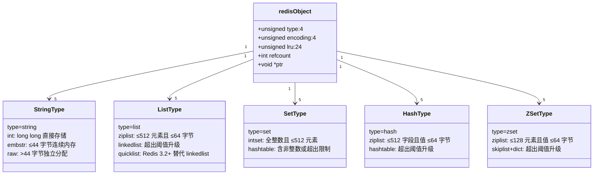
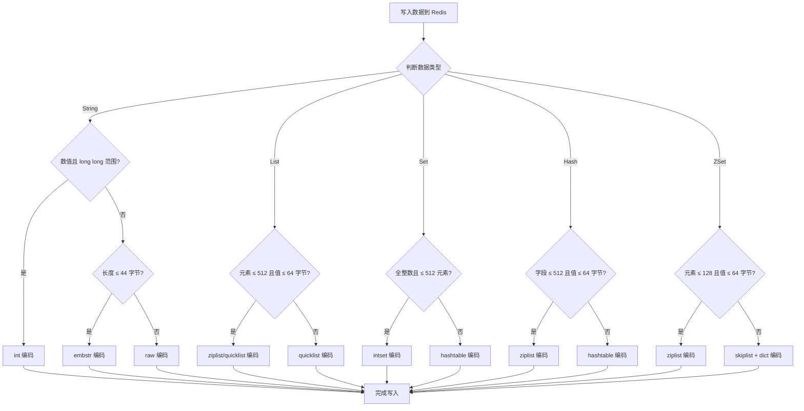

## 引言

Redis 不只是 Key-Value，它内置了 5 种数据结构。

如果你以为 Redis 只是一个简单的内存 KV 存储，那你可能浪费了它 80% 的能力。Redis 之所以能在众多缓存方案中脱颖而出，靠的不是单纯的内存速度——Memcached 同样基于内存——而是其**精心设计的 5 种内置数据结构**和**底层编码的智能切换机制**。理解这些结构，不仅仅是记住几个命令，更是理解其底层实现原理、编码选择逻辑以及性能陷阱。这对编写高效的 Redis 客户端代码、诊断线上问题和通过技术面试都至关重要。

> **💡 核心提示**：Redis 内部使用 `redisObject` 结构体（16 字节头部）来表示所有的 Key 和 Value。每个对象包含 `type`（5 种数据结构之一）和 `encoding`（底层存储编码）。同一个数据类型可能有多种编码，Redis 会根据数据特征**自动切换**，在时间和空间之间取得最优平衡。

## 理解数据结构的关键视角

为了深入理解 Redis 的数据结构，我们从以下视角进行剖析：

* **概念功能：** 它逻辑上表示什么？能解决什么问题？
* **典型应用场景：** 在 Java Web 或分布式系统中的具体应用。
* **核心命令与时间复杂度：** 不同底层实现下的复杂度，这是性能分析和面试的关键。
* **底层实现与内存优化：** 不同编码的原理和切换机制。

Redis 内部使用 `redisObject` 结构体来表示所有的 Key 和 Value，包含 `type`（类型）、`encoding`（编码）、`lru`（LRU 时间或 LFU 计数器）、`refcount`（引用计数）以及 `ptr`（指向实际数据的指针）。

## String（字符串）

* **概念：** 最基础的数据结构，可存储任何形式的二进制安全数据。最大容量 512MB。
* **应用：** 缓存序列化对象、简单 KV 存储、计数器（`INCR`/`DECR`）、限速器（`SETNX` + `EX`）。
* **核心命令与时间复杂度：**
    * `GET key`: $O(1)$
    * `SET key value`: $O(1)$
    * `INCR key`: $O(1)$
    * `GETRANGE key start end`: $O(P)$，$P$ 为子串长度
* **底层实现与内存优化：**
    * Redis 使用 **SDS（Simple Dynamic String）** 而非 C 字符串。SDS 包含 `len`（长度）、`free`（剩余空间）和 `buf`（数据），使获取长度为 $O(1)$，且避免缓冲区溢出。
    * **`int` 编码：** 数字在 `long long` 范围内时，直接用 `redisObject` 指针存储数字，零额外内存。
    * **`embstr` 编码：** 短字符串（长度 ≤ 44 字节）将 `redisObject` 头和 SDS 数据存储在同一块连续内存中。**为什么是 44 字节？** 64 位系统中，`redisObject` 占 16 字节，`sdshdr8` 头占 3 字节，加上末尾 1 字节 `\0`，剩余 64 - 16 - 3 - 1 = 44 字节。一次 `malloc` 分配，缓存局部性好。
    * **`raw` 编码：** 长字符串（> 44 字节），`redisObject` 指针指向独立的 SDS 结构，需要两次内存分配。

> **💡 核心提示**：`embstr` 编码的优势在于**一次内存分配**和**缓存局部性**。`redisObject` 和 SDS 数据在同一块连续内存中，CPU 缓存命中率更高。但 `embstr` 是只读的——一旦修改（如 `APPEND` 使其超过 44 字节），Redis 会将其转换为 `raw` 编码。

## List（列表）

* **概念：** 有序、可重复的字符串列表。支持头尾操作。
* **应用：** 简单消息队列（`LPUSH` + `BRPOP`）、用户时间线、评论列表。
* **核心命令与时间复杂度：**
    * `LPUSH` / `RPUSH`: $O(1)$
    * `LPOP` / `RPOP`: $O(1)$
    * `LLEN`: $O(1)$
    * `LRANGE key start stop`: $O(S + N)$，$S$ 为起始偏移量，$N$ 为获取数量
    * `LINDEX`: $O(N)$
    * `LREM`: $O(N)$
* **底层实现与内存优化：**
    * Redis 3.2 之前：**`ziplist`**（压缩列表）和 **`linkedlist`**（双向链表）。`ziplist` 是一块连续内存，元素紧凑，但中间插入/删除是 $O(N)$。超出阈值时升级为 `linkedlist`。
    * Redis 3.2+：**`ziplist`** 和 **`quicklist`**（快速列表）。`quicklist` 是双向链表，但每个节点是一个 `ziplist`。结合了 `ziplist` 的内存紧凑性和链表的 $O(1)$ 头尾操作。通过 `list-max-ziplist-size` 控制每个节点的 ziplist 大小。

> **💡 核心提示**：`ziplist` 在 Redis 5.0 之前存在**级联更新**（Cascading Update）问题——当某个节点的长度变化导致前后节点的 prevlen 字段需要更新时，可能引发连锁反应。Redis 5.0 引入 `ziplist-new` 结构（后改称 `listpack`），将长度信息后置，彻底解决了级联更新问题。

## Set（集合）

* **概念：** 无序、不重复的字符串集合。
* **应用：** 标签系统、共同好友（`SINTER`）、独立访客统计（UV）、数据去重。
* **核心命令与时间复杂度：**
    * `SADD` / `SREM` / `SISMEMBER` / `SCARD`: $O(1)$
    * `SMEMBERS`: $O(N)$，**慎用！** 大集合可能阻塞 Redis
    * `SINTER`: $O(N \times M)$，取决于最小集合的元素数量
* **底层实现与内存优化：**
    * **`intset` 编码：** 全整数且元素数量较少时（默认 ≤ 512），使用连续内存有序存储，二分查找 $O(\log N)$，空间效率极高。
    * **`hashtable` 编码：** 含非整数或超出限制时升级。成员作为 Key，Value 为 NULL。平均 $O(1)$ 操作。

> **💡 核心提示**：`intset` 支持**单向升级**——当插入的元素类型从 `int16` 升级到 `int32` 或 `int64` 时，需要重新分配内存并迁移所有元素。但**不支持降级**——即使删除了大元素，intset 也不会缩回到更小的整数类型。这是为了减少频繁升级/降级的开销。

## Hash（哈希）

* **概念：** Field-Value 映射，类似 Java 的 `HashMap<String, String>`。适合存储对象。
* **应用：** 用户信息（name/age/city）、产品属性、购物车（商品 ID → 数量）。
* **核心命令与时间复杂度：**
    * `HSET` / `HGET` / `HDEL` / `HLEN`: $O(1)$
    * `HGETALL`: $O(N)$，**慎用！**
    * `HMGET`: $O(M)$，$M$ 为字段数量
* **底层实现与内存优化：**
    * **`ziplist` 编码：** 字段数量少（默认 ≤ 512）且值短（默认 ≤ 64 字节）时，field 和 value 紧凑存储。查找/添加/删除为 $O(N)$，但因 ziplist 小，实际性能快。
    * **`hashtable` 编码：** 超出阈值升级。基于数组 + 链表，平均 $O(1)$。

## Sorted Set（有序集合 / ZSet）

* **概念：** 成员唯一，每个成员关联一个分数（score），按分数排序（相同分数按字典序）。
* **应用：** 排行榜、带权重任务队列、延时队列（分数 = 时间戳）。
* **核心命令与时间复杂度：**
    * `ZADD`: $O(\log N)$
    * `ZREM`: $O(\log N)$
    * `ZSCORE`: $O(1)$
    * `ZRANK`: $O(\log N)$
    * `ZRANGE`: $O(\log N + M)$
    * `ZRANGEBYSCORE`: $O(\log N + M)$
* **底层实现与内存优化：**
    * **`ziplist` 编码：** 成员少（默认 ≤ 128）且值短时，成员和分数相邻存储。$O(N)$ 操作，但因数据量小而可接受。
    * **`skiplist` + `dictionary` 编码：** 这是 ZSet 最核心的实现。
        * **跳跃表（Skiplist）：** 多层链表结构，通过在高层"跳跃"实现 $O(\log N)$ 的查找、插入、删除。支持范围查询和按分数排序。
        * **哈希表（Dictionary）：** 成员到分数的 $O(1)$ 映射。

> **💡 核心提示**：为什么 ZSet 选择 **skiplist** 而非 **红黑树**？
> 1. **范围查询效率**：Skiplist 的范围查询只需线性扫描底层链表，而红黑树需要中序遍历，skiplist 实现更简单且常数因子更小。
> 2. **实现复杂度**：红黑树的插入/删除需要多次旋转和颜色调整，代码复杂度高。Skiplist 只需修改指针，代码量约为红黑树的 1/3。
> 3. **并发友好**：Skiplist 更容易实现无锁并发操作（虽然 Redis 是单线程，但设计哲学上倾向于简洁结构）。
> 4. **内存开销**：红黑树每个节点需要存储颜色位和父指针，而 skiplist 的层数由概率决定，平均层数约为 2。

## 其他数据结构简述

* **Bitmaps（位图）：** String 的子集，看作位数组。`SETBIT`/`GETBIT`。适用于用户签到、活跃度统计。空间效率极高。
* **HyperLogLog：** 基数估算，固定约 12KB 内存，误差约 0.81%。适用于海量 UV 统计。
* **Geospatial Indexes（地理空间索引）：** 底层基于 ZSet，GeoHash 编码经纬度为 score。适用于"附近的人"、地理围栏。

## 实践中的注意事项与 Java 集成

1. **何时选择合适的数据结构？** 需要计数用 String（`INCR`）；两端操作用 List；去重用 Set；存储对象用 Hash；排序和范围查询用 ZSet。
2. **大 Key 风险：** 超大 String 或包含数百万元素的集合会阻塞 Redis（单线程执行 $O(N)$ 命令）。用 `SCAN` 系列命令替代。
3. **Key 命名策略：** 使用分隔符（如 `:`）组织 Key 空间。
4. **TTL 使用：** 合理设置过期时间，避免内存爆炸。
5. **序列化：** Java 对象存入 Redis 需要序列化（JSON/Kryo/Protobuf），选择高效序列化方式对性能影响显著。
6. **编码切换阈值配置：** 可通过 `redis.conf` 调整各编码的阈值。例如 `hash-max-ziplist-entries`、`zset-max-ziplist-entries`、`list-max-ziplist-size`。

> **💡 核心提示**：`quicklist` 的 `fill-factor` 可通过 `list-max-ziplist-size` 配置。负值表示按字节大小限制（-1: 4KB, -2: 8KB, -3: 16KB, -4: 32KB, -5: 64KB），正值表示按元素个数限制。推荐根据实际业务场景调整，过大可能导致 ziplist 级联操作（Redis 5.0 之前），过小则增加链表节点开销。

## 面试官视角

面试官重视 Redis 数据结构，考察的不仅是命令使用，更深层是：

1. **基础扎实度：** 特性、命令、复杂度掌握
2. **性能意识：** 慢命令风险、编码切换的影响
3. **问题分析能力：** 根据场景选择合适结构
4. **底层原理理解：** 有助于排查线上问题（如内存过高）

常见面试问题：
* "实现热门商品排行榜，用哪个数据结构？为什么？"
* "Set 和 List 的区别？各自适用场景？"
* "HGETALL 有什么风险？如何规避？"
* "Sorted Set 底层为什么需要跳跃表？"
* "List 什么时候从 ziplist 变成 quicklist？"

## 生产环境避坑指南

| # | 陷阱 | 后果 | 预防措施 |
|---|------|------|----------|
| 1 | **ziplist 深度嵌套** | Redis 5.0 之前插入/删除触发级联更新，CPU 飙升 | 升级 Redis 到 5.0+（使用 listpack），或控制 ziplist 大小阈值 |
| 2 | **intset 升级阻塞** | 插入超大整数时全量迁移，主线程短暂阻塞 | 预估整数范围，选择合适的初始类型；或在低峰期批量写入 |
| 3 | **Hash 字段数超阈值** | 自动从 ziplist 升级到 hashtable，内存占用突增数倍 | 监控 Hash 字段数，合理配置 `hash-max-ziplist-entries` |
| 4 | **小 ZSet 使用 skiplist** | 元素很少但使用 skiplist+dict，内存开销远高于 ziplist | 控制 ziplist 阈值，让小 ZSet 保持紧凑编码 |
| 5 | **SDS 编码差异** | 某些版本中 SDS 不以 `\0` 结尾，与 C 字符串操作混用可能出问题 | 始终通过 Redis API 操作，不要直接操作底层 SDS |
| 6 | **编码升级不可逆** | ziplist → hashtable 后不会自动降级，即使数据量变小 | 定期分析内存使用，手动重建 Key（`DUMP` + `RESTORE`）可恢复紧凑编码 |

## 核心对比表

### 5 种数据结构对比

| 数据结构 | 底层编码 | 核心操作复杂度 | 内存开销 | 典型场景 |
|---------|---------|--------------|---------|---------|
| **String** | int / embstr / raw | GET/SET $O(1)$ | int: 零额外; embstr: 一次分配; raw: 两次分配 | 缓存对象、计数器 |
| **List** | ziplist / quicklist | 头尾操作 $O(1)$; 中间 $O(N)$ | ziplist: 紧凑; quicklist: 链表+zplist | 消息队列、时间线 |
| **Set** | intset / hashtable | 增删查 $O(1)$ / $O(\log N)$ | intset: 极低; hashtable: 中等 | 标签、UV、去重 |
| **Hash** | ziplist / hashtable | 字段操作 $O(1)$ / $O(N)$ | ziplist: 紧凑; hashtable: 较大 | 对象存储、购物车 |
| **ZSet** | ziplist / skiplist+dict | 增删 $O(\log N)$; 查分数 $O(1)$ | ziplist: 紧凑; skiplist: 较高 | 排行榜、延时队列 |

### 编码切换阈值汇总

| 类型 | 紧凑编码 | 升级条件 | 配置参数 |
|------|---------|---------|---------|
| String | embstr | 长度 > 44 字节 | 固定（无配置项） |
| List | ziplist → quicklist | 元素 > 512 或值 > 64 字节 | `list-max-ziplist-size` |
| Set | intset → hashtable | 含非整数或元素 > 512 | `set-max-intset-entries` |
| Hash | ziplist → hashtable | 字段 > 512 或值 > 64 字节 | `hash-max-ziplist-entries` |
| ZSet | ziplist → skiplist | 元素 > 128 或值 > 64 字节 | `zset-max-ziplist-entries` |

## 总结

Redis 的核心数据结构是其功能的基石和性能的保证。String、List、Set、Hash、Sorted Set 各有其独特的概念、丰富的命令和典型的应用场景。更重要的是，它们灵活多变的底层编码体现了 Redis 在空间和时间效率上的极致追求。理解这些编码的切换机制和原理，能帮助你在生产环境中做出更优的设计决策。

### 行动清单

1. **审查数据结构使用**：检查项目中是否有用 String 存储 JSON 对象的情况，考虑改用 Hash 减少内存开销。
2. **监控编码升级**：使用 `OBJECT ENCODING key` 检查关键 Key 的编码状态，确认是否发生了意料之外的升级。
3. **调整编码阈值**：根据业务数据特征，合理配置 `hash-max-ziplist-entries`、`zset-max-ziplist-entries` 等参数。
4. **避免 $O(N)$ 命令**：全局搜索代码中的 `KEYS`、`SMEMBERS`、`HGETALL`，替换为 `SCAN` 系列命令。
5. **升级 Redis 版本**：确保使用 Redis 5.0+ 以避免 ziplist 级联更新问题，获得 listpack 优化。
6. **序列化优化**：选择高效的序列化方案（Kryo/Protobuf 优于 JSON），String 小对象利用 embstr 编码优势。
7. **内存审计**：定期使用 `MEMORY USAGE key` 分析 Top Key 的内存占用，识别潜在的大 Key 和编码浪费。
8. **理解不可逆升级**：认识到编码升级（ziplist → hashtable）是不可逆的，在容量规划时预留余量。
