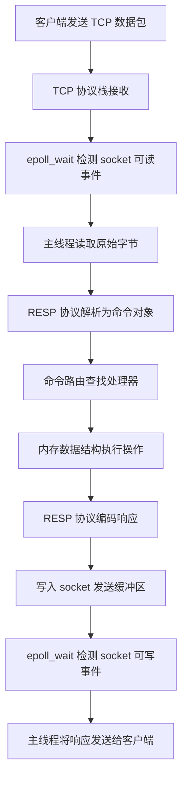
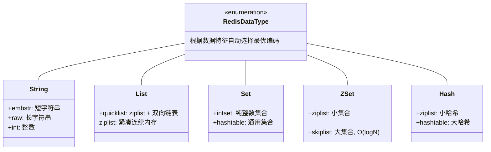
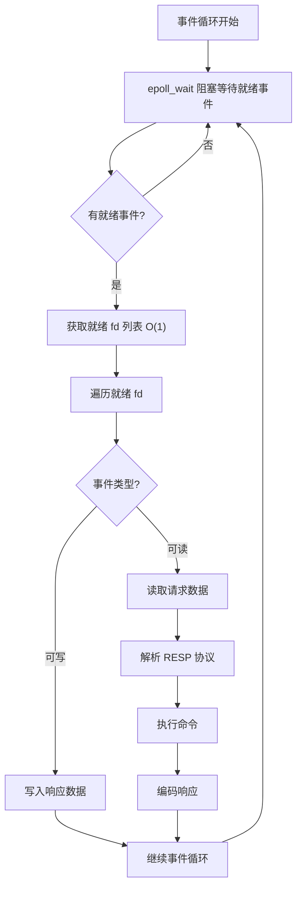

## 引言

Redis 为什么能到每秒 10 万 QPS？这 6 个设计缺一不可。

作为 Java 工程师，Redis 几乎是日常工作中不可或缺的伙伴。无论是作为极速缓存、分布式锁的基石，还是消息队列的缓冲区，我们都受益于它的闪电般的速度。但"Redis 很快"这句口头禅背后，究竟隐藏着哪些硬核技术？深入理解这一点，不仅能帮助你更高效地使用 Redis、避免踩坑，更能让你在技术面试中展现出对系统底层原理的深刻洞察力。

本文将带你剥开现象看本质，深度解析 Redis 为什么如此之快，以及这种"快"的边界在哪里。

> 💡 **核心提示**：Redis 的"快"并非单一因素决定，而是**基于内存 + 单线程无锁 + I/O 多路复用 + 高效数据结构 + 简洁 RESP 协议 + C 语言底层优化**六大设计协同作用的结果。缺少任何一个环节，都无法达到 10 万 QPS 的极致性能。

### 一条命令的完整生命周期

从客户端发出 `GET user:1001` 到收到响应，Redis 内部经历了什么？

### 为什么 Redis 这么快：六大核心因素

#### 基于内存操作 (In-Memory)

* **原理：** Redis 将绝大部分数据存储在主机的 RAM 中，而不是像传统数据库那样存储在磁盘上。
* **贡献速度：** 内存的访问延迟在**纳秒（ns）**级别，而高性能 SSD 在**微秒（μs）**级别，传统机械硬盘在**毫秒（ms）**级别。这种物理介质上的数量级差异，奠定了 Redis 高速的基础。

> 💡 **核心提示**：内存访问速度大约是 SSD 的 100-1000 倍，是机械硬盘的 10 万倍以上。这就是为什么 Redis 即使什么都不优化，仅凭"数据在内存中"这一点，就已经比磁盘数据库快了几个数量级。

#### 单线程模型 (Single-Threaded Model)

* **原理：** Redis 处理客户端**命令请求**时采用**单线程模型**。同一时刻，只有一个线程在处理来自客户端的命令。
* **贡献速度：**
    * **避免上下文切换：** 多线程系统中，CPU 需要在不同线程之间频繁切换。单线程模型完全消除了这种开销。
    * **避免锁竞争：** 多线程访问共享数据需要加锁，锁的获取、释放本身是开销，还可能引发死锁。单线程天然避免了对共享数据的并发访问，无需加锁。

> 💡 **核心提示**：Redis 的"单线程"仅指**处理客户端命令请求的主线程**。Redis 在执行耗时任务时会使用**子进程**（fork 用于 RDB/AOF 重写）和**后台线程**（Lazyfree 异步删除、AOF fsync）。理解这一点是面试常考点。

#### 高效的数据结构 (Efficient Data Structures)

Redis 内置了 String、List、Set、Hash、Sorted Set 等多种针对不同场景优化的数据结构，且每种数据结构有多种底层编码实现：

这些数据结构使得大多数核心操作的时间复杂度极低：

| 数据结构 | 操作 | 时间复杂度 | 底层编码 |
|---------|------|-----------|---------|
| String | GET/SET | O(1) | embstr/raw/int |
| List | LPUSH/RPOP | O(1) | quicklist |
| Hash | HGET/HSET | O(1) | hashtable/ziplist |
| Set | SADD/SISMEMBER | O(1) | hashtable/intset |
| ZSet | ZADD/ZSCORE | O(log N) | skiplist/ziplist |

> 💡 **核心提示**：Redis 会根据存储的数据类型、数量和大小**自动选择最优编码**。例如，少于 512 个元素且每个元素小于 64 字节的 Hash 会使用 ziplist 编码，节省大量内存。

#### 非阻塞 I/O 多路复用 (I/O Multiplexing)

Redis 使用操作系统提供的 I/O 多路复用接口（Linux 的 epoll、macOS 的 kqueue），通过一个线程监听多个 socket。当某个 socket 就绪时，操作系统通知 Redis 主线程处理。

**epoll 为什么比 select/poll 快？**

| 特性 | select | poll | epoll |
|------|--------|------|-------|
| 时间复杂度 | O(n)，每次遍历所有 fd | O(n)，每次遍历所有 fd | O(1)，仅返回就绪 fd |
| 数据拷贝 | 每次调用需从用户态拷贝全部 fd 到内核态 | 同 select | 仅需一次 mmap 共享内存 |
| fd 数量限制 | 通常 1024 (FD_SETSIZE) | 无硬性限制 | 无硬性限制 |
| 适用场景 | 连接数少且活跃 | 连接数多但不推荐 | 高并发、连接数多 |

epoll 的 O(1) 事件通知意味着：即使 Redis 管理 10 万个连接，`epoll_wait` 也只会返回**实际就绪**的那几个连接，而不是遍历全部 10 万个。这正是 Redis 能同时服务海量客户端的关键。

#### 简洁高效的通信协议 (RESP)

* **原理：** Redis 使用 RESP（Redis Serialization Protocol）协议。这是一种基于文本但设计极简的协议，便于机器解析。
* **贡献速度：** 相比 XML 或 JSON 等复杂协议，RESP 的解析和序列化速度极快，占用带宽小。客户端和服务器在协议解析上花费的时间极少。

#### C 语言实现

Redis 的核心代码全部由 C 语言编写，具有高效的内存管理和较低的运行时开销，相比 Java、Python 等高级语言执行效率更高。

### 这些因素如何协同工作？

Redis 的高速是所有因素**协同作用**的结果：

* **内存**是基础，消除了磁盘延迟。
* **高效数据结构**确保单个命令执行的微观速度（O(1) 或 O(log N)）。
* **单线程模型**消除了锁和切换开销，保证命令执行的纯粹高效。
* **I/O 多路复用**让单线程能同时"照看"大量客户端。
* **简洁协议**和**C 语言**保证数据传输和底层执行的效率。
* **子进程/后台线程**分担了耗时的 I/O 和删除操作，保证主线程流畅。

### 生产环境避坑指南

单线程模型意味着**任何长时间执行的命令都会阻塞主线程**，导致所有其他客户端的命令必须等待。以下是生产环境中必须避免的陷阱：

| 陷阱 | 危险命令 | 影响 | 解决方案 |
|------|---------|------|---------|
| 全量键扫描 | `KEYS *` | O(N)，阻塞所有客户端 | 使用 `SCAN` 迭代扫描 |
| 大集合遍历 | `SMEMBERS`、`HGETALL`、`LRANGE 0 -1` | O(N)，N 大时严重阻塞 | 使用 `SSCAN`/`HSCAN`/`LRANGE` 分页 |
| BigKey 操作 | 超大 String 的 GET/SET | 内存拷贝 + 网络传输耗时 | 拆分 Key、压缩数据 |
| 慢 Lua 脚本 | 包含耗时操作或死循环的脚本 | 独占主线程 | 限制脚本执行时间、设置 `lua-time-limit` |
| 同步写盘 | `SAVE` | 完全阻塞直到写盘完成 | 使用 `BGSAVE` |
| AOF always 刷盘 | `appendfsync always` | 每个写命令都同步刷盘 | 使用 `everysec` |
| 集群大事务 | 大量命令的 MULTI/EXEC | 排队执行阻塞 | 拆分事务或使用 Lua 脚本 |

### Redis vs Memcached vs MySQL 性能对比

| 维度 | Redis | Memcached | MySQL (InnoDB) |
|------|-------|-----------|---------------|
| 数据存储 | 内存（可持久化） | 纯内存 | 磁盘（+缓冲池） |
| QPS 级别 | 10 万+ | 10 万+ | 几千~几万 |
| 读写延迟 | 亚毫秒级 | 亚毫秒级 | 毫秒级 |
| 数据模型 | 丰富（String/List/Set/Hash/ZSet/Stream） | 简单（Key-Value 字符串） | 关系型（表、行、列） |
| 持久化 | RDB + AOF | 不支持 | 原生支持 |
| 单线程/多线程 | 命令执行单线程，I/O 可多线程（6.0+） | 多线程 | 多线程 |
| 适用场景 | 缓存、会话、排行榜、分布式锁 | 简单缓存 | 核心业务数据存储 |

> 💡 **核心提示**：Redis 6.0 引入了**多线程 I/O**，但**仅用于网络数据的读取解析和响应写入，命令执行仍然是单线程**。这个设计既提升了高 QPS 场景的吞吐量，又保留了单线程无锁的优势。配置参数为 `io-threads` 和 `io-threads-do-reads`。

### Redis 快的边界：什么会让它变慢？

| 原因 | 说明 |
|------|------|
| 慢命令 | 任何 O(N) 命令在 N 很大时都会阻塞主线程 |
| BigKey | 超大 Key 的读写涉及大量内存拷贝和网络传输 |
| 网络延迟 | RTT 过大时，即使命令执行快，整体响应也慢 |
| 内存淘汰 | 频繁触发淘汰策略会消耗 CPU |
| Fork 阻塞 | 大内存数据集的 fork 操作可能产生延迟（取决于内存分配器和内核配置） |

使用 `redis-cli slowlog get` 查看慢查询日志，`redis-cli --latency` 实时监控延迟。

### 对 Java 开发者的启示

1. **避免大 Key 和慢命令**：设计缓存时避免存储过大的 Key，优先使用 `SCAN` 系列命令迭代。
2. **合理使用批量命令**：使用 Pipeline 或 Multi-Key 命令减少网络 RTT。
3. **选择合适的数据结构**：根据业务场景选择最适合的 Redis 数据结构和编码。
4. **正确配置客户端连接池**：合理设置连接池大小，充分利用 I/O 多路复用能力。
5. **关注监控和慢查询日志**：通过 `INFO`、`slowlog` 及时发现性能问题。
6. **理解 Redis 的瓶颈**：在大多数场景下，瓶颈在于**网络延迟**或**慢命令**，而非命令执行速度本身。

### 行动清单

- [ ] 使用 `redis-cli slowlog get` 检查慢查询，识别 O(N) 命令
- [ ] 用 `redis-cli --bigkeys` 扫描 BigKey，评估拆分策略
- [ ] 将生产环境中的 `KEYS *` 全部替换为 `SCAN`
- [ ] 检查 AOF 配置，确保 `appendfsync` 不是 `always`
- [ ] 对高频批量操作启用 Pipeline，减少 RTT 开销
- [ ] 评估是否需要开启 Redis 6.0+ 的多线程 I/O（`io-threads` 设置为 CPU 核心数 - 1）
- [ ] 配置监控告警，对 `blocked_clients` 和 `slowlog` 异常设置阈值

### 总结

Redis 能达到 10 万 QPS 是多个层面极致优化的结果：**内存存储**消除磁盘延迟、**单线程无锁**保证执行纯粹高效、**epoll I/O 多路复用**实现高并发连接管理、**高效数据结构**保障 O(1) 操作、**简洁 RESP 协议**减少解析开销、**C 语言**提供底层执行效率。

理解这些原理——包括其优势和局限性——对于 Java 工程师至关重要。它指导我们在实际应用中扬长避短，写出高性能、稳定的 Redis 客户端代码，并在面对分布式系统问题时拥有更深入的洞察力。
