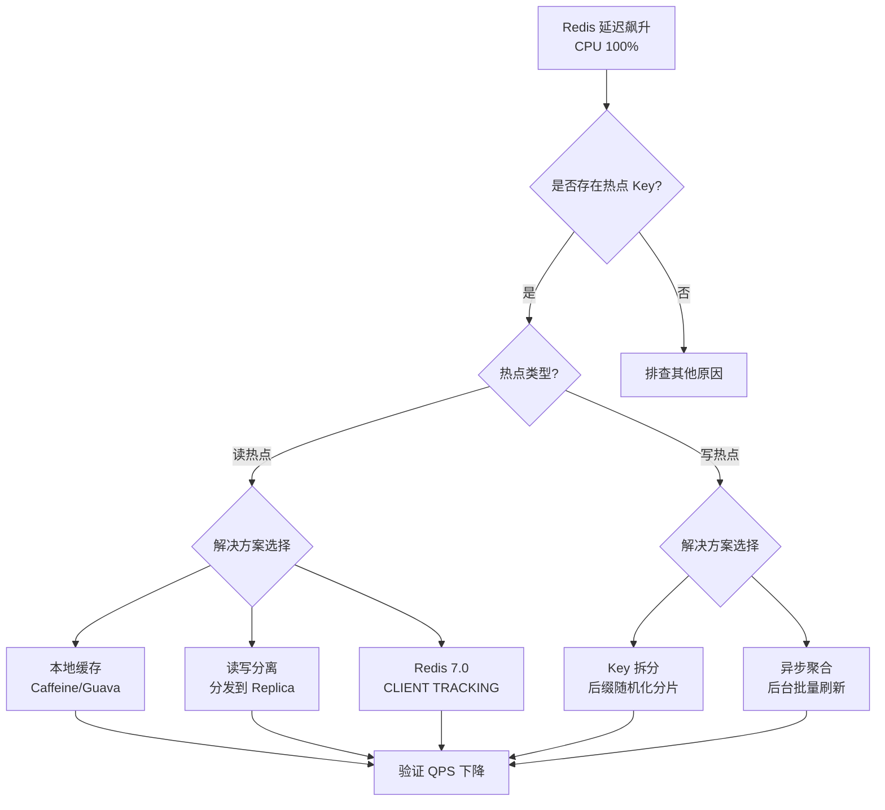
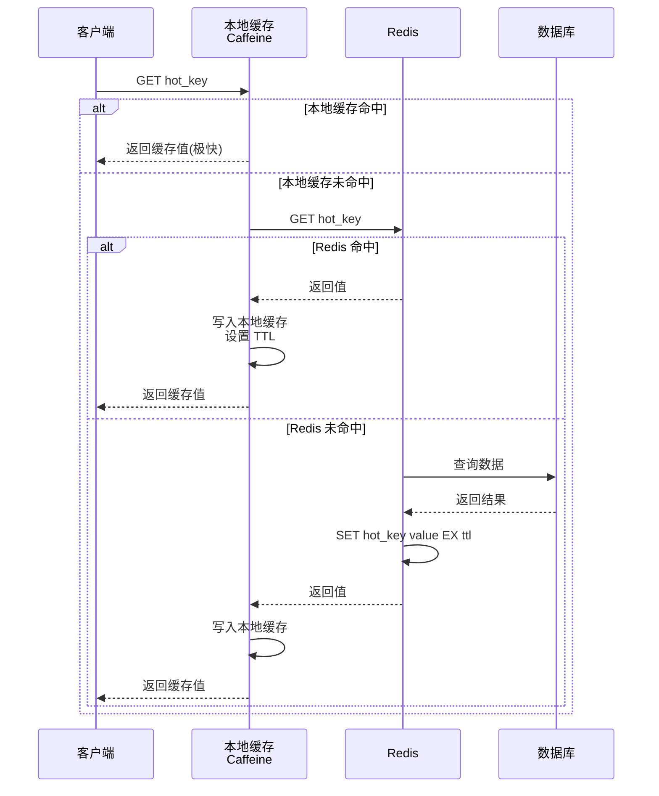
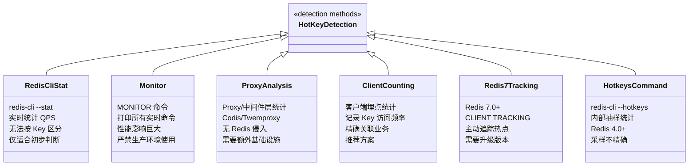

## 引言

秒杀活动把 Redis 打挂了？热点 Key 的 5 种防御方案你必须知道。

在高并发系统中，某些 Key（如秒杀商品库存、突发热点新闻）在极短时间内被极高频率地访问。这些"明星 Key"会集中打到**同一个 Redis 分片**上——因为 CRC16 哈希算法决定了同一个 Key 永远落在同一个槽位。即使单次操作只有 $O(1)$ 复杂度，当 QPS 达到数万甚至数十万时，负责该 Key 的 Redis 实例 CPU 也会瞬间 100%，进而拖累整个服务。本文将带你深入理解热点 Key 的原理、危害、识别方法与 5 种防御方案，助你从容应对高并发挑战。

> **💡 核心提示**：热点 Key 与大 Key 的危害完全不同。大 Key 是**单个命令执行时间过长**（$O(N)$）导致的阻塞；热点 Key 是**单位时间内海量 $O(1)$ 命令集中涌向同一分片**，导致主线程处理不过来。一个 Key 可以同时是大 Key + 热点 Key，但两者的应对思路截然不同。







## 热点 Key 的定义与场景

**什么是热点 Key？**

简单来说，热点 Key 就是**访问频率明显高于其他 Key** 的 Redis Key。一个 Key 每秒访问 1000 次，在总 QPS 10 万的集群中可能不算什么，但在总 QPS 仅 1 万的单实例中就是热点。

**典型场景：**

* **电商平台：** 秒杀商品库存 Key、热门商品详情页缓存
* **社交媒体：** 明星/大 V 主页缓存、热门事件讨论 Key
* **新闻资讯：** 突发热点新闻详情 Key、排行榜计数器
* **游戏：** 热门游戏排行榜 Key、稀有道具库存
* **公共服务：** 高频访问的公共配置项

## 热点 Key 的危害

### 压垮单个 Redis 分片（核心危害）

* **原理：** 无论单实例还是集群，一个 Key 总是存储在**唯一的**一个 Redis 实例或集群分片上。Redis 命令执行核心是**单线程**的，所有针对该 Key 的请求都会汇聚到同一个主线程。
* **后果：** 即使 $O(1)$ 操作，当 QPS 达到数万、数十万时，该实例 CPU 直接 100%。无法及时处理**其他 Key** 的请求，延迟飙升甚至超时。在集群模式下，单个分片过载会影响整个集群。
* **对比大 Key：** 大 Key 是单个 $O(N)$ 命令执行时间长导致阻塞；热点 Key 是海量 $O(1)$ 命令集中涌向同一分片，导致主线程忙不过来。

### 其他危害

* **网络瓶颈：** 客户端和热点 Key 所在实例间的流量剧增，消耗大量带宽。
* **触发缓存击穿：** 热点 Key 过期时，大量请求同时穿透缓存打 DB。
* **影响主从同步：** 写热点产生大量写命令，可能导致复制延迟。
* **客户端连接耗尽：** 连接池被快速占满。

## 如何识别和发现热点 Key？

### 1. 客户端统计（推荐）

在应用服务代码层面埋点，统计 Key 的访问频率（如记录 Redis 访问日志后聚合 Top N）。

* **优点：** 对 Redis 无影响，结果精确，直接关联业务 Key。
* **缺点：** 需要额外的代码埋点。

### 2. `redis-cli --hotkeys`（Redis 4.0+）

* **原理：** 内部通过抽样记录 Key 访问频率，报告 Top Key。
* **优点：** Redis 官方工具，使用简单。
* **局限性：** 基于抽样，不 100% 精确。

> **💡 核心提示**：`redis-cli --hotkeys` 基于 LFU 采样机制，采样期间的访问才会被统计。如果热点是突发性的（如秒杀瞬间），可能无法被及时捕捉。

### 3. `MONITOR` 命令（严禁生产使用！）

* 实时打印所有命令。**性能影响巨大！** 仅适用于开发环境。

### 4. Proxy/中间件监控

使用 Codis、Twemproxy、Envoy 等 Proxy 层的统计功能。

### 5. Redis 自身监控指标

观察 `instantaneous_ops_per_sec`、CPU 使用率、网络流量。某个实例指标长期居高不下，可能存在热点 Key。

### 6. Redis 7.0+ CLIENT TRACKING

Redis 7.0 引入了客户端跟踪功能，可以主动追踪 Key 的访问模式，结合 `CLIENT TRACKING INFO` 获取热点信息。

## 热点 Key 的解决方案

### 1. 客户端本地缓存（读热点首选）

> **💡 核心提示**：本地缓存的失效策略基于 **TTL 而非事件驱动**。Redis 数据更新后，本地缓存不会立即感知，需要等待 TTL 过期或主动失效。这是本地缓存最大的权衡点。

* **原理：** 在应用 JVM 内存中使用 Caffeine 或 Guava Cache 缓存热点 Key。读请求优先走本地缓存，未命中才访问 Redis。
* **优点：** 将绝大多数读请求拦截在应用内部，几乎消除 Redis 压力，访问速度极快。
* **缺点：** 存在数据一致性问题，需要合理设置过期时间或引入失效通知。

### 2. Redis 副本集读写分离

* **原理：** 读请求分发到 Master 和多个 Replica。
* **优点：** 配置简单，提高读 QPS 上限。
* **缺点：** 主从同步延迟，可能读到旧数据。只适用于读热点。

### 3. 热点 Key 拆分（写热点方案）

> **💡 核心提示**：Key 拆分会**增加内存开销**（N 个副本 Key）和**丧失原子性**（无法对拆分后的 Key 做原子操作）。适用于计数器（可聚合求和）场景，不适用于需要事务一致性的场景。

* **原理：** 将逻辑 Key 拆分为多个物理 Key，分布到不同分片。例如计数器 `item:123:count` 拆分为 `item:123:count:0` ~ `item:123:count:N-1`。写操作按规则（客户端 ID 哈希或随机）选择一个 Key，读操作聚合所有分片求和。
* **优点：** 分散写压力到多个分片。
* **缺点：** 应用层需处理拆分和聚合逻辑。

### 4. Redis Cluster 的局限性

> **💡 核心提示**：在 Redis Cluster 中，Key 的槽位由 `CRC16(key) % 16384` 决定。这意味着同一个 Key **永远**落在同一个分片上。Redis Cluster 可以分散**多个不同 Key** 到不同分片，但无法分散单个热点 Key 的压力。

* Hash Tagging `{...}` 的目的是**分组** Key（确保相同 `{id}` 的 Key 落在同一分片），而不是分散单个 Key。如果热点集中在同一个 `{id}` 上，Hash Tagging 反而加剧了问题。

### 5. 二级缓存/缓存代理

在 Redis 前面增加缓存服务或 Proxy 层，专门针对热点 Key 进行优化（如 Proxy 层本地缓存、请求限流）。

### 6. 异步更新 + 限流

* 对可接受延迟的热点数据，由后台任务定时刷新 Redis。
* 在 API 网关层对热点 Key 相关接口限流。

## Java 应用中的实践细节

### 本地缓存（Caffeine）

```java
LoadingCache<String, String> localCache = Caffeine.newBuilder()
    .maximumSize(100_000)
    .expireAfterWrite(5, TimeUnit.MINUTES)
    .build(key -> {
        String value = jedis.get(key);
        if (value != null) return value;
        value = loadFromDatabase(key);
        if (value != null) {
            jedis.setex(key, 300, value);
        }
        return value;
    });
// 使用：String hotValue = localCache.get("hot_key");
```

### Key 拆分

```java
// 写计数器（随机分片）
int shardIndex = ThreadLocalRandom.current().nextInt(NUM_SHARDS);
String counterKey = "item:123:count:" + shardIndex;
jedis.incr(counterKey);

// 读计数器（聚合求和）
long totalCount = 0;
for (int i = 0; i < NUM_SHARDS; i++) {
    String value = jedis.get("item:123:count:" + i);
    if (value != null) totalCount += Long.parseLong(value);
}
```

## 面试官视角

热点 Key 是分布式系统面试的经典题目，考察：

* **高并发系统瓶颈认知：** 流量洪峰对单点的冲击
* **Redis 原理理解：** 热点 Key 如何影响单线程和集群架构
* **问题分析能力：** 区分热点 Key、大 Key、缓存击穿
* **方案设计能力：** 多层次可落地的应对策略
* **缓存架构掌握：** 本地缓存、读写分离、分片技术

常见面试问题："秒杀系统商品库存怎么放 Redis？会有什么问题？怎么解决？""热点 Key 和 BigKey 有什么区别？"

## 生产环境避坑指南

| # | 陷阱 | 后果 | 预防措施 |
|---|------|------|----------|
| 1 | **本地缓存数据陈旧** | Redis 已更新但本地未感知，返回脏数据 | 设置合理的 TTL（不宜过长），或使用缓存失效通知机制 |
| 2 | **Key 拆分丧失原子性** | 拆分后的多个 Key 无法保证事务一致性 | 仅适用于可最终一致的场景（如计数器聚合），不适用于强一致性场景 |
| 3 | **`MONITOR` 命令生产使用** | 打印所有命令，CPU 和带宽被打满 | 严禁生产使用，用客户端埋点或 Proxy 统计替代 |
| 4 | **副本过多导致复制延迟** | 大量 Replica 增加 Master 复制负担，数据不一致 | 控制 Replica 数量（建议 ≤ 3），监控复制延迟 |
| 5 | **事故后才做热点检测** | 热点已发生，检测工具来不及反应 | 建立主动监控和预警机制，客户端持续埋点统计 |
| 6 | **读写分离读到脏数据** | 主从同步延迟导致读到旧数据，用户看到不一致 | 核心写操作走 Master，读操作评估一致性容忍度 |

## 核心对比表

### 热点 Key 解决方案对比

| 方案 | 一致性 | 实现复杂度 | 可扩展性 | 适用场景 | 推荐指数 |
|------|--------|-----------|---------|---------|---------|
| **本地缓存** | 最终一致（TTL 驱动） | 低 | 高（每个节点独立） | 读热点，可容忍短暂不一致 | ⭐⭐⭐⭐⭐ |
| **Key 拆分** | 最终一致（聚合） | 中 | 中（分片数固定） | 写热点计数器 | ⭐⭐⭐⭐ |
| **读写分离** | 最终一致（主从延迟） | 低 | 低（受限于复制） | 读热点，可容忍延迟 | ⭐⭐⭐ |
| **Replica 路由** | 最终一致 | 中 | 中 | 集群模式读热点 | ⭐⭐⭐ |
| **Redis 7.0 追踪** | 实时 | 低 | 高 | 新版本部署环境 | ⭐⭐⭐⭐ |
| **二级缓存/Proxy** | 可配置 | 高 | 高 | 大规模系统 | ⭐⭐⭐⭐ |

## 总结

Redis 热点 Key 问题源于高访问频率集中在**单个 Key** 上，导致该 Key 所在分片的主线程不堪重负。其核心危害与大 Key 不同——不是单个命令执行时间长，而是单位时间内海量命令集中涌向同一分片。

### 行动清单

1. **建立热点监控**：在客户端埋点统计 Key 访问频率，持续追踪 Top Key，而非等事故发生后排查。
2. **读热点优先本地缓存**：使用 Caffeine 配置合理的 TTL（建议 1~5 分钟），在应用层拦截大部分读请求。
3. **写热点 Key 拆分**：对计数器等场景，将逻辑 Key 拆分为 N 个物理 Key，写时随机选择，读时聚合求和。
4. **控制副本数量**：读写分离时 Replica 不超过 3 个，定期监控主从复制延迟（`INFO replication`）。
5. **禁用 `MONITOR`**：在生产环境中严格禁止使用 `MONITOR` 命令，用 Proxy 统计或客户端埋点替代。
6. **升级 Redis 7.0+**：利用 `CLIENT TRACKING` 功能主动追踪热点，配合 `--hotkeys` 抽样检测。
7. **缓存击穿防护**：热点 Key 设置逻辑过期或使用互斥锁，避免过期瞬间被击穿。
8. **架构选型评估**：根据业务对一致性的容忍度选择合适的方案，核心交易场景不建议过度依赖本地缓存。
