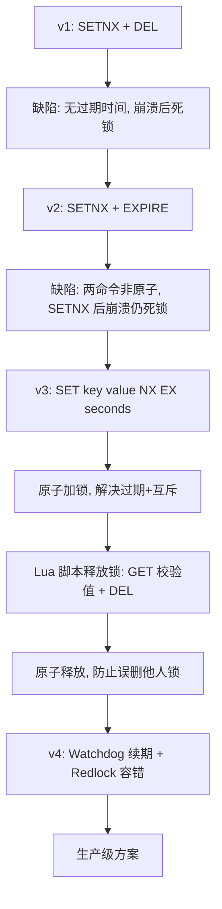
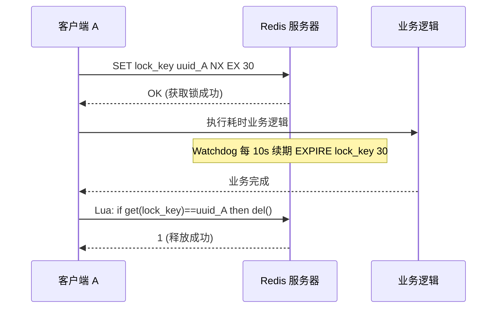
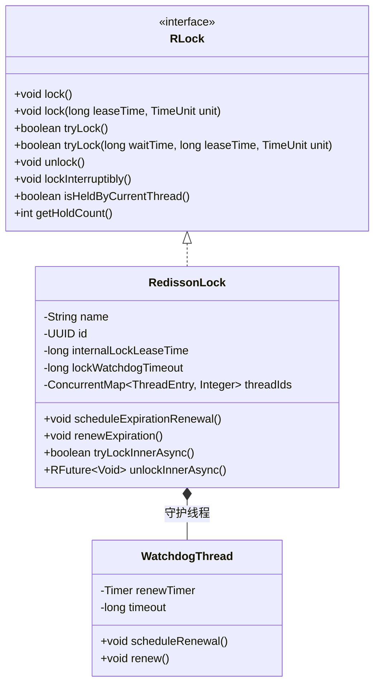

## 引言

SETNX + DEL 就能实现分布式锁？90% 的线上故障都源于这个"天真"的想法。

在单体应用时代，`synchronized` 或 `ReentrantLock` 能轻松解决多线程互斥。但在分布式架构下，同一资源可能被部署在不同服务器、不同进程的多个线程同时访问，JVM 内置锁彻底失效。此时需要一个**分布式锁**来协调跨进程、跨主机的访问。

Redis 因高性能和原子命令成为分布式锁的热门选择，但"看起来简单"往往是最危险的陷阱。本文将带你从最幼稚的 SETNX 方案出发，逐步演进到原子加锁 + Lua 安全释放 + Watchdog 续期的生产级实现，并深入剖析 Redlock 算法的争议与 Redisson 的 Watchdog 机制。读完本文，你将清楚：为什么 SETNX + EXPIRE 分开执行会死锁？为什么释放锁必须用 Lua 脚本？为什么 Martin Kleppmann 认为 Redlock 不安全？

### 分布式锁应满足的特性

一个**正确可靠**的分布式锁至少应满足以下几个特性：

1.  **互斥性 (Mutual Exclusion):** 在任何时刻，**只有一个客户端**能够成功获取锁。
2.  **避免死锁 (Deadlock Prevention):** 即使持有锁的客户端崩溃、进程被杀死或网络中断，锁最终也能被释放。通常通过为锁设置**过期时间**来实现。
3.  **容错性 (Fault Tolerance):** 只要分布式锁服务的大多数节点可用，客户端就能获取和释放锁。这对多节点锁服务（如 Redlock）很重要。
4.  **解铃还须系铃人 ("Release Only My Own Lock"):** 持有锁的客户端必须只能释放自己持有的锁，不能释放由其他客户端持有的锁。这是防止误删的关键。

### 锁的演进：从幼稚到正确

#### v1: SETNX + DEL — 无过期时间的死锁陷阱

* **加锁：** `SETNX lock_key 1`，返回 1 表示成功。
* **解锁：** `DEL lock_key`。
* **致命缺陷：** **没有过期时间！** 如果客户端在 `SETNX` 成功后、`DEL` 之前崩溃，`lock_key` 将永远存在于 Redis 中，导致**死锁**，其他客户端再也无法获取该锁。

#### v2: SETNX + EXPIRE — 非原子操作的漏洞

* **加锁：** 先执行 `SETNX lock_key 1`，成功后再执行 `EXPIRE lock_key seconds`。
* **致命缺陷：** `SETNX` 和 `EXPIRE` 是两个独立命令。如果在 `SETNX` 成功后、`EXPIRE` 执行前客户端崩溃，Key 被设置了但没有过期时间，**仍然死锁**。

#### v3: SET key value NX EX seconds + Lua — 生产级单实例方案

Redis 2.6.12 引入了 `SET` 命令的扩展参数，允许在一个命令中同时设置 Key、值、NX 条件和过期时间，实现了**原子加锁**。

* **原子加锁：**
  ```redis
  SET lock_key unique_value NX EX 30
  ```
  - `unique_value`: 唯一标识（如 UUID），是实现"解铃还须系铃人"的关键。
  - `NX`: 仅当 Key 不存在时执行，保证**互斥性**。
  - `EX 30`: 设置过期时间，保证**避免死锁**。
  - 这两个条件**原子执行**，解决了 v2 的原子性问题。

* **Lua 脚本安全释放锁：** 不能直接用 `DEL`，因为锁可能已过期并被其他客户端获取。

  ```lua
  -- keys[1]: 锁的 key 名
  -- ARGV[1]: 客户端加锁时设置的唯一值
  if redis.call('get', KEYS[1]) == ARGV[1] then
      return redis.call('del', KEYS[1])
  else
      return 0
  end
  ```

  Redis 执行 Lua 脚本是原子性的，"判断值是否匹配 + 删除"在一个脚本中完成，避免了 check-then-act 竞态。

> **💡 核心提示**：释放锁时的 Lua 脚本是生产环境最容易出问题的环节。直接用 `DEL` 会在锁过期后被其他客户端获取的情况下误删别人的锁。必须通过唯一值校验确认"这把锁还是我的"，且校验和删除必须原子执行。

* **锁续期 (Watchdog)：** 任务耗时可能超过锁过期时间，需要后台线程定期检查并续期。Redisson 的 Watchdog 每 10 秒检查一次，将锁过期时间重置为 30 秒（默认值 `lockWatchdogTimeout`）。

#### 锁演进流程图



### 正确锁流程时序图



### Redisson Lock API 架构



### Redlock 算法：多节点容错

单实例方案在 Redis Master 宕机且使用异步复制时，锁数据可能未同步到 Replica，导致锁丢失。Redis 作者 Antirez 提出了 **Redlock** 算法来解决多节点故障下的容错性。

**加锁过程：**

1. 客户端获取当前精确时间 $T_1$。
2. 客户端向 $N$ 个独立的 Redis Master（通常 $N \ge 5$）**并行**发送 `SET key unique_value NX EX timeout`（timeout 设为 50-100ms 用于快速失败）。
3. 客户端记录完成时间 $T_2$。
4. 客户端检查：
   - 是否在**大多数**实例上成功获取锁（至少 $N/2 + 1$ 个）。
   - 获取锁总耗时 ($T_2 - T_1$) 是否小于锁的有效时间。
5. 两个条件都满足则认为获取锁成功，实际有效时间 = 设定时间 - 获取耗时。
6. 任一条件不满足，立即向所有节点发送 `DEL key` 释放已获取的部分锁。

> **💡 核心提示**：Redlock 的安全性存在争议。Martin Kleppmann 指出 Redlock 依赖系统时钟同步，当发生时钟回跳或 GC 暂停时，可能出现多个客户端同时认为持有锁的情况。如果业务对锁的正确性要求极高，建议考虑 ZooKeeper 或 etcd 等基于强一致性的方案。

### Redis 分布式锁 vs ZooKeeper/Etcd 对比

| 特性 | Redis (SET NX EX) | Redis (Redlock) | ZooKeeper | Etcd |
| :--- | :--- | :--- | :--- | :--- |
| **安全性** | 中（单节点故障可能丢锁） | 高（多数派容错） | 高（CP 系统） | 高（CP 系统） |
| **性能** | 极高（内存操作） | 较高（多节点并行） | 中（磁盘 + 网络） | 中（磁盘 + 网络） |
| **复杂度** | 低 | 高（多节点管理） | 中 | 中 |
| **时钟依赖** | 是（过期时间） | 是（时间窗口计算） | 否（会话机制） | 否（Lease 机制） |
| **可重入** | 需 Redisson 支持 | 需 Redisson 支持 | 原生支持 | 原生支持 |
| **公平锁** | 需 Redisson 支持 | 需 Redisson 支持 | 原生支持 | 需实现 |
| **推荐场景** | 大多数业务场景 | 极高容错需求 | 已有 ZK 基础设施 | 已有 etcd 基础设施 |

### 生产环境避坑指南

1.  **锁未释放（缺少 finally 块）**：必须在 `finally` 中调用 `unlock()`，否则业务异常会导致锁永久持有直到过期。
2.  **误删他人锁**：直接用 `DEL key` 而不校验唯一值，在锁过期后可能删除其他客户端的锁。必须使用 Lua 脚本原子校验 + 删除。
3.  **时钟漂移导致锁提前过期**：服务器间时钟不同步可能导致锁的实际过期时间与预期不一致。使用 NTP 同步时钟或使用不依赖时钟的 Lease 机制。
4.  **Redlock 性能开销过大**：每次加锁需并行请求 5 个节点，延迟显著增加。大多数业务场景单实例 + Watchdog 已足够，不必盲目上 Redlock。
5.  **Watchdog 线程泄漏**：频繁创建锁对象但未正确关闭 RedissonClient，导致 Watchdog 线程持续运行。应在应用关闭时调用 `redisson.shutdown()`。
6.  **JVM GC 暂停导致续期失败**：长时间 Full GC 会使 Watchdog 线程无法及时续期，锁过期后被其他客户端获取。需优化 JVM 参数控制 GC 暂停时间。
7.  **锁过期时间设置不合理**：过短导致业务未完成锁就释放，过长导致故障恢复慢。应根据业务最大耗时合理设置，并利用 Watchdog 动态续期。

### 行动清单

1.  **检查点**：确认所有分布式锁的释放逻辑都在 `finally` 块中，且使用 `isHeldByCurrentThread()` 校验。
2.  **使用成熟库**：优先使用 Redisson 而非手写 SET NX EX + Lua，内置了可重入、公平锁、Watchdog 等生产级特性。
3.  **监控锁竞争**：通过 Redisson 的 metrics 监控锁获取等待时间和超时率，及时发现热点锁。
4.  **合理设置过期时间**：根据业务最坏情况设置 leaseTime，避免过短或过长。
5.  **评估 Redlock 必要性**：90% 的场景不需要 Redlock，单实例 Sentinel/Cluster 已提供足够的高可用。
6.  **压测 Watchdog 续期**：在业务峰值场景下验证 Watchdog 续期是否及时，监控 GC 暂停对续期的影响。

### 总结

Redis 分布式锁的正确实现经历了从 `SETNX` 到 `SET NX EX` 再到 Lua 脚本释放锁的演进。生产级方案必须满足三个条件：**原子加锁**（`SET key value NX EX`）、**安全释放**（Lua 脚本校验唯一值）、**锁续期**（Watchdog 自动续期）。对于大多数 Java 应用，使用 Redisson 库是性能与可靠性的最佳平衡。Redlock 虽然提供了更高容错，但其时钟依赖争议和性能开销需权衡评估。
