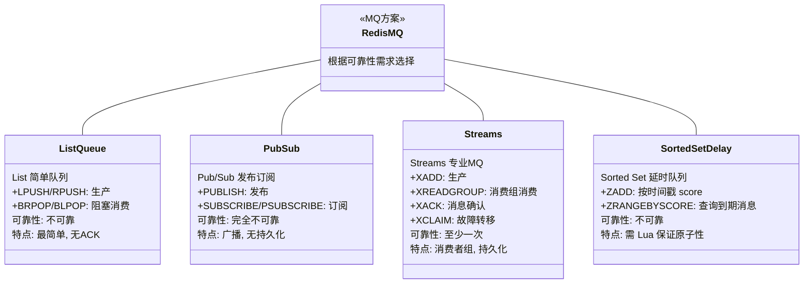
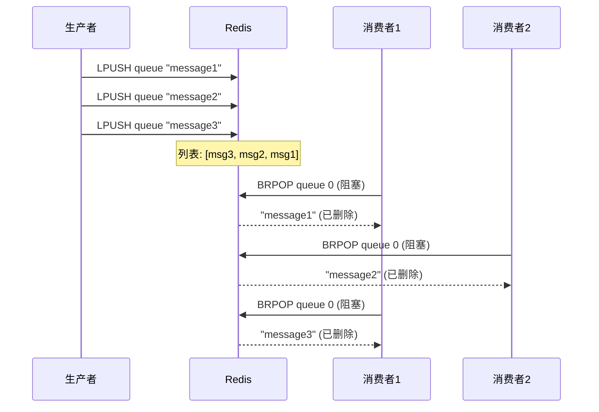
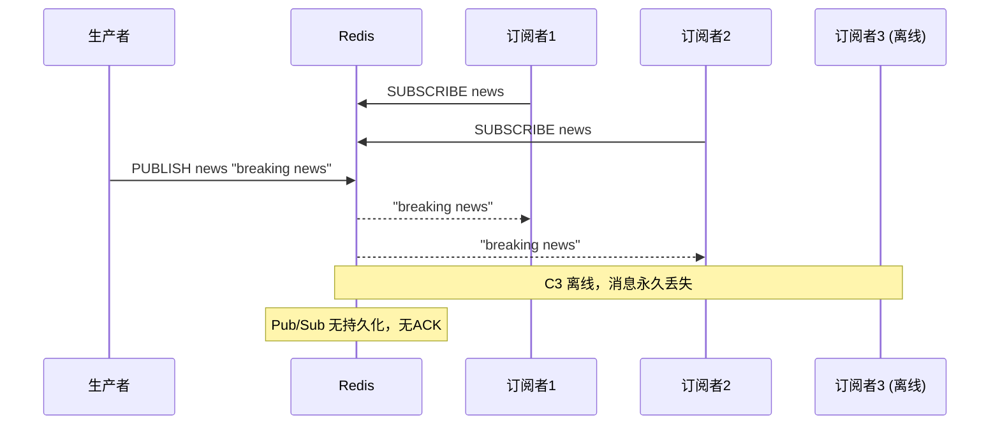
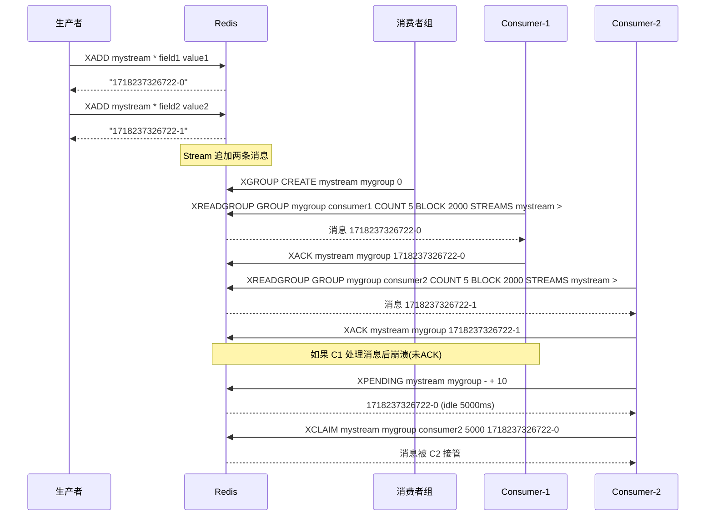

## 引言

有了 Kafka 还需要用 Redis 做消息队列吗？

在分布式系统中，消息队列（MQ）是实现系统解耦、异步通信、流量削峰和广播的基石。市面上有 Kafka、RabbitMQ、RocketMQ 等成熟的专业 MQ 产品。然而，作为高性能内存数据库的 Redis，也常被开发者"跨界"用于实现消息队列。

那么，Redis 到底能胜任 MQ 的角色吗？它是否是所有场景下的最佳选择？本文将深度解析 Redis 实现消息队列的几种方式，探讨其原理、优劣和适用场景，并对比 Redis 与专业 MQ 的差异，帮助你在实际项目中做出更明智的技术选型。

> 💡 **核心提示**：Redis 不是专业的消息队列，但它提供了**三种不同可靠性的 MQ 方案**——从"完全不可靠"的 Pub/Sub，到"至少一次"的 Streams。选型的关键不是"Redis 能不能做 MQ"，而是"你的场景需要多强的可靠性"。

### Redis MQ 方案全景



### List 作为简单队列

利用 Redis List 实现最简单的 FIFO 队列模型。

**机制：**

* **生产者：** `LPUSH` 将消息推入列表头部
* **消费者：** `BRPOP` 从列表尾部阻塞获取（先进先出）



**优劣分析：**

* **优点：** 实现极其简单，支持阻塞获取避免轮询
* **缺点：**
    * **不可靠消费：** 消息取出后即从列表删除，消费者处理前崩溃则消息**永久丢失**
    * **无消息确认 (ACK)**
    * **无广播/Fan-out：** 一条消息只能被一个消费者取走
    * **无消息历史/回溯**
    * **伸缩性有限：** 单个 List Key 承载所有消息流量

> 💡 **核心提示**：`BRPOP` 等阻塞命令**只阻塞当前客户端连接**，不会阻塞 Redis 主线程。主线程仍然可以处理其他客户端的请求。

### Pub/Sub 作为发布/订阅

利用 Redis 内置的发布/订阅功能实现广播模式。

**机制：**

* **生产者：** `PUBLISH channel message`
* **消费者：** `SUBSCRIBE channel` 或 `PSUBSCRIBE pattern`



**优劣分析：**

* **优点：** 支持广播（Fan-out），低延迟，实现简单
* **缺点：**
    * **无消息持久化（最致命）：** Redis **不存储**任何 Pub/Sub 消息。没有客户端订阅时，消息**永久丢失**
    * **无消息确认 (ACK)**
    * **无消息历史/回溯**
    * **无背压机制：** 生产者过快可能导致消费者缓冲区溢出

> 💡 **核心提示**：Pub/Sub 的消息丢失是**完全不可恢复的**。断线期间错过的消息无法找回，没有订阅者的消息直接丢弃。它适合在线聊天室、实时比分推送等"丢了就丢了"的场景，**绝不能用于业务关键消息**。

### Redis Streams 作为专业消息队列

Redis 5.0 引入的全新数据结构，专门解决 List 和 Pub/Sub 在 MQ 场景下的不足。

**核心特性：**

* **消息持久化：** 存储在内存中，可通过 RDB/AOF 持久化到磁盘
* **唯一 ID：** 每条消息分配唯一 ID（`timestamp-sequence` 格式），保证顺序
* **消费者组 (Consumer Groups)：** 多个消费者组成组，共同消费同一 Stream，天然实现负载均衡
* **消息确认 (XACK)：** 消费者处理完毕后确认，未确认消息进入 PEL（Pending Entries List）
* **故障恢复 (XCLAIM)：** 消费者崩溃后，其他消费者可接管未确认消息



**优劣分析：**

* **优点：** 支持持久化、至少一次消费、消费者组、消息确认、故障转移、消息回溯
* **缺点：** API 相对复杂，学习曲线陡峭；Redis 5.0+ 才支持；Cluster 环境下单 Stream 位于一个分片

> 💡 **核心提示**：Streams 的**消费者组**是区别于 List 和 Pub/Sub 的核心特性。组内消息**只会被一个消费者接收**（负载均衡），组间消息**互相独立**（发布/订阅）。PEL（待处理消息列表）是实现"至少一次"消费的关键——未 XACK 的消息会一直留在 PEL 中，直到被 XCLAIM 接管或 XACK 确认。

### Sorted Set 作为延时队列

利用 Sorted Set 按 Score 排序的特性实现延时消息。

* **机制：** `ZADD queue_key timestamp_score message`，消费者用 `ZRANGEBYSCORE` 查询到期消息，结合 `ZREM` 和 Lua 脚本保证原子性
* **适用场景：** 对吞吐量要求不高的简单延时任务，如定时关闭订单

### 生产环境避坑指南

| 陷阱 | 场景 | 影响 | 解决方案 |
|------|------|------|---------|
| Pub/Sub 消息丢失 | 消费者断线期间发送的消息 | 消息永久丢失，无法恢复 | 关键业务使用 Streams 替代 |
| List 无 ACK | 消费者取出消息后崩溃 | 消息永久丢失 | 应用层实现备份机制，或升级 Streams |
| Streams PEL 堆积 | 消费者处理慢，大量消息未 XACK | PEL 占用大量内存，影响性能 | 设置合理的 `xreadgroup` 超时，及时处理 |
| Streams 无死信队列 | 消息反复处理失败 | 无限重试，PEL 持续增长 | 应用层实现重试计数和死信处理 |
| List/Pub/Sub 无顺序保证 | 多个消费者竞争消费 | 消息消费顺序不可控 | 使用 Streams（同一 Stream 内有序） |
| Cluster 单 Stream 限制 | 单个 Stream 位于一个分片 | 无法跨分片横向扩展 | 应用层按业务拆分多个 Stream Key |
| 消费者组再平衡复杂 | 消费者上下线时 | 需要手动管理 PEL 和 XCLAIM | 实现健康检查和自动接管机制 |

### Redis vs 专业 MQ 对比

| 维度 | Redis List | Redis Pub/Sub | Redis Streams | Kafka | RabbitMQ |
|------|-----------|--------------|---------------|-------|----------|
| **持久化** | 依赖 AOF/RDB | 无 | 有（RDB/AOF） | 有（磁盘日志） | 有 |
| **消息可靠性** | 不可靠 | 完全不可靠 | 至少一次 | 至少一次/精确一次 | 至少一次 |
| **消息确认(ACK)** | 无 | 无 | XACK | 手动 ACK | 手动 ACK |
| **消费者组** | 需自实现 | 无 | 有（核心特性） | 有（核心特性） | 有 |
| **死信队列(DLQ)** | 无 | 无 | 需自实现 | 支持 | 支持（DLX） |
| **消息回溯** | 困难 | 无 | 有 | 有（Offset） | 有限 |
| **复杂路由** | 无 | 基于频道 | 有限 | 强大（Topic/Partition） | 强大（Exchange） |
| **消息过滤** | 无 | 模式匹配 | 有限 | 有 | 有 |
| **吞吐量** | 高 | 高 | 中高 | **极高** | 中 |
| **适用场景** | 简单任务队列 | 实时通知 | 轻量级可靠 MQ | 大数据日志/事件流 | 企业级消息路由 |

### 技术选型指南

| 核心需求 | 推荐方案 |
|---------|---------|
| 对可靠性要求极低，点对点 | List (`LPUSH` + `BRPOP`) |
| 对可靠性要求极低，需要广播 | Pub/Sub (`PUBLISH` + `SUBSCRIBE`) |
| 需要持久化、至少一次消费、消费者组 | **Redis Streams**（推荐） |
| 简单延时任务 | Sorted Set（需 Lua 保证原子性） |
| 对消息丢失零容忍、精确一次、复杂路由、海量消息 | **专业 MQ（Kafka/RabbitMQ/RocketMQ）** |

> 💡 **核心提示**：Streams 是 Redis 5.0+ 的功能。如果你的 Redis 版本低于 5.0，**无法使用 Streams**。在这种情况下，只能依靠 List 或 Pub/Sub，并在应用层自行实现可靠性保障。升级 Redis 版本是获得 Streams 能力的前提。

### Java 客户端中的实践

**List 队列：**
```java
jedis.lpush("queue", "message");
String msg = jedis.brpop(0, "queue").get(1); // 阻塞获取
```

**Pub/Sub：**
```java
jedis.subscribe(new JedisPubSub() {
    @Override
    public void onMessage(String channel, String message) {
        System.out.println("Received: " + message);
    }
}, "mychannel"); // 需要在单独线程中执行
```

**Streams：**
```java
// 生产
Map<String, String> msg = new HashMap<>();
msg.put("field1", "value1");
String id = jedis.xadd("mystream", StreamEntryID.NEW_ENTRY, msg);

// 消费组消费
List<Map.Entry<String, List<StreamEntry>>> entries =
    jedis.xreadGroup("mygroup", "consumer1", 5, 2000, new StreamEntryID(">"), "mystream");

// 确认
jedis.xack("mystream", "mygroup", id);
```

### 行动清单

- [ ] 评估当前使用 Redis 做 MQ 的场景，确认可靠性需求等级
- [ ] 如果使用 List 做队列，评估是否升级为 Streams 以避免消息丢失
- [ ] **立即停止**用 Pub/Sub 传输业务关键消息，改用 Streams 或专业 MQ
- [ ] 检查 Streams PEL 堆积情况（`XPENDING`），设置合理的超时和接管机制
- [ ] 在 Cluster 环境下，按业务拆分多个 Stream Key 以实现横向扩展
- [ ] 为 Streams 消费者实现健康检查和自动 XCLAIM 接管机制
- [ ] 对需要死信队列的场景，在应用层实现重试计数和死信处理逻辑

### 总结

Redis 可以利用多种数据结构实现消息队列，但每种方案的可靠性差异巨大：

| 方案 | 可靠性 | 核心能力 | 适用场景 |
|------|--------|---------|---------|
| List | 不可靠 | 最简单点对点 | 允许丢失的临时任务队列 |
| Pub/Sub | 完全不可靠 | 广播/Fan-out | 实时通知、在线聊天 |
| Streams | 至少一次 | 消费者组、持久化、ACK | 轻量级可靠 MQ |
| 专业 MQ | 精确一次+ | 完整 MQ 特性 | 核心业务、海量消息 |

将 Redis 用作 MQ 适合场景相对简单、对可靠性要求不高的场景。对于核心业务、高可靠性要求的场景，**专业消息队列通常是更稳妥的选择**。
