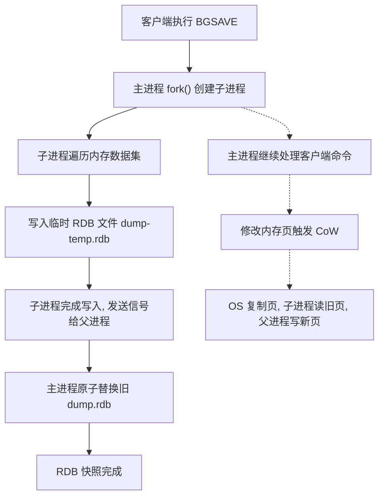
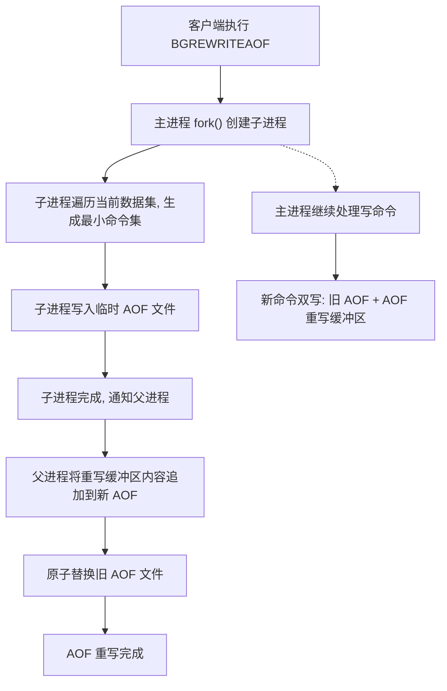
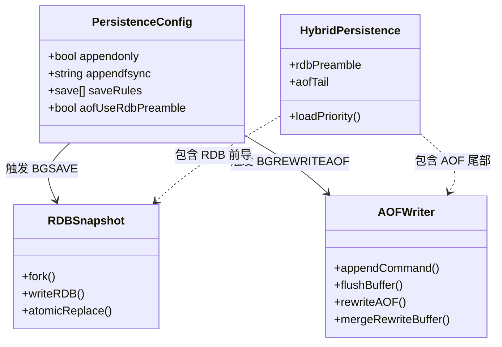

## 引言

你以为开启 AOF 就万无一失了？一次 fork() 阻塞就可能让 Redis 卡死数秒。

Redis 以内存存储的极速性能闻名，但内存数据最大的问题是**易失性**——服务器宕机或进程崩溃，数据瞬间消失。对于缓存可以接受，但对分布式锁、计数器、用户会话等需要持久化的场景，数据丢失是灾难性的。

Redis 提供了 RDB（快照）和 AOF（命令日志）两种持久化机制。理解它们的工作原理、Copy-On-Write 机制的内存翻倍风险、三种 fsync 策略的取舍，以及 Redis 4.0+ 混合持久化的优势，是构建高可靠 Redis 应用的核心能力。本文将深入解析 BGSAVE 的子进程快照过程、AOF 重写如何瘦身膨胀的日志文件、以及混合持久化如何兼顾快速恢复与数据安全。读完本文，你将清楚：为什么生产环境推荐同时开启 RDB 和 AOF？为什么 `fork()` 可能让 Redis 瞬间内存翻倍？为什么 `everysec` 是 fsync 的最优解？

### RDB 持久化：快照模式

RDB 持久化通过生成数据集的**时间点快照**来记录数据，以紧凑的二进制格式写入磁盘。

Redis 提供了两种生成 RDB 文件的方式：

1.  **`SAVE` 命令：** 同步保存，主线程阻塞直到 RDB 文件创建完成。**极少在生产环境使用**，仅用于维护期间手动备份。
2.  **`BGSAVE` 命令：** 后台保存，生产环境推荐方式。Redis 主进程调用 `fork()` 创建子进程，子进程负责写盘，主进程继续处理客户端命令。

### RDB 生成流程图



**Copy-On-Write (CoW) 机制：** `fork()` 创建子进程时，父子进程共享同一份物理内存页。当主进程修改某个内存页时，操作系统先将该页**复制**一份，父进程在新页上修改，子进程仍访问原始页。这样子进程看到的是 `fork()` 时刻的完整内存快照。

> **💡 核心提示**：`fork()` 并非零开销操作。它需要复制父进程的页表，对于大内存 Redis 实例（如 32GB+），`fork` 过程本身可能耗时几百毫秒甚至秒级，这段时间主进程**完全阻塞**。更危险的是，CoW 机制在写高峰期可能导致实际内存使用量翻倍甚至更多，可能触发 OOM Killer 杀死 Redis 进程。

### AOF 持久化：日志追加模式

AOF 持久化将每个写命令以 Redis 协议格式追加到 `appendonly.aof` 文件末尾。

工作过程分为三个环节：

1.  **命令追加：** Redis 收到写命令后先执行，再将命令追加到 AOF 缓冲区。
2.  **缓冲区同步到磁盘 (`appendfsync`)：** 根据策略将缓冲区内容同步到磁盘。
3.  **AOF 重写 (`BGREWRITEAOF`)：** 生成更小、不含冗余命令的新 AOF 文件。

### AOF 重写流程图



**三种 fsync 策略：**

| 策略 | 安全性 | 性能 | 适用场景 |
| :--- | :--- | :--- | :--- |
| `always` | 最高，几乎不丢数据 | 最低，每次写都刷盘 | 极少用于生产 |
| `everysec` | 较高，最多丢 1 秒数据 | 良好，后台线程异步刷盘 | **生产环境推荐** |
| `no` | 最低，取决于 OS | 最高，OS 控制刷盘 | 性能敏感、数据可重建 |

> **💡 核心提示**：`everysec` 是生产环境的最优平衡点。后台线程每秒刷盘一次，最多丢失 1 秒数据。如果 Redis 宕机，这 1 秒的写操作可能丢失。如果业务对数据丢失零容忍，考虑使用 `always` 或结合 RDB 快照做定时备份。

**AOF 重写为什么必要？** 随着时间推移，AOF 文件会因记录所有写命令而不断膨胀。重写时子进程遍历当前数据集，生成最小命令集（例如 100 次 `INCR foo` 重写为一条 `SET foo 100`），大幅缩减文件体积。

### 混合持久化：RDB + AOF

Redis 4.0+ 引入了混合持久化，在 AOF 重写时将当前数据集以 RDB 格式写入 AOF 文件头部（**RDB 前导**），之后增量写命令仍以 AOF 格式追加（**AOF 尾部**）。

```
AOF 文件结构:
[RDB 格式的全量数据快照][AOF 格式的增量命令]
```

**加载优先级：** 当 AOF 开启时，Redis 启动时**优先加载 AOF 文件**。如果 AOF 文件是混合格式，先加载 RDB 部分快速恢复大部分数据，再重放 AOF 增量命令恢复最新数据。只有当 AOF 文件不存在或损坏时，才会加载 RDB 文件。

### 持久化机制架构



### RDB vs AOF vs 混合持久化对比

| 特性 | RDB | AOF (everysec) | 混合持久化 (Redis 4.0+) |
| :--- | :--- | :--- | :--- |
| **数据安全性** | 低（两次快照间的数据丢失） | 高（最多丢 1 秒） | 高（最多丢 1 秒） |
| **文件大小** | 小（紧凑二进制） | 大（命令序列） | 中（RDB 前导 + AOF 增量） |
| **恢复速度** | 快（直接加载） | 慢（逐条重放） | 快（RDB 部分快 + 少量 AOF） |
| **性能影响** | fork() 时短暂阻塞 | 后台线程刷盘 | fork() 时短暂阻塞 |
| **磁盘 I/O** | 周期性全量写 | 持续追加写 | 周期性全量写 + 持续追加 |
| **生产推荐** | 单独不推荐 | 单独推荐 | **最佳方案** |

### 生产环境避坑指南

1.  **fork() 在内存受限系统上失败**：大内存 Redis 实例 `fork()` 时 CoW 可能瞬间占用大量内存，内存不足时 `fork()` 直接失败，BGSAVE/AOF 重写中止。监控 `fork` 成功率和内存使用量。
2.  **AOF 文件爆炸式增长**：高写入速率下 AOF 文件可能极速膨胀，磁盘被写满。合理设置 `auto-aof-rewrite-percentage` 和 `auto-aof-rewrite-min-size`，确保重写及时触发。
3.  **RDB 数据丢失窗口**：如果 `save` 规则间隔较长（如 15 分钟），宕机时可能丢失大量数据。根据业务容忍度调整 `save` 规则或启用 AOF。
4.  **混合持久化加载不一致**：如果 AOF 文件尾部的增量命令与前导 RDB 数据存在版本不兼容，可能导致加载失败。确保 Redis 版本一致，定期检查 AOF 文件完整性。
5.  **磁盘空间不足导致 BGSAVE 失败**：写入临时 RDB 文件时磁盘满，子进程写入失败。监控磁盘使用率，预留至少 2 倍内存大小的磁盘空间。
6.  **CoW 内存超过限制触发 OOM Killer**：写密集型场景下 CoW 导致内存翻倍，Linux OOM Killer 可能杀死 Redis 进程。设置合理的 `vm.overcommit_memory=1` 并监控 CoW 内存增长。

### 行动清单

1.  **检查点**：确认生产环境同时开启 RDB 和 AOF（`appendonly yes` + `save` 规则），启用混合持久化（`aof-use-rdb-preamble yes`）。
2.  **配置 fsync 策略**：设置为 `appendfsync everysec`，在数据安全性和性能之间取得平衡。
3.  **监控 fork() 耗时**：通过 `INFO stats` 查看 `latest_fork_usec`，如果超过 1 秒需关注。
4.  **估算磁盘空间**：预留至少 2 倍 Redis 内存大小的磁盘空间，容纳 RDB + AOF + 临时文件。
5.  **定期检查 AOF 文件大小**：如果 AOF 文件异常大，检查重写配置是否合理，手动触发 `BGREWRITEAOF`。
6.  **制定备份策略**：定期将 RDB 文件备份到异地存储，作为灾难恢复的最后防线。

### 总结

Redis 持久化是保障数据不丢失的生命线。RDB 提供紧凑快照和快速恢复，但存在数据丢失窗口；AOF 通过命令日志提供高数据安全性，但文件较大且恢复较慢；Redis 4.0+ 的混合持久化结合两者优势，是最推荐的生产方案。理解 `fork()` 的 CoW 机制及其内存翻倍风险、三种 fsync 策略的取舍、以及 AOF 重写的瘦身原理，是保障 Redis 服务稳定可靠的核心能力。
