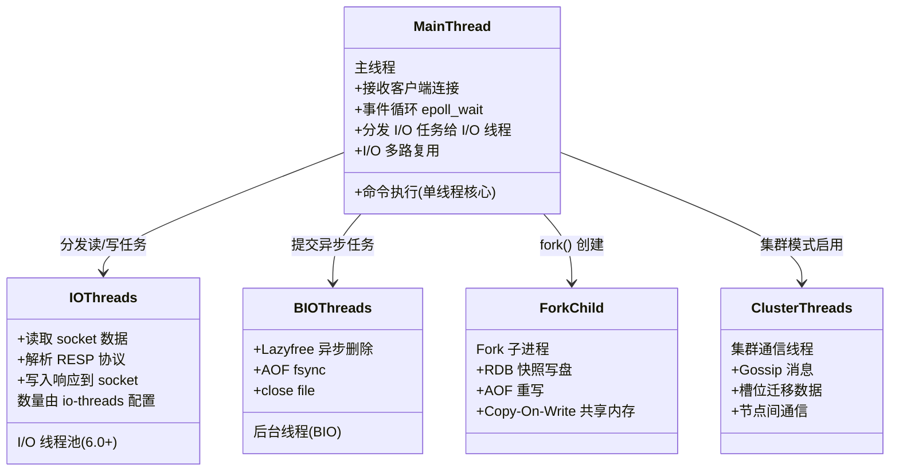
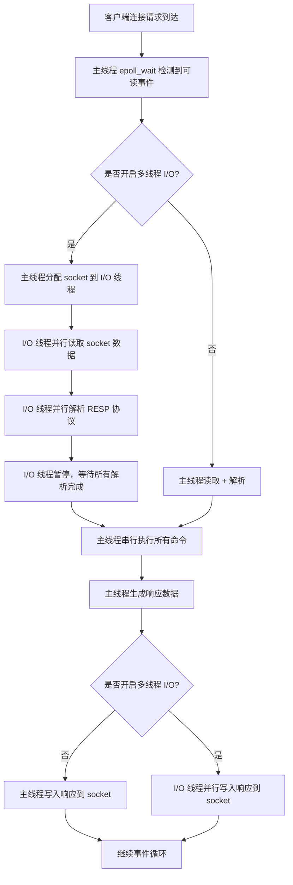
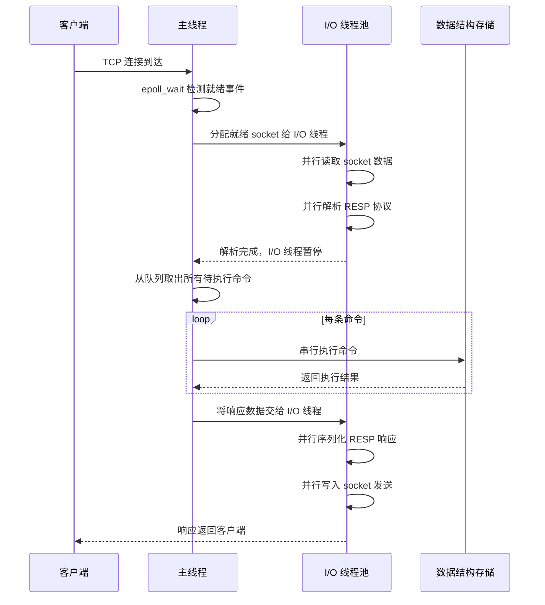
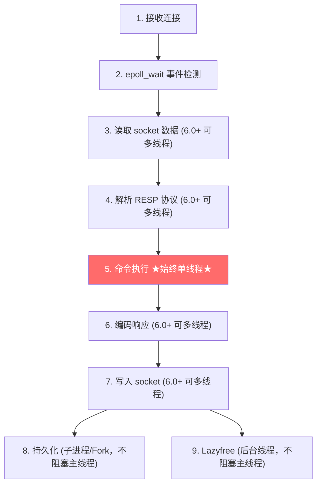

## 引言

Redis 真的是单线程吗？6.0 之后的真相让你意外。

在 Java 开发者的世界里，Redis 因其卓越的性能而闻名遐迩，"单线程"似乎成了它高性能的一张名片。但如果你认为 Redis 真的只有一个线程在工作，那就低估了这个精巧系统的复杂性。实际上，Redis 的线程模型远比表面上复杂——它是一个协调了**主线程、I/O 多线程、子进程以及后台线程**的协作体系。

> 💡 **核心提示**：Redis 的"单线程"仅指**命令执行**是单线程的。从 Redis 6.0 开始，网络数据的**读取、解析、写入**已经可以交给多个 I/O 线程并行处理。而持久化、异步删除等任务也早已通过子进程和后台线程完成。

为什么需要理解这个复杂模型？

1. 准确判断 Redis 的性能瓶颈（网络？CPU？磁盘？）
2. 避免编写或执行会阻塞 Redis 的"危险"命令
3. 理解持久化、集群、异步删除等高级特性的设计原理
4. 在面试中自信地回答 Redis 并发和性能的高阶问题

### Redis 线程模型全景

### 传统（Pre-Redis 6.0）单线程模型

在 Redis 6.0 之前，处理客户端**命令请求**的只有一个主线程，负责：

1. **接收客户端连接**：监听服务器端口
2. **监听 Socket 事件**：通过 I/O 多路复用（epoll）监听所有连接的 socket
3. **读取请求数据**：当 socket 有数据可读时读取
4. **解析请求命令**：解析 RESP 协议格式的命令
5. **执行命令**：核心单线程部分，查找处理器并执行
6. **构建并发送响应**：序列化结果并写入 socket

**非阻塞 I/O 多路复用：单线程处理高并发的关键**

Redis 主线程不是在某一个客户端 socket 上傻傻地阻塞等待，而是使用 `epoll_wait` 监听**多个** socket。当任何一个被监听的 socket 准备好时，`epoll_wait` 立即返回，告诉主线程"哪个 socket 发生了什么事"。这就是**事件循环（Event Loop）**。

**主线程的痛点与阻塞点**

主线程**一旦开始执行某个命令，就必须等待其执行完毕**才能处理下一个命令。任何耗时较长的命令都会阻塞整个服务器：

* **耗时的命令执行**：`LRANGE key 0 -1`、`HGETALL`、复杂 Lua 脚本
* **同步写盘**：`SAVE` 命令阻塞主线程直到写入完成
* **大量数据的网络读写**：大 Key 的拷贝和传输占用主线程 CPU

**子进程 (Fork) 分担重压**

执行 `BGSAVE` 或 `BGREWRITEAOF` 时，Redis 主进程调用 `fork()` 创建子进程：

* `fork()` 复制父进程的页表，父子进程**共享同一份内存数据**
* 子进程负责将数据异步写入磁盘，主进程继续处理客户端命令
* **Copy-On-Write (CoW)**：父进程修改内存页时，操作系统先复制该页，父进程在新页上修改，子进程仍然访问原始页

> 💡 **核心提示**：Fork 期间的 CoW 机制可能导致**内存瞬间翻倍**。如果物理内存不足，可能触发 SWAP，导致性能急剧下降。生产环境中要确保有足够的内存余量（建议空闲内存 > 数据集大小的 30%）。

### Redis 6.0+ 多线程 I/O 模型

随着硬件发展，当 QPS 极高时，主线程花在**读取 socket、解析协议、序列化响应、写回 socket**上的 CPU 时间成为新瓶颈。Redis 6.0 引入**多线程 I/O**来分担这些任务。

#### 分工流程

#### 关键设计决策

* **I/O 线程只负责解析，不负责执行**：网络数据的读取、RESP 协议解析、响应写入可以并行，但**命令执行必须保持单线程**。这是 Redis 设计者权衡后的结果——命令执行涉及复杂数据结构操作，改为多线程需要大量锁和并发控制，可能抵消并行带来的好处。
* **I/O 线程在读取和写入之间暂停**：所有 I/O 线程完成解析后，主线程才开始执行命令。执行完毕后再唤醒 I/O 线程写入响应。这个设计**避免了数据竞争**——在命令执行期间，I/O 线程不会触碰任何共享数据。

> 💡 **核心提示**：I/O 线程**只对网络密集型场景有帮助**，对 CPU 密集型场景（如慢命令）没有帮助。配置建议：`io-threads` 设置为服务器核心数减 1 或物理核心数的一半，**不超过 10**。通过 `io-threads-do-reads yes` 开启读取多线程。

### 其他后台线程 (Background I/O)

除了主线程和 I/O 线程，Redis 还利用后台线程处理不需要阻塞主线程的任务：

* **AOF fsync**：`appendfsync everysec` 配置下，将 AOF 缓冲区刷盘的操作由后台线程完成
* **异步删除 (Lazyfree)**：`UNLINK`、`FLUSHALL ASYNC` 等命令的内存释放由后台线程异步执行
* **集群相关**：Redis Cluster 模式下，处理节点间 Gossip 消息和槽位迁移的后台线程

### 命令执行时间线：哪些部分是单线程？哪些是多线程？

### 各版本线程模型对比

| 维度 | Pre-6.0 (单线程) | 6.0+ (多线程 I/O) | 7.0+ (函数/模块化) |
|------|-----------------|-------------------|-------------------|
| 命令执行 | 单线程 | **单线程** | **单线程** |
| 网络读取 | 主线程 | I/O 线程（可配置） | I/O 线程 |
| 协议解析 | 主线程 | I/O 线程（可配置） | I/O 线程 |
| 响应写入 | 主线程 | I/O 线程（可配置） | I/O 线程 |
| 持久化 | Fork 子进程 | Fork 子进程 | Fork 子进程 |
| 异步删除 | 后台线程 | 后台线程 | 后台线程 |
| AOF fsync | 后台线程 | 后台线程 | 后台线程 |
| 性能提升 | 基准 | 高 QPS 场景 30-50% | 函数 API 额外优化 |
| 何时启用 | 默认 | QPS > 5 万且 CPU 有空余核心 | 同 6.0 |

### 生产环境避坑指南

| 陷阱 | 场景 | 影响 | 解决方案 |
|------|------|------|---------|
| I/O 线程过多 | `io-threads` 设置为过大值 | 线程间争用，反而降低性能 | 设置为 CPU 核心数 - 1，不超过 10 |
| 忽略慢命令 | 开启多线程 I/O 后仍执行 KEYS/HGETALL | 多线程 I/O 无法解决命令执行阻塞 | 依然要排查和消除慢命令 |
| 大内存 Fork | 数据集超过 10GB 时 BGSAVE | CoW 导致内存翻倍，可能触发 OOM | 监控内存使用，确保足够余量 |
| BIO 线程覆盖不足 | UNLINK 大量大 Key | 后台线程队列积压 | 分批删除，控制删除速率 |
| 错误理解"多线程" | 认为 6.0+ 后所有操作都并行 | 实际只有 I/O 并行，命令执行仍串行 | 理解多线程 I/O 的作用范围 |
| Fork 期间写放大 | 主线程在 fork 后大量修改数据 | CoW 产生大量内存页复制 | 避免在 BGSAVE 期间大量写操作 |

### 理解线程模型对性能瓶颈的启示

| 瓶颈类型 | 判断方法 | 解决方案 |
|---------|---------|---------|
| 网络瓶颈（RTT 大） | `redis-cli --latency` 延迟高 | 优化网络、使用 Pipeline |
| 主线程 CPU 瓶颈 | `INFO commandstats`、`slowlog` | 消除慢命令、优化 BigKey |
| I/O 线程瓶颈（6.0+） | `top` 观察 CPU 利用率 > 单核 | 增加 `io-threads` 数量 |
| 内存瓶颈 | 频繁触发淘汰策略 | 调整 maxmemory、优化数据结构 |
| 磁盘 I/O 瓶颈 | `iostat` 检查磁盘性能 | 优化 AOF 策略、使用 SSD |

### 对 Java 开发者的实践指导

1. **正确认识"单线程"**：Redis 能通过 I/O 多路复用、多线程 I/O、子进程等机制充分利用多核 CPU，但**单个命令的执行不会跨越多个核心**。
2. **警惕慢命令和 BigKey**：避免存储大集合，避免执行 O(N) 命令，用 `SCAN` 替代 `KEYS`。
3. **合理使用批量操作**：Pipeline 能有效降低 RTT，充分利用 Redis 的 I/O 多路复用能力。
4. **配置客户端连接池**：复用 TCP 连接，配合 Redis 的 I/O 多路复用高效处理。
5. **理解伸缩性**：单实例有上限，需要通过主从复制、分片（Cluster）分散到多个实例。
6. **合理配置 6.0+ 多线程 I/O**：在高吞吐量场景下，适当配置 `io-threads` 可获得额外性能提升。

### 行动清单

- [ ] 检查当前 Redis 版本，确认是否启用多线程 I/O（`CONFIG GET io-threads`）
- [ ] 使用 `INFO commandstats` 和 `slowlog` 定位主线程瓶颈
- [ ] 评估 `io-threads` 配置值，建议设置为 CPU 核心数 - 1
- [ ] 监控 fork 期间的内存使用（`INFO memory` 中的 `used_memory_peak`）
- [ ] 排查所有 O(N) 命令，替换为迭代式 API（SCAN/HSCAN/SSCAN）
- [ ] 开启 `io-threads-do-reads yes` 以启用读取多线程
- [ ] 设置 `lazyfree-lazy-eviction`、`lazyfree-lazy-expire` 为 yes，减少淘汰阻塞

### 总结

Redis 的线程模型是一个精妙设计的协作体系：

* **主线程**永远是核心大脑，负责接收连接、事件循环、**执行所有命令**、协调其他线程/进程
* **I/O 线程池**（6.0+）负责并行读写 socket 和解析协议，减轻主线程网络负担
* **子进程 (Fork)** 负责耗时的磁盘写操作（RDB/AOF 重写），完全独立于主线程
* **后台线程**负责处理零碎但可能阻塞的任务（AOF fsync、Lazyfree）

传统单线程依靠 **I/O 多路复用**实现高并发。Redis 6.0+ 引入**多线程 I/O**进一步缓解了网络读写瓶颈，但**命令执行核心仍是单线程**，保留了无锁的优势。理解这个模型，才能在实际使用中扬长避短，做出正确的性能优化决策。
