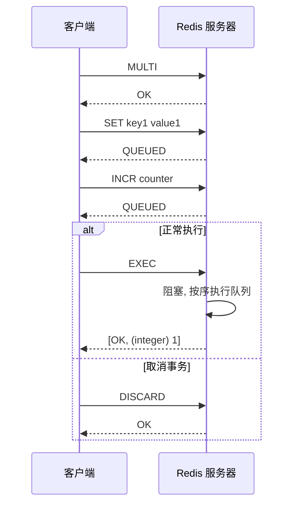
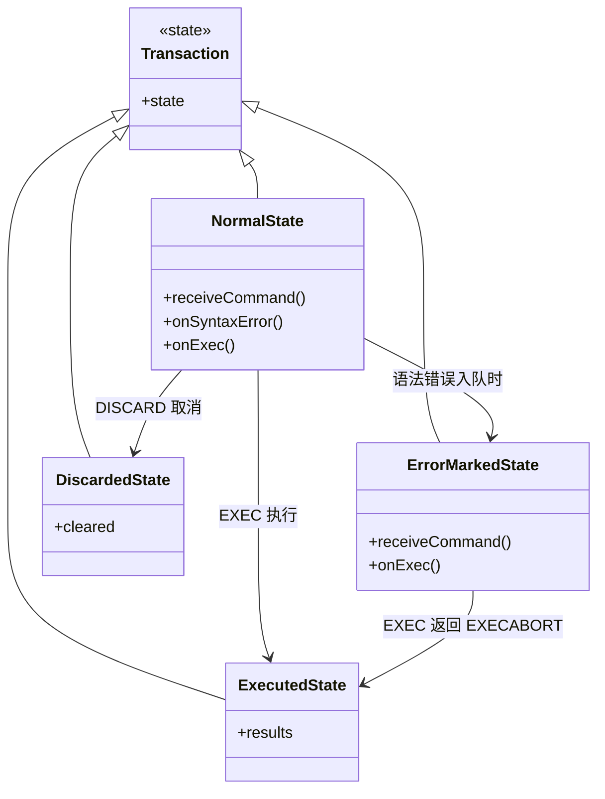
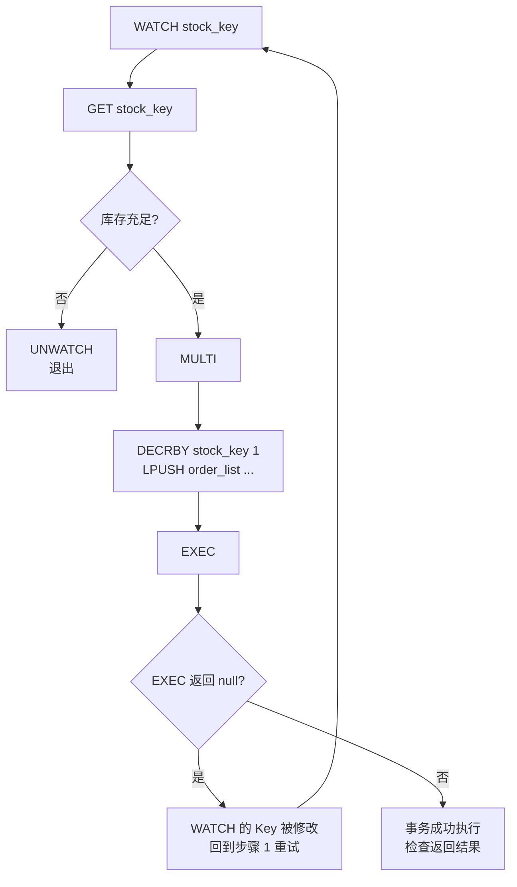

## 引言

Redis 事务没有回滚？这个设计坑了多少开发者。

在构建高并发分布式系统时，我们经常需要执行一系列相关操作：扣减库存并记录购买流水、从一个账户转移积分到另一个账户。关系型数据库用 ACID 事务来解决，但 Redis 作为高性能内存数据库，其事务机制与传统数据库截然不同——**它不保证执行失败时的回滚**。

理解 Redis 事务的"原子性"边界、"无回滚"的设计哲学、`WATCH` 乐观锁的实现原理，以及语法错误与运行时错误的差异化处理，是编写正确并发代码和应对技术面试的关键。本文将深入解析 MULTI/EXEC/DISCARD 的命令入队机制、WATCH 的 Key 级监控原理，以及为什么 Lua 脚本在多数场景下是比事务更好的原子性保证。读完本文，你将清楚：为什么 Redis 选择不回滚？WATCH 监控的是值变化还是写操作？为什么 `WATCH` 在集群环境中会失效？

### Redis 事务核心命令：MULTI、EXEC、DISCARD

Redis 事务通过三个核心命令实现：

1.  **`MULTI`：标记事务开始。** 发送后 Redis 不再立即执行后续命令，而是将其入队。
2.  **命令入队 (Queuing)：** 在 `MULTI` 之后的命令不会立即执行，被放入内部队列。Redis 对入队命令进行**语法检查**，语法错误会标记该事务为错误事务，但事务不会立即终止。
3.  **`EXEC`：执行事务。**
    - 如果事务在入队阶段被标记为语法错误，Redis 拒绝执行整个事务，返回 `EXECABORT` 错误。
    - 如果事务未被标记为错误，Redis **按顺序、一次性地执行**队列中所有命令。**执行期间 Redis 是阻塞的**，不会处理其他客户端的命令。
4.  **`DISCARD`：取消事务。** 清空命令队列，退出事务状态。

### 事务流程时序图



> **💡 核心提示**：`MULTI` 只是将命令**入队**，并不会执行。命令在 `EXEC` 时才真正执行。这意味着如果客户端在 `MULTI` 和 `EXEC` 之间连接断开，队列中的命令将永远不会被执行。

### 原子性与隔离性保证

Redis 事务的原子性有特殊含义：

* **入队阶段语法错误：** 整个事务被拒绝执行，"要么全执行，要么都不执行"。
* **执行阶段运行时错误：** 只有出错的命令失败（EXEC 返回列表中对应位置为错误响应），**其他命令继续执行，已执行的命令不回滚**。

**为什么 Redis 不实现回滚？** 这是 Redis 设计哲学的体现：

1.  运行阶段错误（如对 String 类型执行 RPUSH）通常是**编程错误**，不应该通过事务机制回滚。
2.  实现回滚机制会增加 Redis 的复杂性，影响性能，与 Redis 追求简洁高效的理念不符。

### 事务状态与错误类型类图



> **💡 核心提示**：语法错误和运行时错误处理方式完全不同。语法错误（如拼写错误的命令名）在入队时就能检测，会导致整个事务被拒绝；运行时错误（如类型不匹配）只有在 EXEC 执行时才会发现，此时只影响单个命令，不会回滚。

### WATCH 乐观锁

`WATCH` 解决了在 `MULTI` 之前读取 Key 值并在事务中基于旧值写入时的竞态条件（Check-and-Set 场景）。

**原理：**

* `WATCH key` 在事务前监视一个或多个 Key。
* Redis 内部记录被 WATCH 的 Key。
* 执行 `EXEC` 时，如果**任何一个**被 WATCH 的 Key 在 WATCH 之后被其他客户端修改过（**任何写操作，不仅仅是值变化**），EXEC 返回 Null multi-bulk reply（Java 客户端中表现为 `null`），事务被取消。

**典型流程：**

1. `WATCH` 需要监视的 Key。
2. `GET` 当前值，客户端进行业务逻辑判断。
3. `MULTI` 开始事务。
4. 将写命令入队。
5. `EXEC` 执行。
6. 检查返回值：`null` 表示 WATCH 失败，需要重试；非 `null` 表示成功。

### WATCH 乐观锁流程



> **💡 核心提示**：WATCH 监控的是 Key 是否被**修改**（任何写操作），而不仅仅是值是否变化。即使你用 SET 命令将 Key 设置为相同的值，WATCH 也会认为 Key 被修改了，EXEC 返回 null。此外，WATCH 在执行 EXEC 或 DISCARD 后**自动清除**，必须重新 WATCH 才能进行下一轮重试。

### Redis 事务 vs SQL 事务 vs Lua 脚本

| 特性 | Redis MULTI/EXEC | SQL 事务 (MySQL) | Lua 脚本 |
| :--- | :--- | :--- | :--- |
| **原子性** | 执行时不回滚 | 完全原子，支持回滚 | 完全原子（单命令） |
| **隔离性** | EXEC 期间阻塞 | 支持隔离级别 | 执行期间阻塞 |
| **回滚** | 不支持 | 支持 ROLLBACK | 不支持（原子执行） |
| **语法错误** | 整个事务拒绝 | 语句报错 | 脚本编译失败 |
| **运行时错误** | 单命令失败，继续执行 | 整个事务回滚 | 脚本执行失败 |
| **并发控制** | 需配合 WATCH | 锁机制 / MVCC | 无需额外控制 |
| **性能** | 中等（多次网络往返） | 中等 | 高（单次网络往返） |
| **推荐场景** | 简单批量操作 | 强一致性需求 | 复杂原子操作 |

### 典型应用场景：库存扣减

```java
String stockKey = "product:123:stock";
int quantityToBuy = 1;
boolean success = false;
int maxRetries = 3;

for (int i = 0; i < maxRetries; i++) {
    jedis.watch(stockKey); // 1. WATCH 库存 Key

    String stockStr = jedis.get(stockKey); // 2. GET 当前库存
    int currentStock = (stockStr == null) ? 0 : Integer.parseInt(stockStr);

    if (currentStock < quantityToBuy) {
        jedis.unwatch(); // 库存不足，取消 WATCH
        break;
    }

    Transaction t = jedis.multi(); // 3. MULTI
    t.decrBy(stockKey, quantityToBuy); // 4. 命令入队
    t.lpush("user:order:list", "userX_bought_product123");

    List<Object> results = t.exec(); // 5. EXEC

    if (results == null) {
        // WATCH 失败，重试
        continue;
    } else {
        success = true;
        break;
    }
}
```

### Pipeline 与事务的区别

| 特性 | Pipeline | Transaction (MULTI/EXEC) |
| :--- | :--- | :--- |
| **执行时机** | 命令逐个发送，服务器逐个执行 | 命令先入队，EXEC 时批量执行 |
| **隔离性** | 无（其他命令可穿插执行） | 有（EXEC 期间阻塞） |
| **原子性** | 无 | 有（执行过程不被打断） |
| **网络优化** | 减少 RTT，批量发送 | 减少 RTT，但需额外 MULTI/EXEC |
| **错误处理** | 每个命令独立结果 | 语法错误整批拒绝 |

> **💡 核心提示**：Pipeline 和 Transaction 解决的问题不同。Pipeline 优化网络延迟，适合批量非原子操作；Transaction 保证执行过程不被打断，适合需要原子性的场景。两者可以结合使用：在 Pipeline 中发送 MULTI 和 EXEC 之间的命令。

### 生产环境避坑指南

1.  **WATCH 在 EXEC/DISCARD 后自动清除**：每次事务结束后必须重新 `WATCH`，否则下一次 EXEC 不会做任何检查。重试循环中忘记重新 WATCH 是最常见的错误。
2.  **语法错误导致整个事务拒绝**：入队阶段的语法错误（命令名拼错、参数数量不对）会导致 EXEC 时整个事务被拒绝。务必在开发阶段验证命令正确性。
3.  **无回滚导致部分执行不一致**：EXEC 阶段运行时错误不回滚。如果事务中第 3 个命令失败，前 2 个命令已成功执行且无法撤销。需在应用层检查 EXEC 返回结果并做补偿处理。
4.  **WATCH 在 Redis Cluster 中失效**：如果被 WATCH 的 Key 分布在不同的槽（不同节点），WATCH 无法跨节点协调。在集群中使用时务必确认所有 WATCH 的 Key 使用哈希标签 `{...}` 保证同槽。
5.  **事务不提供隔离（其他命令可在 MULTI 和 EXEC 间执行）**：`MULTI` 和 `EXEC` 之间的命令只是入队，不执行。其他客户端的命令可以在入队期间正常执行。真正的隔离只在 `EXEC` 执行期间生效。
6.  **WATCH 重试风暴**：高并发场景下，多个客户端竞争同一个 Key，WATCH 频繁失败导致无限重试。设置合理的最大重试次数（如 3-5 次），失败后降级处理或返回错误。

### 行动清单

1.  **检查点**：确认所有事务的 EXEC 返回值都被检查（`null` 表示 WATCH 失败），并且有重试或降级逻辑。
2.  **优先使用 Lua 脚本**：对于需要强原子性的复杂操作，使用 `EVAL` 执行 Lua 脚本比 MULTI/EXEC 更可靠（完全原子、支持条件逻辑、单次网络往返）。
3.  **避免事务中使用慢命令**：`KEYS`、`HGETALL` 等 O(N) 命令在 EXEC 期间会阻塞整个 Redis 实例，应保持事务短小精悍。
4.  **集群中使用 WATCH 时确保同槽**：被 WATCH 的多个 Key 必须使用哈希标签保证落在同一槽，否则跨节点 WATCH 无法生效。
5.  **监控 EXEC 返回结果**：记录 EXEC 返回列表中的错误响应，及时发现运行时错误（如类型不匹配）。
6.  **限制事务队列长度**：过长的命令队列占用服务器内存并增加阻塞时间，建议单次事务不超过 20 个命令。

### 总结

Redis 事务通过 MULTI/EXEC 机制提供了命令执行过程的原子性和隔离性，但与传统数据库事务最大的区别在于**执行失败时不回滚**。这是 Redis 追求简洁高效的设计哲学：运行时错误被视为编程错误，不通过事务机制回滚。`WATCH` 命令提供了乐观锁机制，通过 Key 级监控解决并发竞态条件，但需要在客户端实现重试逻辑。对于需要更强原子性保证的场景，Lua 脚本是比 MULTI/EXEC 更可靠的选择——它在单个命令中完成所有逻辑，完全原子且无需 WATCH。
