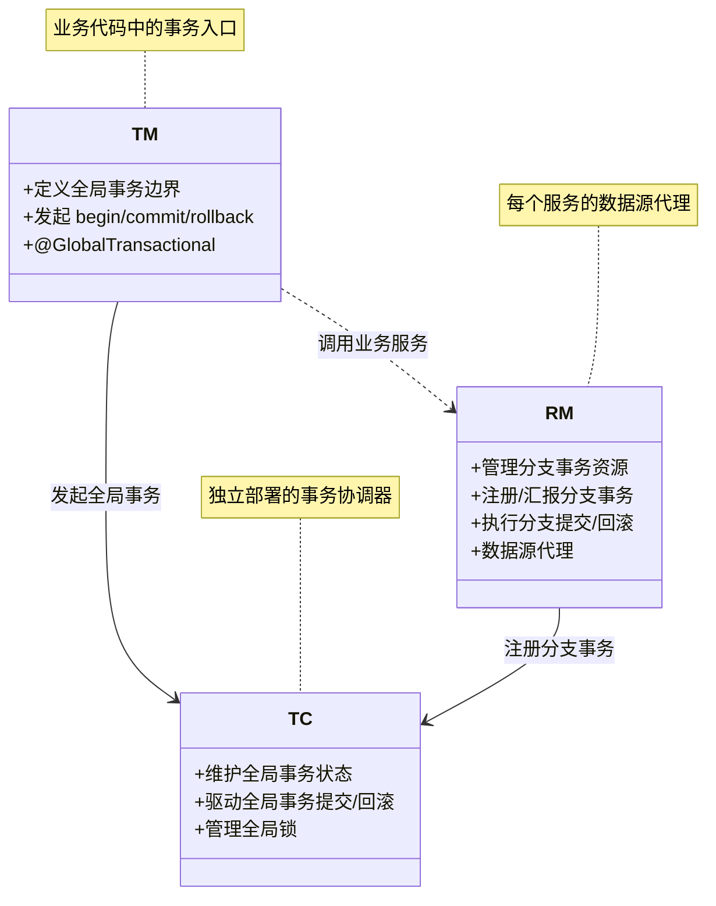
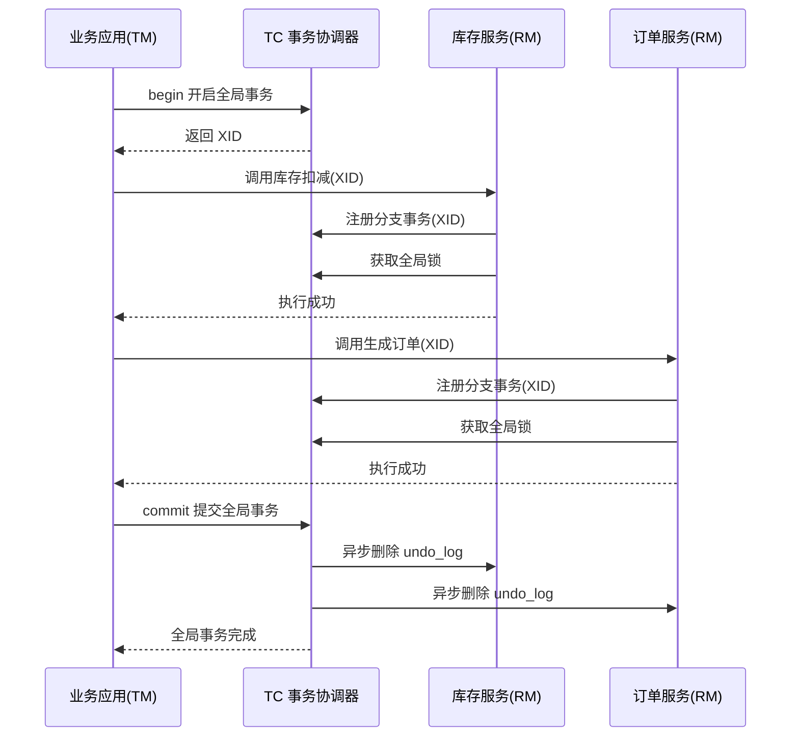
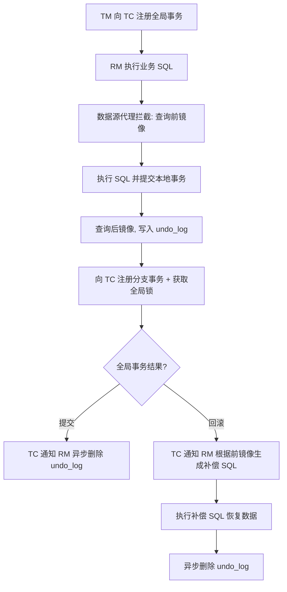

## 引言

假设你负责的电商系统正在搞大促，用户下单扣库存、生成订单、扣减余额三个服务必须同时成功或同时失败。然而库存服务已经提交，订单服务却超时了——数据不一致的灾难就此开始。**你是否曾因为分布式事务导致的数据错乱而被半夜叫起排查？**

这篇文章将带你彻底理清 Seata 的底层架构与四种事务模式的选型逻辑。读完后，你将能够：
- 说出 TC/TM/RM 三大组件如何协作完成一次全局事务
- 根据业务场景在 AT/TCC/SAGA/XA 之间做出正确选型
- 画出 AT 模式从 SQL 拦截到 Undo Log 生成的完整流程图
- 避开生产环境中全局锁超时、Undo Log 膨胀等常见陷阱

## 什么是 Seata？

Apache Seata（Simple Extensible Autonomous Transaction Architecture）是一款开源的**分布式事务解决方案**，致力于在微服务架构下提供高性能、简单易用的分布式事务服务。它通过多种事务模式覆盖了从强一致性到最终一致性的全部场景，尤其 AT 模式以极低侵入性成为关系型数据库微服务的首选方案。

## 分布式事务：痛点何在？

在单体应用时代，我们依赖数据库提供的本地事务（ACID 特性）来保证数据的一致性。`@Transactional` 注解几乎可以解决所有问题。但进入分布式世界，情况完全不同了。

想象一下，一个用户下单的操作，可能涉及扣减库存服务、生成订单服务、调用支付服务，这三个服务可能分别对应不同的数据库。如果库存扣减成功，订单生成成功，但支付失败了，我们能简单地回滚前面两个操作吗？在本地事务中可以，但在分布式环境中，已经提交的本地事务是无法直接回滚的。这就是分布式事务的"跨越山河大海"的挑战。

传统的分布式事务解决方案，比如基于数据库的 XA 规范（二阶段提交），在单体应用或少量系统集成时尚可接受。但在微服务场景下，XA 模式会长时间锁定资源，性能低下，且参与者（各个服务）需要强耦合，任何一个参与者的阻塞都可能导致整个事务挂起，与微服务的"松耦合"理念格格不入。

因此，我们需要一种新的方式来管理跨服务的业务一致性，这就是分布式事务框架的用武之地，Seata 正是为此而生。

> **💡 核心提示**：分布式事务的本质难题在于——多个独立数据库的本地事务无法被统一回滚。Seata 的价值在于提供了一套协调机制，让分散的事务行为重新获得"一致性"。

## 理论基石：从 ACID 到 BASE

在探讨 Seata 的具体实现之前，我们有必要快速回顾一下分布式系统的一致性理论。

- **ACID**: 是传统数据库事务的四大特性：原子性（Atomicity）、一致性（Consistency）、隔离性（Isolation）、持久性（Durability）。它追求的是**强一致性**。在分布式系统中，特别是在出现网络分区（P）时，根据 CAP 定理，我们不得不权衡可用性（A）和一致性（C）。鱼与熊掌不可兼得，很难同时满足强一致性（C）和高可用性（A）。
- **BASE**: 是互联网分布式系统常用的设计思想：基本可用（Basically Available）、软状态（Soft State）、最终一致性（Eventually Consistent）。它追求的是**最终一致性**。BASE 理论认为，系统在发生故障时允许出现短暂的不一致，但在故障恢复后，数据会逐渐达到一致状态。Seata 的大部分模式，尤其是 AT、TCC、SAGA，都是基于 BASE 理论，通过柔性事务来保证最终一致性。

理解了从强一致性到最终一致性的转变，就理解了分布式事务解决方案（尤其是柔性事务）的设计哲学：牺牲短时的强一致性，换取系统的可用性和性能。

## Seata 架构总览：三大核心组件

Seata 框架本身也是一个分布式系统，它由三大核心组件构成，它们协同工作来管理分布式事务的生命周期：

- **Transaction Coordinator (TC) - 事务协调器:**
    - **职责:** 维护全局事务的状态，管理并驱动全局事务的提交或回滚。它是一个独立的的服务端应用。
    - **定位:** 事务的"大脑"或"指挥中心"。它接收来自 TM 的全局事务请求，协调所有参与的 RM。

- **Transaction Manager (TM) - 事务管理器:**
    - **职责:** 定义全局事务的范围。它负责向 TC 发起全局事务的开启（begin）、提交（commit）或回滚（rollback）请求。
    - **定位:** 应用中发起分布式事务的"入口"。通常与业务代码集成在一起，例如通过 Spring AOP 或 `@GlobalTransactional` 注解来实现。

- **Resource Manager (RM) - 资源管理器:**
    - **职责:** 管理分支事务处理的资源（例如数据库连接）。它负责向 TC 注册分支事务、汇报分支事务的状态，并接收 TC 的指令来提交或回滚分支事务。
    - **定位:** 应用中访问具体资源的"代理"。以 AT 模式为例，RM 会代理数据源，拦截 SQL 操作。

### 组件协作流程

整个过程中，TC 是中心协调者，TM 是业务发起者，RM 是资源执行者。

## Seata 事务模式深度解析

Seata 提供了多种事务模式来应对不同的业务场景和技术栈，它们各有特点。这是面试中常被问到的重点！

### AT 模式 (Automatic Transaction)

**原理：** 基于二阶段提交的改进，对业务代码**无侵入**（或极少侵入）。Seata 通过拦截 JDBC 操作，自动完成事务协调。

**核心机制：**

- **数据源代理 (Data Source Proxy):** Seata 通过代理 DataSource、Connection、Statement 等 JDBC 对象，在业务 SQL 执行前后织入逻辑。这是 AT 模式"无侵入"的关键。
- **Undo Log（回滚日志）:** 这是 AT 模式的核心。在执行业务 SQL（Update, Delete, Insert）之前，Data Source Proxy 会解析 SQL，查询数据的**前镜像 (Before Image)**；执行 SQL 后，查询数据的**后镜像 (After Image)**。前镜像和后镜像以及业务 SQL 等信息会组成一条 **Undo Log**，记录在 `undo_log` 表中（每个 RM 对应的数据库都会有此表）。
    - **作用:**
        - **全局提交时:** 清理对应的 Undo Log。
        - **全局回滚时:** 根据 Undo Log 中的前镜像，生成补偿 SQL，将数据恢复到业务操作之前的状态。
- **全局锁 (Global Lock):** 在 AT 模式的一阶段（业务提交本地事务），RM 在向 TC 注册分支事务的同时，会尝试获取该分支事务所修改记录的**全局锁**。只有成功获取全局锁的分支才能继续。
    - **作用:** 防止脏写。如果在全局事务提交前，另一个全局事务修改了同一行数据并提交，当前事务回滚时，就会覆盖掉后者已提交的数据，造成脏写。全局锁确保在一个全局事务提交或回滚前，其他全局事务不能提交对同一数据的修改。

**工作流程 (二阶段)：**

**优缺点:**

- **优点:** 对业务代码侵入性小，几乎是透明的；提供 ACID 特性中 C 和 I 的保证（在 AT 模式下，通过全局锁和 Undo Log，虽然不是强一致，但可以防止脏写，提供了一种隔离性）；适用于关系型数据库。
- **缺点:** 依赖底层数据库支持本地事务；性能受 Undo Log 记录和全局锁开销影响；对非关系型数据库或跨数据库类型不适用。

**适用场景:** 主要用于关系型数据库之间的分布式事务，对业务代码改动要求低。

> **💡 核心提示**：AT 模式"无侵入"的秘密武器是数据源代理。它在 JDBC 层拦截 SQL，自动完成前/后镜像的采集和 Undo Log 的写入，开发者只需一个 `@GlobalTransactional` 注解即可开启分布式事务。

### TCC 模式 (Try-Confirm-Cancel)

**原理：** 基于补偿机制的柔性事务。需要业务代码手动实现三个阶段：Try、Confirm、Cancel。

**核心机制：**

- **Try:** 尝试执行业务操作，主要进行**资源预留**或**业务检查**。这个阶段必须保证业务数据的一致性（比如账户余额是否充足）。
- **Confirm:** 确认执行业务操作。Try 阶段预留的资源在这里真正被消耗或锁定。Confirm 操作必须是**幂等**的。
- **Cancel:** 取消执行业务操作。当 Try 阶段失败或全局事务需要回滚时，调用 Cancel 操作来**释放** Try 阶段预留的资源。Cancel 操作也必须是**幂等**的。

**工作流程 (二阶段):**

- **第一阶段 (Try):**
    1.  TM 向 TC 注册全局事务。
    2.  TM 调用各个参与者的 Try 方法。
    3.  各个参与者执行 Try 逻辑（预留/检查资源），并向 TC 报告结果。
- **第二阶段 (Confirm 或 Cancel):**
    - **Confirm:** 如果所有参与者的 Try 都成功，TC 向所有参与者发送 Confirm 指令。各参与者执行 Confirm 逻辑。
    - **Cancel:** 如果有任何一个参与者的 Try 失败，TC 向所有**已成功执行 Try** 的参与者发送 Cancel 指令。各参与者执行 Cancel 逻辑。

**优缺点:**

- **优点:** 灵活性高，可以支持各种异构资源（数据库、消息队列、外部服务等）；可以提供比 AT 更高的一致性级别（取决于 Try 阶段对资源的锁定程度）。
- **缺点:** 对业务代码侵入性高，需要为每个分布式事务涉及的操作手动编写 Try、Confirm、Cancel 三个方法；实现复杂，需要仔细处理幂等性和悬挂（Cancel 先于 Try 执行）等问题。

**适用场景:** 适用于跨越多类型资源、业务流程复杂、对一致性要求较高的场景，但需要投入较高的开发成本。

### SAGA 模式

**原理：** 长时运行事务解决方案，通过**补偿操作链**来实现。适用于业务流程非常长、跨越服务多的场景。

**核心机制：**

- **业务操作与补偿操作:** SAGA 模式将分布式事务分解为一系列的**本地事务**。每个本地事务都有一个与之对应的**补偿操作**。
- **正向执行与逆向补偿:** SAGA 事务会按照预定的顺序执行这些本地事务。如果在执行过程中任何一个本地事务失败，则会按照相反的顺序调用已成功执行的本地事务的补偿操作，以抵消之前的操作。
- **状态机/流程引擎:** 通常需要一个状态机或流程引擎来驱动整个 SAGA 流程的执行和失败时的补偿。

**工作流程:**

1.  TM 向 TC 注册全局事务。
2.  TC 协调各个参与者，按顺序执行本地事务 A。
3.  如果 A 成功，执行本地事务 B。
4.  如果 B 成功，执行本地事务 C...
5.  如果在执行本地事务 N 时失败，则 TC 会协调，依次调用本地事务 N-1 的补偿操作，然后是 N-2 的补偿操作，直到已成功执行的第一个事务的补偿操作。

**优缺点:**

- **优点:** 适用于长流程、涉及服务多的场景；对性能影响相对较小（没有全局锁或长时间资源锁定）。
- **缺点:** 只保证最终一致性；补偿操作的编写和维护成本较高；设计复杂的补偿逻辑来处理各种失败场景。

**适用场景:** 业务流程长、需要跨越大量服务且允许最终一致性的场景，如复杂的审批流程、订单履约流程等。

### XA 模式

**原理：** 实现了标准的 XA 协议，基于底层数据库的二阶段提交能力。

**核心机制:** Seata 作为协调者（充当 TM 和 TC 的角色），驱动各个支持 XA 协议的数据库执行 Prepare、Commit/Rollback 指令。

**工作流程:** 标准的 XA 二阶段提交流程（Prepare -> Commit/Rollback）。

**优缺点:**

- **优点:** 保证强一致性（ACID）；原理简单，符合传统事务习惯。
- **缺点:** 性能差，长时间锁定数据库资源；对底层数据库有 XA 支持要求；不适用于非关系型数据库或跨异构资源；协调者宕机可能导致数据不一致（需复杂恢复机制）。

**适用场景:** 在微服务中较少使用，主要用于少量服务间且底层数据库强一致性要求极高、性能要求不敏感的场景。

### 各模式对比总结

| 特性 | AT 模式 | TCC 模式 | SAGA 模式 | XA 模式 |
| :--- | :--- | :--- | :--- | :--- |
| **侵入性** | 低（数据源代理） | 高（业务实现 Try/Confirm/Cancel） | 高（业务实现补偿逻辑） | 低（依赖数据库 XA 支持） |
| **一致性** | 最终一致性 | 最终一致性，可达强一致性 | 最终一致性 | 强一致性 |
| **性能** | 中（Undo Log + 全局锁开销） | 高（由业务实现决定） | 高（无长时间资源锁定） | 低（长时间资源锁定） |
| **复杂度** | 低（框架自动处理） | 高（需手动编写三阶段逻辑） | 高（需设计补偿逻辑和流程） | 低（依赖数据库） |
| **适用资源** | 关系型数据库 | 异构资源（DB/MQ/Service） | 异构资源（DB/MQ/Service） | 支持 XA 的关系型数据库 |
| **典型场景** | 电商下单、支付 | 资金转账、库存预留 | 长流程审批、订单履约 | 金融级强一致场景 |

> **💡 核心提示**：当被问到"Seata 有几种模式？如何选择？"时，除了列举模式名称，更重要的是结合场景说明选择依据。**AT 模式**因低侵入性在关系型数据库微服务中应用最广；**TCC** 和 **SAGA** 用于 AT 无法覆盖的异构或长流程场景；**XA** 仅在对强一致性有刚性要求时选用。

## 实现细节与进阶

理解 Seata 的工作原理，还需要更深入地了解一些实现细节：

- **Data Source Proxy (数据源代理):** 它的底层是基于 Java 的动态代理或字节码增强技术（如 AspectJ），在运行时对 DataSource 对象进行包装。当应用代码通过代理对象执行 SQL 时，代理逻辑会被触发，从而进行 Undo Log 的记录和全局锁的获取。
- **Undo Log 的存储:** Undo Log 默认存储在业务数据库的 `undo_log` 表中。这种方式简单方便，但也增加了业务数据库的负担。Seata 也支持将 Undo Log 存储到文件或其他存储介质。
- **全局锁的实现:** 全局锁由 TC 统一管理。RM 在向 TC 报告分支成功时，会携带其锁定的资源信息。TC 会将这些锁信息存储起来，并在第二阶段全局提交时释放，全局回滚时校验锁是否存在。
- **事务恢复 (Transaction Recovery):** 分布式系统面临宕机和网络异常。Seata 通过持久化事务状态来保证恢复能力。TC 会将全局事务的状态持久化（到数据库或文件），RM 会将分支事务状态和 Undo Log 持久化。当 TC 或 RM 宕机重启后，可以根据持久化的状态继续未完成的事务流程（提交或回滚），确保最终一致性。
- **配置管理与集成:** 在实际应用中，Seata 的 TC 地址、注册中心、配置中心、事务分组等信息需要配置。通常通过 Spring Cloud、Dubbo 的集成组件来简化配置，例如使用 `@GlobalTransactional` 注解标记全局事务的入口。

## 核心参数对比表

| 参数/配置项 | 说明 | 默认值 | 生产建议 |
| :--- | :--- | :--- | :--- |
| `client.rm.reportRetryCount` | RM 向 TC 汇报重试次数 | 5 | 保持默认或略增大 |
| `client.rm.reportSuccessEnable` | 一阶段成功后是否上报 | true | 保持 true |
| `client.tm.commitRetryCount` | TM 提交重试次数 | 5 | 建议 5~10 |
| `client.tm.rollbackRetryCount` | TM 回滚重试次数 | 5 | 建议 5~10 |
| `client.tm.defaultGlobalTransactionTimeout` | 全局事务超时时间(ms) | 60000 | 根据业务链路调整，建议 30000~120000 |
| `client.rm.lock.retryInterval` | 获取全局锁重试间隔(ms) | 10 | 建议 10~20 |
| `client.rm.lock.retryTimes` | 获取全局锁重试次数 | 30 | 高并发建议增大到 50~100 |
| `client.undo.logTable` | Undo Log 表名 | `undo_log` | 保持默认 |

## 常见问题与面试要点

- **AT 模式的性能问题:** Undo Log 的生成和全局锁的竞争会带来一定性能开销。可以通过优化 SQL、减少全局事务跨度、合理设置全局锁超时时间等方式缓解。
- **TCC 模式的幂等性与悬挂:**
    - **幂等性:** Try、Confirm、Cancel 方法必须是幂等的，即多次调用产生的结果一致。需要在业务代码中加入幂等判断逻辑（如使用业务 ID 去重）。
    - **悬挂:** Cancel 调用先于 Try 调用发生。例如，TC 重试 Cancel 指令时，Try 请求因为网络延迟才到达。需要在 Try 方法中判断全局事务状态，如果已被判定为 Cancel，则 Try 直接返回失败或空操作。
- **SAGA 模式的补偿逻辑复杂性:** SAGA 模式的难点在于设计完善的补偿逻辑，要覆盖所有可能的失败组合，确保补偿操作本身不会失败。
- **TC 的可用性:** TC 是 Seata 的核心协调者，其可用性至关重要。生产环境中 TC 通常以集群方式部署，并依赖注册中心进行服务发现。
- **面试题集锦：**
    - 微服务下为什么需要分布式事务？本地事务和 XA 为什么不适用？
    - Seata 的整体架构是什么？TC、TM、RM 分别负责什么？它们如何交互？
    - 详细解释 Seata 的 AT 模式原理，Undo Log 和全局锁的作用是什么？（高频题）
    - TCC 模式如何工作？Try、Confirm、Cancel 分别做什么？如何保证幂等性和解决悬挂问题？（高频题）
    - SAGA 模式适用于什么场景？它的基本思想是什么？
    - AT、TCC、SAGA、XA 这几种模式有什么区别？如何根据业务场景选择合适的模式？（高频题）
    - Seata 如何保证事务的最终一致性？如何处理 TC 或 RM 宕机的情况？

## 总结

Seata 作为一套成熟的分布式事务框架，为微服务架构下的数据一致性提供了有效的解决方案。它提供了多种事务模式，通过灵活的选择，可以适应不同业务场景的技术需求。尤其是其 AT 模式，凭借对业务代码的低侵入性，极大地降低了分布式事务的实施门槛，是关系型数据库场景下的首选。

当然，分布式事务本身就是一个复杂的课题，Seata 也并非银弹。在使用过程中，我们需要深入理解其原理，结合业务场景仔细权衡，并关注其在高并发、故障恢复等方面的表现。

## 生产环境避坑指南

### 1. Undo Log 表膨胀

AT 模式下每次写操作都会生成前/后镜像，如果全局事务量大或回滚频繁，`undo_log` 表会迅速膨胀。

**对策：**
- 定期清理已提交事务对应的 undo_log 记录
- 监控 undo_log 表大小，设置告警阈值
- 使用 Seata 自带的清理策略或编写定时任务

### 2. 全局锁超时

在高并发场景下，多个全局事务竞争同一行数据的全局锁，容易导致锁等待超时。

**对策：**
- 适当增大 `client.rm.lock.retryTimes` 和 `retryInterval`
- 优化业务逻辑，减少全局事务的跨度和锁粒度
- 对热点行使用 TCC 模式替代 AT 模式

### 3. TC 单点故障

TC 是 Seata 的核心协调者，单机部署存在 SPOF 风险。

**对策：**
- 生产环境必须集群部署 TC（至少 2 节点）
- 搭配注册中心（Nacos/Consul/Eureka）实现高可用
- 使用数据库模式持久化 TC 事务状态

### 4. 分支事务悬挂

网络异常导致分支事务注册失败，但实际 SQL 已执行。TC 重试时可能出现悬挂。

**对策：**
- 在业务代码中增加悬挂检测逻辑
- TCC 模式的 Try 方法中检查全局事务状态

### 5. 跨库分布式事务性能

跨不同数据库实例的分布式事务性能开销大，尤其 XA 模式。

**对策：**
- 优先选择 AT 模式而非 XA
- 避免在一个全局事务中跨越过多微服务
- 考虑使用消息队列实现最终一致性（替代方案）

## 行动清单

- [ ] 评估当前系统的事务一致性要求（强一致 vs 最终一致）
- [ ] 选择合适的事务模式（AT/TCC/SAGA/XA），并验证适用性
- [ ] 在开发环境搭建 Seata TC Server 并配置注册中心
- [ ] 在 Spring Boot 项目中引入 Seata 依赖，添加 `@GlobalTransactional` 注解验证
- [ ] 为 AT 模式配置 `undo_log` 表并验证前/后镜像生成
- [ ] 设置全局锁超时、重试次数等关键参数
- [ ] 编写 TCC/SAGA 模式下的幂等和悬挂处理逻辑
- [ ] 部署 TC 集群，配置高可用和事务状态持久化
- [ ] 建立 undo_log 监控和清理策略
- [ ] 压测验证分布式事务在预期并发下的性能表现
