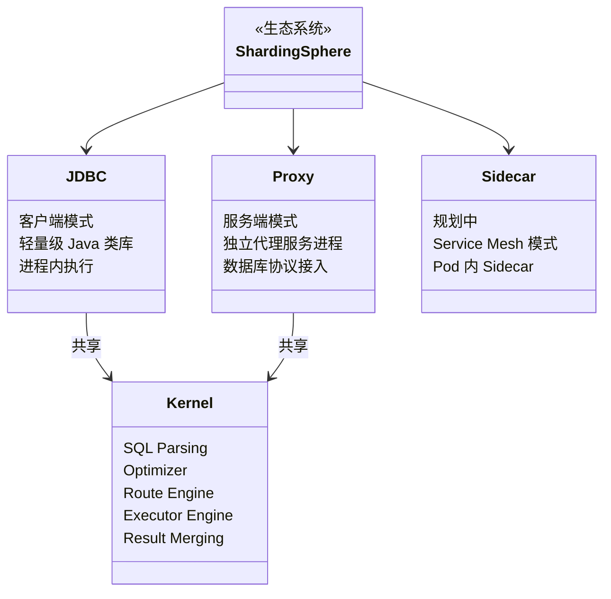
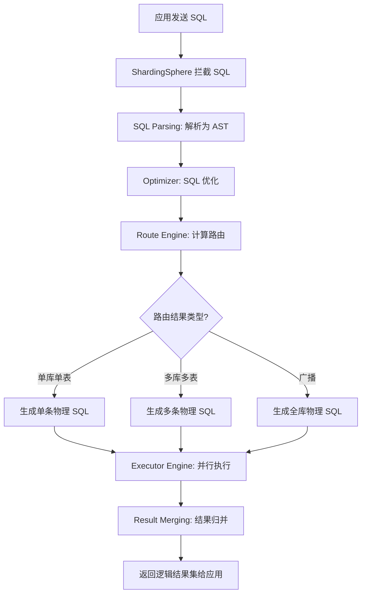

## 引言

你的用户表已经突破 5000 万行，单库查询慢如蜗牛，垂直升级硬件的成本也到了天花板。**如果把数据分散到多个数据库实例，SQL 查询怎么自动路由？跨库 JOIN 怎么做？分布式事务谁来保证？**

这篇文章将带你彻底搞懂 Apache ShardingSphere 如何通过 SQL 解析、路由、执行、结果归并四大引擎，让分布式数据库对应用完全透明。读完后你将能够：
- 对比 ShardingSphere-JDBC 和 ShardingSphere-Proxy 的适用场景
- 画出 SQL 从发送到返回的完整生命周期
- 根据业务需求选择分片算法并编写配置
- 避开生产环境中分片键选择不当、跨库查询性能骤降等常见陷阱

## ShardingSphere 是什么？

Apache ShardingSphere 是一个**开源的分布式数据库中间件解决方案生态圈**。它不改变底层数据库，而是在应用程序和数据库之间构建一个中间层，通过对应用程序的 SQL 进行拦截和解析，透明地增加分布式数据库的能力。

**核心目标：** 提供一套标准化的数据分片、分布式事务、数据库高可用等能力，让开发者像使用一个逻辑数据库一样使用物理上分散的数据源。

ShardingSphere 包含多个子项目，其中最核心的是：

- **ShardingSphere-JDBC：** 作为 Java JDBC 驱动或增强数据源，在 Java 进程内部提供服务。
- **ShardingSphere-Proxy：** 一个独立的数据库代理服务，应用程序通过标准数据库协议（如 MySQL、PostgreSQL）连接它。

## 数据库扩展的瓶颈与 ShardingSphere 的使命

随着业务数据的快速增长和访问量的爆炸式提升，单一关系型数据库面临着存储容量和处理能力的双重瓶颈。

- **垂直扩展：** 升级硬件（CPU、内存、SSD）可以在一定程度上提升性能，但存在物理天花板，且成本随着性能提升呈指数级增长。
- **水平扩展：** 将数据分散到多个数据库节点，理论上可以无限扩展。但实现水平扩展需要解决：
    - **数据分片 (Sharding)：** 如何根据规则将数据分布到不同的数据库实例或表？
    - **路由：** SQL 语句如何被正确地转发到存储了所需数据的物理库和表？
    - **跨库跨表查询：** 如何执行涉及多个分片节点的复杂查询（如 JOIN、GROUP BY、ORDER BY、聚合函数）？
    - **分布式事务：** 如何保证跨越多个分片节点的写操作的 ACID 特性？
    - **数据一致性：** 如何保证不同节点间的数据同步和一致？
    - **读写分离与高可用 (HA)：** 如何利用主从复制实现读流量分担和故障转移？
    - **运维复杂性：** 分布式环境下的数据迁移、扩容、备份、恢复等。

ShardingSphere 的使命正是通过中间件的方式，**透明地**解决应用程序在使用分布式数据库时面临的上述复杂性问题。

> **💡 核心提示**：ShardingSphere 的核心价值在于"透明"——开发者只需配置分片规则，SQL 的解析、路由、执行、归并全部由框架自动完成，业务代码无需感知底层是单库还是多库。

## 为什么选择 ShardingSphere？

- **透明性：** 对应用程序完全透明，无需修改大部分现有代码即可接入分布式数据库能力。
- **灵活性：** 支持多种数据分片算法和策略，可根据业务需求定制。支持多种分布式事务方案和读写分离模式。
- **功能丰富：** 除了数据分片和读写分离，还提供分布式事务、数据加密、数据脱敏、影子库等分布式数据治理功能。
- **多接入端：** 提供 JDBC 和 Proxy 两种接入方式，适应不同场景需求。
- **生态融合：** 可以与 Spring、Spring Boot、Dubbo、Kubernetes 等生态良好集成。

## 整体架构与核心模块

ShardingSphere 的架构可从两个层面理解：**多接入端**和**核心处理引擎**。



### 多接入端

- **ShardingSphere-JDBC (客户端模式)：**
    - **原理：** 作为一个轻量级的 Java 类库，它增强了 JDBC 的功能，提供额外的 `ShardingSphereDataSource` 等实现。
    - **工作方式：** ShardingSphere-JDBC 拦截 JDBC 调用，对 SQL 进行解析和改写，然后转发给真实的 JDBC 驱动。整个过程在应用进程内部完成。
    - **优点：** 轻量级，无需额外部署，性能损耗小。
    - **缺点：** 只支持 Java 应用；运维（如扩容、规则变更）可能需要重启应用。
    - **适用场景：** 纯 Java 应用，对性能要求较高。

- **ShardingSphere-Proxy (服务端模式)：**
    - **原理：** 一个独立的无状态服务进程，应用程序通过标准数据库协议（如 MySQL、PostgreSQL）连接 Proxy 的监听端口。
    - **工作方式：** Proxy 接收数据库协议请求，解析和改写 SQL，连接真实物理数据库执行，并将结果按协议返回。
    - **优点：** 对应用语言无限制；集中配置和管理；易于运维。
    - **缺点：** 需额外部署；相比 JDBC 模式可能增加网络开销。
    - **适用场景：** 多语言应用，希望集中管理分布式能力。

- **ShardingSphere-Sidecar (规划中)：** 基于 Service Mesh 的概念，将 ShardingSphere 作为 Sidecar 部署在应用的 Pod 中。

### 核心处理引擎

- **SQL Parsing (SQL 解析)：** 将 SQL 解析为抽象语法树 (AST)，提取关键信息（表、条件、排序/分组/聚合等）。
- **Optimizer (SQL 优化器)：** 对 AST 进行分析和优化，选择更高效的路由和执行策略。
- **Route Engine (路由引擎)：** **这是实现数据分片的核心阶段！** 根据解析后的 SQL 和分片规则，计算 SQL 需要路由到哪些物理数据库实例和物理表。
- **Executor Engine (执行引擎)：** 将路由引擎计算出的 SQL 执行计划进行并行执行。
- **Result Merging Engine (结果归并引擎)：** **处理跨库跨表查询的关键！** 收集多个物理数据源的结果集，根据原始 SQL 的要求进行归并（排序、分组、聚合），生成逻辑结果集。

## SQL 执行流程详解

一个 SQL 语句在 ShardingSphere 中的完整生命周期：



1. **应用程序发送 SQL：** 应用通过 ShardingSphere 的数据源 (JDBC) 或连接到 Proxy (Proxy) 发送 SQL 语句。
2. **ShardingSphere 拦截 SQL：** JDBC 驱动或 Proxy 接收到 SQL。
3. **SQL 解析：** 将 SQL 解析为 AST，提取关键信息。
4. **路由引擎：** 分析 AST，结合分片规则、读写分离规则等，计算 SQL 应该发送到哪些**物理数据源**上的哪些**物理表**。生成包含多个物理 SQL 的执行计划。
    - **分片路由过程：** 根据配置的分片算法，将 SQL 中的分片键值映射到物理库表。例如 `user_id = 10`，分片算法为 `user_id % 2`，结果为 0 则路由到 `ds_0.user_0`，为 1 则路由到 `ds_1.user_1`。不带分片键的查询可能路由到所有物理表（广播路由）。
5. **执行引擎：** 接收执行计划，在对应的物理数据源连接上并行执行各个物理 SQL。
6. **结果归并引擎：** 收集来自各个物理数据源的结果集，进行**内存计算或二次排序**，将多个结果集合并成一个逻辑结果集。
7. **ShardingSphere 返回结果：** 将最终归并得到的逻辑结果集返回给应用程序。

> **💡 核心提示**：结果归并引擎是 ShardingSphere 处理跨库查询最复杂的部分。跨库 `ORDER BY` 需要在内存中对所有分片的结果进行全局排序，跨库 `COUNT(*)` 需要将各分片返回的 COUNT 值相加。如果路由到全部物理表（广播路由），归并的数据量会显著增加，这也是分片键设计如此重要的原因。

## 核心功能实现原理

- **数据分片：**
    - **分片键 (Sharding Key)：** 用于确定数据分布的列（如 `user_id`, `order_id`）。
    - **分片算法：** 决定分片键如何映射到物理库表。常见类型：标准分片（范围、取模、Hash、时间）、复杂分片（多个分片键）、Hint 分片（通过 Hint 指定路由）、自动分片（如雪花算法 ID）。
- **读写分离：**
    - 配置一个逻辑数据源，包含主库和多个从库。写操作走主库，读操作根据负载均衡策略（轮询、随机、权重）路由到从库。
- **分布式事务：**
    - **XA 模式：** 基于分布式事务的 XA 规范，强一致性，二阶段提交，性能开销较大。
    - **BASE 模式：** 基于补偿机制实现最终一致性，常与 Seata 集成。
- **数据治理：**
    - **数据加密：** 写入前加密，读取时自动解密。
    - **数据脱敏：** 查询结果返回前对敏感数据处理（如部分隐藏）。
    - **影子库：** 将业务流量复制一份到影子库，用于压测或数据验证。

## 配置方式

ShardingSphere 的配置（数据源、分片规则、读写分离规则等）主要通过 YAML 文件进行。

```yaml
# ShardingSphere YAML 配置结构示例

dataSources:
  ds_0:
    url: jdbc:mysql://localhost:3306/db_0?serverTimezone=UTC
    username: root
    password: password
  ds_1:
    url: jdbc:mysql://localhost:3306/db_1?serverTimezone=UTC
    username: root
    password: password

rules:
  - !SHARDING
    tables:
      user:
        actualDataNodes: ds_${0..1}.user_${0..1}
        databaseStrategy:
          standard:
            shardingColumn: user_id
            shardingAlgorithmName: user_db_hash
        tableStrategy:
          standard:
            shardingColumn: user_id
            shardingAlgorithmName: user_table_hash
    shardingAlgorithms:
      user_db_hash:
        type: HASH_MOD
        props:
          algorithm-expression: ${user_id % 2}
      user_table_hash:
        type: HASH_MOD
        props:
          algorithm-expression: ${user_id % 2}

  - !READWRITE_SPLITTING
    dataSources:
      logic_db:
        writeDataSourceName: ds_write
        readDataSourceNames:
          - ds_read_0
          - ds_read_1
        loadBalancerName: round_robin
    loadBalancers:
      round_robin:
        type: ROUND_ROBIN
```

## 与 Spring Boot 集成

1. **添加依赖：**
   ```xml
   <dependency>
       <groupId>org.apache.shardingsphere</groupId>
       <artifactId>shardingsphere-jdbc-spring-boot-starter</artifactId>
       <version>5.3.0</version>
   </dependency>
   <dependency>
       <groupId>mysql</groupId>
       <artifactId>mysql-connector-java</artifactId>
       <version>8.0.28</version>
   </dependency>
   ```

2. **配置：**
   ```yaml
   # application.yml
   spring:
     shardingsphere:
       yaml-config: classpath:shardingsphere-config.yaml
   ```

3. **使用：** 应用程序像使用普通数据源一样使用 ShardingSphere 提供的 `DataSource` Bean。

## JDBC vs Proxy 对比

| 特性 | ShardingSphere-JDBC | ShardingSphere-Proxy |
| :--- | :--- | :--- |
| **部署模式** | 客户端（嵌入应用） | 服务端（独立进程） |
| **语言支持** | 仅 Java | 不限语言（MySQL/PostgreSQL 协议） |
| **性能** | 高（无额外网络跳数） | 中（多一层网络开销） |
| **运维** | 需逐个应用管理 | 集中管理，独立升级 |
| **配置变更** | 通常需重启应用 | 可动态刷新 |
| **适用场景** | 纯 Java 微服务 | 多语言、集中管控 |

## 核心参数对比表

| 参数/配置项 | 说明 | 默认值 | 生产建议 |
| :--- | :--- | :--- | :--- |
| `actualDataNodes` | 物理数据节点表达式 | 无 | 按实际库表数配置，如 `ds_${0..3}.user_${0..7}` |
| `shardingColumn` | 分片键 | 无 | 选择查询最频繁的列 |
| `shardingAlgorithms.type` | 分片算法类型 | 无 | 常用 HASH_MOD、INLINE、RANGE |
| `loadBalancerName` | 读写分离负载均衡 | 无 | 推荐 ROUND_ROBIN 或 WEIGHT |
| `props.sql-show` | 打印实际执行 SQL | false | 生产关闭，开发开启便于调试 |
| `max-connections-size-per-query` | 单查询最大连接数 | 1 | 根据连接池容量调整 |

## 常见问题与面试要点

- **什么是 Apache ShardingSphere？它解决了什么问题？** (分布式数据库中间件生态，解决水平扩展带来的复杂性，核心目标是透明化分布式数据库能力)
- **请描述 ShardingSphere 的整体架构。有哪些不同的接入端？** (接入端包括 JDBC、Proxy、Sidecar。核心处理引擎共享)
- **请详细描述一个 SQL 查询在 ShardingSphere 中的执行流程。** (SQL 拦截 -> 解析 -> 路由 -> 执行 -> 结果归并 -> 返回)
- **ShardingSphere 如何实现数据分片？核心要素是什么？** (分片键、分片算法、逻辑表、物理表、分片策略)
- **ShardingSphere 支持哪些分片算法类型？** (标准、复杂、Hint、自动分片算法)
- **ShardingSphere 如何实现读写分离？原理是什么？** (配置主从数据源，根据 SQL 类型自动路由)
- **ShardingSphere 如何支持分布式事务？支持哪些模式？** (XA 强一致性、BASE 最终一致性，常与 Seata 集成)
- **ShardingSphere 如何实现对应用透明？** (通过拦截 JDBC 调用或数据库协议，在中间层处理分布式逻辑)

## 总结

Apache ShardingSphere 是解决关系型数据库水平扩展和分布式数据治理的优秀开源方案。它通过 JDBC (客户端) 和 Proxy (服务端) 两种接入方式，以及一套强大的核心处理引擎（SQL 解析、路由、执行、结果归并），透明地为应用程序提供了数据分片、读写分离、分布式事务等分布式数据库能力。

## 生产环境避坑指南

### 1. 分片键选择不当

如果分片键选择了一个查询中很少使用的列，会导致大量查询走广播路由（全表扫描），性能急剧下降。

**对策：**
- 选择查询 WHERE 条件中最常用的列作为分片键
- 如果有多个常用查询列，考虑使用复合分片算法
- 对于无法避免的非分片键查询，考虑建立冗余表或 ES 索引

### 2. 跨库 JOIN 性能问题

跨分片的 JOIN 操作需要拉取大量数据到内存中进行归并，性能很差。

**对策：**
- 尽量将需要 JOIN 的表使用相同的分片键和分片算法（绑定表）
- 无法避免时，考虑在应用层组装数据或使用 ES 等搜索引擎
- 使用 ER 分片策略保证关联数据在同一分片

### 3. 扩容时数据迁移

增加分片节点时，数据重新分布的迁移工作量大且容易出错。

**对策：**
- 提前规划分片数量，预留扩展空间
- 使用 ShardingSphere 的弹性伸缩（Scaling）模块进行在线迁移
- 分片算法选择支持动态扩容的算法（如一致性 Hash）

### 4. 分布式事务性能

跨库分布式事务（尤其 XA 模式）性能开销大。

**对策：**
- 优先在应用层设计避免跨库事务
- 使用 BASE 模式替代 XA 模式
- 控制单个事务涉及的数据库数量

### 5. SQL 兼容性

并非所有 SQL 语法都能被 ShardingSphere 正确解析和路由。

**对策：**
- 在测试环境充分验证 SQL 兼容性
- 开启 `sql-show` 配置查看实际执行的 SQL
- 关注 ShardingSphere 版本更新对 SQL 解析器的改进

## 行动清单

- [ ] 评估当前数据量和增长率，确定是否需要分库分表
- [ ] 选择合适的分片键（分析高频查询的 WHERE 条件）
- [ ] 选择分片算法（HASH_MOD/INLINE/RANGE）并验证均匀分布
- [ ] 在开发环境搭建 ShardingSphere-JDBC 或 Proxy
- [ ] 编写 YAML 配置，验证分片路由正确性
- [ ] 配置读写分离规则（如有主从架构）
- [ ] 开启 `sql-show` 查看实际执行 SQL，验证路由结果
- [ ] 设计绑定表策略避免跨库 JOIN
- [ ] 评估分布式事务方案（XA vs BASE）
- [ ] 制定扩容方案和数据迁移计划
- [ ] 压测验证分库分表后的性能提升
