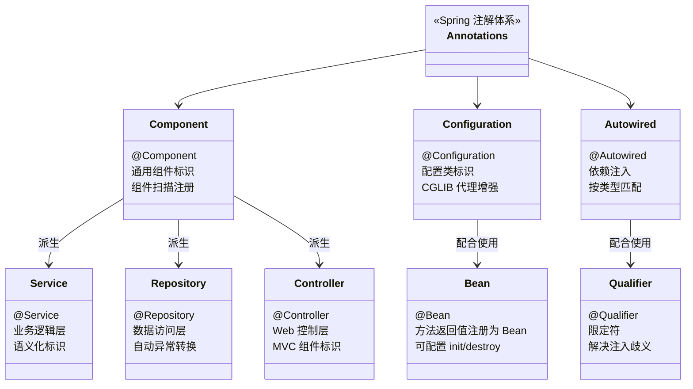

## 引言

你只会用 @Autowired？Spring 注解背后藏着整个容器的秘密

遥想 Spring 早期，XML 配置是主流，一个简单的应用可能需要大量 XML 文件来定义 Bean、配置依赖、声明事务——这就是"配置地狱"。随着 Java 5 引入注解特性，Spring 迅速拥抱这一变化，推出了基于注解的配置方式。

注解的引入带来了革命性的变化：简化配置、提高开发效率、增强可读性。但对于中高级开发者来说，仅仅会用注解是远远不够的。每一个常用的 Spring 注解背后，都隐藏着 Spring 容器为了处理它而默默执行的复杂机制。

理解这些注解"为什么"能工作，以及它们触发了 Spring 容器的哪些行为，是提升技术内功、高效解决问题、并从容面对高阶面试的必经之路。

💡 **核心提示** Spring 注解不是"语法糖"——它们是容器行为的触发器。`@Component` 触发组件扫描和 BeanDefinition 注册，`@Configuration` 触发 CGLIB 代理，`@Transactional` 触发事务代理创建。理解注解背后的处理链路，才能真正驾驭 Spring。

```mermaid
flowchart TD
    A[Spring 容器启动] --> B[组件扫描\n@ComponentScan]
    B --> C[扫描包路径, 查找\n@Component/@Service/@Controller/@Repository]
    C --> D[为每个带注解的类\n创建 BeanDefinition]
    D --> E[注册到 BeanFactory]
    E --> F[BeanFactoryPostProcessor\n处理 BeanDefinition]
    F --> G[Bean 实例化\n反射调用构造器]
    G --> H[属性填充阶段\nAutowiredAnnotationBeanPostProcessor]
    H --> H1[@Autowired\n按类型注入依赖]
    H --> H2[@Value\n解析 ${} 占位符 / #{SpEL}]
    H1 --> I[初始化阶段]
    H2 --> I
    I --> I1[@PostConstruct\n执行初始化逻辑]
    I --> I2[BeanPostProcessor\nAOP / 事务代理]
    I2 --> J[Bean Ready\n可使用]
```



### IoC 容器核心注解

#### @Component 及其派生注解：@Repository、@Service、@Controller

这四个注解是组件扫描的基础。它们都是 `@Component` 的**元注解**，Spring 会扫描这些注解标识的类，并将其注册为 BeanDefinition。

| 注解 | 语义层 | 特殊功能 | 推荐场景 |
|------|--------|---------|---------|
| `@Component` | 通用组件 | 无 | 通用工具类 |
| `@Service` | 业务逻辑层 | 无特殊功能（语义标识） | Service 层实现类 |
| `@Repository` | 数据访问层 | **自动异常转换**：将数据访问相关异常转换为 Spring 统一 DataAccessException 体系 | DAO/Repository 实现类 |
| `@Controller` | Web 控制层 | Spring MVC 识别为控制器 | Web 控制器 |

💡 **核心提示** `@Repository` 的异常转换功能是通过 `PersistenceExceptionTranslationPostProcessor`（一个 BeanPostProcessor）实现的。它拦截 DAO 层抛出的原生异常（如 `SQLException`），将其转换为 Spring 统一的 `DataAccessException` 层次结构，让上层代码只需处理 Spring 的异常体系。

#### @Autowired — 依赖注入的核心

`@Autowired` 由 **`AutowiredAnnotationBeanPostProcessor`** 处理。在 Bean 生命周期的**属性填充阶段**，它会检查带有 `@Autowired`、`@Value` 或 JSR 330 `@Inject` 的成员和方法，尝试从容器中查找匹配的 Bean 并注入。

**查找策略：**
1. 按**类型**查找
2. 多个同类型 → 按**名称**匹配（变量名/参数名）
3. 仍有多个 → 检查 `@Primary`，优先选择
4. 仍有多个 → 检查 `@Qualifier`，精确匹配
5. 无法确定 → 抛出 `NoUniqueBeanDefinitionException`

💡 **核心提示** `@Autowired` 默认按**类型**注入，不是按名称。只有当存在多个同类型 Bean 时，才回退到按名称匹配。这与 `@Resource`（默认按名称）有本质区别。

#### @Autowired vs @Resource vs @Inject 对比

| 维度 | @Autowired | @Resource | @Inject |
|------|-----------|-----------|---------|
| 来源 | Spring | JSR-250 标准 | JSR-330 标准 |
| 匹配策略 | 先按类型，再按名称 | 先按名称，再按类型 | 按类型 |
| required 属性 | 支持 (`required=false`) | 不支持 | 不支持 |
| 可标注位置 | 字段、Setter、构造器 | 字段、Setter | 字段、Setter、构造器 |
| 框架依赖 | Spring 专属 | 标准注解，框架无关 | 标准注解，框架无关 |

#### @Qualifier — 解决注入歧义

当容器中存在多个同类型 Bean 时，`@Qualifier` 精确指定注入哪一个：

```java
@Service("smsSender")
public class SmsSender implements MessageSender { ... }

@Service("emailSender")
public class EmailSender implements MessageSender { ... }

@Service
public class NotificationService {
    @Autowired
    @Qualifier("emailSender")  // 指定注入 emailSender
    private MessageSender messageSender;
}
```

#### @Value — 外部化配置注入

```java
@Value("${app.name}")                          // 配置文件属性
@Value("#{systemProperties['java.version']}")  // 系统属性 (SpEL)
@Value("#{userService.getUserCount() > 100 ? 'Plenty' : 'Few'}")  // SpEL 表达式
```

由 `AutowiredAnnotationBeanPostProcessor` 处理。`${...}` 从 Environment 查找，`#{...}` 解析并执行 SpEL 表达式。

### 配置类注解 (JavaConfig)

#### @Configuration — 不只是标识那么简单

`@Configuration` 类会被 Spring 进行 **CGLIB 代理增强**。当你在一个 `@Configuration` 类中调用另一个 `@Bean` 方法时，实际调用的是代理对象的方法——代理拦截调用，从容器缓存中查找或创建 Bean，而不是每次执行方法体创建新实例。

这就是 `@Configuration` 的 **Full 模式**（默认）。如果设置 `@Configuration(proxyBeanMethods = false)`，则处于 **Lite 模式**，内部调用 `@Bean` 方法会直接执行方法体。

💡 **核心提示** `@Configuration` 的 CGLIB 代理是保证 `@Bean` 方法之间调用时单例语义的关键。如果不用 Full 模式，`userController(userService())` 中的 `userService()` 每次都会创建新实例，破坏单例语义。

#### @Bean — 定义 Bean

标注在 `@Configuration` 类的方法上，返回值注册为 Bean。支持 `name`、`initMethod`、`destroyMethod` 属性。

```java
@Bean(name = "myDataSource", initMethod = "init", destroyMethod = "close")
public DataSource dataSource() {
    return new MyCustomDataSource();
}
```

#### @ComponentScan — 组件扫描

```java
@Configuration
@ComponentScan(basePackages = {"com.example.service", "com.example.controller"})
public class AppConfig { ... }
```

Spring 容器启动时扫描指定包及其子包，查找带有 `@Component` 或其派生注解的类，为它们创建并注册 BeanDefinition。

#### @Import — 组合配置类

可以导入 `@Configuration` 类、普通类、`ImportSelector` 或 `ImportBeanDefinitionRegistrar`：

```java
@Configuration
@Import({ServiceConfig.class, DaoConfig.class, MyRegistrar.class})
public class RootConfig { ... }
```

`ImportSelector` 和 `ImportBeanDefinitionRegistrar` 是高级扩展点，允许根据条件或编程逻辑动态注册 Bean 定义。**Spring Boot 的自动配置就是基于 `@Import` + `ImportSelector` 实现的。**

#### @Conditional 家族 — 条件化 Bean 注册

`@Conditional` 是 Spring Boot 自动配置的基石：

| 注解 | 条件 |
|------|------|
| `@ConditionalOnClass` | 类路径中存在指定类 |
| `@ConditionalOnMissingBean` | 容器中不存在指定类型的 Bean |
| `@ConditionalOnProperty` | 配置文件中存在指定属性 |
| `@ConditionalOnWebApplication` | 当前是 Web 应用 |
| `@ConditionalOnExpression` | SpEL 表达式结果为 true |

💡 **核心提示** Spring Boot 的 `@SpringBootApplication` 内部使用了 `@EnableAutoConfiguration`，后者通过 `@Import(AutoConfigurationImportSelector.class)` 扫描 `META-INF/spring.factories` 中的自动配置类。每个自动配置类都用 `@Conditional` 系列注解控制是否生效——这就是"约定优于配置"的秘密。

### AOP 相关注解

#### @EnableAspectJAutoProxy

```java
@Configuration
@EnableAspectJAutoProxy
public class AopConfig { ... }
```

注册 `AnnotationAwareAspectJAutoProxyCreator`（一个 BeanPostProcessor），负责扫描容器中的 `@Aspect` 切面，解析切点和通知，在 Bean 生命周期中为符合条件的 Bean 创建代理。

#### @Aspect 与通知注解

```java
@Aspect
@Component
public class LoggingAspect {

    @Pointcut("execution(public * com.example.service.*.*(..))")
    public void serviceMethods() {}

    @Before("serviceMethods()")
    public void logBefore(JoinPoint joinPoint) { ... }

    @Around("serviceMethods()")
    public Object logAround(ProceedingJoinPoint joinPoint) throws Throwable {
        Object result = joinPoint.proceed();  // 执行目标方法
        return result;
    }
}
```

| 通知类型 | 执行时机 | 能否阻止目标方法执行 |
|---------|---------|-------------------|
| `@Before` | 目标方法执行前 | 否（抛出异常可阻止） |
| `@AfterReturning` | 目标方法成功返回后 | 否 |
| `@AfterThrowing` | 目标方法抛出异常后 | 否 |
| `@After` | 目标方法执行后（无论异常） | 否 |
| `@Around` | 环绕目标方法 | 是（可不调用 proceed） |

### 生命周期注解 (JSR-250)

#### @PostConstruct

标注在方法上，在 Bean 属性填充后、`BeanPostProcessor#postProcessBeforeInitialization` 之后执行。

#### @PreDestroy

标注在方法上，在 Bean 销毁前执行（仅单例有效）。

由 **`CommonAnnotationBeanPostProcessor`** 处理。执行顺序：

```
初始化: @PostConstruct → InitializingBean#afterPropertiesSet() → init-method
销毁:   @PreDestroy → DisposableBean#destroy() → destroy-method
```

### @Component vs @Bean vs @Configuration 对比

| 维度 | @Component | @Bean | @Configuration |
|------|-----------|-------|---------------|
| 标注位置 | 类上 | 方法上 | 类上 |
| Bean 创建 | 自动扫描注册 | 方法返回值注册 | 类本身注册为 Bean |
| 适用场景 | 自己编写的类 | 第三方库对象 | 配置类 |
| CGLIB 代理 | 否 | 否 | 是（Full 模式） |
| 控制粒度 | 粗（自动） | 细（手动编码） | 中（组合 @Bean） |

### 生产环境避坑指南

1. **@Autowired 字段注入（不可测试）**：字段注入让类依赖 Spring 容器才能实例化，脱离容器无法创建对象。单元测试时无法通过构造器注入 Mock 对象。**解决**：使用构造器注入（Spring 4.3+ 单构造器可省略 `@Autowired`）。

2. **@ComponentScan 遗漏包路径**：只扫描配置类所在包的子包，其他包的 `@Component` 类不会被注册。**解决**：显式指定 `basePackages`，或将配置类放在根包下。

3. **@Bean 方法没有放在 @Configuration 类中**：普通类中的 `@Bean` 方法处于 Lite 模式，方法间调用不会走代理，每次创建新实例。**解决**：将 `@Bean` 方法放在 `@Configuration` 类中（保持 Full 模式）。

4. **@Transactional 标注在非 public 方法上**：Spring AOP 代理默认只拦截 public 方法，非 public 方法上的 `@Transactional` 不会生效。**解决**：确保事务方法为 public。

5. **@Scheduled 标注在非单例 Bean 上**：Spring 的定时任务调度器期望 Bean 是单例。如果 `@Scheduled` 标注在 prototype Bean 上，调度行为可能不符合预期。**解决**：`@Scheduled` 方法所在 Bean 保持默认单例作用域。

6. **@Autowired 注入多个候选 Bean 未指定 Qualifier**：当存在多个同类型实现时，`@Autowired` 抛出 `NoUniqueBeanDefinitionException`。**解决**：使用 `@Qualifier` 指定 Bean 名称，或使用 `@Primary` 标注首选实现。

### 注解的使用建议

* **注解 vs XML：** 注解使配置与代码紧密结合，XML 使配置集中化。大型项目推荐混合使用：核心组件用注解，环境/部署相关配置用 XML 或 PropertySource。
* **避免过度使用：** 不要在与业务逻辑无关的类上滥用 Spring 注解。遵循"配置类用配置注解，业务组件用少量核心注解"的原则。
* **统一风格：** 团队内统一注入方式（推荐构造器注入），避免混用 XML 和注解。

### 总结

Spring 注解覆盖框架的方方面面：从 IoC 核心（`@Autowired`、`@Component`），到配置类（`@Configuration`、`@Bean`），到 AOP（`@EnableAspectJAutoProxy`、`@Aspect`），到事务（`@EnableTransactionManagement`、`@Transactional`），再到生命周期（`@PostConstruct`、`@PreDestroy`）。

| 注解类别 | 核心注解 | 背后机制 |
|---------|---------|---------|
| IoC 组件 | `@Component`、`@Service`、`@Repository`、`@Controller` | 组件扫描 + BeanDefinition 注册 |
| 依赖注入 | `@Autowired`、`@Qualifier`、`@Value` | `AutowiredAnnotationBeanPostProcessor` |
| 配置类 | `@Configuration`、`@Bean`、`@ComponentScan`、`@Import` | CGLIB 代理 + JavaConfig 解析 |
| AOP | `@EnableAspectJAutoProxy`、`@Aspect`、`@Pointcut` | `AnnotationAwareAspectJAutoProxyCreator` |
| 事务 | `@EnableTransactionManagement`、`@Transactional` | 事务 BeanPostProcessor + AOP 代理 |
| 条件化 | `@Conditional` 家族 | `@Import` + `ImportSelector`（Spring Boot 基础） |
| 生命周期 | `@PostConstruct`、`@PreDestroy` | `CommonAnnotationBeanPostProcessor` |

会使用注解是基本功，理解其背后原理——BeanPostProcessor 如何识别处理、Bean 生命周期回调如何触发、AOP 代理如何创建——才是真正掌握 Spring 的标志。
