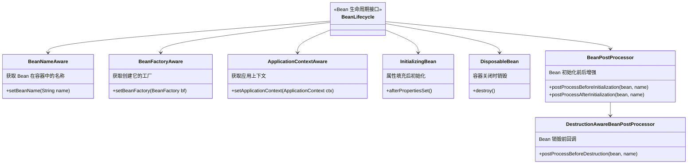
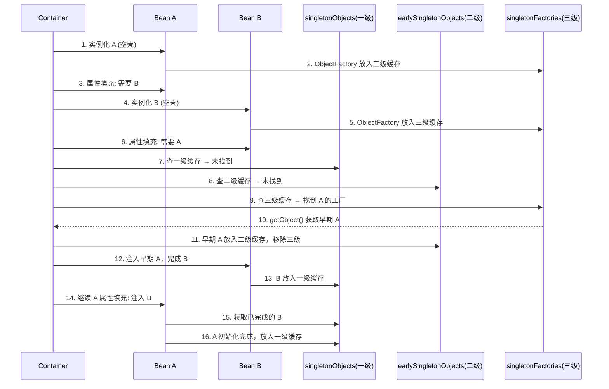

## 引言

一个 Bean 从出生到死亡，Spring 内部经历了多少个步骤？

想象一下，你正在构建一个企业级应用，需要管理数据库连接池、消息队列连接、缓存客户端等资源。这些资源往往需要在应用启动时初始化，在应用关闭时优雅地释放。Spring IoC 容器正是管理这些 Bean 的管家。

理解 Spring Bean 的生命周期，本质上就是理解这位管家在管理 Bean 的"从生到死"过程中，**何时**、**何地**会执行哪些操作，以及我们作为开发者可以在哪些关键节点**介入**或**影响**这些操作。

💡 **核心提示** Bean 生命周期的核心价值：掌握定制能力（在关键节点执行自定义逻辑）、理解框架底层机制（AOP、事务代理都是通过 BeanPostProcessor 实现的）、高效问题排查（定位初始化/依赖注入异常的根本原因）。

Spring IoC 容器对 Bean 的管理贯穿以下主要阶段：**Bean 定义 → Bean 实例化 → 属性填充 → 初始化 → 使用 → 销毁**。

```mermaid
flowchart TD
    A[BeanDefinition\n读取配置元数据] --> B[Instantiation\n反射创建空壳实例]
    B --> C[DI 属性填充\n依赖注入]
    C --> D[Aware 接口回调\n感知容器环境]
    D --> E[BeanPostProcessor\n#postProcessBeforeInitialization]
    E --> F{用户自定义初始化}
    F --> F1[@PostConstruct]
    F1 --> F2[InitializingBean\n#afterPropertiesSet]
    F2 --> F3[init-method]
    F3 --> G[BeanPostProcessor\n#postProcessAfterInitialization]
    G --> H[Bean Ready\n放入一级缓存]
    H --> I[应用使用]
    I --> J{容器关闭?}
    J -->|是| K[销毁阶段]
    J -->|否| I
    K --> K1[@PreDestroy]
    K1 --> K2[DisposableBean\n#destroy]
    K2 --> K3[destroy-method]
    K3 --> L[Bean 销毁完成]
```



### Spring Bean 生命周期详解

#### 阶段一：Bean 定义 (BeanDefinition)

容器启动时扫描配置元数据（XML、注解、JavaConfig），为每个 Bean 生成 `BeanDefinition` 对象——Bean 在容器中的"蓝图"，包含类名、构造器参数、属性值、作用域、初始化/销毁方法等。

**扩展点：** `BeanFactoryPostProcessor` 在所有 BeanDefinition 加载完成、Bean 实例尚未创建之前执行，可以修改 BeanDefinition 元数据。例如 `PropertySourcesPlaceholderConfigurer` 解析 `${...}` 占位符。

#### 阶段二：Bean 实例化 (Instantiation)

容器根据 BeanDefinition 中的类名，通过反射调用构造器创建原始 Bean 实例。此时 Bean 只是一个"空壳"，属性尚未填充。

#### 阶段三：属性填充 (Property Population / DI)

容器通过依赖注入为 Bean 实例填充属性。包括字面量值、集合、依赖的其他 Bean 实例。这个过程可能是递归的——如果依赖的 Bean 尚未创建，容器会先去创建依赖的 Bean。

#### 阶段四：初始化 (Initialization) — 回调点最多、最复杂

##### 4.1 Aware 接口回调

如果 Bean 实现了特定 Aware 接口，容器会注入相应的环境对象：

| 接口 | 方法 | 作用 |
|------|------|------|
| `BeanNameAware` | `setBeanName(String)` | 注入 Bean 名称 |
| `BeanFactoryAware` | `setBeanFactory(BeanFactory)` | 注入 BeanFactory |
| `ApplicationContextAware` | `setApplicationContext(ApplicationContext)` | 注入 ApplicationContext |
| `EnvironmentAware` | `setEnvironment(Environment)` | 注入环境配置 |
| `ResourceLoaderAware` | `setResourceLoader(ResourceLoader)` | 注入资源加载器 |

##### 4.2 BeanPostProcessor#postProcessBeforeInitialization()

容器遍历所有 BeanPostProcessor，在用户自定义初始化方法**之前**调用。这是一个强大的扩展点——Spring AOP 的 `AbstractAutoProxyCreator` 在此阶段进行判断和准备。

##### 4.3 用户自定义初始化方法（按顺序执行）

💡 **核心提示** `@PostConstruct`、`InitializingBean`、`init-method` 三者的执行顺序是面试高频考点。它们本质上是同一阶段的三种不同配置方式，Spring 按固定顺序依次调用。

| 方式 | 来源 | 特点 | 推荐度 |
|------|------|------|--------|
| `@PostConstruct` | JSR-250 标准 | 注解驱动，与 Spring 耦合度低 | 推荐 |
| `InitializingBean#afterPropertiesSet()` | Spring 接口 | 接口耦合，无法修改源码时不可用 | 不推荐 |
| `init-method` | BeanDefinition 配置 | 配置化，适合第三方类 | 可选 |

##### 4.4 BeanPostProcessor#postProcessAfterInitialization()

在用户自定义初始化方法**之后**调用。此方法可以返回原始 Bean，也可以返回一个完全不同的对象（通常是代理对象）。Spring AOP 代理的创建和返回就发生在此阶段。

💡 **核心提示** `postProcessAfterInitialization` 能够**替换** Bean 实例——这正是理解 AOP 代理如何生效的关键。容器后续会将代理对象（而非原始 Bean）注入给其他 Bean。

#### 阶段五：Bean Ready for Use

所有回调点执行完毕后，Bean 完全初始化，存入一级缓存 `singletonObjects`，可以被其他 Bean 注入或应用程序直接使用。

#### 阶段六：Bean 销毁 (Destruction)

容器关闭时执行。仅对**单例 Bean** 生效。

| 方式 | 来源 | 执行顺序 |
|------|------|---------|
| `@PreDestroy` | JSR-250 标准 | 最先执行 |
| `DisposableBean#destroy()` | Spring 接口 | 中间执行 |
| `destroy-method` | BeanDefinition 配置 | 最后执行 |

**注意：** 原型 (Prototype) Bean 的销毁回调不会被 Spring 调用。开发者需要自己管理原型 Bean 的生命周期。

### BeanPostProcessor vs BeanFactoryPostProcessor

这是面试必考题，两者的核心区别在于作用阶段和处理对象：

| 维度 | BeanFactoryPostProcessor | BeanPostProcessor |
|------|-------------------------|-------------------|
| 作用阶段 | Bean 定义阶段（实例化**之前**） | Bean 实例化后（初始化阶段） |
| 处理对象 | `BeanDefinition`（图纸） | Bean 实例（造好的零件） |
| 方法数量 | `postProcessBeanFactory()` | `before` + `after` 两个方法 |
| 典型应用 | 占位符解析、属性修改 | AOP 代理、`@Autowired` 处理 |
| 创建时机 | 比普通 Bean **更早**创建 | 普通 Bean 创建过程中调用 |

💡 **核心提示** 记住这个核心差异：`BeanFactoryPostProcessor` 动的是"图纸"（BeanDefinition），`BeanPostProcessor` 动的是"造好的零件"（Bean 实例）。

### Bean 生命周期与循环依赖

Spring 通过**三级缓存**解决单例 Bean 的 Setter/字段注入循环依赖：



* **构造器注入的循环依赖无法解决：** 构造器阶段尚未完成实例化，没有机会放入三级缓存。
* **原型 Bean 的循环依赖无法解决：** 原型 Bean 不缓存状态，每次创建新实例，无限循环。

### 生产环境避坑指南

1. **构造器循环依赖**：Spring 无法解决构造器注入的循环依赖（实例化阶段尚未完成，无法放入三级缓存），直接抛出 `BeanCurrentlyInCreationException`。**解决**：改用 Setter 注入或在依赖上使用 `@Lazy` 打破循环。

2. **@PostConstruct 与 InitializingBean 双重初始化**：同时使用两种初始化方式会导致初始化逻辑执行两次。如果两个方法内部操作了同一资源（如创建连接池），会导致资源泄漏。**解决**：只选择一种方式，推荐使用 `@PostConstruct`。

3. **BeanPostProcessor 返回错误类型**：`postProcessAfterInitialization` 可以返回任意对象。如果返回了与原始 Bean 不兼容的类型，后续依赖注入会抛出 `BeanNotOfRequiredTypeException`。**解决**：确保返回类型与 Bean 声明类型兼容。

4. **原型 Bean 资源泄漏**：原型 Bean 的销毁回调（`@PreDestroy`、`DisposableBean`、`destroy-method`）不会被 Spring 调用。如果 Bean 持有数据库连接、文件句柄等资源，会导致泄漏。**解决**：使用 `ObjectFactory` + try-with-resources 手动管理生命周期，或注册 `DestructionAwareBeanPostProcessor`。

5. **BeanDefinition 覆盖问题**：Spring Boot 2.1+ 默认禁止 BeanDefinition 覆盖。如果两个配置定义了同名的 Bean，启动会报错。**解决**：显式设置 `spring.main.allow-bean-definition-overriding=true`（不推荐），或重命名冲突的 Bean。

6. **BeanPostProcessor Bean 的循环依赖**：BeanPostProcessor 本身也是 Bean，它们的创建优先于普通 Bean。如果 BeanPostProcessor 依赖的 Bean 又依赖 BeanPostProcessor，会导致死锁。**解决**：避免在 BeanPostProcessor 中注入普通业务 Bean。

### 总结

Spring Bean 的生命周期是其 IoC 容器最核心的机制。从 Bean 定义到销毁，每一步都有精确的时序和扩展点：

| 阶段 | 核心操作 | 时间复杂度 |
|------|---------|-----------|
| BeanDefinition | 扫描配置，生成蓝图 | O(n) n=Bean 数量 |
| 实例化 | 反射调用构造器 | O(1) |
| 属性填充 | 依赖注入（可能递归） | O(d) d=依赖深度 |
| 初始化 | Aware → BPP.before → 用户初始化 → BPP.after | O(m) m=后置处理器数量 |
| 销毁 | @PreDestroy → DisposableBean → destroy-method | O(1) |

**使用建议：**

1. 优先使用 `@PostConstruct` / `@PreDestroy` 进行初始化和销毁，它们是标准注解，与 Spring 耦合度最低。
2. 需要全局 Bean 增强时，实现自定义 `BeanPostProcessor`；需要在 Bean 创建前修改配置时，使用 `BeanFactoryPostProcessor`。
3. 对于需要释放资源的 Bean，务必注册销毁回调（仅单例有效），避免资源泄漏。
4. 理解 BeanPostProcessor 在 AOP 代理创建中的作用，这有助于排查代理失效和 `this` 调用绕过代理的问题。
