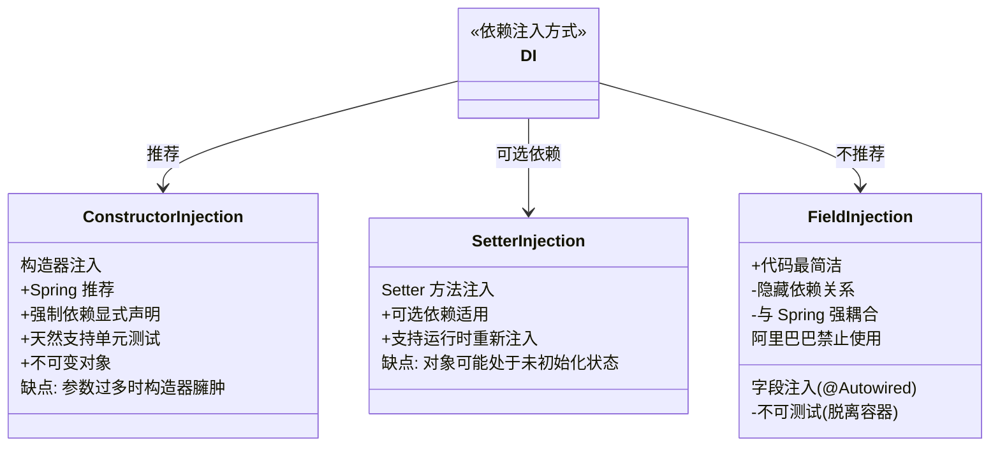
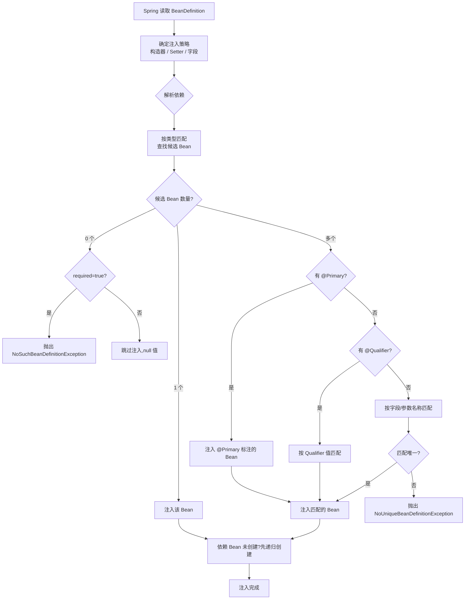

## 引言

Spring 依赖注入的三种方式，为什么阿里巴巴禁用字段注入？

Spring 的 IoC 容器帮你管理对象，但容器怎么知道该给对象注入什么依赖？答案就是**依赖注入 (Dependency Injection)**——Spring 在创建 Bean 时，自动将其依赖的其他 Bean 注入进来。

但注入方式有三种：构造器注入、Setter 注入、字段注入。它们各有什么优劣？为什么阿里巴巴《Java 开发手册》明确禁止使用字段注入？为什么 Spring 官方从 4.x 开始推荐使用构造器注入？

理解这三种注入方式的差异和 Spring 的 DI 解析策略，不仅能帮你写出更优雅的代码，还能帮你避开循环依赖、隐藏依赖、测试困难等常见陷阱。

💡 **核心提示** 字段注入看似最简洁，但隐藏了类的依赖关系，让类脱离容器无法实例化，也让单元测试变得困难。构造器注入让依赖关系一目了然，强制依赖显式声明，是 Spring 官方推荐的最佳实践。



### Spring DI 解析过程



### 三种注入方式深度解析

#### 构造器注入 (Constructor Injection) — Spring 推荐

```java
@Service
public class OrderService {
    private final UserRepository userRepository;
    private final PaymentGateway paymentGateway;

    // Spring 4.3+ 单构造器可省略 @Autowired
    public OrderService(UserRepository userRepository, PaymentGateway paymentGateway) {
        this.userRepository = userRepository;
        this.paymentGateway = paymentGateway;
    }
}
```

**优势：**
* **强制依赖显式声明：** 构造器参数列表一目了然，类的依赖关系清晰可见。
* **不可变性：** 依赖字段声明为 `final`，创建后不可修改，线程安全。
* **天然可测试：** 单元测试时无需 Spring 容器，直接 `new OrderService(mockRepo, mockGateway)` 即可。
* **保证完全初始化：** 对象创建后所有依赖已就位，不会出现"半初始化"状态。
* **循环依赖早期暴露：** 构造器注入的循环依赖在启动时就报错，不会延迟到运行时。

💡 **核心提示** 从 Spring 4.x 开始，官方推荐使用构造器注入处理强制依赖。Spring 4.3+ 如果类只有一个构造器，可以省略 `@Autowired` 注解，进一步减少样板代码。

#### Setter 注入 (Setter Injection) — 可选依赖

```java
@Service
public class NotificationService {
    private EmailSender emailSender;  // 可选依赖

    @Autowired(required = false)
    public void setEmailSender(EmailSender emailSender) {
        this.emailSender = emailSender;
    }
}
```

**适用场景：**
* **可选依赖：** 该依赖不是必须的，没有也能正常工作。
* **运行时可变：** 依赖可能在运行时需要更换实现（通过重新调用 Setter）。

**劣势：**
* 对象可能处于"部分初始化"状态（Setter 未被调用时依赖为 null）。
* 需要在每个使用依赖的方法中进行 null 检查。

#### 字段注入 (Field Injection) — 不推荐

```java
@Service
public class UserService {
    @Autowired  // 不推荐！
    private UserRepository userRepository;

    @Autowired  // 不推荐！
    private EmailSender emailSender;
}
```

**为什么不推荐（阿里巴巴为什么禁止）：**
* **隐藏依赖关系：** 不看字段上的注解，不知道这个类依赖什么。类的外部无法从构造器签名了解其依赖。
* **脱离容器无法实例化：** 测试时必须启动 Spring 容器或使用 ReflectionTestUtils，无法直接 `new`。
* **与 Spring 强耦合：** 字段注入是 Spring 特有的，切换到其他 DI 框架需要全部修改。
* **无法声明为 final：** 字段注入不能在声明时为 final，破坏了不可变性。
* **掩盖设计问题：** 字段注入让类可以无限制地添加 `@Autowired` 字段，导致类承担过多职责。

### @Autowired 解析策略

当 Spring 处理 `@Autowired` 时，遵循以下策略：

1. **按类型查找**：在容器中查找与字段/参数类型匹配的 Bean。
2. **多个候选 → @Primary**：如果标记了 `@Primary` 的 Bean，优先选择。
3. **多个候选 → @Qualifier**：如果使用了 `@Qualifier`，按限定符精确匹配。
4. **多个候选 → 按名称**：回退到按字段名/参数名匹配。
5. **仍无法确定**：抛出 `NoUniqueBeanDefinitionException`。

💡 **核心提示** `@Primary` 用于设置"默认首选"，适合某个接口的常用实现；`@Qualifier` 用于精确指定，适合需要注入特定实现的场景。两者配合使用可以灵活处理复杂的多实现注入。

### 对比表：三种注入方式

| 维度 | 构造器注入 | Setter 注入 | 字段注入 |
|------|-----------|------------|---------|
| **依赖可见性** | 高（构造器参数一目了然） | 中（需看 Setter 方法） | 低（需逐字段查看） |
| **不可变性** | 支持（final 字段） | 不支持 | 不支持 |
| **可测试性** | 高（直接 new + Mock） | 中（需调用 Setter） | 低（需容器或反射） |
| **框架耦合** | 低（纯 Java） | 中（需要 @Autowired） | 高（必须 @Autowired） |
| **强制依赖** | 支持 | 不支持 | 支持但不推荐 |
| **可选依赖** | 不直观 | 支持 | 支持 |
| **循环依赖** | 启动时暴露 | 运行时可能发现 | 运行时可能发现 |
| **参数过多** | 构造器臃肿（考虑拆分） | 优雅 | 看起来没问题（掩盖问题） |
| **Spring 推荐度** | 强烈推荐 | 可选依赖使用 | 不推荐 |

### 生产环境避坑指南

1. **构造器参数过多**：当构造器参数超过 4-5 个时，说明这个类职责过多，违反了单一职责原则。**解决**：拆分类，或将相关参数组合为一个新的配置类/值对象。不要为了减少参数而改用字段注入——这只是掩盖了设计问题。

2. **构造器循环依赖**：A 的构造器需要 B，B 的构造器需要 A，Spring 无法解决（实例化阶段尚未完成，没有机会放入三级缓存）。**解决**：改用 Setter 注入或在其中一个依赖上使用 `@Lazy` 打破循环。

3. **@Autowired 多候选未指定 Qualifier**：容器中有多个 `MessageSender` 实现，`@Autowired` 直接注入会抛出 `NoUniqueBeanDefinitionException`。**解决**：使用 `@Qualifier("emailSender")` 指定 Bean 名称，或使用 `@Primary` 标注默认实现。

4. **Setter 注入允许非预期的 null**：使用 Setter 注入但忘记标注 `required=false`，且该依赖是强制性的。当容器无法找到匹配的 Bean 时（或 `required=false` 时没有注入），字段为 null，后续 NPE。**解决**：强制依赖使用构造器注入；可选依赖明确标注 `@Autowired(required = false)` 并做好 null 处理。

5. **字段注入导致测试困难**：字段注入的类无法在不启动 Spring 容器的情况下进行单元测试。测试人员被迫使用 `@SpringBootTest` 启动完整上下文，导致测试缓慢。**解决**：改用构造器注入，测试时直接 `new` 并传入 Mock 对象。

6. **@Autowired 与 @Resource 混用**：团队内混用 `@Autowired`（按类型）和 `@Resource`（按名称），导致注入行为不一致，问题难以排查。**解决**：团队统一使用一种注入注解，推荐 `@Autowired` + 构造器注入。

### 总结

Spring 依赖注入是 IoC 容器的核心功能，三种注入方式各有适用场景：

| 注入方式 | 适用场景 | Spring 推荐度 |
|---------|---------|-------------|
| 构造器注入 | 强制依赖、不可变对象、需要测试 | 强烈推荐 |
| Setter 注入 | 可选依赖、运行时可变 | 可选使用 |
| 字段注入 | 无（代码简洁不是理由） | 不推荐 |

**行动清单：**

1. 将所有强制依赖改为构造器注入，声明为 `final` 字段。
2. 可选依赖使用 Setter 注入，并明确标注 `@Autowired(required = false)`。
3. 逐步移除项目中所有字段注入的 `@Autowired` 注解。
4. 当构造器参数过多时，考虑拆分类或引入配置对象，而不是改用字段注入。
5. 遇到循环依赖时，优先从设计上消除，其次使用 `@Lazy`，最后才改为 Setter 注入。
6. 为多个同类型实现设置 `@Primary`（默认）或 `@Qualifier`（精确指定）。

理解 DI 的三种方式及其优劣，能帮你写出更健壮、更可测试、更易维护的 Spring 代码。阿里巴巴禁用字段注入不是没有道理的——构造器注入的每个优势，都在真实项目的痛点上得到了验证。
