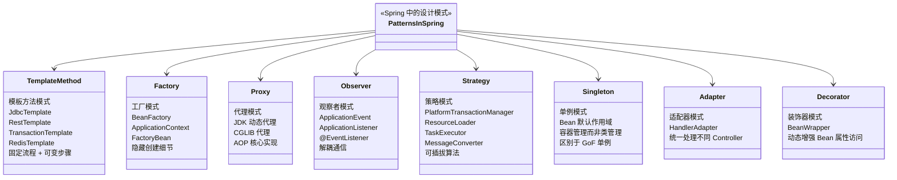
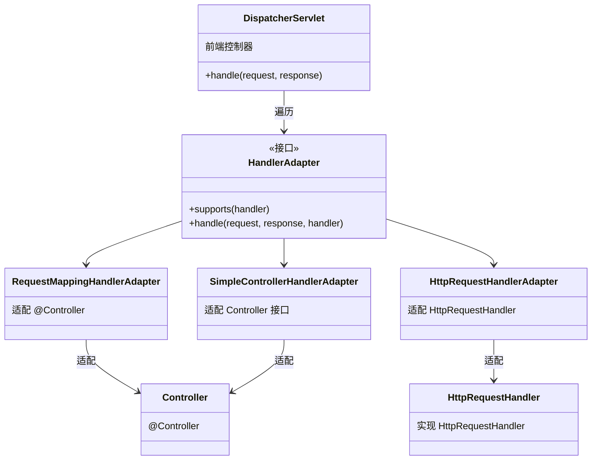

## 引言

Spring 源码里藏着多少种设计模式？掌握这些，你的代码也能如此优雅

Spring 框架是 Java 企业级应用开发的事实标准。它提供了一站式的解决方案，涵盖了依赖注入、AOP、事务管理、MVC、数据访问等众多领域。然而，Spring 的伟大不仅仅在于功能的全面，更在于底层设计的精巧与匠心。

而这种精巧设计的核心密码，正是对经典设计模式的融会贯通与灵活运用。Spring 框架本身就是一个设计模式的集大成者——IoC 容器运用了工厂模式，AOP 运用了代理模式，事务管理运用了策略模式，JdbcTemplate 运用了模板方法模式……

理解 Spring 如何使用设计模式，价值巨大：

* **深入理解 Spring 核心原理：** 设计模式是 Spring 的骨骼和脉络。看懂模式，才能真正看懂 Spring 的"魔术"。
* **更好地利用 Spring 扩展点：** 扩展机制围绕设计模式构建，理解模式能更高效地进行高级定制。
* **编写更"Spring 化"的代码：** 学习框架如何运用模式，指导我们在业务代码中应用类似的设计思想。
* **从容应对高阶面试：** 结合设计模式阐述 Spring 特性，展现更强的技术功底。

💡 **核心提示** 设计模式不是 Spring 的"附加功能"，而是它的"DNA"。理解这些模式如何协同工作，比单纯记住每个模式的定义更有价值——你会发现 Spring 的各个模块是如何通过这些模式有机结合在一起的。



### 核心设计模式在 Spring 中的应用

#### 模板方法模式 (Template Method)

模板方法模式在方法中定义算法骨架，将具体步骤延迟到子类或回调中。

Spring 大量使用 "Template" 后缀类处理固定流程 + 可变步骤的场景：

| Template 类 | 固定流程 | 可变步骤（回调） |
|-------------|---------|-----------------|
| `JdbcTemplate` | 获取连接 → 创建 Statement → 执行 SQL → 关闭资源 | SQL 创建、参数设置、结果集映射 (`RowMapper`) |
| `RestTemplate` | 构建请求 → 发送 HTTP → 解析响应 | 请求回调、响应提取器 |
| `TransactionTemplate` | 开启事务 → 执行回调 → 提交/回滚 | 业务逻辑 (`TransactionCallback`) |
| `RedisTemplate` | 获取连接 → 执行命令 → 释放连接 | 具体 Redis 操作 |

```java
// JdbcTemplate 示例：开发者只需关注 SQL 和结果映射
jdbcTemplate.query(
    "SELECT * FROM users WHERE id = ?",
    new Object[]{userId},
    (rs, rowNum) -> new User(rs.getLong("id"), rs.getString("name")) // RowMapper 回调
);
```

💡 **核心提示** 模板方法模式通过"钩子方法"（回调接口）让开发者在不改变流程骨架的前提下自定义步骤。好处是减少样板代码、保证流程一致性（如资源关闭总是执行）、提供简洁 API。

#### 工厂模式 (Factory Method / Abstract Factory)

Spring 的 IoC 容器本身就是典型工厂：

* **`BeanFactory`：** 最基础工厂，提供按需延迟加载。
* **`ApplicationContext`：** 增强工厂，增加事件发布、国际化、统一资源加载等。启动时预加载所有单例 Bean。
* **多种 ApplicationContext 实现**（`ClassPathXmlApplicationContext`、`AnnotationConfigApplicationContext`、`WebApplicationContext` 等）体现了**抽象工厂模式**——为不同配置方式提供一系列相关工厂。

#### 代理模式 (Proxy)

Spring AOP 的核心实现机制：

| 代理类型 | 条件 | 实现方式 | 限制 |
|---------|------|---------|------|
| JDK 动态代理 | 目标实现了接口 | 代理接口方法 | 只能代理接口方法 |
| CGLIB 代理 | 目标未实现接口 | 继承目标类创建子类 | 目标类/方法不能是 final |

**与 Bean 生命周期的关联：** 代理对象在 `BeanPostProcessor#postProcessAfterInitialization()` 阶段创建。`AbstractAutoProxyCreator` 检查 Bean 是否需要代理，如果需要就创建代理对象并返回。后续其他 Bean 注入时获取到的是代理对象而非原始 Bean。

💡 **核心提示** 理解代理模式能解释为什么通过 `this` 在 Bean 内部调用方法时 AOP 会失效——因为 `this` 指向原始对象，而非代理对象。

#### 观察者模式 (Observer)

Spring 的 ApplicationEvent/Listener 机制：

* **`ApplicationEventPublisher`**（通常是 `ApplicationContext`）：主题 (Subject)，发布事件。
* **`ApplicationEvent`**：事件本身。
* **`ApplicationListener`** / `@EventListener`：观察者，接收并处理事件。

```java
// 发布事件
applicationEventPublisher.publishEvent(new OrderCreatedEvent(this, orderId));

// 监听事件（Spring 4.2+）
@EventListener
public void handleOrderCreated(OrderCreatedEvent event) {
    // 发送通知、更新缓存等
}
```

💡 **核心提示** Spring 事件机制默认是**同步**的。`@EventListener` 方法在主线程中执行，如果耗时操作会阻塞主流程。需要异步时，在监听方法上加 `@Async` 注解（需先开启异步支持 `@EnableAsync`）。

#### 策略模式 (Strategy)

Spring 通过接口定义策略，提供多种实现，运行时根据配置选择：

| 策略接口 | 实现类举例 | 选择依据 |
|---------|-----------|---------|
| `PlatformTransactionManager` | `DataSourceTransactionManager`、`JpaTransactionManager` | 配置的数据访问技术 |
| `ResourceLoader` | `ClassPathResourceLoader`、`FileSystemResourceLoader` | 资源路径类型 |
| `TaskExecutor` | `SimpleAsyncTaskExecutor`、`ThreadPoolTaskExecutor` | 并发需求 |
| `MessageConverter` | `MappingJackson2HttpMessageConverter`、`StringHttpMessageConverter` | 请求/响应 Content-Type |

#### 单例模式 (Singleton)

Spring Bean 的默认作用域是 `singleton`，但与经典 GoF 单例有本质区别：

| 维度 | GoF 单例模式 | Spring 单例 |
|------|-------------|------------|
| 实例控制者 | 类自身（私有构造器 + 静态方法） | Spring IoC 容器 |
| 获取方式 | `ClassName.getInstance()` | `context.getBean("beanName")` |
| 类加载耦合 | 客户端直接依赖类 | 客户端只依赖接口 |
| 灵活性 | 低（硬编码） | 高（配置驱动） |

#### 适配器模式 (Adapter)

Spring MVC 的 `HandlerAdapter` 是典型的适配器模式：



### 为什么 Spring 偏爱这些模式？

* **高内聚低耦合：** 各模块职责单一，通过接口和 DI 协作。
* **极高灵活性和可扩展性：** 策略模式、工厂模式让组件易于替换。
* **出色可测试性：** 解耦设计 + DI，方便 Mock 依赖。
* **减少样板代码：** 模板方法模式封装繁琐流程。
* **一致的编程模型：** 无论底层技术如何，API 风格统一。

### 生产环境避坑指南

1. **@EventListener 阻塞主线程**：默认同步执行，如果监听方法中有耗时操作（如 HTTP 调用、邮件发送），会阻塞事件发布者的主流程。**解决**：在监听方法上加 `@Async`，并确保已开启 `@EnableAsync`。

2. **FactoryBean 的 getObject() 返回 null**：`FactoryBean` 用于创建复杂对象，如果 `getObject()` 返回 null，Spring 不会抛出异常，但后续注入时会报 `NullPointerException`。**解决**：确保 `getObject()` 始终返回非 null 实例。

3. **模板方法子类破坏不变量**：继承 Template 类并重写钩子方法时，如果违反了父类定义的前置/后置条件（如未正确关闭资源），会导致资源泄漏。**解决**：仔细阅读 Template 类的 Javadoc，理解哪些步骤是框架管理的、哪些需要开发者负责。

4. **Resource 路径混淆**：`classpath:` vs `file:` vs URL 路径搞混，导致资源加载失败。classpath 查找类路径下，file 查找文件系统，URL 查找网络资源。**解决**：明确资源位置，使用正确的 Resource 前缀。

5. **HandlerAdapter 匹配顺序**：`DispatcherServlet` 遍历 HandlerAdapter 列表，使用第一个 `supports(handler)` 返回 true 的适配器。如果自定义的 HandlerAdapter 顺序不对，可能导致请求被错误处理。**解决**：通过 `@Order` 或 `Ordered` 接口控制适配器顺序。

6. **策略模式的选择歧义**：当容器中存在多个同一策略接口的实现时（如多个 `MessageConverter`），Spring 的选择策略可能不符合预期。**解决**：显式配置策略选择器，或通过 `@Primary`、`@Qualifier` 指定首选实现。

### 工厂模式深度对比：FactoryBean vs BeanFactory

这是面试高频混淆点：

| 维度 | BeanFactory | FactoryBean |
|------|------------|-------------|
| 角色 | **容器本身**（Bean 工厂） | **特殊 Bean**（工厂 Bean） |
| 作用 | 创建和管理所有 Bean | 创建一个特定类型的 Bean |
| 获取方式 | `context.getBean("beanName")` | `context.getBean("&beanName")` 获取工厂本身 |
| 典型应用 | `ApplicationContext` | `SqlSessionFactoryBean` |
| 比喻 | 整个工厂 | 工厂里的一台机器 |

💡 **核心提示** 记住：`FactoryBean` 是一个**特殊的 Bean**，它本身也是由 `BeanFactory` 管理的。当你通过 `getBean("xxx")` 获取一个 FactoryBean 时，Spring 返回的是它 `getObject()` 方法创建的对象。要获取 FactoryBean 本身，需要加 `&` 前缀：`getBean("&xxx")`。

### 模板方法 vs 策略模式

| 维度 | 模板方法模式 | 策略模式 |
|------|-------------|---------|
| 核心思想 | 固定流程，可变步骤 | 不同算法，自由替换 |
| 结构 | 继承（抽象类定义骨架） | 组合（接口 + 多个实现） |
| 运行时可变 | 否（编译时确定） | 是（运行时切换） |
| Spring 示例 | `JdbcTemplate` | `PlatformTransactionManager` |
| 适用场景 | 流程固定，部分步骤需定制 | 多种算法/实现，需动态选择 |

### 总结

Spring 框架之所以成为 Java 世界的翘楚，与其对经典设计模式的巧妙运用密不可分：

| 设计模式 | Spring 中的典型应用 | 解决的问题 |
|---------|-------------------|-----------|
| 模板方法 | `JdbcTemplate`、`RestTemplate` | 减少样板代码，保证流程一致性 |
| 工厂模式 | `BeanFactory`、`FactoryBean` | 隐藏创建细节，解耦创建与使用 |
| 代理模式 | Spring AOP | 无侵入增强，横切关注点分离 |
| 观察者模式 | `ApplicationEvent` / `@EventListener` | 组件间解耦通信 |
| 策略模式 | `PlatformTransactionManager` | 底层技术可插拔 |
| 单例模式 | Bean 默认作用域 | 资源复用，性能优化 |
| 适配器模式 | `HandlerAdapter` | 统一处理不同类型的处理器 |

理解这些模式在 Spring 中的应用，让你不再只是 Spring 的使用者，而是理解者。当被问到 "Spring AOP 原理是什么？" 你能回答 "代理模式"；被问到 "事务管理如何支持多种技术？" 你能回答 "策略模式"——这种结合设计模式的深度回答，是面试中的加分利器。
