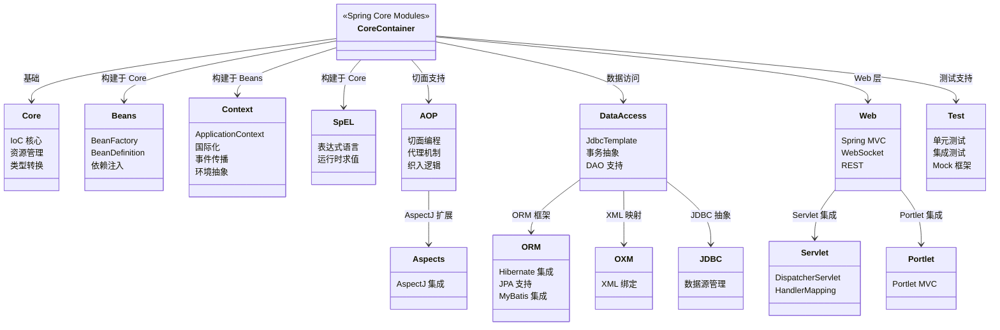

## 引言

Spring 为什么能统治 Java 企业级开发 20 年？

从 2004 年 Rod Johnson 发布《Expert One-on-One J2EE Development without EJB》到如今 Spring Boot、Spring Cloud、Spring AI 的全面繁荣，Spring 几乎成为了 Java 后端开发的代名词。无论大小公司，无论新老项目，Spring 的身影无处不在。

但 Spring 的成功并非偶然。它不是靠营销，也不是靠"大而全"的功能堆砌——而是靠**卓越的架构设计和核心设计理念**。正是这些理念，让 Spring 能够灵活应对各种复杂场景，降低开发门槛，提升系统可维护性和可测试性。

对于中高级 Java 工程师而言，深入理解 Spring 的架构原理，不仅能帮助我们更高效地利用框架，更是应对高阶技术面试的关键。

💡 **核心提示** Spring 的强大不在于功能多，而在于设计好。IoC/DI 实现了对象解耦，AOP 实现了关注点分离，非侵入性让业务代码保持纯粹，模块化保证了灵活扩展。这些设计原则相互协同，共同构成了 Spring 的"架构之美"。



### Spring Bean 生命周期概览

```mermaid
flowchart TD
    A[BeanDefinition\n读取配置元数据] --> B[Instantiation\n反射创建实例]
    B --> C[DI 依赖注入\n属性填充]
    C --> D[Aware 接口回调\n感知容器]
    D --> E[BPP.before\n前置增强]
    E --> F[@PostConstruct\n用户初始化]
    F --> G[InitializingBean\n接口初始化]
    G --> H[init-method\n配置初始化]
    H --> I[BPP.after\n后置增强/AOP代理]
    I --> J[Bean Ready\n存入缓存]
    J --> K[应用使用]
    K --> L{容器关闭?}
    L -->|是| M[@PreDestroy → DisposableBean → destroy-method]
    L -->|否| K
    M --> N[Bean 销毁]
```

### Spring 架构的核心设计原则

#### 控制反转 (IoC) 与依赖注入 (DI) — 框架的基石

* **概念解释：**
    * **控制反转 (IoC - Inversion of Control)：** 将对象创建、依赖查找和生命周期管理的控制权从应用代码**反转**给框架。传统开发中，对象自己创建依赖；IoC 中，对象被动接受框架为其创建并管理的依赖。
    * **依赖注入 (DI - Dependency Injection)：** 实现 IoC 的具体方式。框架在创建对象时，将其依赖通过构造器、Setter 或字段注入。
    * **类比：** 传统方式像自己采购原材料组装产品；IoC/DI 像向"工厂"下单，框架负责采购、生产、组装后直接交付。

* **核心机制：**
    * **IoC 容器：** `BeanFactory` 提供基础 DI，`ApplicationContext` 是其增强版，提供国际化、事件传播、资源加载等企业级服务。
    * **配置元数据：** XML、注解（`@Component`、`@Autowired`）或 JavaConfig（`@Configuration` + `@Bean`）。

* **价值：**
    * **解耦：** 对象不直接依赖创建过程，轻松替换实现。
    * **易测试：** 方便 Mock 依赖，隔离测试核心逻辑。
    * **可维护：** 依赖关系集中管理，修改无需改动业务代码。

#### 面向切面编程 (AOP) — 解决横切关注点

* **概念：** 将日志、事务、安全等横切关注点从业务逻辑中分离，集中管理。

* **核心机制：**
    * **切面 (Aspect)：** 封装横切关注点的模块。
    * **连接点 (Join Point)：** 可插入切面的执行点（Spring AOP 主要支持方法级别）。
    * **切入点 (Pointcut)：** 定义在哪些方法上应用通知的表达式。
    * **通知 (Advice)：** Before、AfterReturning、AfterThrowing、After、Around 五种类型。

* **Spring AOP 实现：** 基于**动态代理**。
    * **JDK 动态代理：** 目标实现了接口时使用，代理接口方法。
    * **CGLIB 代理：** 目标未实现接口时通过继承创建代理子类。

💡 **核心提示** Spring AOP 的代理创建发生在 Bean 生命周期的 `BeanPostProcessor#postProcessAfterInitialization()` 阶段。代理对象**替换**了原始 Bean，所以后续其他 Bean 注入时获取到的是代理对象而非原始对象。

#### 抽象与非侵入性 — 解耦与简化测试

* **抽象：** Spring 为数据库访问、缓存、消息队列等技术提供高级抽象（如 `JdbcTemplate`），开发者面向抽象编程，底层实现由 Spring 适配。
* **非侵入性：** 业务对象保持为普通 POJO，不强制继承 Spring 特定基类或实现特定接口。

* **价值：**
    * **技术切换成本低：** 从 Hibernate 换 MyBatis 无需修改业务逻辑。
    * **容器外可测试：** 业务 POJO 不依赖 Spring 容器，单元测试快速独立。

#### 模块化与开放性 — 灵活与可扩展

* **模块化：** Spring 由多个独立模块组成（spring-core、spring-beans、spring-context、spring-aop、spring-jdbc、spring-webmvc、spring-test 等），按需引入。
* **开放性/可扩展性：** 提供丰富扩展点：
    * `BeanPostProcessor`：Bean 初始化前后增强。
    * `BeanFactoryPostProcessor`：修改 BeanDefinition 元数据。
    * `ImportSelector`、`ImportBeanDefinitionRegistrar`：动态注册 Bean。

💡 **核心提示** Spring 偏好组合而非继承。组合让框架保持低耦合，让开发者可以按需扩展，而不是被迫继承一个庞大基类。这也是 Spring 非侵入性的核心体现。

### 配置演进：从 XML 到 JavaConfig

Spring 配置方式的演进体现了对**简单、灵活、易用**的持续追求：

| 配置方式 | 特点 | 适用场景 |
|---------|------|---------|
| XML 配置 | 清晰直观，配置量大，与代码分离 | 早期项目，配置需外部化 |
| 注解配置 | 减少 XML，配置靠近代码 | 日常开发，组件标识 |
| JavaConfig | 完全代码化，灵活，支持条件化配置 | 现代项目，Spring Boot 推荐 |

### 生产环境避坑指南

1. **循环依赖问题**：构造器注入的循环依赖 Spring 无法解决（构造器阶段尚未完成实例化，无法放入三级缓存），会抛出 `BeanCurrentlyInCreationException`。**解决**：改用 Setter/字段注入，或在依赖上使用 `@Lazy`，或从设计上消除循环依赖。

2. **代理自调用绕过 (Self-Invocation Bypass)**：在同一个类中通过 `this` 调用带有 `@Transactional` 或 `@Cacheable` 的方法时，代理逻辑不会生效，因为 `this` 指向原始对象而非代理。**解决**：将方法拆分到不同类，或通过 `AopContext.currentProxy()` 获取代理对象调用。

3. **BeanPostProcessor 顺序陷阱**：多个 BeanPostProcessor 的执行顺序未定义，除非实现 `Ordered` 或 `PriorityOrdered` 接口。如果后置处理器之间存在依赖关系，顺序错误可能导致不可预期的行为。**解决**：显式实现排序接口。

4. **单例 Bean 线程安全**：Spring 默认单例 Bean 是全局共享的。如果 Bean 持有可变状态（成员变量），并发访问会导致线程安全问题。**解决**：Bean 设计为无状态，或使用 `ThreadLocal`、加锁等线程安全策略。

5. **@Autowired 注入歧义**：当容器中存在多个同类型 Bean 时，`@Autowired` 按类型匹配失败。**解决**：使用 `@Qualifier` 指定 Bean 名称，或使用 `@Primary` 标注首选 Bean。

6. **原型 Bean 注入单例 Bean**：单例 Bean 只创建一次，注入的原型 Bean 也会固定为首次创建的那个实例，后续不会重新创建。**解决**：使用 `ObjectFactory<T>`、`@Lookup` 方法或 `ApplicationContext.getBean()` 按需获取原型 Bean。

### IoC vs DI 与 JDK 代理 vs CGLIB 对比

| 对比维度 | 对比项 A | 对比项 B | 核心区别 |
|---------|---------|---------|---------|
| IoC vs DI | 思想/原则 | 实现方式 | IoC 是"控制反转"的思想，DI 是实现 IoC 的具体手段 |
| JDK 代理 | 需要目标实现接口 | 代理接口方法 | 标准 JDK API，无法代理类方法 |
| CGLIB 代理 | 通过继承目标类 | 代理非 final 方法 | 第三方库，性能略高，可代理无接口类 |
| BeanFactory vs ApplicationContext | 基础容器，延迟加载 | 增强容器，预加载单例 | ApplicationContext 提供更多企业级功能 |

### Spring vs Jakarta EE (EJB)

| 维度 | Spring | Jakarta EE (EJB) |
|------|--------|------------------|
| 侵入性 | 低（POJO） | 高（需继承/实现 EJB 接口） |
| 容器依赖 | 可在容器外测试 | 必须运行在 EJB 容器中 |
| 配置复杂度 | 低（注解 + JavaConfig） | 高（XML + 部署描述符） |
| 学习曲线 | 平缓 | 陡峭 |
| 社区生态 | 活跃，第三方集成丰富 | 相对封闭 |

### 总结

Spring 框架的巨大成功源于其卓越的架构设计：

| 设计原则 | 核心价值 |
|---------|---------|
| IoC/DI | 对象解耦，依赖管理，提升可测试性 |
| AOP | 横切关注点分离，代码整洁 |
| 非侵入性 | POJO 编程，容器外可测试 |
| 模块化 | 按需引入，降低依赖冲突 |
| 开放性 | 丰富扩展点，高度可定制 |

掌握 Spring 的架构原理，不仅能在日常开发中更高效地使用框架，更能在面试中展现对框架底层原理的深度理解。理解这些设计原则的协同工作机制，是成为中高级 Java 工程师的必经之路。
