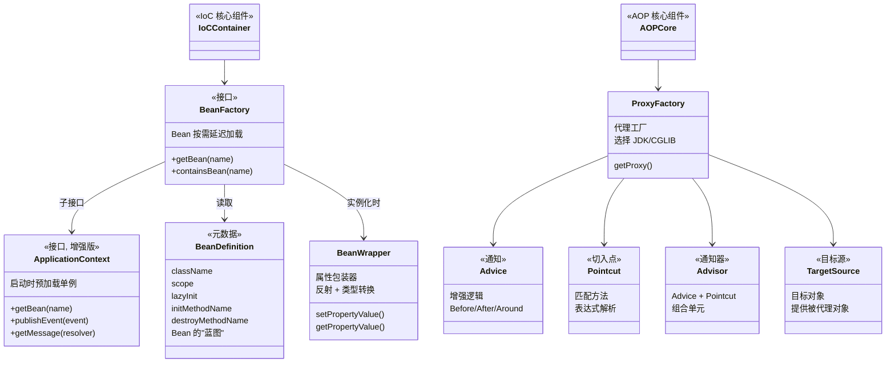
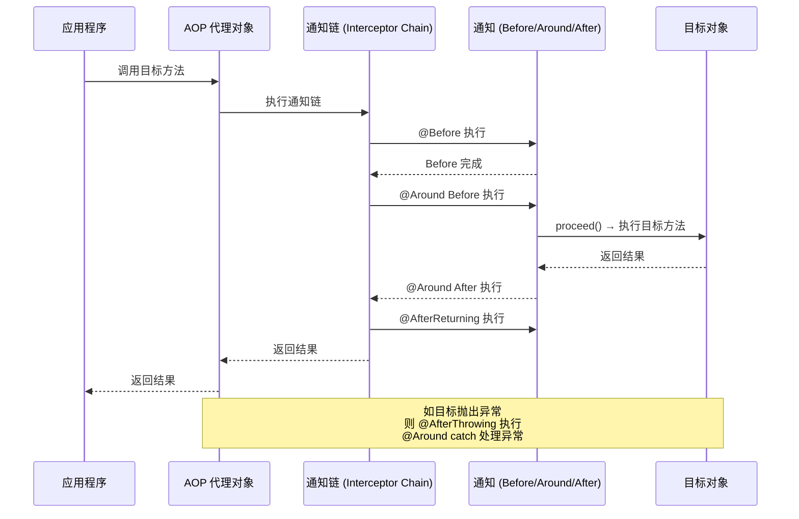
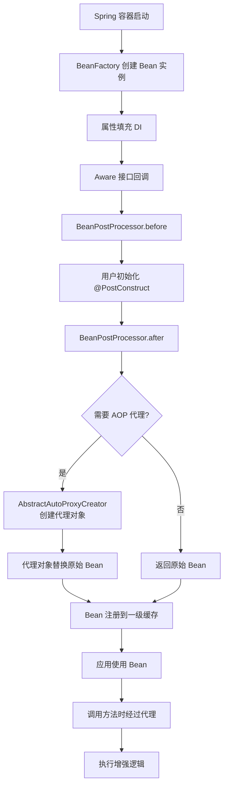

## 引言

Spring 的两大核心 IoC 和 AOP，到底是怎么把代码"织"进去的？

Spring 能管理对象——帮你 `new` Bean、注入依赖、控制生命周期。但 Spring 的能力远不止于此——它还能在不修改你代码的情况下，给对象"织入"额外行为：日志记录、事务管理、权限校验……

这背后的魔法，就是 **IoC（控制反转）**和 **AOP（面向切面编程）**。

* **IoC** 管理对象的创建和依赖——让 Spring 替你 `new` 对象。
* **AOP** 管理对象的行为增强——让 Spring 替你加日志、加事务、加权限。

理解这两大核心原理，不仅能让你更高效地使用框架，更能让你真正读懂 Spring 的"魔法"到底是如何运作的。

💡 **核心提示** IoC 和 AOP 不是两个独立的功能，而是深度协同的：IoC 负责创建和管理 Bean，AOP 通过 BeanPostProcessor 在 Bean 初始化阶段"织入"增强逻辑。两者配合，构成了 Spring 框架的核心骨架。



### IoC 核心：BeanFactory vs ApplicationContext

#### BeanFactory — 基础容器

`BeanFactory` 是 Spring IoC 容器的最基础接口，提供最简单的 DI 功能：

* **延迟加载**：Bean 在第一次 `getBean()` 时才创建。
* **功能有限**：不支持国际化、事件传播、AOP 自动代理等高级特性。

#### ApplicationContext — 企业级容器

`ApplicationContext` 是 `BeanFactory` 的子接口，增加了：

| 功能 | BeanFactory | ApplicationContext |
|------|------------|-------------------|
| Bean 加载 | 延迟加载（首次 getBean） | 启动时预加载所有单例 |
| 国际化 (i18n) | 不支持 | 支持 (`getMessage()`) |
| 事件传播 | 不支持 | 支持 (`publishEvent()`) |
| 资源加载 | 不支持 | 支持 (`getResource()`) |
| AOP 自动代理 | 不支持 | 支持（自动注册 BeanPostProcessor） |
| 环境抽象 | 不支持 | 支持 (`Environment`) |

💡 **核心提示** `ApplicationContext` 在启动时会**预加载所有单例 Bean**。这意味着如果某个 Bean 配置有误（如依赖找不到、初始化方法报错），错误会在启动时立刻暴露，而不是等到运行时才抛出异常——这是快速失败 (Fail-Fast) 的设计哲学。

### AOP 核心：动态代理与切面织入

#### Spring AOP 的实现方式

Spring AOP 基于**动态代理**，在运行时为目标对象生成代理对象：

| 代理类型 | 使用条件 | 实现方式 | 限制 |
|---------|---------|---------|------|
| JDK 动态代理 | 目标实现了接口 | `java.lang.reflect.Proxy` | 只能代理接口方法 |
| CGLIB 代理 | 目标未实现接口 | 继承目标类创建子类 | 目标类/方法不能是 final |

**选择逻辑：**
1. 目标实现了至少一个接口 → 默认 JDK 动态代理
2. 目标未实现接口 → CGLIB 代理
3. 可通过配置强制使用 CGLIB（`proxy-target-class=true`）

💡 **核心提示** AOP 代理**替换**了原始 Bean。当其他 Bean 通过 `@Autowired` 注入时，获取到的是代理对象，而非原始对象。所以代理对象的方法调用会触发增强逻辑。但 Bean 内部通过 `this` 调用时，使用的是原始对象，**绕过**了代理——这就是自调用失效的根本原因。

#### AOP 核心概念



#### 完整 AOP 方法调用流程

```mermaid
flowchart TD
    A[外部调用 Bean 方法] --> B[代理对象拦截调用]
    B --> C{匹配 Pointcut?}
    C -->|否| D[直接调用目标方法]
    C -->|是| E[构建通知链 Advisor Chain]
    E --> F[按顺序执行 @Before 通知]
    F --> G[执行 @Around Before 逻辑]
    G --> H[proceed() → 调用目标方法]
    H --> I{目标方法是否异常?}
    I -->|否| J[@Around After 逻辑]
    I -->|是| K[@AfterThrowing 逻辑]
    J --> L[@AfterReturning 逻辑]
    K --> M[@Around catch 处理]
    L --> N[@After 最终逻辑]
    M --> N
    N --> O[返回结果 / 抛出异常]
```

#### 五种通知类型

| 通知类型 | 注解 | 执行时机 | 能否阻止目标方法 |
|---------|------|---------|----------------|
| Before | `@Before` | 目标方法执行前 | 否（抛异常可阻止） |
| AfterReturning | `@AfterReturning` | 目标方法正常返回后 | 否 |
| AfterThrowing | `@AfterThrowing` | 目标方法抛出异常后 | 否 |
| After | `@After` | 目标方法执行后（无论异常） | 否 |
| Around | `@Around` | 环绕目标方法 | 是（可不调用 proceed） |

#### 通知执行顺序 (@Order)

多个切面作用于同一方法时，执行顺序由 `@Order` 注解决定（值越小优先级越高）：

```
执行顺序 (入栈):  @Order(1).Before → @Order(2).Before → 目标方法
返回顺序 (出栈):  @Order(2).After → @Order(1).After
```

💡 **核心提示** 如果没有 `@Order` 注解，切面执行顺序是**未定义的**（取决于 Spring 内部实现细节，不同版本可能不同）。如果切面之间存在依赖关系或顺序要求，务必显式声明 `@Order`。

#### Pointcut 表达式语言

```java
@Pointcut("execution(public * com.example.service.*.*(..))")  // 包下所有公共方法
@Pointcut("execution(* com.example.service.UserService.*(..))")  // 特定类所有方法
@Pointcut("@annotation(com.example.annotation.Log)")  // 带特定注解的方法
@Pointcut("within(com.example.service..*)")  // 包及子包内所有方法
```

### JDK 代理 vs CGLIB 深度对比

| 维度 | JDK 动态代理 | CGLIB 代理 |
|------|-------------|-----------|
| 原理 | 实现接口，动态生成实现类 | 继承目标类，生成子类 |
| 条件 | 目标必须实现接口 | 目标类和方法不能是 final |
| 性能 | 早期版本较慢，Java 8+ 优化后接近 | 创建慢，调用快 |
| 代理范围 | 只能代理接口方法 | 可代理非接口方法 |
| Spring 默认 | 有接口时使用 | 无接口时使用 |
| 强制指定 | `proxy-target-class=false` | `proxy-target-class=true` |

### 生产环境避坑指南

1. **AOP 自调用失效**：同类中 `this.method()` 调用绕过代理，AOP 增强逻辑不会执行。这是最常见的坑。**解决**：将方法拆分到不同类，或通过 `AopContext.currentProxy()` 获取代理调用。

2. **代理类型选择错误**：JDK 代理只能代理接口方法，如果目标方法不在接口中声明，不会被代理。**解决**：需要代理非接口方法时，配置 `proxy-target-class=true` 强制 CGLIB。

3. **BeanFactory 不支持消息/事件**：`BeanFactory` 没有国际化、事件传播等企业级功能。如果代码依赖这些功能却用了 `BeanFactory`，运行时会报方法不存在异常。**解决**：始终使用 `ApplicationContext`。

4. **@Aspect 执行顺序未定义**：没有 `@Order` 注解时，多个切面的执行顺序不确定。如果切面之间存在依赖（如日志切面需要在事务切面之前执行），可能导致日志记录不完整。**解决**：显式声明 `@Order`。

5. **Pointcut 表达式匹配过宽**：`execution(* *(..))` 会匹配所有方法，包括框架内部方法，导致性能下降和意外增强。**解决**：使用精确的包路径或类名匹配，避免通配符过宽。

6. **final 方法无法被 CGLIB 代理**：CGLIB 通过继承实现代理，final 方法不能被子类重写，因此无法被代理。**解决**：确保需要增强的方法不是 final 的。

### IoC 与 AOP 的协同工作



IoC 和 AOP 不是两个独立的功能。IoC 负责创建和管理 Bean 的完整生命周期，而 AOP 通过 `BeanPostProcessor#postProcessAfterInitialization()` 在 Bean 初始化完成后，为符合条件的 Bean 创建代理对象。**代理对象替换了原始 Bean**，后续所有依赖注入获取到的都是代理对象。

### 总结

Spring 的两大核心 IoC 和 AOP 协同工作，构成了框架的基础架构：

| 核心 | 关键组件 | 核心价值 |
|------|---------|---------|
| IoC | `BeanFactory`、`ApplicationContext`、`BeanDefinition` | 对象创建和依赖管理自动化 |
| AOP | `ProxyFactory`、`Advice`、`Pointcut`、`Advisor` | 横切关注点分离，无侵入增强 |

| 维度 | IoC | AOP |
|------|-----|-----|
| 解决的问题 | 对象之间的依赖关系 | 方法级别的横切行为 |
| 实现方式 | 容器管理 Bean 创建 | 动态代理织入增强逻辑 |
| 关键扩展点 | `BeanFactoryPostProcessor` | `BeanPostProcessor`（代理创建） |
| 典型应用 | 依赖注入、Bean 生命周期管理 | 事务管理、日志记录、权限校验 |

掌握 IoC 和 AOP 的原理，意味着你不再只是 Spring 的使用者，而是理解者。你能解释 Bean 是如何被创建的、代理是如何织入的、自调用为什么会失效——这些理解将大幅提升你使用 Spring 的深度和应对面试的底气。
