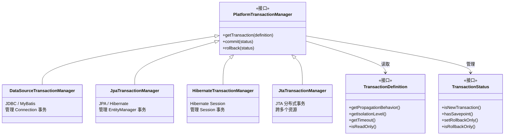
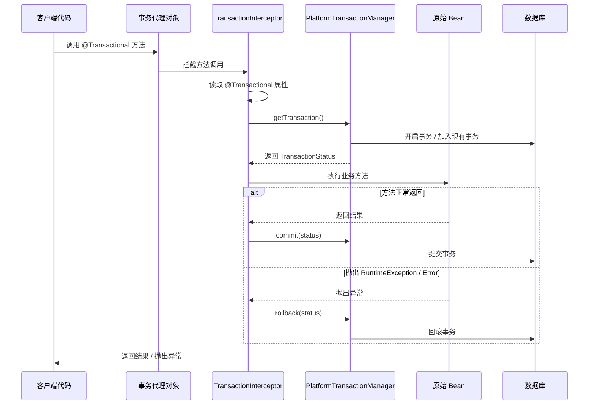
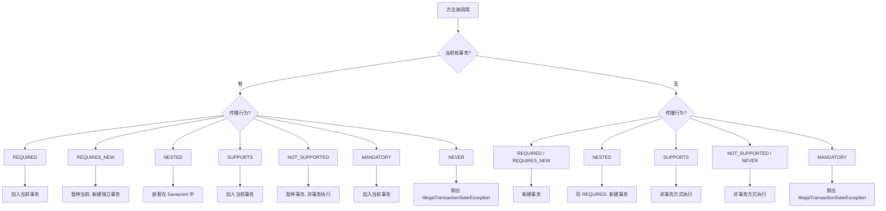

## 引言

@Transactional 加上去就万事大吉了？80% 的事务失效都源于这个误区

银行转账场景：从账户 A 扣款，向账户 B 加款。这两个操作必须作为一个**不可分割的整体**来执行。如果 A 扣款成功但 B 加款失败，A 的扣款却未撤销——系统的数据就处于不一致状态。

这就是事务要解决的核心问题。事务具有 ACID 四大特性：

* **原子性 (Atomicity)：** 要么全部成功，要么全部回滚。
* **一致性 (Consistency)：** 事务前后数据库完整性约束不被破坏。
* **隔离性 (Isolation)：** 并发事务互不干扰。
* **持久性 (Durability)：** 提交后结果永久保存。

在传统 Java EE 开发中，手动获取连接、开启事务、提交/回滚、关闭连接……代码冗余且与业务逻辑耦合紧密。Spring 的事务管理正是为了解决这些痛点而生——通过统一的抽象层和声明式事务，让我们用标准化、简洁的方式管理事务。

💡 **核心提示** Spring 声明式事务的核心是 **AOP 代理**。理解这一点，80% 的事务失效问题都能迎刃而解：`@Transactional` 不是"魔法标签"，而是通过代理对象在方法调用前后织入事务逻辑。如果方法调用绕过了代理，事务就失效了。



### 声明式事务管理：@Transactional 的魔力

#### 启用声明式事务

```java
@Configuration
@EnableTransactionManagement
public class TransactionConfig {

    @Bean
    public DataSourceTransactionManager transactionManager(DataSource dataSource) {
        return new DataSourceTransactionManager(dataSource);
    }
}
```

`@EnableTransactionManagement` 导入事务管理所需的后置处理器，其中最关键的是能解析 `@Transactional` 并创建事务代理的 `BeanPostProcessor`。

#### @Transactional 实现原理



#### @Transactional 注解详解

**propagation (传播行为) — 面试必考**

| 传播行为 | 当前有事务 | 当前无事务 | 典型场景 |
|---------|-----------|-----------|---------|
| `REQUIRED` (默认) | 加入现有事务 | 新建事务 | 大多数 CRUD 操作 |
| `REQUIRES_NEW` | 暂停当前事务，新建独立事务 | 新建事务 | 独立日志记录，不受外部回滚影响 |
| `NESTED` | 嵌套事务（Savepoint） | 新建事务 | 部分操作可独立回滚 |
| `SUPPORTS` | 加入现有事务 | 非事务方式执行 | 只读查询 |
| `NOT_SUPPORTED` | 暂停当前事务，非事务执行 | 非事务方式执行 | 发邮件、调外部接口 |
| `MANDATORY` | 加入现有事务 | 抛出异常 | 必须在大事务内执行的操作 |
| `NEVER` | 抛出异常 | 非事务方式执行 | 禁止在事务中执行的操作 |

💡 **核心提示** `REQUIRED` vs `REQUIRES_NEW` 是面试最高频对比：`REQUIRED` 共享同一个物理事务，回滚时一同回滚；`REQUIRES_NEW` 使用独立物理事务，回滚互不影响。`NESTED` 与 `REQUIRES_NEW` 的区别在于：`NESTED` 通过数据库 Savepoint 实现，嵌套事务回滚不影响外部事务，但外部回滚会回滚嵌套部分。

**isolation (隔离级别)**

| 隔离级别 | 脏读 | 不可重复读 | 幻读 | 说明 |
|---------|------|----------|------|------|
| `READ_UNCOMMITTED` | 可能 | 可能 | 可能 | 最低级别 |
| `READ_COMMITTED` | 解决 | 可能 | 可能 | Oracle 默认 |
| `REPEATABLE_READ` | 解决 | 解决 | 可能 | MySQL 默认 |
| `SERIALIZABLE` | 解决 | 解决 | 解决 | 性能最低 |
| `DEFAULT` | - | - | - | 使用数据库默认 |

**rollbackFor / noRollbackFor**

Spring 默认只对 **RuntimeException 及其子类**和 **Error** 进行回滚。Checked Exception 不会触发回滚。

```java
@Transactional(rollbackFor = IOException.class)  // Checked Exception 也回滚
@Transactional(noRollbackFor = BusinessException.class)  // 指定异常不回滚
```

#### 事务传播行为决策树



### Spring 事务管理中的常见问题与陷阱

1. **内部方法调用 (Self-invocation) 失效**

    * **场景：** 同一个类中，非事务方法调用事务方法。
    * **原因：** 内部调用使用 `this.methodB()`，`this` 指向原始对象而非代理对象，绕过了事务拦截器。
    * **解决：** 将方法拆分到不同类并通过 `@Autowired` 注入；或通过 `AopContext.currentProxy()` 获取代理对象调用。

2. **非 public 方法上的 @Transactional 失效**

    * **原因：** Spring AOP 代理机制默认只拦截公共方法。
    * **解决：** 确保 `@Transactional` 应用于 public 方法。

3. **异常被 catch 吞掉导致不回滚**

    * **原因：** 事务方法内部 `try-catch` 捕获了异常但未重新抛出，事务管理器感知不到异常发生。
    * **解决：** 在 catch 块中重新抛出异常，或调用 `TransactionAspectSupport.currentTransactionStatus().setRollbackOnly()` 手动标记回滚。

4. **Checked Exception 默认不回滚**

    * **原因：** Spring 默认只对 RuntimeException 和 Error 回滚。
    * **解决：** 使用 `@Transactional(rollbackFor = Exception.class)` 让所有异常都触发回滚。

5. **长事务持有数据库连接**

    * **原因：** 在事务方法中执行远程调用（HTTP、RPC）、大量数据处理等耗时操作，导致数据库连接长时间被占用，连接池耗尽。
    * **解决：** 缩小事务边界，将非 DB 操作移出事务方法；设置合理的 `timeout`。

6. **多数据源事务问题**

    * **原因：** 当应用使用多个数据源时，一个 `@Transactional` 只能管理一个数据源的事务。跨数据源操作无法保证原子性。
    * **解决：** 使用 `JtaTransactionManager`（分布式事务），或使用 Seata 等分布式事务方案。

### 编程式事务管理

```java
@Service
public class MyProgrammaticService {
    @Autowired
    private TransactionTemplate transactionTemplate;

    public void doBusinessWithTx() {
        transactionTemplate.execute(new TransactionCallbackWithoutResult() {
            @Override
            protected void doInTransactionWithoutResult(TransactionStatus status) {
                // 业务逻辑
                // 可以通过 status.setRollbackOnly() 手动标记回滚
            }
        });
    }
}
```

适用场景：事务边界需要复杂动态判断，或在非 Spring Bean 中需要事务支持。

### 事务同步 (Transaction Synchronization)

Spring 通过 `TransactionSynchronizationManager` 将资源（如数据库连接）绑定到当前线程。基于 `ThreadLocal` 实现，确保同一个事务内的所有操作使用同一个资源实例。事务开启时绑定，提交/回滚时解绑。

### 生产环境避坑指南

1. **自调用丢失事务**：同类中 `this.method()` 调用绕过代理，`@Transactional` 失效。这是最隐蔽、最常见的坑。**解决**：拆分到不同类，或通过 `AopContext.currentProxy()` 获取代理。

2. **catch 块吞掉异常**：`try { ... } catch (Exception e) { log.error("...", e); }` 没有重新抛出异常，事务正常提交。**解决**：catch 块中必须 `throw` 异常，或手动 `setRollbackOnly()`。

3. **长事务耗尽连接池**：在事务方法内调用外部 HTTP 接口、发送 MQ 消息、处理大批量数据，长时间持有数据库连接。**解决**：缩小事务边界，非 DB 操作移出事务，设置 `timeout`。

4. **嵌套 @Transactional 回滚规则冲突**：内层方法设置 `REQUIRES_NEW` + `rollbackFor = A.class`，外层设置 `rollbackFor = B.class`，两者回滚规则不一致导致行为混乱。**解决**：统一回滚规则，或在文档中明确标注每个方法的事务语义。

5. **多数据源无分布式事务管理**：两个 `@Transactional` 分别管理不同数据源，无法保证跨数据源原子性。一个提交成功另一个失败，数据不一致。**解决**：使用 `JtaTransactionManager` 或 Seata。

6. **异步方法 @Async + @Transactional**：`@Async` 方法在新线程执行，`TransactionSynchronizationManager` 的 ThreadLocal 不跨线程，事务上下文丢失。**解决**：在异步方法内部独立开启事务，不要在调用链中间混用 `@Async` 和 `@Transactional`。

### Spring 事务管理器 (PlatformTransactionManager)

| 事务管理器 | 适用技术 | 说明 |
|-----------|---------|------|
| `DataSourceTransactionManager` | JDBC / MyBatis | 管理 Connection 事务 |
| `JpaTransactionManager` | JPA | 管理 EntityManager 事务 |
| `HibernateTransactionManager` | Hibernate | 管理 Session 事务 |
| `JtaTransactionManager` | JTA | 跨多个资源的分布式事务 |

### Spring vs JTA 分布式事务

| 维度 | Spring 本地事务 | JTA 分布式事务 |
|------|----------------|---------------|
| 支持资源数 | 单个数据源 | 多个数据源/资源 |
| 实现方式 | 绑定 Connection 到 ThreadLocal | 两阶段提交 (2PC) |
| 性能 | 高 | 较低（2PC 开销） |
| 复杂度 | 低（@Transactional 即可） | 高（需要 JTA 提供者） |
| 适用场景 | 单库事务 | 跨库/跨资源事务 |

### 面试高频问题

1. **REQUIRED 和 REQUIRES_NEW 的区别？** REQUIRED 共享事务，一同回滚；REQUIRES_NEW 独立事务，回滚互不影响。
2. **@Transactional 原理是什么？** 基于 AOP 代理。`@EnableTransactionManagement` 注册 BeanPostProcessor，在 Bean 生命周期中创建事务代理，`TransactionInterceptor` 拦截方法调用并管理事务。
3. **@Transactional 失效场景？** 内部调用绕过代理、非 public 方法、异常被 catch 吞掉、Checked Exception 未配置 rollbackFor。
4. **Spring 默认对哪些异常回滚？** RuntimeException 和 Error，Checked Exception 不回滚。

### 总结

Spring 事务管理是框架提供的强大核心功能。通过统一的事务抽象层和声明式事务，Spring 极大简化了企业级应用的事务控制。

| 核心概念 | 要点 |
|---------|------|
| 传播行为 (7 种) | REQUIRED 默认，REQUIRES_NEW 独立事务，NESTED 嵌套 Savepoint |
| 隔离级别 (5 种) | DEFAULT 使用数据库默认，READ_COMMITTED / REPEATABLE_READ 常用 |
| 回滚规则 | 默认 RuntimeException + Error，Checked Exception 需显式配置 rollbackFor |
| 实现原理 | AOP 代理，BeanPostProcessor 创建事务代理，TransactionInterceptor 织入事务逻辑 |
| 失效场景 | 自调用绕过代理、非 public 方法、异常被 catch 吞掉、Checked Exception |

掌握 `@Transactional` 的各种属性，理解基于 AOP 代理的实现原理，并能够识别和解决常见的事务陷阱，是每一位中高级 Java 开发者必备的技能。
