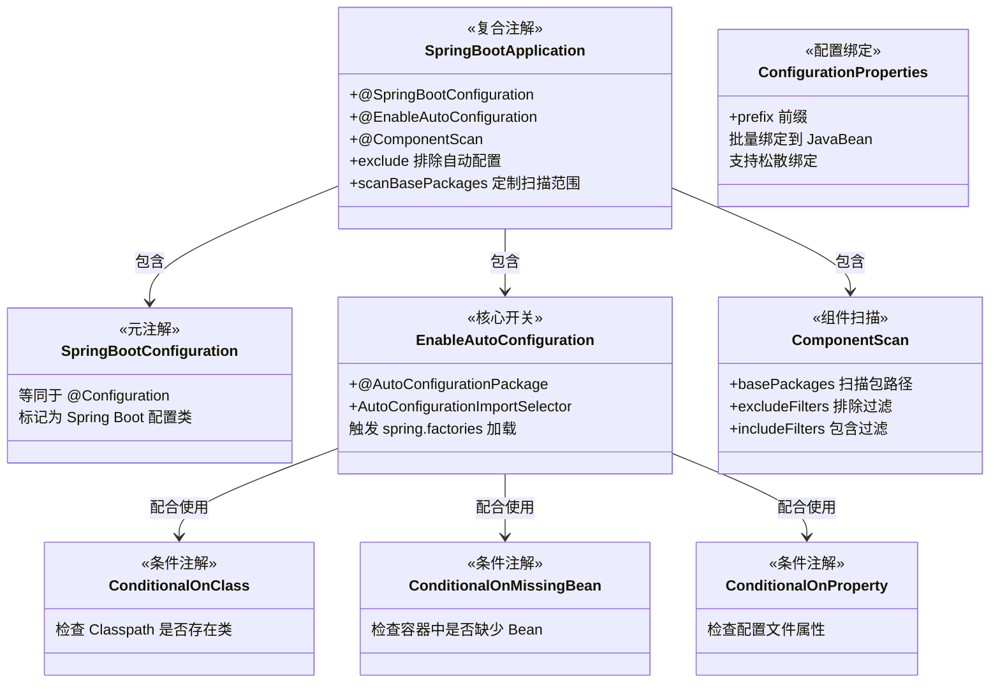
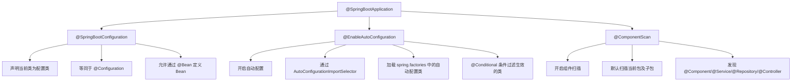

## 引言

Spring Boot 的这些注解，你真的用对了吗？

`@SpringBootApplication`、`@ConfigurationProperties`、`@ConditionalOnClass`……你可能每天都在用这些注解，但你是否知道 `@SpringBootApplication` 其实是三个注解的"合体"？是否清楚 `@ConfigurationProperties` 和 `@Value` 在底层实现上有什么本质区别？当面试官问"自动配置是怎么被触发的"，你能准确说出从 `@EnableAutoConfiguration` 到 `spring.factories` 再到 `@Conditional` 评估的完整链路吗？

读完本文，你将获得：
1. **注解层级全景**：Spring Boot 核心注解的组成关系与加载机制
2. **深度对比**：`@ConfigurationProperties` vs `@Value` vs `@Environment`，`@SpringBootApplication` vs 手动 `@Configuration`
3. **生产避坑指南**：6 个最常见的注解误用场景及解决方案

> 理解这些注解背后的原理，不仅能让你的代码更优雅，更是面试中区分"会用的程序员"和"懂原理的工程师"的分水岭。

### Spring Boot 注解体系概览

虽然我们之前可能讨论过 Spring 的常用注解，但将它们置于 Spring Boot 的语境下，结合 Spring Boot 独特的自动配置、外部化配置等机制来理解，会带来更深刻的洞察。Spring Boot 引入了一些新的注解，并赋予了一些现有 Spring 注解新的生命力。



### `@SpringBootApplication` 三合一深度解析

`@SpringBootApplication` 是 Spring Boot 应用的**主配置注解**，它是一个**复合注解**，包含了三个核心注解：



> **💡 核心提示**：`@SpringBootApplication` 是一个"三重注解"：`@SpringBootConfiguration`（声明配置类）+ `@EnableAutoConfiguration`（开启自动配置）+ `@ComponentScan`（组件扫描）。它让开发者只需一个注解就能完成基本配置，但理解其内部组成对高级定制至关重要。

* **`@SpringBootConfiguration`**：标识这是一个 Spring Boot 配置类，其作用等同于 `@Configuration`。使用这个派生注解而不是直接使用 `@Configuration` 的好处是，Spring Boot 可以通过它识别"主配置类"，在日志和一些工具中提供更准确的提示。
* **`@EnableAutoConfiguration`**：**开启 Spring Boot 自动配置功能**。它会引入 `AutoConfigurationImportSelector`，通过 `SpringFactoriesLoader` 读取 `META-INF/spring.factories`（Spring Boot 3.2+ 为 `AutoConfiguration.imports`）中的自动配置类列表，然后根据 `@Conditional` 注解判断哪些需要生效。
* **`@ComponentScan`**：开启组件扫描，默认扫描当前包及其子包下的 `@Component` 及其派生注解标识的类，将它们注册为 Bean。

**给开发者的建议：**

* 在大多数 Spring Boot 应用中，`@SpringBootApplication` 是启动类的标准配置。
* 如果你需要定制扫描范围，使用 `scanBasePackages` 或 `scanBasePackageClasses` 属性。
* 如果你想排除某个自动配置类，使用 `exclude` 属性：`@SpringBootApplication(exclude = {DataSourceAutoConfiguration.class})`。

### `@EnableAutoConfiguration` 加载机制详解

`@EnableAutoConfiguration` 是触发 Spring Boot 自动配置的**开关**。它引入了一个 `AutoConfigurationImportSelector`，这是一个 `ImportSelector` 的实现。

* **加载流程：** Spring 容器处理 `@Configuration` 类时 -> `AutoConfigurationImportSelector.selectImports()` 被调用 -> 通过 `SpringFactoriesLoader` 读取所有 `spring.factories` -> 获取 `EnableAutoConfiguration` 对应的自动配置类全限定名列表 -> 根据 `exclude`/`excludeName` 属性过滤 -> 根据 `@Conditional` 注解判断哪些生效 -> 将符合条件的自动配置类注册到 Spring 容器。
* **`SpringFactoriesLoader` 机制：** 它是 Spring Boot 提供的一个工具类，能够读取 ClassLoader 所有 JAR 包中 `META-INF/spring.factories` 文件的内容。这是一个基于 JVM ServiceLoader 思想的扩展机制。

> **💡 核心提示**：`@EnableAutoConfiguration` 的 `exclude` 属性可以用来禁用不需要的自动配置。例如，如果你不需要数据源自动配置，可以写 `@EnableAutoConfiguration(exclude = {DataSourceAutoConfiguration.class})`。但更推荐的做法是通过排除依赖（如从 Starter 中排除 `spring-boot-starter-jdbc`）来实现，这样更干净。

### `@ConfigurationProperties` vs `@Value` vs `@Environment`

这三个是 Spring Boot 外部化配置中最常用的方式，但它们的适用场景和底层机制完全不同：

```mermaid
classDiagram
    class Environment {
        <<接口>>
        +getProperty(String key) String
        +getActiveProfiles() String[]
        +acceptsProfiles(String... profiles) boolean
        获取原始配置值
        无类型转换
    }
    class Value {
        <<注解>>
        @Value("${key}")
        @Value("#{spel}")
        单个属性注入
        支持 SpEL 表达式
    }
    class ConfigurationProperties {
        <<注解>>
        @ConfigurationProperties(prefix="x")
        批量绑定到 JavaBean
        松散绑定 (kebab-case -> camelCase)
        JSR-303 校验支持
        IDE 元数据提示
    }

    ConfigurationProperties ..> Environment : 内部使用
    Value ..> Environment : 内部使用
```

| 特性 | `@ConfigurationProperties` | `@Value` | `@Environment` |
|:---|:---|:---|:---|
| **绑定方式** | 批量绑定到 JavaBean | 逐个属性注入 | 编程式获取 `getProperty(key)` |
| **类型安全** | 强类型（IDE 提示 + 编译期检查） | 弱类型（运行时类型转换） | 返回字符串，需手动转换 |
| **松散绑定** | 支持（`my-client.server-url` -> `serverUrl`） | 不支持 | 不支持 |
| **SpEL 表达式** | 不支持 | 支持（`#{...}`） | 不支持 |
| **校验支持** | 支持 JSR-303 `@Validated` | 不支持 | 不支持 |
| **嵌套复杂类型** | 支持 List、Map、嵌套对象 | 不支持 | 不支持 |
| **适用场景** | 结构化、成组的配置 | 少量、分散的配置值或 SpEL | 动态读取、条件判断 |
| **元数据生成** | 配合 processor 生成 IDE 提示 | 无 | 无 |

> **💡 核心提示**：`@ConfigurationProperties` 的 `prefix` 属性是最佳实践的关键。使用明确的前缀（如 `myapp.datasource`）可以避免配置属性冲突，同时让你的 `application.yml` 结构更清晰。配合 `spring-boot-configuration-processor` 使用，IDE 会自动提供配置属性的补全和文档提示。

### `@ConditionalOnProperty` 环境特定配置

`@ConditionalOnProperty` 是实现环境特定配置的强大工具：

```java
@Configuration
@ConditionalOnProperty(name = "myapp.cache.enabled", havingValue = "true", matchIfMissing = false)
public class CacheConfiguration {
    @Bean
    public CacheManager cacheManager() {
        // 仅在 myapp.cache.enabled=true 时生效
    }
}
```

* `name`：要检查的属性名。
* `havingValue`：期望的属性值。
* `matchIfMissing`：属性不存在时是否匹配（默认 `false`）。

> **💡 核心提示**：`@ConditionalOnProperty` 的 `matchIfMissing = false` 是默认行为，意味着如果配置文件中没有该属性，条件不满足。这是安全的默认值——功能默认关闭，需要显式开启。

### Bean 定义与依赖注入注解

这些是 Spring Framework 核心注解，但在 Spring Boot 中使用更加普遍和便捷：

* **`@Configuration` 与 `@Bean`**：Java Config 的核心。`@Configuration` 类会被 Spring 进行 CGLIB 代理（Full 模式），确保内部 `@Bean` 方法相互调用时返回单例 Bean。
* **`@Autowired`、`@Qualifier`、`@Primary`**：`@Autowired` 用于自动注入，`@Qualifier` 按名称指定注入，`@Primary` 标记首选 Bean。推荐使用构造器注入（Spring 4.3+ 单个构造器可省略 `@Autowired`）。
* **`@Value`**：注入外部属性值或 SpEL 表达式结果。适用于少量、分散的配置值。

### 外部化配置绑定注解

* **`@ConfigurationProperties`**：将配置文件中具有特定前缀的一组属性批量绑定到一个 JavaBean 上。由 `ConfigurationPropertiesBindingPostProcessor` 处理。
* **`@PropertySource`**：加载指定的属性文件到 `Environment` 中。在 Spring Boot 中，默认的 `application.properties`/`yml` 是自动加载的，`@PropertySource` 主要用于加载额外的配置文件。
* **`@Profile`**：条件化地注册 Bean 或配置类。只有当指定的 Profile 被激活时才会加载。结合 `application-{profile}.properties/yml` 文件管理多环境配置。

### AOP 与事务注解

* **`@EnableAspectJAutoProxy`**：启用基于 `@Aspect` 注解的 AOP 支持。通常在引入 `spring-boot-starter-aop` 后自动配置生效。
* **`@EnableTransactionManagement`**：启用声明式事务管理。通常在引入数据访问 Starter 后自动配置生效。
* **`@Transactional`**：声明事务边界。由事务 AOP 代理拦截，通过 `PlatformTransactionManager` 执行事务逻辑。

### 生命周期回调注解

* **`@PostConstruct`**：Bean 初始化后执行（属性填充后）。由 `CommonAnnotationBeanPostProcessor` 处理。
* **`@PreDestroy`**：Bean 销毁前执行（仅单例）。容器关闭时执行。

### Web 层注解

* **`@RestController`**：复合注解，等同于 `@Controller` + `@ResponseBody`。
* **`@RequestMapping` 及派生注解**：`@GetMapping`、`@PostMapping`、`@PutMapping`、`@DeleteMapping`、`@PatchMapping`。
* **`@RequestBody`**：将 HTTP 请求体内容绑定到方法参数。
* **`@RequestParam`、`@PathVariable`**：绑定请求参数和 URI 模板变量。

### `@SpringBootApplication` vs 手动 `@Configuration`

| 方式 | `@SpringBootApplication` | 手动 `@Configuration` + `@ComponentScan` + `@EnableAutoConfiguration` |
|:---|:---|:---|
| **简洁性** | 一行搞定 | 需要三个注解 |
| **灵活性** | 中等（通过属性定制） | 高（可以独立配置每个注解的属性） |
| **可读性** | 更好（语义明确） | 稍差（需要三个注解组合理解） |
| **推荐场景** | 绝大多数 Spring Boot 应用 | 需要精细控制扫描范围或自动配置的复杂项目 |
| **组件扫描默认路径** | 当前包及其子包 | 需要显式指定 `basePackages` |

> **💡 核心提示**：`@SpringBootApplication` 的组件扫描默认从声明该注解的类所在包开始。如果你的项目结构不规范（如启动类在 `com.example.app` 包，但业务类在 `com.example.service` 包），`@ComponentScan` 将无法发现这些类。解决方案：将启动类移到更上层的包中，或使用 `scanBasePackages` 显式指定。

### 生产环境避坑指南

以下是 Spring Boot 注解使用中最常见的 8 个陷阱：

| # | 陷阱 | 后果 | 解决方案 |
|---|------|------|----------|
| 1 | **`@SpringBootApplication` 扫描范围错误** | 启动类所在包之外的组件无法被发现，`@Autowired` 注入失败 | 将启动类放在项目的根包（最上层包）中；或使用 `scanBasePackages` 显式指定 |
| 2 | **`@ConfigurationProperties` 绑定到可变字段** | 配置在运行时被意外修改，线程安全问题 | 将属性类设计为不可变类（使用 `final` 字段 + 构造器注入），或使用 `@Immutable` 注解 |
| 3 | **`@Value` 不支持松散绑定** | `my-client.server-url` 配置无法通过 `@Value("${myClient.serverUrl}")` 获取 | 使用与配置文件完全一致的 key 名称，或改用 `@ConfigurationProperties` 享受松散绑定 |
| 4 | **Actuator 端点未设安全保护** | `/env` 泄露数据库密码、`/beans` 暴露内部结构 | 引入 `spring-boot-starter-security`，配置 `management.endpoints.web.exposure.include` 只暴露必要端点 |
| 5 | **`@ConditionalOnClass` 使用不当** | 类引用导致编译期硬依赖，缺少依赖时直接 `ClassNotFoundException` | 使用 `@ConditionalOnClass(name = "fully.qualified.ClassName")` 字符串形式避免编译期硬依赖 |
| 6 | **`@ConfigurationProperties` 未启用** | 只写了 `@ConfigurationProperties` 但未注册为 Bean，属性绑定不生效 | 在属性类上添加 `@Component`，或在配置类上使用 `@EnableConfigurationProperties(XxxProperties.class)` |
| 7 | **`@PostConstruct` 中执行耗时操作** | 阻塞 Bean 初始化，拖慢整体启动时间 | 将耗时操作移到 `ApplicationRunner` 中异步执行 |
| 8 | **`@Bean` 方法循环调用导致 CGLIB 代理问题** | `@Configuration` 类中 `@Bean` 方法相互调用时，Lite 模式下返回新实例而非单例 | 使用 `@Configuration`（Full 模式）或显式通过 ApplicationContext 获取 Bean |

### 行动清单

1. **检查启动类位置**：确认 `@SpringBootApplication` 标注的类在项目的根包中，确保所有组件都能被扫描到。
2. **将 `@Value` 替换为 `@ConfigurationProperties`**：如果你有 3 个以上相关的 `@Value` 注入，考虑合并为一个 `@ConfigurationProperties` 类。
3. **为 `@ConfigurationProperties` 类添加校验**：引入 `spring-boot-starter-validation`，使用 `@Validated` 和 JSR-303 注解（`@NotBlank`、`@Min` 等）校验配置属性。
4. **查看自动配置报告**：启动时添加 `--debug` 参数，了解哪些自动配置生效了、哪些被跳过了。
5. **使用 `scanBasePackageClasses` 替代 `scanBasePackages`**：类型安全的包指定方式，重构时不易出错。
6. **审查 Actuator 端点暴露**：运行 `curl http://localhost:8080/actuator`，确认只暴露了必要的端点，其余端点需要认证访问。

### 面试问题示例与深度解析

1. **`@SpringBootApplication` 注解包含了哪些注解？它们的作用是什么？**
    * **要点：** `@SpringBootConfiguration`（等同于 `@Configuration`，声明配置类）、`@EnableAutoConfiguration`（开启自动配置）、`@ComponentScan`（组件扫描）。
2. **请解释 Spring Boot 的自动配置原理，以及 `@EnableAutoConfiguration` 在其中扮演的角色。**
    * **要点：** `@EnableAutoConfiguration` 引入 `AutoConfigurationImportSelector`，通过 `SpringFactoriesLoader` 加载 `spring.factories` 中的自动配置类列表，根据 `@Conditional` 注解过滤生效的类。
3. **`@Value` 和 `@ConfigurationProperties` 有什么区别？各自的使用场景是什么？**
    * **要点：** `@Value` 逐个注入、支持 SpEL、弱类型；`@ConfigurationProperties` 批量绑定、强类型、支持松散绑定和校验、IDE 友好。少量配置用 `@Value`，结构化配置用 `@ConfigurationProperties`。
4. **请解释 `@Conditional` 注解家族的常用成员及其在自动配置中的作用。**
    * **要点：** `@ConditionalOnClass`（检测类存在）、`@ConditionalOnMissingBean`（检测 Bean 缺失，允许覆盖）、`@ConditionalOnProperty`（配置文件开关）。
5. **如何在 Spring Boot 中实现多环境配置和条件化加载 Bean？**
    * **要点：** `@Profile` + 多环境配置文件（`application-{profile}.yml`），以及 `@Conditional` 系列注解。
6. **`@ConfigurationProperties` 是如何工作的？**
    * **要点：** 由 `ConfigurationPropertiesBindingPostProcessor` 处理，从 `Environment` 中查找对应前缀的属性，通过 Setter 方法或构造器绑定到 Bean 对象上。支持松散绑定和校验。

### 总结

Spring Boot 的常用注解是其简洁高效开发体验的基石。从简化启动和配置的 `@SpringBootApplication`、`@EnableAutoConfiguration`，到实现强大外部化配置绑定的 `@ConfigurationProperties`、`@Value`，再到构建智能自动配置的 `@Conditional` 家族，以及用于传统 Spring 核心功能（DI、AOP、事务、生命周期）在 Spring Boot 中便捷使用的注解，它们共同构成了现代 Spring 开发的编程模型。

理解每个注解背后的机制——从 `@SpringBootApplication` 的三重组合、`@EnableAutoConfiguration` 的 `SpringFactoriesLoader` 加载链路、到 `@Conditional` 的条件评估——是从"会用 Spring Boot"到"精通 Spring Boot"的关键跨越。
