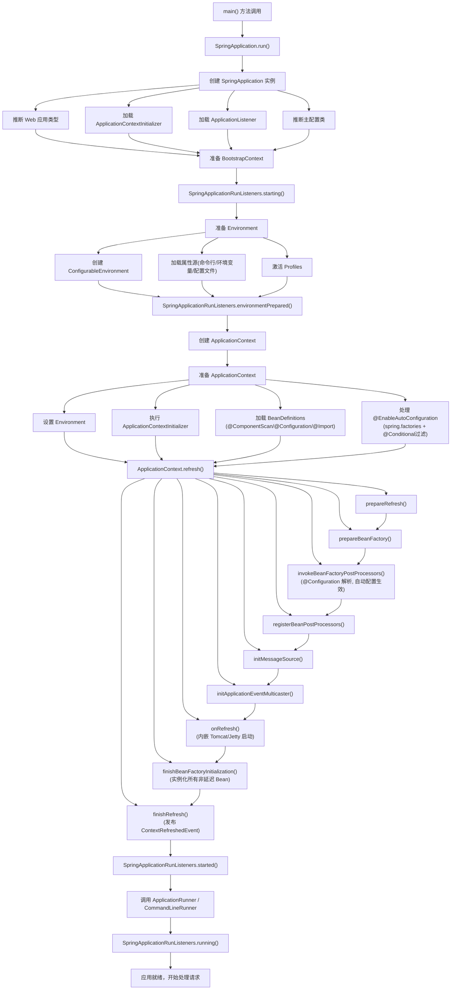
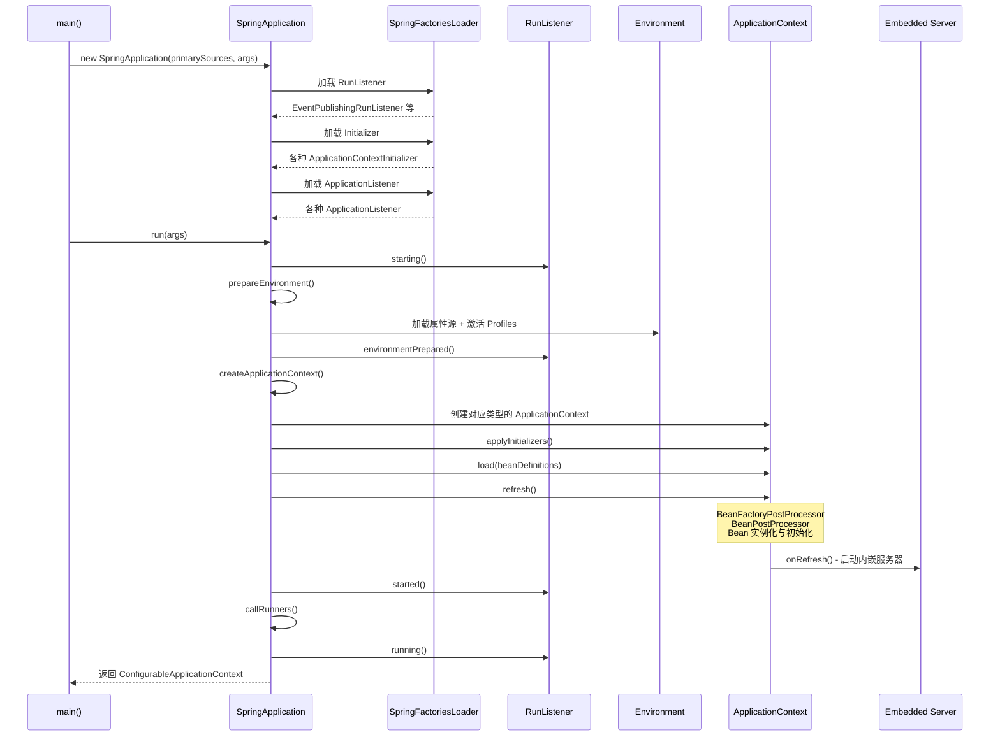

## 引言

从 `main()` 到 Tomcat 启动，Spring Boot 启动时偷偷做了多少事？

你以为 `SpringApplication.run()` 只是一行简单的启动代码？实际上，它背后是一条精密的流水线：推断 Web 类型、加载监听器、准备 Environment、创建 ApplicationContext、扫描 Bean 定义、评估自动配置条件、刷新容器、启动内嵌服务器、执行 Runner……整个过程涉及几十个核心类的协同工作。

读完本文，你将获得：
1. **完整启动链路**：从 `main()` 到应用就绪的每一步，附带 Mermaid 流程图
2. **关键扩展点定位**：在哪个阶段可以插入自定义逻辑（`BeanFactoryPostProcessor`、`BeanPostProcessor`、`ApplicationRunner`）
3. **生产避坑指南**：6 个常见的启动问题及排查方法

> 如果你遇到过"启动失败但不知道哪个阶段出错"、"启动太慢想知道瓶颈在哪"、或者面试被问到"Spring Boot 启动流程"，这篇文章就是你的答案。

### 启动入口：`main` 方法与 `SpringApplication.run()`

一个典型的 Spring Boot 应用的入口类通常长这样：

```java
@SpringBootApplication
public class MySpringBootApplication {

    public static void main(String[] args) {
        SpringApplication.run(MySpringBootApplication.class, args);
    }
}
```

这里，`@SpringBootApplication` 是一个复合注解，包含了 `@SpringBootConfiguration`（等同于 `@Configuration`）、`@EnableAutoConfiguration` 和 `@ComponentScan`，它是 Spring Boot 应用的推荐主配置注解。

而 `SpringApplication.run()` 方法则是整个启动过程的**核心引导**。`SpringApplication` 类本身并不包含业务逻辑，它是一个引导类，封装了 Spring Boot 应用从启动到运行的整个流程。

### `SpringApplication.run()` 完整流程解析



> **💡 核心提示**：整个启动过程中，`ApplicationContext.refresh()` 是最耗时、最核心的阶段。Bean 的生命周期（实例化、属性填充、初始化）全部在这个阶段完成。如果应用启动慢，优先排查这个阶段。

#### 阶段一：`SpringApplication` 实例的创建与初始化

当调用 `SpringApplication.run(Source, args)` 时，内部会创建一个新的 `SpringApplication` 实例。

* **推断主应用类：** `SpringApplication` 会尝试从调用栈中推断出哪个类是主应用类（即带有 `main` 方法的类），将其作为主要的配置源。
* **推断 Web 应用类型：** Spring Boot 会根据 Classpath 中是否存在特定的类，推断出当前的 Web 应用类型：
    * `jakarta.servlet.Servlet` 存在 -> Servlet Web 应用（`AnnotationConfigServletWebServerApplicationContext`）
    * `org.springframework.web.reactive.DispatcherHandler` 存在 -> 响应式 Web 应用（`AnnotationConfigReactiveWebServerApplicationContext`）
    * 都不存在 -> 非 Web 应用（`AnnotationConfigApplicationContext`）
    这将决定后续创建哪种类型的 `ApplicationContext`。
* **加载 `ApplicationContextInitializer` 和 `ApplicationListener`：** 通过 **`SpringFactoriesLoader`** 机制，从 Classpath 下所有 JAR 包的 `META-INF/spring.factories`（Spring Boot 3.2+ 为 `META-INF/spring/` 目录下的专用 imports 文件）中加载初始化和监听器实现类列表。



#### 阶段二：`SpringApplicationRunListeners` 启动并发送 `starting` 事件

在 `SpringApplication` 实例创建并初始化完成后，它会遍历所有加载到的 `SpringApplicationRunListener` 实例，并调用它们的 `starting()` 方法。

* **作用：** `SpringApplicationRunListener` 是 Spring Boot 启动过程中**最早期的扩展点**。你可以在这里获取到一个 `ConfigurableBootstrapContext`，在环境对象（Environment）创建之前做一些非常早期的工作。

> **💡 核心提示**：`ApplicationListener` 在 `SpringApplication` 构造函数阶段就被加载了，它们**在任何 Bean 存在之前**就已经注册到了事件多播器中。如果你需要在 Bean 创建之前就监听启动事件，使用 `ApplicationListener` 而不是 `@EventListener`。

#### 阶段三：构建并配置 `Environment` 环境

这个阶段负责创建和配置 Spring 应用所使用的 `Environment` 环境对象。

* **创建 `Environment`：** 根据应用的 Web 类型，创建相应的 `ConfigurableEnvironment` 实现类（如 `StandardServletEnvironment`）。
* **配置属性源：** 从各种外部配置源加载配置属性，并按既定的优先级顺序排列：
    * 命令行参数 `args`
    * Java 系统属性 `System.getProperties()`
    * 操作系统环境变量 `System.getenv()`
    * `application.properties`/`application.yml` 文件
* **激活 Profiles：** 根据配置（如命令行参数 `-Dspring.profiles.active=dev`）设置激活的 Profiles。
* **通知监听器 `environmentPrepared`：** 这是在 `Environment` 对象构建完成但 `ApplicationContext` 尚未创建时的扩展点。你可以在这里访问和修改 `Environment` 对象，例如添加、修改或移除属性源。

#### 阶段四：准备 `ApplicationContext`

环境准备好后，Spring Boot 开始创建和准备 `ApplicationContext` 容器。

* **创建 `ApplicationContext` 实例：** 根据推断的 Web 应用类型，创建相应的 `ApplicationContext` 实现类实例（如 `AnnotationConfigServletWebServerApplicationContext`）。
* **设置 `Environment` 和其他属性：** 将之前创建和配置好的 `Environment` 设置到 `ApplicationContext` 中。
* **执行 `ApplicationContextInitializer`s：** 调用它们的 `initialize()` 方法，这是在 `ApplicationContext` 刷新**之前**的扩展点，可以对 `ApplicationContext` 进行编程式设置。
* **加载 Bean Definitions：** 将应用中的配置元数据转化为 Spring 内部的 `BeanDefinition` 对象：
    * 扫描 `@ComponentScan` 指定的基础包，查找带有 `@Component` 及其派生注解的类
    * 处理 `@Configuration` 类，解析其内部的 `@Bean` 方法
    * 处理 `@Import` 导入的类或 `ImportSelector`/`ImportBeanDefinitionRegistrar`
    * **处理 `@EnableAutoConfiguration`：** 根据 `spring.factories` 加载到的自动配置类候选列表，以及每个类上的 `@Conditional` 注解判断结果，过滤出最终需要生效的自动配置类，解析其中的 `@Bean` 方法

#### 阶段五：刷新 `ApplicationContext` (`refresh()` 方法)

这是整个 Spring Boot 启动流程中**最核心、最关键、最复杂**的阶段，也是大部分 Spring Framework 功能初始化和 Bean 生命周期执行的地方。

* `prepareRefresh()`：准备刷新上下文，设置激活状态、记录启动时间、初始化属性源、校验环境等。
* `obtainBeanFactory()`：获取用于 Bean 管理的 `DefaultListableBeanFactory`。
* `prepareBeanFactory()`：设置类加载器，注册内置的 BeanPostProcessor（如处理 `@Autowired` 的工厂）、注册内置 Bean（`environment`, `systemProperties` 等）。
* `postProcessBeanFactory()`：子类扩展点，Web 应用中会注册 web 相关的 BeanPostProcessor。
* **`invokeBeanFactoryPostProcessors()`：执行所有 `BeanFactoryPostProcessor`。`ConfigurationClassPostProcessor` 在这里处理 `@Configuration`、`@ComponentScan`、`@PropertySource` 和**自动配置类**。**这是在 Bean 实例化之前修改 BeanDefinition 的最后机会。**
* `registerBeanPostProcessors()`：查找并注册所有 `BeanPostProcessor`，供后续 Bean 创建时使用。
* `initMessageSource()`：初始化国际化消息源。
* `initApplicationEventMulticaster()`：初始化应用事件多播器。
* **`onRefresh()`：** ApplicationContext 子类的扩展点。对于 WebServerApplicationContext，**内嵌 Web 服务器（Tomcat/Jetty/Undertow）的创建和启动就发生在此阶段**。
* **`finishBeanFactoryInitialization()`：Bean 生命周期的主要执行阶段！** 遍历所有**非延迟加载**的单例 Bean，按依赖关系顺序依次创建和初始化它们。完整的 Bean 生命周期（实例化 -> 属性填充 -> Aware 回调 -> BeanPostProcessor#before -> 自定义初始化 -> BeanPostProcessor#after -> Bean Ready）就在这里被驱动执行。
* `finishRefresh()`：发布 `ContextRefreshedEvent` 事件，初始化生命周期处理器，启动实现了 `Lifecycle` 接口的 Bean（如内嵌 Web 服务器）。

> **💡 核心提示**：`BeanFactoryPostProcessor` 在 Bean **实例化之前**运行，用于修改或注册 Bean 定义。`BeanPostProcessor` 在 Bean **实例化之后、初始化前后**运行，用于增强或替换 Bean 实例。理解两者的时机差异是理解 Spring 扩展机制的关键。

#### 阶段六：`started` 事件、Runners 执行、`running` 事件

* **`started` 事件：** ApplicationContext 刷新完成后发送。此时容器完全可用，但 Runner 尚未执行。
* **调用 `CommandLineRunner` 和 `ApplicationRunner`：** 查找容器中所有实现了这两个接口的 Bean 并按 `@Order` 排序后依次调用。`ApplicationRunner` 提供了对 `ApplicationArguments` 更方便的访问（支持命名参数）。
* **`running` 事件：** 所有 Runner 执行完毕后发送，表示应用完全进入运行状态。

#### 阶段七：应用退出

正常关闭或异常退出时，Spring 容器执行关闭流程，触发 Bean 的销毁方法（`@PreDestroy`、`DisposableBean`、`destroy-method`），释放资源。

### 核心组件在启动流程中的作用总结

| 组件 | 职责 | 激活时机 |
|:---|:---|:---|
| `SpringApplication` | 引导和协调整个启动流程 | 入口 |
| `SpringFactoriesLoader` | 从 `META-INF/spring.factories` 加载扩展点实现 | 构造阶段 + 启动各阶段 |
| `SpringApplicationRunListener` | 启动过程的关键里程碑事件通知 | 各阶段转换点 |
| `Environment` | 存储配置属性和 Profile 信息 | 阶段三 |
| `ApplicationContextInitializer` | ApplicationContext 刷新前的编程式初始化 | 阶段四 |
| `BeanFactoryPostProcessor` | Bean 实例化前修改 BeanDefinition | refresh() 内 |
| `BeanPostProcessor` | Bean 实例化后增强/替换 Bean 实例 | refresh() 内 |
| `ApplicationContext` | IoC 容器，管理 Bean 生命周期 | refresh() 是核心 |
| `CommandLineRunner` / `ApplicationRunner` | 应用完全启动后执行特定任务 | refresh() 后 |

### 自动配置是如何在启动过程中生效的？

自动配置与启动流程的串联：

1. **发现（启动早期）：** `SpringApplication` 初始化时，`SpringFactoriesLoader` 读取 `spring.factories`，发现所有自动配置类候选列表。
2. **加载 Bean Definition（ApplicationContext 准备阶段）：** 处理自动配置类候选，根据 `@Conditional` 注解筛选出满足条件的，将其 `@Bean` 方法解析为 BeanDefinition。
3. **应用/创建 Bean（ApplicationContext 刷新阶段 - `refresh()`）：**
    * 在 `invokeBeanFactoryPostProcessors` 阶段，`ConfigurationClassPostProcessor` 处理自动配置类，解析 `@Bean` 方法。
    * **在 `finishBeanFactoryInitialization` 阶段，自动配置创建的 Bean 才真正被实例化和初始化**，经历完整的 Bean 生命周期。

所以，自动配置的**发现**发生在启动早期，但它的**加载和应用**贯穿于 `ApplicationContext` 的准备阶段和核心的 `refresh()` 阶段。

### Servlet vs Reactive 启动差异

| 维度 | Servlet Web | Reactive Web |
|:---|:---|:---|
| **ApplicationContext 类型** | `AnnotationConfigServletWebServerApplicationContext` | `AnnotationConfigReactiveWebServerApplicationContext` |
| **内嵌服务器** | Tomcat（默认）、Jetty、Undertow | Netty（默认）、Tomcat、Jetty、Undertow |
| **依赖判断** | Classpath 存在 `jakarta.servlet.Servlet` | Classpath 存在 `DispatcherHandler` |
| **请求处理模型** | 线程-per-request，阻塞 I/O | 事件循环，非阻塞 I/O |
| **典型 Starter** | `spring-boot-starter-web` | `spring-boot-starter-webflux` |

### ApplicationRunner vs CommandLineRunner

| 特性 | `CommandLineRunner` | `ApplicationRunner` |
|:---|:---|:---|
| **方法签名** | `run(String... args)` | `run(ApplicationArguments args)` |
| **参数类型** | 原始字符串数组 | 封装的 `ApplicationArguments` 对象 |
| **命名参数支持** | 不支持（需手动解析） | 支持 `getOptionValues("name")` |
| **使用场景** | 简单的启动后任务 | 需要解析复杂命令行参数 |
| **排序** | `@Order` 注解 | `@Order` 注解 |

### 生产环境避坑指南

以下是 Spring Boot 启动过程中最常见的 8 个陷阱：

| # | 陷阱 | 后果 | 解决方案 |
|---|------|------|----------|
| 1 | **`@PostConstruct` 中执行耗时操作** | 阻塞整个启动流程，`finishBeanFactoryInitialization` 阶段卡住 | 将耗时操作（如缓存预热、大量数据加载）放到 `ApplicationRunner` 中异步执行 |
| 2 | **`@ComponentScan` 扫描范围过大** | 扫描了大量无关类，显著拖慢启动速度 | 使用 `scanBasePackageClasses` 精确指定包；或使用 `excludeFilters` 排除不需要的类 |
| 3 | **`ApplicationListener` 异常静默失败** | 监听器抛出异常未传播，问题难以排查 | 在 `onApplicationEvent` 方法中做好异常捕获和日志记录；避免在监听器中做复杂逻辑 |
| 4 | **Profile 未正确激活** | 生产环境使用了 dev 配置（如 H2 数据库） | CI/CD 流水线中显式设置 `SPRING_PROFILES_ACTIVE=prod`；启动日志检查 `The following profiles are active` |
| 5 | **启动时内存不足 OOM** | 大量 Bean 实例化时元空间或堆内存溢出 | 设置 `-Xmx` 和 `-XX:MaxMetaspaceSize`；使用 `--debug` 分析启动内存消耗 |
| 6 | **多个 `@Bean` 返回同类型且无 `@Primary`** | `NoUniqueBeanDefinitionException` 注入失败 | 使用 `@Primary` 标记首选 Bean 或在注入处使用 `@Qualifier` 指定名称 |
| 7 | **循环依赖** | Spring Boot 2.6+ 默认禁止循环依赖，启动直接失败 | 重构代码消除循环依赖；或使用 `@Lazy` 延迟注入（不推荐作为长期方案） |
| 8 | **`spring.factories` 配置错误** | 自动配置类不生效或类找不到异常 | 确认文件路径正确（`META-INF/spring.factories`）；Spring Boot 3.2+ 注意新的 `AutoConfiguration.imports` 文件格式 |

### 行动清单

1. **开启 debug 模式**：在 `application.properties` 中设置 `debug=true`，启动时查看完整的 AUTO-CONFIGURATION REPORT，理解哪些自动配置生效了。
2. **绘制你的启动链路图**：根据本文的 Mermaid 流程图，标注出你的应用中自定义的 Initializer、Listener 和 Runner 分别在哪个阶段介入。
3. **检查 `@ComponentScan` 范围**：确认你的主类放在正确的包层级，避免扫描到测试类或不需要的组件。
4. **测量启动时间**：记录 `SpringApplication.run()` 的耗时，如果超过 10 秒，使用 `--debug` 定位瓶颈（是 Bean 定义加载慢？还是某个 Bean 的 `@PostConstruct` 太耗时？）。
5. **区分 `@PostConstruct` 和 `ApplicationRunner`**：`@PostConstruct` 用于 Bean 自身的初始化（轻量），`ApplicationRunner` 用于应用级的启动任务（可耗时、可异步）。
6. **设置 JVM 参数**：生产环境至少配置 `-Xms`、`-Xmx`、`-XX:+HeapDumpOnOutOfMemoryError`，避免启动时 OOM 且无诊断信息。

### 面试问题示例与深度解析

1. **请描述一下 Spring Boot 的启动流程。**
    * **要点：** 从 `main()` -> `SpringApplication.run()` -> `SpringApplication` 实例创建 -> 加载 Listeners/Initializers -> `starting` 事件 -> `Environment` 构建 -> `ApplicationContext` 创建 -> Bean Definitions 加载（含自动配置筛选）-> **`ApplicationContext.refresh()`** -> `started` 事件 -> Runners -> `running` 事件。
2. **`SpringFactoriesLoader` 在启动流程中有什么作用？**
    * **要点：** Spring Boot 的核心加载器，负责读取 `META-INF/spring.factories` 文件。加载的组件：`SpringApplicationRunListener`、`ApplicationContextInitializer`、`ApplicationListener`、`EnableAutoConfiguration` 对应的自动配置类列表。
3. **自动配置是在启动流程的哪个阶段生效的？**
    * **要点：** **发现**发生在启动早期（`SpringFactoriesLoader`）。**加载和应用**发生在 `ApplicationContext` 的准备阶段（解析 BeanDefinition）和**核心的 `refresh()` 阶段**（`invokeBeanFactoryPostProcessors` 处理 `@Bean` 方法，`finishBeanFactoryInitialization` 实例化 Bean）。
4. **`ApplicationContext.refresh()` 在启动流程中扮演什么角色？**
    * **要点：** 标准 Spring Framework 容器初始化的核心流程。**Bean 的生命周期（实例化、初始化、后置处理等）和容器大部分功能的初始化都发生在这个方法执行期间。**
5. **`CommandLineRunner` 和 `ApplicationRunner` 有什么区别？**
    * **要点：** `CommandLineRunner` 接收原始字符串数组，`ApplicationRunner` 接收封装的 `ApplicationArguments`（支持命名参数）。两者都在 `refresh()` 完成后执行。
6. **启动流程中有哪些扩展点可以介入？**
    * **要点：** `SpringApplicationRunListener`（最早）、`ApplicationContextInitializer`（refresh 前）、`BeanFactoryPostProcessor`（修改 BeanDefinition）、`BeanPostProcessor`（修改 Bean 实例）、`@Configuration`/`@Bean`（定义 Bean）、`CommandLineRunner`/`ApplicationRunner`（refresh 后）。

### 总结

Spring Boot 的启动流程是一个复杂但清晰的、多阶段协调合作的过程。从 `main()` 方法中调用 `SpringApplication.run()` 开始，它经历了实例初始化、事件发布、环境准备、上下文创建和准备、**核心的 `ApplicationContext.refresh()` 刷新**，最终执行 Runners 并进入运行状态。

理解这个流程，特别是 `SpringFactoriesLoader` 的发现机制、`ApplicationContext.refresh()` 作为 Bean 生命周期和容器初始化的核心作用、以及自动配置在其中的加载时机，是深入掌握 Spring Boot 的关键。它将帮助你更自信地开发、排查启动问题，并在面试中展现出对框架底层的深刻认知。
